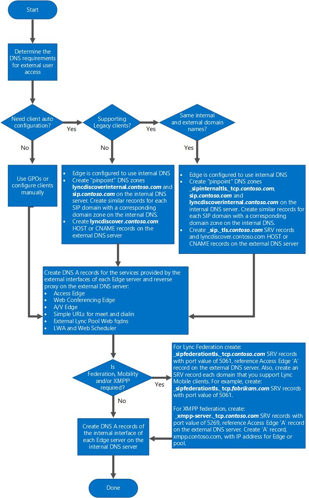

# DNS requirements for Skype for Business
[] **Summary:** Review the DNS considerations in this topic before implementing Skype for Business Server 2015.
To deploy Skype for Business Server, you must create Domain Name System (DNS) records that enable the discovery of clients and servers, and, optionally, support for automatic client sign-in if your organization wants to support it.
  
    
    

Skype for Business Server uses DNS in the following ways:
- To discover internal servers or pools for server-to-server communications.
    
  
- To allow clients to discover the Front End pool or Standard Edition server used for various SIP transactions.
    
  
- To allow unified communications (UC) devices that are not logged on to discover the Front End pool or Standard Edition server running Device Update Web Service, obtain updates, and send logs.
    
  
- To allow external servers and clients to connect to Edge Servers or the HTTP reverse proxy for instant messaging (IM) or conferencing.
    
  
- To allow external UC devices to connect to Device Update Web service through Edge Servers or the HTTP reverse proxy and obtain updates.
    
  
- To allow mobile clients to automatically discover Web Services resources without requiring users to manually enter URLs in device settings.
    
  

## Determine DNS requirements
<a name="det"> </a>

Use the following flow chart to determine Domain Name System (DNS) requirements.
  
    
    

> [!IMPORTANT]
> Skype for Business Server supports the use of IPv6 addressing. To use IPv6 addresses, you must also provide support for IPv6 DNS and configure DNS host AAAA (known as "quad-A") records. In deployments where both IPv4 and IPv6 are being used, it is best to configure and maintain both host A records for IPv4 and host AAAA for IPv6. Even if your deployment has transitioned fully to IPv6, IPv4 DNS host records may still be required when external users are still using IPv4. 
  
    
    


**Determining DNS Requirements Flow Chart**

  
    
    

  
    
    

  
    
    

    
> [!IMPORTANT]
> By default the computer name of a computer that is not joined to a domain is a host name, and not a fully qualified domain name (FQDN). Topology Builder uses FQDNs, not host names. So, you must configure a DNS suffix on the name of the computer to be deployed as an Edge Server that is not joined to a domain. **Use only standard characters** (including A-Z, a-z, 0-9, and hyphens) when assigning FQDNs to your servers running Skype for Business Server. Do not use Unicode characters or underscores. Nonstandard characters in an FQDN are often not supported by external DNS and public CAs (that is, when the FQDN must be assigned to the SN in the certificate). For additional details, see [Configure DNS Host Records](http://technet.microsoft.com/library/78a1afcf-41c8-4da5-8740-c6570c19078c.aspx)
  
    
    


### How Skype for Business Clients Locate Services

Skype for Business and Lync 2013 are similar in how the client finds and accesses services in Skype for Business Server. The notable exception is the Lync Windows Store app that uses a different service location process. This section details two scenarios of how the clients locate services, first the traditional method using a series of SRV and A host records, second using only the Autodiscover service records. For all clients, the DNS query process continues until a successful query is returned, or the list of possible DNS records is exhausted, and the final error is returned to the client.
  
    
    
For all clients **except** for the Lync Windows Store app During DNS lookup, SRV records are queried and returned to the client in the following order:
  
    
    

1. lyncdiscoverinternal. _<domain>_ A (host) record for the Autodiscover service on the internal Web services
    
  
2. lyncdiscover. _<domain>_ A (host) record for the Autodiscover service on the external Web services
    
  
3. _sipinternaltls._tcp. _<domain>_ SRV (service locator) record for internal TLS connections
    
  
4. _sipinternal._tcp. _<domain>_ SRV (service locator) record for internal TCP connections (performed only if TCP is allowed)
    
  
5. _sip._tls. _<domain>_ SRV (service locator) record for external TLS connections
    
  
6. sipinternal. _<domain>_ A (host) record for the Front End pool or Director, resolvable only on the internal network
    
  
7. sip. _<domain>_ A (host) record for the Front End pool or Director on the internal network, or the Access Edge service when the client is external
    
  
8. sipexternal. _<domain>_ A (host) record for the Access Edge service when the client is external
    
  
The Lync Windows Store app changes the process completely because it uses two records:
  
    
    

1. lyncdiscoverinternal. _<domain>_ A (host) record for the Autodiscover service on the internal Web services
    
  
2. lyncdiscover. _<domain>_ A (host) record for the Autodiscover service on the external Web services
    
  
There is no fallback to the other record types. 
  
    
    
The difference between the methods used for newer clients as compared to older clients is that the Autodiscover service is becoming the preferred method to locate all services.
  
    
    
When a connection is successful, the Autodiscover Service returns all the Web Services URLs for the user's home pool, including the Mobility Service (known as Mcx by the virtual directory created for the service in IIS), Microsoft Lync Web App and Web scheduler URLs. However, both the internal Mobility Service URL and the external Mobility Service URL is associated with the external Web Services FQDN. Therefore, regardless of whether a mobile device is internal or external to the network, the device always connects to the Mobility Service externally through the reverse proxy. 
  
    
    
The Autodiscover Service also returns references to Internal/UCWA, External/UCWA and UCWA. These entries refer to the Unified Communications Web API (UCWA) web component. Currently, only the entry UCWA is used and provides a reference to a URL for the web component. UCWA is used by Skype for Business Mobile clients instead of the Mcx Mobility Service used by the Lync 2010 Mobile clients.
  
    
    

> [!NOTE]
> When creating SRV records, it is important to remember that they must point to a DNS A and AAAA (if you are using IPv6 addressing) record in the same domain in which the DNS SRV record is created. For example, if the SRV record is in contoso.com, the A and AAAA (if you are using IPv6 addressing) record it points to can't be in fabrikam.com. 
  
    
    


> [!TIP]
> The default configuration is to direct all mobile client traffic through the external site. You can modify settings to return only the internal URL, if this is more preferable for your requirements. With this configuration, users can use Lync mobile applications on their mobile devices only when they are inside the corporate network. To define this configuration, you use the **Set-CsMcxConfiguration** cmdlet.
  
    
    


> [!NOTE]
> Although mobile applications can also connect to other Skype for Business Server services, such as Address Book Service, internal mobile application web requests go to the external web FQDN only for the Mobility Service. Other service requests, such as Address Book requests, do not require this configuration. 
  
    
    

Mobile devices support manual discovery of services. In this case, each user must configure the mobile device settings with the full internal and external Autodiscover Service URIs, including the protocol and path, as follows: 
  
    
    

- https:// _<ExtPoolFQDN>_/Autodiscover/autodiscoverservice.svc/Root for external access 
    
  
- https:// _<IntPoolFQDN>_/AutoDiscover/AutoDiscover.svc/Root for internal access 
    
  
We recommend that you use automatic discovery, rather than manual discovery. However, manual settings can be useful for troubleshooting mobile device connectivity issues.
  
    
    

### Configuring Split-Brain DNS with Skype for Business Server

Split-brain DNS is known by a number of names, for example, split DNS or split-horizon DNS. Simply, it describes a DNS configuration where there are two DNS zones with the same namespace - but one DNS zone services internal-only requests, and the other DNS zone services external-only requests. However, many of the DNS SRV and A records contained in the internal DNS will not be contained in the external DNS, and the reverse is also true. In cases where the same DNS record exists in both the internal and external DNS (for example, www.contoso.com), the IP address returned will be different based on where (internal or external) the query was initiated.
  
    
    

> [!IMPORTANT]
> Currently, Split-Brain DNS is not supported for the mobility, or more specifically, the LyncDiscover and LyncDiscoverInternal DNS records. LyncDiscover must be defined on an external DNS server and LyncDiscoverInternal must be defined on an internal DNS server. 
  
    
    

For the purposes of these topics, the term split-brain DNS will be used. 
  
    
    
If you are configuring split-brain DNS, the following internal and external zone contain a summary of the types of DNS records required in each zone. For details, see  [Scenarios for External User Access](http://technet.microsoft.com/library/25697446-b045-4d12-9b1c-47f694b4f224.aspx).
  
    
    
 **Internal DNS:**
  
    
    

- Contains a DNS zone called contoso.com for which it is authoritative
    
  
- The internal contoso.com zone contains:
    
  - DNS A and AAAA (if you are using IPv6 addressing) and SRV records for internal Skype for Business Server client auto-configuration (optional)
    
  
  - DNS A and AAAA (if you are using IPv6 addressing) or CNAME records for automatic discovery of Skype for Business Server Web Services (optional) 
    
  
  - DNS A and AAAA (if you are using IPv6 addressing) records for Front End pool name, Director or Director pool name, and all internal servers running Skype for Business Server in the corporate network
    
  
  - DNS A and AAAA (if you are using IPv6 addressing) records for the Edge internal interface of each Skype for Business Server Edge Server in the perimeter network
    
  
  - DNS A and AAAA (if you are using IPv6 addressing) records for the internal interface of each reverse proxy server in the perimeter network (optional for management of reverse proxy)
    
  
  - All Skype for Business Server Edge Server internal edge interfaces in the perimeter network use the internal DNS zone for resolving queries to contoso.com
    
  
  - All servers running Skype for Business Server and clients running Skype for Business in the corporate network point to the internal DNS servers for resolving queries to contoso.com, or use of HOSTS file on each Edge server and list A and AAAA (if you are using IPv6 addressing) records for next hop server, specifically the Director or Director VIP, Front End pool VIP, or Standard Edition server
    
  
 **External DNS:**
  
    
    

- Contains a DNS zone called contoso.com for which it is authoritative
    
  
- The external contoso.com zone contains:
    
  - DNS A and AAAA (if you are using IPv6 addressing) and SRV records for Skype for Business Server client auto-configuration (optional)
    
  
  - DNS A and AAAA (if you are using IPv6 addressing) or CNAME records for automatic discovery of Skype for Business Server Web Services for use with mobility
    
  
  - DNS A and AAAA (if you are using IPv6 addressing) and SRV records for the Edge external interface of each Skype for Business Server, Edge Server or hardware load balancer virtual IP (VIP) in the perimeter network
    
  
  - DNS A and AAAA (if you are using IPv6 addressing) records for the external interface of the reverse proxy server or VIP for a pool of reverse proxy servers in the perimeter network
    
  

### Automatic Configuration without Split-Brain DNS

Using split-brain DNS, a Skype for Business Server user that signs in internally can take advantage of automatic configuration if the internal DNS zone contains a _sipinternaltls._tcp SRV record for each SIP domain in use. However, if you do not use split-brain DNS, internal automatic configuration of clients running Skype for Business will not work unless one of the workarounds described in later in this section is implemented. This is because Skype for Business Server requires the user's SIP URI to match the domain of the Front End pool designated for automatic configuration. This was also the case with earlier versions of Communicator.
  
    
    
For example, if you have two SIP domains in use, the following DNS service (SRV) records would be required:
  
    
    

- If a user signs in as bob@contoso.com the following SRV record will work for automatic configuration because the user's SIP domain (contoso.com) matches the domain of automatic configuration Front End pool):
    
     _sipinternaltls._tcp.contoso.com. 86400 IN SRV 0 0 5061 pool01.contoso.com
    
  
- If a user signs in as alice@fabrikam.com the following DNS SRV record will work for automatic configuration of the second SIP domain.
    
     _sipinternaltls._tcp.fabrikam.com. 86400 IN SRV 0 0 5061 pool01.fabrikam.com
    
  
For comparison, if a user signs in as tim@litwareinc.com the following DNS SRV record will not work for automatic configuration, because the client's SIP domain (litwareinc.com) does not match the domain that the pool is in (fabrikam.com):
  
    
    
 _sipinternaltls._tcp.litwareinc.com. 86400 IN SRV 0 0 5061 pool01.fabrikam.com
  
    
    
If automatic configuration is required for clients running Skype for Business, select one of the following options:
  
    
    

- **Group Policy Objects** Use Group Policy objects (GPOs) to populate the correct server values.
    
    > [!NOTE]
      > This option does not enable automatic configuration, but it does automate the process of manual configuration, so if this approach is used, the SRV records associated with automatic configuration are not required. 
- **Matching internal zone** Create a zone in the internal DNS that matches the external DNS zone (for example, contoso.com) and create DNS A and AAAA (if you are using IPv6 addressing) records corresponding to the Skype for Business Server pool used for automatic configuration. For example, if a user is homed on pool01.contoso.net but signs into Skype for Business as bob@contoso.com, create an internal DNS zone called contoso.com and inside it, create a DNS A and AAAA (if IPv6 addressing is used) record for pool01.contoso.com.
    
  
- **Pin-point internal zone** If you are creating an entire zone in the internal DNS is not an option, you can create pin-point (that is, dedicated) zones that correspond to the SRV records that are required for automatic configuration, and populate those zones using dnscmd.exe. Dnscmd.exe is required because the DNS user interface does not support creation of pin-point zones. For example, if the SIP domain is contoso.com and you have a Front End pool called pool01 that contains two Front End Servers, you need the following pin-point zones and A records in your internal DNS:
    
  ```
  
dnscmd . /zoneadd _sipinternaltls._tcp.contoso.com. /dsprimary
dnscmd . /recordadd _sipinternaltls._tcp.contoso.com. @ SRV 0 0 5061 pool01.contoso.com.
dnscmd . /zoneadd pool01.contoso.com. /dsprimary
dnscmd . /recordadd pool01.contoso.com. @ A 192.168.10.90
dnscmd . /recordadd pool01.contoso.com. @ AAAA <IPv6 address>
dnscmd . /recordadd pool01.contoso.com. @ A 192.168.10.91 
dnscmd . /recordadd pool01.contoso.com. @ AAAA <IPv6 address>
  ```


    If your environment contains a second SIP domain (for example, fabrikam.com), you need the following pin-point zones and A records in your internal DNS:
    


  ```
  
dnscmd . /zoneadd _sipinternaltls._tcp.fabrikam.com. /dsprimary
dnscmd . /recordadd _sipinternaltls._tcp.fabrikam.com. @ SRV 0 0 5061 pool01.fabrikam.com.
dnscmd . /zoneadd pool01.fabrikam.com. /dsprimary
dnscmd . /recordadd pool01.fabrikam.com. @ A 192.168.10.90
dnscmd . /recordadd pool01.contoso.com. @ AAAA <IPv6 address>
dnscmd . /recordadd pool01.fabrikam.com. @ A 192.168.10.91
dnscmd . /recordadd pool01.contoso.com. @ AAAA <IPv6 address>
  ```


> [!NOTE]
> The Front End pool FQDN appears twice, but with two different IP addresses. This is because DNS load balancing is used, but if hardware load balancing is used, there would be only a single Front End pool entry. Also, the Front End pool FQDN values change between the contoso.com example and the fabrikam.com example, but the IP addresses remain the same. This is because users signing in from either SIP domain use the same Front End pool for automatic configuration. 
  
    
    

For details, see the DMTF blog article, "Communicator Automatic Configuration and Split-Brain DNS," at  [https://go.microsoft.com/fwlink/p/?linkId=200707](https://go.microsoft.com/fwlink/p/?linkId=200707). Although the article refers to Office Communicator, the details apply equally well to Skype for Business Server.
  
    
    

> [!NOTE]
> The content of each blog and its URL are subject to change without notice. 
  
    
    


### Configuring the domain name system (DNS) for Disaster Recovery

To configure DNS to redirect Skype for Business Server Web traffic to your disaster recovery and failover sites, you must be using a DNS provider that supports using GeoDNS to resolve to a geographically close server if possible, or to a distant one if necessary. You can set up your DNS records for Web to support disaster recovery, so that features that use Web services continue even if one entire Front End pool goes down. This disaster recovery feature supports the Autodiscover (Lyncdiscover URL), Meet and Dial-In simple URLs.
  
    
    
You define and configure additional DNS host (A and AAAA if using IPv6) records for internal and external resolution of Web services at your GeoDNS provider. The following details assume paired pools, geographically dispersed, and GeoDNS supported by your provider with either round-robin DNS, or configured to use Pool1 as primary, and fail over to Pool2 in the event of communications loss or hardware failure.
  
    
    


|**GeoDNS record (example)**|**Pool records (example)**|**CNAME records (example)**|**DNS settings (select one option)**|
|:-----|:-----|:-----|:-----|
|Meet-int.geolb.contoso.com  <br/> |Pool1InternalWebFQDN.contoso.com  <br/> Pool2InternalWebFQDN.contoso.com  <br/> |Meet.contoso.com alias to Pool1InternalWebFQDN.contoso.com  <br/> Meet.contoso.com alias to Pool2InternalWebFQDN.contoso.com  <br/> |Round Robin between pools  <br/> Use primary, connect to secondary if failure  <br/> |
|Meet-ext.geolb.contoso.com  <br/> |Pool1ExternalWebFQDN.contoso.com  <br/> Pool2ExternalWebFQDN.contoso.com  <br/> |Meet.contoso.com alias to Pool1ExternalWebFQDN.contoso.com  <br/> Meet.contoso.com alias to Pool2ExternalWebFQDN.contoso.com  <br/> |Round Robin between pools  <br/> Use primary, connect to secondary if failure  <br/> |
|Dialin-int.geolb.contoso.com  <br/> |Pool1InternalWebFQDN.contoso.com  <br/> Pool2InternalWebFQDN.contoso.com  <br/> |Dialin.contoso.com alias to Pool1InternalWebFQDN.contoso.com  <br/> Dialin.contoso.com alias to Pool2InternalWebFQDN.contoso.com  <br/> |Round Robin between pools  <br/> Use primary, connect to secondary if failure  <br/> |
|Dialin-ext.geolb.contoso.com  <br/> |Pool1ExternalWebFQDN.contoso.com  <br/> Pool2ExternalWebFQDN.contoso.com  <br/> |Dialin.contoso.com alias to Pool1ExternalWebFQDN.contoso.com  <br/> Dialin.contoso.com alias to Pool2ExternalWebFQDN.contoso.com  <br/> |Round Robin between pools  <br/> Use primary, connect to secondary if failure  <br/> |
|Lyncdiscoverint-int.geolb.contoso.com  <br/> |Pool1InternalWebFQDN.contoso.com  <br/> Pool2InternalWebFQDN.contoso.com  <br/> |Lyncdiscoverinternal.contoso.com alias to Pool1InternalWebFQDN.contoso.com  <br/> Lyncdiscoverinternal.contoso.com alias to Pool2InternalWebFQDN.contoso.com  <br/> |Round Robin between pools  <br/> Use primary, connect to secondary if failure  <br/> |
|Lyncdiscover-ext.geolb.contoso.com  <br/> |Pool1ExternalWebFQDN.contoso.com  <br/> Pool2ExternalWebFQDN.contoso.com  <br/> |Lyncdiscover.contoso.com alias to Pool1ExternalWebFQDN.contoso.com  <br/> Lyncdiscover.contoso.com alias to Pool2ExternalWebFQDN.contoso.com  <br/> |Round Robin between pools  <br/> Use primary, connect to secondary if failure  <br/> |
|Scheduler-int.geolb.contoso.com  <br/> |Pool1InternalWebFQDN.contoso.com  <br/> Pool2InternalWebFQDN.contoso.com  <br/> |Scheduler.contoso.com alias to Pool1InternalWebFQDN.contoso.com  <br/> Scheduler.contoso.com alias to Pool2InternalWebFQDN.contoso.com  <br/> |Round Robin between pools  <br/> Use primary, connect to secondary if failure  <br/> |
|Scheduler-ext.geolb.contoso.com  <br/> |Pool1ExternalWebFQDN.contoso.com  <br/> Pool2ExternalWebFQDN.contoso.com  <br/> |Scheduler.contoso.com alias to Pool1ExternalWebFQDN.contoso.com  <br/> Scheduler.contoso.com alias to Pool2ExternalWebFQDN.contoso.com  <br/> |Round Robin between pools  <br/> Use primary, connect to secondary if failure  <br/> |
   

### DNS Load Balancing
<a name="BKMK_DNSLoadBalancing"> </a>

DNS load balancing is typically implemented at the application level. The application (for example, a client running Skype for Business), tries to connect to a server in a pool by connecting to one of the IP addresses returned from the DNS A and AAAA (if IPv6 addressing is used) record query for the pool fully qualified domain name (FQDN). 
  
    
    
For example, if there are three front end servers in a pool named pool01.contoso.com, the following will happen:
  
    
    

- Clients running Skype for Business query DNS for pool01.contoso.com. The query returns three IP addresses and caches them as follows (not necessarily in this order):
    
    pool01.contoso.com 192.168.10.90
    
    pool01.contoso.com 192.168.10.91
    
    pool01.contoso.com 192.168.10.92
    
  
- The client attempts to establish a Transmission Control Protocol (TCP) connection to one of the IP addresses. If that fails, the client tries the next IP address in the cache.
    
  
- If the TCP connection succeeds, the client negotiates TLS to connect to the primary registrar on pool01.contoso.com.
    
  
- If the client tries all cached entries without a successful connection, the user is notified that no servers running Skype for Business Server are available at the moment.
    
  

> [!NOTE]
> DNS-based load balancing is different from DNS round robin (DNS RR) which typically refers to load balancing by relying on DNS to provide a different order of IP addresses corresponding to the servers in a pool. Typically DNS RR only enables load distribution, but does not enable failover. For example, if the connection to the one IP address returned by the DNS A and AAAA (if you are using IPv6 addressing) query fails, the connection fails. Therefore, DNS round robin by itself is less reliable than DNS-based load balancing. You can use DNS round robin in conjunction with DNS load balancing. 
  
    
    

DNS load balancing is used for the following:
  
    
    

- Load balancing server-to-server SIP to the Edge Servers
    
  
- Load balancing Unified Communications Application Services (UCAS) applications such as Conferencing Auto Attendant, Response Group, and Call Park
    
  
- Preventing new connections to UCAS applications (also known as "draining")
    
  
- Load balancing all client-to-server traffic between clients and Edge Servers
    
  
DNS load balancing cannot be used for the following:
  
    
    

- Client-to-server web traffic to Director or Front End Servers
    
  
DNS load balancing and federated traffic:
  
    
    
If multiple DNS records are returned by a DNS SRV query, the Access Edge service always picks the DNS SRV record with the lowest numeric priority and highest numeric weight. The Internet Engineering Task Force document "A DNS RR for specifying the location of services (DNS SRV)"  [https://www.ietf.org/rfc/rfc2782.txt](https://www.ietf.org/rfc/rfc2782.txt) specifies that if there are multiple DNS SRV records defined, priority is first used, then weight. For example DNS SRV record A has a weight of 20 and a priority of 40 and DNS SRV record B has a weight of 10 and priority of 50. DNS SRV record A with priority 40 will be selected. The following rules apply to DNS SRV record selection:
  
    
    

- Priority is considered first. A client MUST attempt to contact the target host defined by the DNS SRV record with the lowest numbered priority it can reach. Targets with the same priority SHOULD be tried in an order defined by the weight field.
    
  
- The weight field specifies a relative weight for entries with the same priority. Larger weights SHOULD be given a proportionately higher probability of being selected. DNS administrators SHOULD use Weight 0 when there isn't any server selection to do. In the presence of records containing weights greater than 0, records with weight 0 should have a very small chance of being selected.
    
  
If multiple DNS SRV records with equal priority and weight are returned, the Access Edge service will select the SRV record that was received first from the DNS server.
  
    
    

## DNS requirements for Front End pools
<a name="det"> </a>

This section describes the Domain Name System (DNS) records that are required for deployment of Front End pools.
  
    
    

### DNS Records for Front End Pools

The following table specifies DNS requirements for a Skype for Business Server Front End pool deployment.
  
    
    

**DNS Requirements for a Front End Pool**


|**Deployment scenario**|**DNS requirement**|
|:-----|:-----|
|Front End pool with multiple Front End Servers and a hardware load balancer (whether or not DNS load balancing is also deployed on that pool)  <br/> | When using both DNS load balancing and a hardware load balancer, you need to create Host A records. Create an internal A record for each front end server that resolves the fully qualified domain name (FQDN) of the Front End pool for DNS load balancing. Create an internal host A record for the internal Web services to the virtual IP (VIP) address of the load balancer. You must use the internal Web services name as defined in Topology Builder. <br/>  For example, if you use both DNS load balancing and hardware load balancing, you would have an A record for each Front End Server in a pool for DNS load balancing, and an A record for the internal Web services pointing to the virtual IP of the hardware load balancer: <br/>  DNS load balancing: Pool01.contoso.net IP Address of pool 10.10.10.5 <br/> > [!CAUTION]>  Each Front End Server will also have a distinct A record:           FE01.contoso.net 10.10.10.1 <br/>  FE02.contoso.net 10.10.10.2 <br/>  FE03.contoso.net 10.10.10.3 <br/>  FE04.contoso.net 10.10.10.4 <br/>  Hardware load balancing: WebInternal.contoso.net IP Address of HLB VIP 192.168.10.5 <br/>  All traffic except for HTTP/HTTPS traffic will use the Pool01.contoso.net record. HTTP/HTTPS traffic will use the defined internal Web services address of 192.168.10.5 <br/> |
|Front End pool with DNS load balancing deployed  <br/> |A set of internal A records that resolve the FQDN of the pool to the IP address of each server in the pool. There must one A record for each server in the pool. For details, see  [DNS Load Balancing](http://technet.microsoft.com/library/7ed0ed20-33ad-4253-926d-21d392590ae7.aspx) in the Planning documentation. <br/> |
|||
|Front End pool with a single Front End Server and a dedicated back-end database but no load balancer  <br/> |An internal A record that resolves the FQDN of the Front End pool to the IP address of the single Enterprise Edition Front End Server.  <br/> |
|Automatic client sign-in  <br/> |For each supported SIP domain, an SRV record for _sipinternaltls._tcp.<domain> over port 5061 that maps to the FQDN of the Front End pool that authenticates and redirects client requests for sign-in. For details, see  [DNS Requirements for Automatic Client Sign-In](http://technet.microsoft.com/library/3bcd4bb3-a022-4ffa-b005-1a95ad2b1796.aspx).  <br/> |
|Device Update Web service discovery by unified communications (UC) devices  <br/> |An internal A record with the name ucupdates-r2.<SIP domain> that resolves to the IP address of the Front End pool that hosts the Device Update Web service. In the situation where a UC device is turned on, but a user has never logged into the device, the A record allows the device to discover the Front End pool hosting Device Update Web service and obtain updates. Otherwise, devices obtain this information though in-band provisioning the first time a user logs in.  <br/> > [!IMPORTANT]> If you have an existing deployment of Device Update Web service in Lync Server 2010, you have already created an internal A record with the name ucupdates. _<SIP domain>_. For Microsoft Office Communications Server 2007 R2, you must create an additional DNS A record with the name ucupdates-r2. _<SIP domain>_.           |
|A reverse proxy to support HTTP traffic  <br/> |An external A record that resolves the external web farm FQDN to the external IP address of the reverse proxy. Clients and UC devices use this record to connect to the reverse proxy. For details, see  [DNS Record Requirements for External User Access](http://technet.microsoft.com/library/95777017-6282-44c0-a685-f246af0501b4.aspx) in the Planning documentation. <br/> |
   
The following table shows an example of the DNS records required for the internal web farm FQDN.
  
    
    

**Example DNS Records for Internal Web Farm FQDN**


|**Internal web farm FQDN**|**Pool FQDN**|**DNS A record(s)**|
|:-----|:-----|:-----|
|webcon.contoso.com  <br/> |ee-pool.contoso.com  <br/> |DNS A record for the ee-pool.contoso.com that resolves to the VIP address of the load balancer used by the Front End Servers.  <br/> DNS A record for webcon.contoso.com that resolves to the VIP address of the load balancer used by the Front End Servers.  <br/> |
|ee-pool.contoso.com  <br/> |ee-pool.contoso.com  <br/> |DNS A record for ee-pool.contoso.com that resolves to the virtual IP (VIP) address of the load balancer used by the Enterprise Edition Front End Servers in the Front End pool.  <br/> Note that if you are using DNS load balancing on this pool, your Front End pool and internal web farm cannot have the same FQDN.  <br/> |
   

## DNS requirements for Standard Edition servers
<a name="det"> </a>

This section describes the Domain Name System (DNS) records that are required for deployment of Standard Edition servers.
  
    
    

### DNS Records for Standard Edition Servers

The following table specifies DNS requirements for Skype for Business Server Standard Edition server deployment.
  
    
    

**DNS Requirements for a Standard Edition Server**


|**Deployment scenario**|**DNS requirement**|
|:-----|:-----|
|Standard Edition server  <br/> |An internal A record that resolves the fully qualified domain name (FQDN) of the server to its IP address.  <br/> |
|Automatic client sign-in  <br/> |For each supported SIP domain, an SRV record for _sipinternaltls._tcp. _<domain>_ over port 5061 that maps to the FQDN of the Standard Edition server that authenticates and redirects client requests for sign-in. For details, see [DNS Requirements for Automatic Client Sign-In](http://technet.microsoft.com/library/3bcd4bb3-a022-4ffa-b005-1a95ad2b1796.aspx).  <br/> |
|Device Update Web service discovery by unified communications (UC) devices  <br/> |An internal A record with the name ucupdates-r2. _<SIP domain>_ that resolves to the IP address of the Standard Edition server hosting Device Update Web service. In the situation where a UC device is turned on, but a user has never logged into the device, the A record allows the device to discover the server hosting Device Update Web service and obtain updates. Otherwise, devices obtain the server information though in-band provisioning the first time a user logs in. <br/> |
|A reverse proxy to support HTTP traffic  <br/> |An external A record that resolves the external web farm FQDN to the external IP address of the reverse proxy. Clients and UC devices use this record to connect to the reverse proxy. For details, see  [DNS Requirements for External Access](http://technet.microsoft.com/library/95777017-6282-44c0-a685-f246af0501b4.aspx) in the Planning documentation. <br/> |
   

## DNS requirements for simple URLs
<a name="det"> </a>

Skype for Business Server supports simple URLs, which make joining meetings easier for your users, and make getting to Skype for Business Server administrative tools easier for your administrators. The simple URL domain must not match any of the SIP domains. For details about simple URLs, see  [Planning for Simple URLs](http://technet.microsoft.com/library/20e4f4b6-b7ff-4297-b00d-d1211ee800ac.aspx). 
  
    
    
Skype for Business Server supports the following three simple URLs: Meet, Dial-In, and Admin. You are required to set up simple URLs for Meet and Dial-In, and the Admin simple URL is optional. The Domain Name System (DNS) records that you need to support simple URLs depend on how you have defined these simple URLs, and whether you want to support disaster recovery for Simple URLs. 
  
    
    

### Simple URL Option 1

In Option 1, you create a new base URL for each simple URL.
  
    
    

> [!NOTE]
> When a user clicks a simple URL meeting link, the server that the DNS A record resolves to determines the correct client software to start. After the client software is started, it automatically communicates with the pool where the conference is hosted. This way, users are directed to the appropriate server for meeting content no matter which server or pool the simple URL DNS A records resolve to. 
  
    
    


**Simple URL Option 1**

|||
|:-----|:-----|
|**Simple URL** <br/> |**Example** <br/> |
|Meet  <br/> |https://meet.contoso.com, https://meet.fabrikam.com, and so on (one for each SIP domain in your organization)  <br/> |
|Dial-in  <br/> |https://dialin.contoso.com  <br/> |
|Admin  <br/> |https://admin.contoso.com  <br/> |
   
If you use Option 1, you must define the following:
  
    
    

- For each Meet simple URL, you need a DNS A record that resolves the URL to the IP address of the Director, if you have one deployed. Otherwise, it should resolve to the IP address of the load balancer of a Front End pool. If you have not deployed a pool and are using a Standard Edition server deployment, the DNS A record must resolve to the IP address of one Standard Edition server in your organization.
    
    If you have more than one SIP domain in your organization and you use this option, you must create Meet simple URLs for each SIP domain and you need a DNS A record for each Meet simple URL. For example, if you have both contoso.com and fabrikam.com, you will create DNS A records for both https://meet.contoso.com and https://meet.fabrikam.com.
    
    Alternatively, if you have multiple SIP domains and you want to minimize the DNS record and certificate requirements for these simple URLs, use Option 3 as described later in this topic.
    
  
- For the Dial-in simple URL, you need a DNS A record that resolves the URL to the IP address of the Director, if you have one deployed. Otherwise, it should resolve to the IP address of the load balancer of a Front End pool. If you have not deployed a pool and are using a Standard Edition server deployment, the DNS A record must resolve to the IP address of one Standard Edition server in your organization.
    
  
- The Admin simple URL is internal only. It requires a DNS A record that resolves the URL to the IP address of the Director, if you have one deployed. Otherwise, it should resolve to the IP address of the load balancer of a Front End pool. If you have not deployed a pool and are using a Standard Edition server deployment, the DNS A record must resolve to the IP address of one Standard Edition server in your organization.
    
  

### Simple URL Option 2

With Option 2, the Meet, Dial-in, and Admin simple URLs all have a common base URL, such as lync.contoso.com. Therefore, you need only one DNS A record for these simple URLs, which resolve lync.contoso.com to the IP address of a Director pool or Front End pool. If you have not deployed a pool and are using a Standard Edition server deployment, the DNS A record must resolve to the IP address of one Standard Edition server in your organization.
  
    
    
Note that if you have more than one SIP domain in your organization, you must still create Meet simple URLs for each SIP domain and you need a DNS A record for each Meet simple URL. In this example, while three simple URLs are all based on lync.contoso.com, an additional Meet simple URL for fabrikam.com is set up with a different base URL. In this example, you must create DNS A records for both https://lync.contoso.com and https://lync.fabrikam.com. Simple URL Option 3 shows another way to handle naming and DNS A records if you have multiple SIP domains.
  
    
    

**Simple URL Option 2**

|||
|:-----|:-----|
|**Simple URL** <br/> |**Example** <br/> |
|Meet  <br/> |https://lync.contoso.com/Meet, https://lync.fabrikam.com/Meet, and so on (one for each SIP domain in your organization)  <br/> |
|Dial-in  <br/> |https://lync.contoso.com/Dialin  <br/> |
|Admin  <br/> |https://lync.contoso.com/Admin  <br/> |
   

### Simple URL Option 3

Option 3 is most useful if you have many SIP domains, and you want to minimize the DNS record and certificate requirements for these simple URLs. In this example, you need only one DNS A record, which resolves lync.contoso.com to the IP address of a Director pool or Front End pool. 
  
    
    

**Simple URL Option 3**

|||
|:-----|:-----|
|**Simple URL** <br/> |**Example** <br/> |
|Meet  <br/> |https://lync.contoso.com/contosoSIPdomain/Meet  <br/> https://lync.contoso.com/fabrikamSIPdomain/Meet  <br/> |
|Dial-in  <br/> |https://lync.contoso.com/contosoSIPdomain/Dialin  <br/> |
|Admin  <br/> |https://lync.contoso.com/contosoSIPdomain/Admin  <br/> |
   

### Disaster Recovery Option for Simple URLs

If you have multiple sites that contain Front End pools and your DNS provider supports GeoDNS, you can set up your DNS records for Simple URLs to support disaster recovery, so that Simple URL functionality continues even if one entire Front End pool goes down. This disaster recovery feature supports the Meet and Dial-In simple URLs.
  
    
    
To configure this, create two GeoDNS addresses. Each address has two DNS A or CNAME records that resolve to two pools which are paired together for disaster recovery purposes. One GeoDNS address is used for internal access, and resolves to the internal web FQDN or load balancer IP address for the two pools. The other GeoDNS address is used for external access and resolves to the external web FQDN or load balancer IP address for the two pools. The following is an example for the Meet simple URL, using the FQDNs for the pools. 
  
    
    


```

Meet-int.geolb.contoso.com
     Pool1InternalWebFQDN.contoso.com
     Pool2InternalWebFQDN.contoso.com
```


```

Meet-ext.geolb.contoso.com
     Pool1ExternalWebFQDN.contoso.com
     Pool2ExternalWebFQDN.contoso.com
```

Then create CNAME records that resolve your Meet simple URL (such as meet.contoso.com) to the two GeoDNS addresses.
  
    
    

> [!NOTE]
> If your network uses hairpinning (routing all your Simple URL traffic through the external link, including traffic that comes from within your organization), then you can just configure the external GeoDNS address and resolve your Meet simple URL to only that external address.
  
    
    

When you use this method, you can configure each GeoDNS address to use either a round robin method to distribute requests to the two pools, or to connect primarily to one pool (such as the pool located geographically closer) and use the other pool only in case of connectivity failure. 
  
    
    
You can set up the same configuration for the Dial-In simple URL. To do so, create additional records like those in the previous example, substituting  `dialin` for `meet` in the DNS records. For the Admin simple URL, use one of the three options listed earlier in this section.
  
    
    
Once this configuration is set up, you must use a monitoring application to set up HTTP monitoring to watch for failures. For external access, monitor to make sure that HTTPS GET lyncdiscover.<sipdomain> requests to the external web FQDN or load balancer IP address for the two pools are successful. For example, the following requests must not contain any **ACCEPT** header and must return **200 OK**.
  
    
    


```

HTTPS GET Pool1ExternalWebFQDN.contoso.com/autodiscover/autodiscoverservice.svc/root
HTTPS GET Pool2ExternalWebFQDN.contoso.com/autodiscover/autodiscoverservice.svc/root

```

For internal access, you must monitor port 5061 on the internal web FQDN or load balancer IP address for the two pools. If any connectivity failures are detected, the VIP for these pools must close ports 80, 443 and 4443.
  
    
    

## DNS requirements for automatic client sign-in
<a name="det"> </a>

This section explains the Domain Name System (DNS) records that are required for automatic client sign-in. When you deploy your Standard Edition servers or Front End pools, you can configure your clients to use automatic discovery to sign in to the appropriate Standard Edition server or Front End pool. Require your clients to connect manually to Skype for Business Server is not recommended.
  
    
    
To support automatic client sign-in, you must:
  
    
    

- Designate a single server or pool to distribute and authenticate client sign-in requests. This can be an existing server or pool in your organization that hosts users, or you can designate a dedicated server or pool for this purpose that hosts no users. For high availability, we recommend that you designate a Front End pool for this function.
    
  
- Create an internal DNS SRV record to support automatic client sign-in for this server or pool.
    
    > [!NOTE]
      > In the following record requirements, SIP domain refers to the host portion of the SIP URIs assigned to users. For example, if SIP URIs are of the form *@contoso.com, contoso.com is the SIP domain. The SIP domain is often different from the internal Active Directory domain. An organization can also support multiple SIP domains. 
To enable automatic configuration for your clients, you must create an internal DNS SRV record that maps one of the following records to the fully qualified domain name (FQDN) of the Front End pool or Standard Edition server that distributes sign-in requests from Skype for Business clients:
  
    
    

- _sipinternaltls._tcp. _<domain>_ - for internal TLS connections
    
  
You only need to create a single SRV record per domain for the Front End pool or Standard Edition server or that will distribute sign-in requests.
  
    
    
The following table shows some example records required for the fictitious company Contoso, which supports SIP domains of contoso.com and retail.contoso.com.
  
    
    

**Example of DNS Records Required for Automatic Client Sign-in with Multiple SIP Domains**


|**FQDN of Front End pool used to distribute sign-in requests**|**SIP domain**|**DNS SRV record**|
|:-----|:-----|:-----|
|pool01.contoso.com  <br/> |contoso.com  <br/> |An SRV record for _sipinternaltls._tcp.contoso.com domain over port 5061 that maps to pool01.contoso.com  <br/> |
|pool01.contoso.com  <br/> |retail.contoso.com  <br/> |An SRV record for _sipinternaltls._tcp.retail.contoso.com domain over port 5061 that maps to pool01.contoso.com  <br/> |
   

> [!NOTE]
> By default, queries for DNS records adhere to strict domain name matching between the domain in the user name and the SRV record. If you prefer that client DNS queries use suffix matching instead, you can configure the DisableStrictDNSNaming Group Policy. For details, see  [Planning for Clients and Devices in Communications Server 2010 (Beta Refresh)](http://technet.microsoft.com/library/7b45958a-bb98-4f69-b597-18bb27034244.aspx) in the Planning documentation.
  
    
    


### Example of the Certificates and DNS Records Required for Automatic Client Sign-In

This example uses the same example names in the preceding table. The Contoso organization supports the SIP domains of contoso.com and retail.contoso.com, and all of its users have a SIP URI in one of the following forms:
  
    
    

-  _<user>_@retail.contoso.com
    
  
-  _<user>_@contoso.com
    
  

## DNS requirements for mobility
<a name="det"> </a>

When you deploy the Skype for Business Server mobility feature, you can use the new URLs that are available with the Microsoft Skype for Business Server Autodiscover Service, or you can use your existing Web Services URLs. If you use your existing URLs, users need to manually enter the URLs in their mobile device settings. This option is typically used for troubleshooting. When you use the new URLs, mobile clients can automatically discover Skype for Business Server resources. When you support automatic discovery, you need to add new Domain Name System (DNS) records. This section describes the DNS records that are required for automatic discovery. 
  
    
    
To support automatic discovery, you need to create the following DNS records for each SIP domain:
  
    
    

- An internal DNS record to support mobile users who connect from within your organization's network
    
  
- An external, or public, DNS record to support mobile users who connect from the Internet
    
  
The internal automatic discovery URL should not be addressable from outside your network. The external automatic discovery URL should not be addressable from within your network. However, if you cannot meet this requirement for the external URL, mobile client functionally should not be affected.
  
    
    
The DNS records can be either CNAME records or A (host) records.
  
    
    
 **Internal DNS records**
  
    
    
You need to create one of the following internal DNS records:
  
    
    


|**Record type**|**Host name or SRV definition**|**Resolves to**|
|:-----|:-----|:-----|
|CNAME  <br/> |lyncdiscoverinternal. _<sipdomain>_ <br/> |Internal Web Services fully qualified domain name (FQDN) for your Director pool, if you have one, or for your Front End pool if you do not have a Director  <br/> |
|A (host)  <br/> |lyncdiscoverinternal. _<sipdomain>_ <br/> |Internal Web Services IP address (virtual IP (VIP) address if you use a load balancer) of your Director pool, if you have one, or of your Front End pool if you do not have a Director  <br/> |
   
 **External DNS records**
  
    
    
You need to create one of the following external DNS records:
  
    
    


|**Record type**|**Host name**|**Resolves to**|
|:-----|:-----|:-----|
|CNAME  <br/> |lyncdiscover.  _<sipdomain>_ <br/> |External Web Services FQDN for your Director pool, if you have one, or for your Front End pool if you do not have a Director  <br/> |
|A (host)  <br/> |lyncdiscover.  _<sipdomain>_ <br/> |External or public IP address (VIP address if you use a load balancer) of the reverse proxy  <br/> |
|SRV  <br/> |_sipfederationtls._tcp.  _<sipdomain>_ <br/> Resolves to host (A or AAAA) record for the Access Edge service  <br/> |To support Push Notification Service and Apple Push Notification service, you create one SRV record for each SIP domain that has Microsoft Lync Mobile clients.  <br/> > [!IMPORTANT]> This requirement applies only to Microsoft Lync Mobile clients on Apple or Microsoft based mobile devices. Android and Nokia Symbian devices do not use push notification.           |
   

> [!NOTE]
> Autodiscover traffic goes through the reverse proxy. SRV record points to a record that resolves through the Access Edge service. 
  
    
    


## DNS load balancing
<a name="det"> </a>

Skype for Business Server enables DNS load balancing, a software solution that can greatly reduce the administration overhead for load balancing on your network. DNS load balancing balances the network traffic that is unique to Skype for Business Server, such as SIP traffic and media traffic.
  
    
    
If you deploy DNS load balancing, your organization's administration overhead for hardware load balancers will be minimized. Additionally, complex troubleshooting of problems related to misconfiguration of load balancers for SIP traffic will be eliminated. You can also prevent server connections so that you can take servers offline. DNS load balancing also ensures that hardware load balancer problems do not affect elements of SIP traffic such as basic call routing.
  
    
    
If you use DNS load balancing, you may also be able to purchase lower-cost hardware load balancers than if you used the hardware load balancers for all types of traffic. You should use load balancers that have passed interoperability qualification testing with Skype for Business Server. For details about load balancer interoperability testing, see "Lync Server 2010 Load Balancer Partners" at  [https://go.microsoft.com/fwlink/p/?linkId=202452](https://go.microsoft.com/fwlink/p/?linkId=202452). The content there applies to Skype for Business Server.
  
    
    
DNS load balancing is supported for Front End pools, Edge Server pools, Director pools, and stand-alone Mediation Server pools.
  
    
    

### DNS Load Balancing on Front End Pools and Director Pools

You can use DNS load balancing for the SIP traffic on Front End pools and Director pools. With DNS load balancing deployed, you still need to also use hardware load balancers for these pools, but only for client-to-server HTTPS traffic. The hardware load balancer is used for HTTPS traffic from clients over ports 443 and 80. 
  
    
    
Although you still need hardware load balancers for these pools, their setup and administration will be primarily for HTTPS traffic, which the administrators of hardware load balancers are accustomed to.
  
    
    

#### DNS Load Balancing and Supporting Older Clients and Servers

DNS load balancing supports automatic failover only for servers running Skype for Business Server or Lync Server 2010, and for Lync 2013 and Skype for Business clients. Earlier versions of clients and Office Communications Server can still connect to pools running DNS load balancing, but if they cannot make a connection to the first server that DNS load balancing refers them to, they are unable to fail over to another server in the pool. 
  
    
    

  
    
    
Additionally, if you are using Exchange UM, you must use a minimum of Exchange 2010 SP1 to get support for Skype for Business Server DNS load balancing. If you use an earlier version of Exchange, your users will not have failover capabilities for these Exchange UM scenarios:
  
    
    

- Playing their Enterprise voicemail on their phone
    
  
- Transferring calls from an Exchange UM Auto Attendant
    
  
All other Exchange UM scenarios will work properly.
  
    
    

#### Deploying DNS Load Balancing on Front End Pools and Director Pools

Deploying DNS load balancing on Front End pools and Director pools requires you to perform a couple of extra steps with FQDNs and DNS records.
  
    
    

- A pool that uses DNS load balancing must have two FQDNs: the regular pool FQDN that is used by DNS load balancing (such as pool01.contoso.com), and resolves to the physical IPs of the servers in the pool, and another FQDN for the pool's Web services (such as web01.contoso.com), which resolves to virtual IP address of the pool. 
    
    In Topology Builder, if you want to deploy DNS load balancing for a pool, to create this extra FQDN for the pool's Web services you must select the **Override internal Web Services pool FQDN** check box and type the FQDN, in the **Specify the Web Services URLs for this Pool** page.
    
  
- To support the FQDN used by DNS load balancing, you must provision DNS to resolve the pool FQDN (such as pool01.contoso.com) to the IP addresses of all the servers in the pool (for example, 192.168.1.1, 192.168.1.2, and so on). You should include only the IP addresses of servers that are currently deployed.
    
    > [!CAUTION]
      > If you have more than one Front End pool or Front End Server the external Web services FQDN must be unique. For example, if you define the external Web services FQDN of a Front End Server as **pool01.contoso.com**, you cannot use **pool01.contoso.com** for another Front End pool or Front End Server. If you are also deploying Directors, the external Web services FQDN defined for any Director or Director pool must be unique from any other Director or Director pool as well as any Front End pool or Front End Server. If decide to override the Internal web services with a self-defined FQDN, each FQDN must be unique from any other Front End pool, Director or a Director pool.

### DNS Load Balancing on Edge Server Pools

You can deploy DNS load balancing on Edge Server pools. If you do, you must be aware of some considerations.
  
    
    
Using DNS load balancing on your Edge Servers causes a loss of failover ability in the following scenarios:
  
    
    

- Federation with organizations that are running versions of Skype for Business Server released prior to Lync Server 2010.
    
  
- Instant message exchange with users of public instant messaging (IM) services AOL and Yahoo!, in addition to XMPP-based providers and servers, such as Google Talk, currently the only supported XMPP partner.
    
  
These scenarios will work as long as all Edge Servers in the pool are up and running, but if one Edge Server is unavailable, any requests for these scenarios that are sent to it will fail, instead of routing to another Edge Server.
  
    
    
 If you are using Exchange UM, you must use a minimum of Exchange 2013 to get support for Skype for Business Server DNS load balancing on Edge. If you use an earlier version of Exchange, your remote users will not have failover capabilities for these Exchange UM scenarios:
  
    
    

- Playing their Enterprise voicemail on their phone
    
  
- Transferring calls from an Exchange UM Auto Attendant
    
  
All other Exchange UM scenarios will work properly.
  
    
    
The internal Edge interface and external Edge interface must use the same type of load balancing. You cannot use DNS load balancing on one Edge interface and hardware load balancing on the other Edge interface.
  
    
    

#### Deploying DNS Load Balancing on Edge Server Pools

To deploy DNS load balancing on the external interface of your Edge Server pool, you need the following DNS entries:
  
    
    

- For the Access Edge service, you need one entry for each server in the pool. Each entry must resolve the FQDN of the Access Edge service (for example, sip.contoso.com) to the IP address of the Access Edge service on one of the Edge Servers in the pool.
    
  
- For the Web Conferencing Edge service, you need one entry for each server in the pool. Each entry must resolve the FQDN of the Web Conferencing Edge service (for example, webconf.contoso.com) to the IP address of the Web Conferencing Edge service on one of the Edge Servers in the pool.
    
  
- For the Audio/Video Edge service, you need one entry for each server in the pool. Each entry must resolve the FQDN of the Audio/Video Edge service (for example, av.contoso.com) to the IP address of the A/V Edge service on one of the Edge Servers in the pool.
    
  
To deploy DNS load balancing on the internal interface of your Edge Server pool, you must add one DNS A record, which resolves the internal FQDN of the Edge Server pool to the IP address of each server in the pool.
  
    
    

### Using DNS Load Balancing on Mediation Server Pools

You can use DNS load balancing on stand-alone Mediation Server pools. All SIP and media traffic is balanced by DNS load balancing.
  
    
    
To deploy DNS load balancing on a Mediation Server pool, you must provision DNS to resolve the pool FQDN (for example, mediationpool1.contoso.com) to the IP addresses of all the servers in the pool (for example, 192.168.1.1, 192.168.1.2, and so on).
  
    
    

### Blocking Traffic to a Server With DNS Load Balancing

If you use DNS load balancing and you need to block traffic to a specific computer, it is not sufficient to just remove the IP address entries from the Pool FQDN. You must remove the DNS entry for the computer as well. 
  
    
    
Note that for server-to-server traffic, Skype for Business Server uses topology-aware load balancing. Servers read the published topology in the Central Management store to obtain the FQDNs of servers in the topology, and automatically distribute the traffic among the servers. To block a server from receiving server-to-server traffic, you must remove the server from the topology. 
  
    
    

## DNS requirements for Persistent Chat Servers
<a name="det"> </a>

This section describes the Domain Name System (DNS) records that are required for deployment of Persistent Chat Servers.
  
    
    

### DNS Records for Persistent Chat Servers

The following table specifies DNS requirements for Persistent Chat Server deployment.
  
    
    

**DNS Requirements for a Persistent Chat Server**


|**Deployment scenario**|**DNS requirement**|
|:-----|:-----|
|One Persistent Chat Server  <br/> |An internal A record that resolves the fully qualified domain name (FQDN) of the server to its IP address.  <br/> |
|Persistent Chat pool  <br/> |An internal A record that resolves the fully qualified domain name (FQDN) of the servers to its IP address.  <br/> **Example** <br/> PersistentChatServer01.contoso.com 10.10.10.1  <br/> PersistentChatServer02.contoso.com 10.10.10.2  <br/> An internal A record that resolves the fully qualified domain name (FQDN) of the servers to its IP address.  <br/> **Example** <br/> PersistentChatPool.contoso.com 10.10.10.1  <br/> PersistentChatPool.contoso.com 10.10.10.2  <br/> |
   
