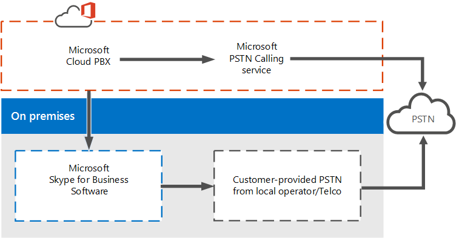
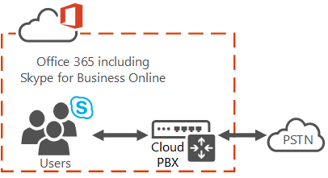
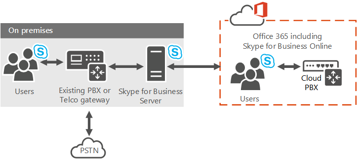
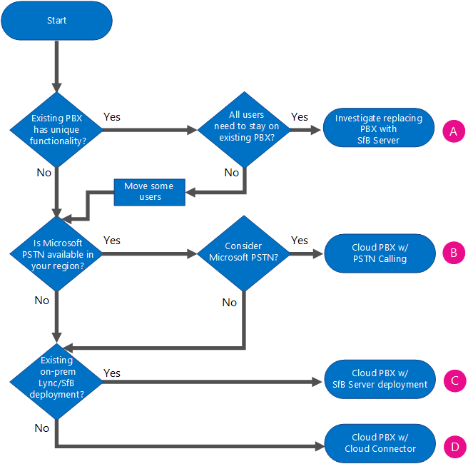

# Plan your Cloud PBX solution in Skype for Business
[]Find information on Microsoft's Cloud PBX solutions for your business.
Microsoft offers a variety of options for enabling your users to call landlines and mobile phones through the Public Switched Telephone Network (PSTN)--whether their accounts exist in Office 365 on Skype for Business Online or in your on-premises Skype for Business Server or Lync Server 2013 deployment.
  
    
    

This article outlines the different Microsoft voice offerings, and then provides guidance on which options might be the best for you, depending on your organization's current status and future plans. You can use this article along with the Skype for Business Online Voice Solutions poster available as a download in both  [Visio](https://download.microsoft.com/download/2/E/E/2EE5C4DE-7F12-475C-A507-37870020F0D3/Plan Voice Solution poster - Final.vsdx) and [PDF](https://download.microsoft.com/download/2/E/E/2EE5C4DE-7F12-475C-A507-37870020F0D3/Plan Voice Solution poster - Final.pdf) formats.
## Enterprise Voice

 **Enterprise Voice** is Microsoft's world-class software-powered Voice over Internet Protocol (VoIP) solution, included in on-premises deployments of Skype for Business Server. Enterprise Voice offers a rich set of capabilities and features, including Response Groups, Call Park, Enhanced 9-1-1, and much more. Enterprise Voice is a full Private Branch Exchange (PBX) system for your organization, including PSTN connectivity through your local operator.
  
    
    

  
    
    

  
    
    

  
    
    
For more information about Microsoft's Enterprise Voice solutions, see:  [Plan for Enterprise Voice in Skype for Business Server 2015](plan-for-enterprise-voice-in-skype-for-business-server-2015.md),  [Deploy Enterprise Voice in Skype for Business Server 2015](deploy-enterprise-voice-in-skype-for-business-server-2015.md),  [Planning for Enterprise Voice in Lync Server 2013](https://technet.microsoft.com/library/gg413081%28v=ocs.15%29.aspx), and  [Deploying Enterprise Voice in Lync Server 2013](https://technet.microsoft.com/EN-US/library/gg412876%28v=ocs.15%29.aspx).
  
    
    

## Cloud PBX

 **Cloud PBX** is Microsoft's technology for enabling call control and PBX capabilities in the Office 365 cloud with Skype for Business Online. Skype for Business Cloud PBX allows you to replace your existing PBX system with a set of features directly delivered from Office 365 and tightly integrated into the company's cloud productivity experience.
  
    
    
With Cloud PBX, your users can use Skype for Business Online to take care of basic call control tasks, such as placing and receiving calls, transferring calls, and muting and unmuting calls. Cloud PBX users can click a name in their address book, and Skype for Business places a call to that person. To place and receive calls, Cloud PBX users can use their mobile devices, a headset with a laptop or PC, or one of many IP phones that work with Skype for Business. For administrators, Cloud PBX provides the ability to manage calling within the same Tenant admin console used for messaging, collaboration, and so on.
  
    
    
As with traditional PBX systems and with Enterprise Voice, calls between users in your organization are handled internally within Cloud PBX, never going to the PSTN. This applies to calls between users in your organization located in different geographical areas, removing long-distance costs on these internal calls.
  
    
    
To enable calls to landlines and mobile phones, Cloud PBX can be connected to the PSTN in one of two ways:
  
    
    

- By purchasing the PSTN Calling service add-on to Office 365.
    
  
- By using on-premises PSTN connectivity, where software on-premises connects with your existing telephony infrastructure. 
    
  

## Cloud PBX solutions

The solution you choose to take advantage of Microsoft's Cloud PBX offering depends on your current and future needs, such as whether you want--or are required--to retain functionality provided by your on-premises deployment, whether you need features that are currently available only with your on-premises Enterprise Voice solution, and what your plan is for moving people to the cloud. 
  
    
    
You can choose a completely-in-the-cloud offering, or you can choose a hybrid deployment that takes advantage of Cloud PBX, but keeps some functionality on premises. Depending on your needs, you can choose to have PSTN functionality provided by the Office 365 service or by your on-premises software--as shown in the following diagram and described in the sections that follow:
  
    
    

  
    
    

  
    
    

  
    
    

- **Cloud PBX with PSTN Calling service** - This is the service plan you can add to Cloud PBX to enable calling to landlines and mobile phones around the world (depending on the level of service being licensed). Your users are homed in the cloud and are enabled for Cloud PBX with PSTN Calling provided by Microsoft. The PSTN Calling offering is an add-on to Office 365 that does not require an on-premises server deployment. PSTN Calling only works with Cloud PBX--you can't use it with another PBX system. For more information, see [PSTN Calling service](plan-your-cloud-pbx-solution-in-skype-for-business.md#BKMK_PSTNCalling).
    
  
- **Cloud PBX with on-premises PSTN connectivity** - This option uses software on premises to connect your existing PSTN carrier, circuit, and contract with Office 365. Your users are homed in the cloud and are enabled for Cloud PBX, but their calling is processed through software on premises.
    
    You continue to use your existing PSTN connectivity (either through a PBX, Gateway, Session Border Controller, or SIP Trunking connection) to source PSTN for the users who you move to the cloud. Once a user is moved to Skype for Business Online and Cloud PBX, their phone number will route to any of the Skype for Business clients for PCs or Smartphones as well as desk phones certified for Skype for Business. Once ported, Cloud and legacy PBX users can call each other normally as well as make and receive PSTN calls using their full phone number.
    
    If you want to implement on-premises PSTN connectivity, you can choose from the following options:
    
  - **Skype for Business Cloud Connector Edition** - Cloud Connector is a hybrid offering that consists of a set of packaged Virtual Machines (VMs) that implement on-premises PSTN connectivity. By deploying a minimal Skype for Business Server topology in a virtualized environment, users in your organization, whether homed in the cloud are on premises, will be able to send and receive calls with landlines and mobile phones through the existing on-premises voice infrastructure. For more information, see [Plan for Skype for Business Cloud Connector Edition](plan-for-skype-for-business-cloud-connector-edition.md) and [Configure Skype for Business Cloud Connector Edition](configure-skype-for-business-cloud-connector-edition.md).
    
  
  - **Skype for Business Server existing deployment** - An existing Skype for Business Server or Lync Server deployment can implement on-premises PSTN connectivity as well. This is a hybrid offering that consists of a Skype for Business Server on-premises deployment modified for hybrid PSTN. Users in your organization, whether homed in the cloud are on premises, will be able to send and receive calls with landlines and mobile phones through the existing on-premises voice infrastructure. For more information, see [Plan Cloud PBX with on-premises PSTN connectivity in Skype for Business Server 2015 or Lync Server 2013](plan-cloud-pbx-with-on-premises-pstn-connectivity-in-skype-for-business-server-2.md) and [Deploy Cloud PBX with on-premises PSTN connectivity in Skype for Business Server 2015 or Lync Server 2013](deploy-cloud-pbx-with-on-premises-pstn-connectivity-in-skype-for-business-server.md).
    
  

### PSTN Calling service

 **PSTN Calling service** is the service that works with Cloud PBX allowing users to make calls to landlines and mobile phones. Because the PSTN Calling service operates out of Office 365, this is a completely-in-the-cloud offering that does not require an on-premises server deployment.
  
    
    
Users of this option are homed in Skype for Business Online in Office 365 and have access to Skype for Business Online voice services. Microsoft is the provider of both core calling and PSTN services, and can even provide or port your users' phone numbers. 
  
    
    
PSTN Calling allows you to search, acquire, and assign phone numbers to users in your organization so that users can make and receive phone calls with people inside and outside of your organization.
  
    
    
In all types of business, having a phone number that allows users to send and receive voice calls is an important requirement to do business as phone numbers are used to identify a user and allow for communication across organizations. The users that are assigned phone numbers will be able to make voice calls across all Skype for Business devices including VoIP phones, PCs, and mobile devices. 
  
    
    

  
    
    

  
    
    

  
    
    
For more information, see  [What is PSTN Calling?](https://support.office.com/en-us/article/What-is-PSTN-calling-3dc773b9-95e0-4448-b2f1-887c54022429?ui=en-US&amp;rs=en-US&amp;ad=US)
  
    
    
PSTN Calling service is available in specific but growing geographic locations. Please check with your Microsoft representative for availability in your area. 
  
    
    

### On-premises PSTN connectivity with Cloud Connector Edition

 **Cloud Connector** is a set of packaged Virtual Machines (VMs) that implement on-premises PSTN connectivity with Cloud PBX. This hybrid offering is designed for organizations that want to enable their Skype for Business Online users to use their existing on-premises PSTN connection, with Skype for Business call control in the cloud.
  
    
    
With this option, you deploy a set of packaged VMs that contain a minimal Skype for Business Server topology--consisting of an Edge component, Mediation component, and a Central Management Store (CMS) role. These services are configured for hybrid with your Office 365 tenant that includes Skype for Business Online services. 
  
    
    

  
    
    

  
    
    

  
    
    
For more information about this option, see  [Plan for Skype for Business Cloud Connector Edition](plan-for-skype-for-business-cloud-connector-edition.md) and [Configure Skype for Business Cloud Connector Edition](configure-skype-for-business-cloud-connector-edition.md).
  
    
    

### On-premises PSTN connectivity with an existing deployment

You can implement a hybrid solution using your existing Skype for Business Server deployment and PSTN connectivity. In this topology, users are homed in the cloud on Skype for Business Online instead of being homed on the on-premises deployment. You can choose this option if you currently have users homed in the cloud or if you want to start migrating users to the cloud. 
  
    
    
With this option, your Skype for Business Online users get their PSTN connectivity through Enterprise Voice on your on-premises Skype for Business Server deployment, with Skype for Business call control in the cloud. 
  
    
    

  
    
    

  
    
    

  
    
    
For more information about this option, see  [Plan Cloud PBX with on-premises PSTN connectivity in Skype for Business Server 2015 or Lync Server 2013](plan-cloud-pbx-with-on-premises-pstn-connectivity-in-skype-for-business-server-2.md) and [Deploy Cloud PBX with on-premises PSTN connectivity in Skype for Business Server 2015 or Lync Server 2013](deploy-cloud-pbx-with-on-premises-pstn-connectivity-in-skype-for-business-server.md).
  
    
    

## Choose the best solution

To decide which solution is best for your organization, make sure you know the answers to the following questions, and then review the flowchart that will help you choose your solution:
  
    
    

- Do you have an existing on-premises Skype for Business Server deployment? 
    
  
- Are your users homed in Skype for Business on-premises, in the cloud on Skype for Business Online, or both? Do you want to move your on-premises users to the cloud?
    
  
- Is Microsoft's PSTN calling service available in your region? 
    
  
- Do you want to keep your current telephony carrier? Do you need to keep your current telephony carrier because of an existing contract?
    
  
- Do you have an existing on-premises legacy PBX that you want or need to keep? 
    
  
- Does your current legacy PBX offer unique features that are critical to your business?
    
  
- Do any or all of your users require features not currently offered in Cloud PBX?
    
  
Before you make your decision about which solution is right for your organization--Cloud PBX, on-premises Enterprise Voice, or a combination solution--you need to determine what features you need now and in the future. Some features--such as Response Groups, Group Call Pickup, and Call Park--are offered only for on-premises users. For a complete list of Cloud PBX features available to you, see  [Here's what you get with Cloud PBX](https://go.microsoft.com/fwlink/p/?LinkId=715517).
  
    
    

  
    
    

**Choose your solution**

  
    
    

  
    
    

  
    
    

  
    
    

|||
|:-----|:-----|
|**Your situation**   |**Cloud PBX solution**   |
|
  
    
    

  
    
    
Your PBX system offers unique features that you need to retain.    |**Investigate replacing your PBX with Skype for Business Server.** You can use Skype for Business Server Enterprise Voice as a full PBX system for your organization, including PSTN connectivity through your local operator. If your need for PBX features changes in the future, you can reconsider Microsoft Cloud PBX.   For more information about Microsoft's Enterprise Voice solutions, see  [Plan your Enterprise Voice solution in Skype for Business Server 2015](plan-your-enterprise-voice-solution-in-skype-for-business-server-2015.md).    If not all your users require the unique features provided by your current PBX, you can consider moving those users to Skype for Business Online.    |
|
  
    
    

  
    
    
Your PBX does not offer unique features that you need to retain, PSTN Calling service is available in your region, and you want to use Microsoft-provided PSTN services.    |**Subscribe to PSTN Calling service.** All your users can be in the cloud on Skype for Business Online, and your organization can receive both PBX and PSTN services from the Microsoft cloud. If your users already have phone numbers from your current carrier, the phone numbers can be ported to Cloud PBX. As needed, you can then get additional phone numbers from Microsoft.   For more information, see  [What is PSTN Calling?](https://support.office.com/en-us/article/What-is-PSTN-calling-3dc773b9-95e0-4448-b2f1-887c54022429?ui=en-US&amp;rs=en-US&amp;ad=US)   |
|
  
    
    

  
    
    
Your PBX does not offer unique features that you need to retain, PSTN Calling service is not available in your region, and you have an existing Lync or Skype for Business Server deployment.    In this scenario it is also possible that all your users are in the United Stated, but you cannot consider moving to Microsoft-provided PSTN for other reasons-- such as contractual obligations with your existing carrier.    |**Connect your existing Skype for Business Server deployment with Cloud PBX.** PSTN connectivity is provided through Enterprise Voice on your on-premises Skype for Business Server deployment, but your organization can receive PBX services from the Microsoft cloud. You can retain your users' voice capabilities as you begin to move them to Skype for Business Online. You can move your users at your own pace, knowing that their voice features will continue no matter where they are homed.   In the future, if you decide you can leave your current carrier, you can port your cloud users to Microsoft's full Cloud PBX with PSTN Calling service, with Microsoft providing all PBX and PSTN capabilities.    For more information about this option, see  [Plan Cloud PBX with on-premises PSTN connectivity in Skype for Business Server 2015 or Lync Server 2013](plan-cloud-pbx-with-on-premises-pstn-connectivity-in-skype-for-business-server-2.md) and [Deploy Cloud PBX with on-premises PSTN connectivity in Skype for Business Server 2015 or Lync Server 2013](deploy-cloud-pbx-with-on-premises-pstn-connectivity-in-skype-for-business-server.md).    |
|
  
    
    

  
    
    
Your PBX does not offer unique features that you need to retain, PSTN Calling service in not available in your region, and you do not have an existing Lync or Skype for Business Server deployment.    In this scenario, it is also possible that PSTN Calling service is available in your region, but you cannot consider moving to Microsoft-provided PSTN for other reasons-- such as contractual obligations with your existing carrier.    |**Deploy Cloud Connector.** You keep your current PSTN carrier, but your organization can receive PBX services from the Microsoft cloud. Cloud Connector allows you to provide Skype for Business call control capabilities to your users. This solution works no matter the geographic location of your users, as each user is connected to their local site for PSTN connectivity.   In the future, if you decide you can leave your current carrier, you can port your cloud users to Microsoft's full Cloud PBX with PSTN Calling service, with Microsoft providing all PBX and PSTN capabilities.    For more information about this option, see  [Plan for Skype for Business Cloud Connector Edition](plan-for-skype-for-business-cloud-connector-edition.md) and [Configure Skype for Business Cloud Connector Edition](configure-skype-for-business-cloud-connector-edition.md).    |
   

### Choose a combination solution

Of course, you don't have to choose just one solution for your entire organization. Following are just some examples where combining solutions might be the best strategy for your organization:
  
    
    

- **My organization has an existing Skype for Business Server deployment, PSTN Calling service is available in my region, I only need basic call control features, and I do not need to keep my PSTN trunks or PBX on premises.** You can use Cloud PBX with PSTN connectivity to keep users' voice features as you start to move them online. Eventually, you can move all users online, deprecate your on-premises servers, and use Cloud PBX with PSTN Calling.
    
  
- **My organization has many geographic locations. The larger sites have an on-premises Skype for Business Server deployments with Enterprise Voice, while users at the smaller sites do not have any Skype for Business voice features at all.** If these smaller sites are in a region that provides PSTN Calling service, you could move these users to Skype for Business Online and enable them for voice features through Cloud PBX with PSTN Calling. All the while, users at your larger sites can stay on premises, or you could move them to Skype for Business Online at your own pace by taking advantage of Cloud PBX with PSTN connectivity.
    
  
- **My organization has an existing Skype for Business Server deployment, PSTN Calling service is available in my region, but some of my users require advanced calling features such as Response Groups and Group Call Pickup.** Those users who do not need to use advanced calling features can be moved to the cloud now, using Cloud PBX with PSTN connectivity. Later, when the required features are added to Skype for Business Online, you can move the rest of your users to the cloud as well.
    
  
- **My organization has an existing Skype for Business Server deployment, I want to move all my users to the cloud, but PSTN Calling service is not available in all regions.** You can move all your users to the cloud while retaining their local site trunk and PBX functionality, using Cloud PBX with PSTN connectivity. For those users residing in regions that provide PSTN Calling service--and who do not need advanced calling features--you can optionally move their call control to the cloud as well, using Cloud PBX with PSTN Calling. When you do so, you can optionally port their existing phone numbers.
    
  
- **My organization has an existing Skype for Business Server, but without Enterprise Voice deployment.** See the flowchart to determine the best solution for your organization.
    
  

