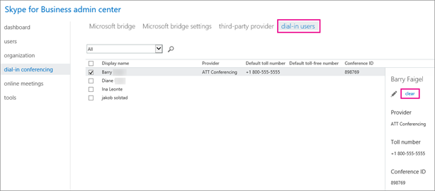

# Set the dial-in phone numbers for meeting organizers that are included on invites

Skype for Business dial-in conferencing enables users in your organization to create a Skype for Business Online meeting and then allow users to dial in to it using a phone. In Office 365, you have the option of using a Microsoft dial-in conferencing bridge or to use a third-party audio conferencing bridge that is hosted by an approved audio conferencing provider (ACP).
  
    
    

A conferencing bridge gives you a set of dial-in phone numbers for your organization. All of them can be used to join the meetings that a meeting organizer has created, but you can select which ones will be included on their meeting invites.
> [!NOTE]
> There can be a maximum of one toll and one toll-free phone number on the meeting invite for a meeting organizer, but there is also a link located at the bottom of each meeting invite that opens the full list of all dial-in phone numbers that can be used to join a meeting. 
  
    
    


## Setting the default dial-in phone number for a meeting organizer


1. Sign in to Office 365 with your work or school account. 
    
  
2. Choose **Admin centers** > **Skype for Business**. 
    
  
3. Choose **Users**.
    
    
  
    
    

    
  
4. Choose which users you want to edit: 
    
  - To select a single user, choose the user's name.
    
  
  - To select all users on the page, check the box next to **Display name** at the top of the list.
    
  
  - To select multiple users, press and hold Ctrl, and then choose the users you want.
    
  
5. In the right panel, choose **Edit**.
    
    
  
    
    

    
  
6. In the **Provider** dropdown box, choose the provider for the user. Depending on the provider, complete the following boxes.
    
  - **Microsoft is the provider**: use the **Default toll number** and **Default toll-free number** lists to select the default numbers for the user.
    
    > [!NOTE]
      > At least one toll-free number must be assigned to your conferencing bridge before it can be set as the default toll-free number of a user. To get a toll-free number, see  [Getting Skype for Business service phone numbers](getting-skype-for-business-service-phone-numbers.md). 
  - **A third-party is the provider**: use the **Toll number** and **Toll-free number** fields to enter the numbers for the user.
    
  

## Reset dial-in conferencing phone numbers


1. In the **Skype for Business admin center**, choose **dial-in conferencing**. 
    
  
2. At the top of the page, choose **dial-in users**. 
    
  
3. Choose the users you want to reset, and then choose **Clear**. 
    
    
  
    
    

    
  
By default, when you change a user's conferencing settings, emails are sent to users. To change this, see  [Enable or disable sending emails when dial-in conferencing settings change](enable-or-disable-sending-emails-when-dial-in-conferencing-settings-change.md).
  
    
    

## Want to know how to manage with Windows PowerShell?


- To save time or automate this, you can use the  [Set-CsOnlineDialInConferencingUser](https://go.microsoft.com/fwlink/?LinkId=617688) cmdlet.
    
  
- Use the  [Set-CsOnlineDialInConferencingUser](https://go.microsoft.com/fwlink/?LinkId=617688) cmdlet to change the default toll or toll-free number for specific users.
    
    To change the default toll-free number for a user, run:
    


  ```
  
Set-CsOnlineDialinConferencingUser -Identity amos.marble@Contoso.com -TollFreeServiceNumber   80045551234
  ```

- Use the **Set-CsOnlineDialInConferencingUserDefaultNumber** cmdlet to change the default toll or toll-free number of users based on their original default number or their location.
    
    > [!NOTE]
      > To find the BridgeID, use the **Get-CsOnlineDialInConferencingBridge**.

  - To set the default toll-free number for all users without one to 8005551234, run:
    
  ```
  
Set-CsOnlineDialInConferencingUserDefaultNumber -FromNumber $null -ToNumber 8005551234 -NumberType TollFree -BridgeId <Bridge Id>  
  ```

  - To change the default toll-free number of all users that have 8005551234 as their default toll-free number to 8005551239, run:
    
  ```
  Set-CsOnlineDialInConferencingUserDefaultNumber -FromNumber 8005551234 -ToNumber 8005551239 NumberType TollFree -BridgeId <Bridge Id>
  ```

  -  To set the default toll-free number of all users located in the U.S. to 8005551234, run:
    
  ```
  Set-CsOnlineDialInConferencingUserDefaultNumber -Country US -ToNumber 8005551234 -NumberType TollFree -BridgeId <Bridge Id>
  ```


    > [!NOTE]
      > The location that is used above needs to match the contact information of user(s) that is set in the Office 365 admin center. 

- When it comes to Windows PowerShell is all about managing users and what users are allowed or not allowed to do. With Windows PowerShell, you can manage Office 365 and Skype for Business Online using a single point of administration that can simplify your daily work, when you have multiple tasks to do. To get started with Windows PowerShell, see these topics:
    
  -  [An introduction to Windows PowerShell and Skype for Business Online](https://go.microsoft.com/fwlink/?LinkId=525039)
    
  
  -  [Six Reasons Why You Might Want to Use Windows PowerShell to Manage Office 365 ](https://go.microsoft.com/fwlink/?LinkId=525041)
    
  
- Windows PowerShell has many advantages in speed, simplicity, and productivity over only using the Office 365 admin center such as when you are making setting changes for many users at one time. Learn about these advantages in the following topics:
    
  -  [Best ways to manage Office 365 with Windows PowerShell](https://go.microsoft.com/fwlink/?LinkId=525142)
    
  
  -  [Using Windows PowerShell to manage Skype for Business Online](https://go.microsoft.com/fwlink/?LinkId=525453)
    
  
  -  [Using Windows PowerShell to do common Skype for Business Online management tasks](https://go.microsoft.com/fwlink/?LinkId=525038)
    
  

## See also


#### Other Resources


  
    
    
 [Set up dial-in or PSTN conferencing for Skype for Business](set-up-dial-in-or-pstn-conferencing-for-skype-for-business.md)
