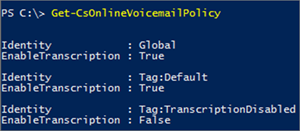

# Set up Cloud PBX voicemail - Admin help

This article is for the  [About Office 365 admin roles](http://technet.microsoft.com/library/da585eea-f576-4f55-a1e0-87090b6aaa9d%28Office.14%29.aspx) who wants to set up Skype for Business Cloud PBX voicemail for everyone in their business.
  
    
    


> [!NOTE]
> Cloud PBX voicemail supports depositing voicemail messages only in an Exchange mailbox and doesn't support any third-party email systems. As a fallback mechanism, Cloud PBX Voicemail can resend messages using SMTP, which means users with a mailbox on a third-party email system will receive their voicemail messages with no guaranteed service uptime or other voicemail features, such as changing their greetings and other settings . 
  
    
    


## Cloud-only environments: Set up Cloud PBX voicemail

For Skype for Business Online and PSTN Calling users, Cloud PBX voicemail is automatically set up and provisioned for users after you assign a Skype for Business Cloud PBX license and a phone number to them.
  
    
    

1. If the Cloud PBX feature isn't included in your plan, you may need to purchase Cloud PBX add-on licenses. You may also need to purchase an Exchange Online Plan 2 license. See  [Skype for Business add-on licensing](skype-for-business-add-on-licensing.md).
    
  
2.  [Assign or remove licenses for Office 365 for business](http://technet.microsoft.com/library/997596b5-4173-4627-b915-36abac6786dc%28Office.14%29.aspx) and the [Assign Skype for Business licenses](assign-skype-for-business-licenses.md) and Exchange Online Plan 2 licenses to the people in your business. After you do that, they will be able to receive voicemail messages!
    
  
3. Voicemail Transcription service has been added as of March 2017 and is enabled by default for all tenants and users. To disable Transcription for your tenant or users, See Transcription Policies
    
  

## Cloud PBX with On-Premises PSTN Calling environments

Following is information about configuring Cloud PBX voicemail to work with on-premises PSTN Calling environments.
  
    
    

1. If the Cloud PBX feature isn't included in your plan, you may need to purchase Cloud PBX add-on licenses. You also need to purchase an Exchange Online Plan 2 license. See  [Skype for Business add-on licensing](skype-for-business-add-on-licensing.md).
    
  
2.  [Assign or remove licenses for Office 365 for business](http://technet.microsoft.com/library/997596b5-4173-4627-b915-36abac6786dc%28Office.14%29.aspx) and the [Assign Skype for Business licenses](assign-skype-for-business-licenses.md) and Exchange Online Plan 2 licenses to the people in your business.
    
  
3. Next, follow the instructions in the **Enable users for Cloud PBX voice and voice mail services** section of the [Configure Skype for Business Cloud Connector Edition guide](https://technet.microsoft.com/en-us/library/mt605228.aspx).
    
  
4. Support for Voicemail transcription has been added as of March 2017 and is enabled by default for all tenants and users. To disable transcription for your tenant or users, See Voicemail Policies
    
    You can also see  [Customer issues between ExUM and Azure Voicemail](https://support.microsoft.com/en-us/kb/3195158) for how to configure delivery of Azure voicemail messages for Cloud PBX users that have a on-premises mailbox.
    
  

## Setting voicemail policies in your organization

Voicemail transcription is enabled by default for all organizations and users, however, you can control it by using the  [Set-CsOnlineVoicemailPolicy]() and [Grant-CsOnlineVoicemailPolicy](https://technet.microsoft.com/EN-US/library/mt798311.aspx) cmdlet.
  
    
    

> [!IMPORTANT]
> You can't create a new policy instance for transcription using the **New-CsOnlineVoiceMailPolicy** cmdlet and you can't remove an existing policy instance using the **Remove-CsOnlineVoiceMailPolicy** cmdlet.
  
    
    

You can manage the transcription settings for your users using voicemail policies. To see the all available voicemail policy instances, you can use the [Get-CsOnlineVoicemailPolicy]() cmdlet.
  
    
    
 **PS C:\\> Get-CsOnlineVoicemailPolicy**
  
    
    

  
    
    

  
    
    

### Turning off transcription for your organization

Because the default setting for transcription is on for your organization, you may want to disable it by using the  [Set-CsOnlineVoicemailPolicy](https://technet.microsoft.com/EN-US/library/mt798310.aspx). To do this run:
  
    
    

```

Set-CsOnlineVoicemailPolicy -EnableTranscription $false
```


### Turning off transcription for a user

User policies are evaluated before the organizational default settings. For example, if voicemail transcription is enabled for all of your users you can assign a policy to disable transcription for a specific user using  [Grant-CsOnlineVoicemailPolicy](https://technet.microsoft.com/EN-US/library/mt798309.aspx) cmdlet.
  
    
    
To disable transcription for a single user, run:
  
    
    


```

Grant-CsOnlineVoicemailPolicy -PolicyName TranscriptionDisabled -Identity sip:amosmar@contoso.com
```


> [!IMPORTANT]
> The voicemail service in Office 365 caches voicemail policies and updates the cache every 4 hours. So, policy changes that you make can take up to 4 hours to be applied. 
  
    
    


## Help your users learn Skype for Business voicemail features

We have a lot of training information and articles to help your users be successful with Skype for Business voicemail. Point them to the following articles:
  
    
    

-  [Check Skype for Business voice mail and options](http://technet.microsoft.com/library/2deea7f8-831f-4e85-a0d4-b34da55945a8%28Office.14%29.aspx): This article explains how to listen to your voicemail in Skype for Business, change your voice mail greeting, and listen to your voicemail at different speeds.
    
  
-  [Skype for Business 2016 training](http://technet.microsoft.com/library/eb2081bc-fd0a-4eda-94da-5a39f369ee74%28Office.14%29.aspx)
    
  

## Related Topics

 [Set up Skype for Business Online](set-up-skype-for-business-online.md)
  
    
    
 [Here's what you get with Cloud PBX](here-s-what-you-get-with-cloud-pbx.md)
  
    
    

