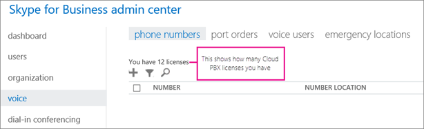

# Set up PSTN Calling for Skype for Business

Calls to other Skype for Business users are free, but if you want your users to be able to call regular phones outside of your business, get the PSTN Calling telephone service. It's easy to set up the Skype for Business PSTN Calling service for your business.  [What is PSTN calling?](what-is-pstn-calling.md)
  
    
    

## Step 1: Buy and assign licenses

1. If the Cloud PBX feature isn't included in your plan, you may need to purchase Cloud PBX add-on licenses. After you have Cloud PBX licenses, purchase a  [PSTN Calling plans for Skype for Business](pstn-calling-plans-for-skype-for-business.md). See  [Skype for Business add-on licensing](skype-for-business-add-on-licensing.md), and buy the licenses and plan. 
    
    > [!TIP]
      > Cloud PBX licenses and voice calling plans go together, so to see the option to purchase a voice calling plan, you must first have the Cloud PBX licenses. 
2. First  [Assign a Cloud PBX license](http://technet.microsoft.com/library/36c6d5a6-5ea8-4c44-9f18-fea33d5a847e%28Office.14%29.aspx) and then [Assign a PSTN Calling plan license](http://technet.microsoft.com/library/af1095d8-28d7-4424-84f5-9140425fba09%28Office.14%29.aspx) to the people in your organization.
    
  

## Step 2: Get phone numbers

If you're outside of the United States, the order of steps changes slightly. This is because in some countries/regions you get an emergency address with the phone number that you get from Office 365 or the phone number you transfer. So, if you are outside of the U.S., first do  [Step 3: Add emergency addresses and locations for your organization](set-up-pstn-calling-for-skype-for-business.md#bkmk_add_addresses), and then do **Step 2: Get phone numbers**.
  
    
    

  
    
    

1. If you are using phone numbers from Office 365, you follow these steps. **If you need to transfer existing phone numbers from another service provider, follow the steps in  [Transfer phone numbers to Skype for Business Online](transfer-phone-numbers-to-skype-for-business-online.md)**.
    
  
2. Sign in to Office 365 with your work or school account.
    
  
3. Go to the **Office 365 admin center** > **Admin centers** > **Skype for Business >** **Voice**.
    
||
|:-----|
|**IMPORTANT**: For you to see the **Voice** option in the left navigation in the Skype for Business admin center, you must first buy at least one **Enterprise E5 license**, one **Skype for Business Cloud PBX** add-on license, or one **Skype for Business PSTN Conferencing** add-on license.|
   

    
    
  
4. Choose **Phone numbers**. You'll see how many Skype for Business Cloud PBX licenses you have, to give you an idea how many phone numbers to request.
    
    > [!TIP]
      > You can acquire more phone numbers than you have licenses for. To determine how many phone numbers you can acquire, add 10% of your licenses, and then add 10. For example, if you have purchased 100 licenses, you can acquire 120 phone numbers. 

     
  

  

  
5. Choose **Add**. On the **Add new user numbers** page, choose the country/region and city that you want to select numbers from.
    
  
6.  Under **Quantity**, enter the number of phone numbers that you want for your organization from this area, and click **Add** to create a reservation.
    
    > [!CAUTION]
      > You have 10 minutes to select your phone numbers. After 10 minutes the phone numbers are returned to the pool of phone numbers at Office 365. 

    In the following picture you can see I added phone numbers for two different cities, and I have 9 minutes left to acquire them. 
    
     
  

  

  
7. You can choose **Show numbers** to see the full list of phone numbers. This is helpful if you don't want a specific phone number in the list.
    
  
8. Select the phone numbers you want and then choose **Acquire numbers**.
    
  
9. You'll return to the Voice page where you'll see all the numbers you acquired. 
    
    
  
    
    

  
    
    

  
    
    

  
    
    

    
  

## Step 3: Add emergency addresses and locations for your organization

1. On the **Voice** page, choose **Emergency locations** > **Add**.
    
  
2. In the **New address** pane, enter a name for your address, and then complete the remaining boxes.
    
     
  

    
    > [!TIP]
      > For English customers, if the street name is a number, be sure to include "st" or "th" at the end, as shown in the above picture. 
3. Choose **Validate**.
    
    If needed, you'll be prompted to make corrections to the address. 
    
    > [!CAUTION]
      > Validating a street or civic address involves making sure that it is legitimate and correctly formatted. It is possible that a partially correct emergency address - such as if you mistyped the name of the city - may still pass validation. Even though it's misspelled and passed validation, the combination of the misspelled name of city along with the other correct parts of the address are enough information to route the call to the appropriate emergency dispatch center. 

    > [!TIP]
      > If the address needs to be corrected for emergency response, a green banner will appear notifying you that the address was updated. 
4. After the address is validated, choose **Save**.
    
  

## Step 4: Assign phone numbers and emergency addresses to users

> [!TIP]
> If you add more people to your business right before doing this step, it may take **several hours** for them to appear on the **Voice users** page. There's a latency.
  
    
    

1. On the **Voice users** page, choose the people who you want to assign a phone number and emergency address to.
    
  
2. Choose **Assign number**.
    
  
3. On the **Assign number** page, in the **Select number to assign** drop down, select the phone number for the user.
    
  
4. To select an emergency address, put the name of the city in the **Find City** box and choose Search.
    
    > [!IMPORTANT]
      > If you are outside the U.S., your numbers already have an emergency address but you can change it now. See  [Assign or change an emergency address for a user](assign-or-change-an-emergency-address-for-a-user.md). 
5. After you assign both the phone number and emergency address, choose **Save**.
    
  

## Step 5: Tell your users about their new phone numbers

We recommend sending mail or using your business's preferred communication method to tell the people about their new phone numbers. Here's how they can see that phone number in their Skype for Business app:
  
    
    

1. Sign in to Skype for Business on your desktop.
    
  
2. Choose **Settings** > **Tools** > **Options**. 
    
     
  

  

  
3. Then choose **Phones**. 
    
    
  
    
    

  
    
    

  
    
    

  
    
    

    
  

## What else do you need to know?

- An emergency address is often referred to as a civic address, street address, or a physical address. It is the street or civic address of a place of business for your organization.
    
  
- Emergency locations aren't validated, only emergency addresses are.
    
  
- If you want to know more about emergency addresses, see  [What are emergency locations, addresses and call routing?](what-are-emergency-locations-addresses-and-call-routing.md)
    
  

## Do you want to automate assigning phone numbers?

If you know Windows PowerShell, you can use the following cmdlets to automate assigning phone numbers to your users. 
  
    
    

-  [Get-CsOnlineTelephoneNumber](https://technet.microsoft.com/en-us/library/mt243818.aspx): Retrieves the telephone numbers from the Business Voice Directory.
    
  
-  [Set-CsOnlineVoiceUser](https://technet.microsoft.com/en-us/library/mt243817.aspx): Sets the telephone numbers.
    
  
To learn more, see  [Quick reference: Using Windows PowerShell to do common Skype for Business Online management tasks](https://technet.microsoft.com/en-us/library/dn362776%28v=ocs.15%29.aspx).
  
    
    

## Leave us a comment

Were these steps helpful? If so, please let us know at the bottom of this article. If not, please let us know what was confusing and we'll use your feedback to double-check our steps. 
  
    
    

## See also

#### Other Resources

  
    
    
 [Skype for Business Online: Emergency Calling disclaimer label](https://go.microsoft.com/fwlink/?LinkID=692099)
  
    
    
 [Emergency calling terms and conditions](emergency-calling-terms-and-conditions.md)
  
    
    
 [Skype for Business Online PSTN services use terms](skype-for-business-online-pstn-services-use-terms.md)
