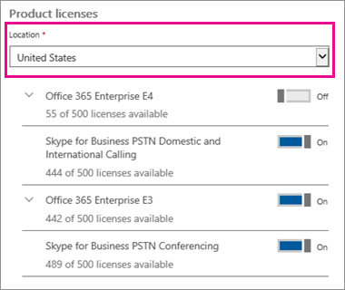
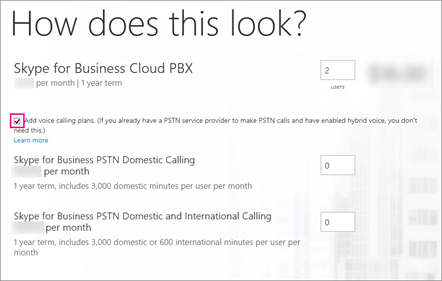
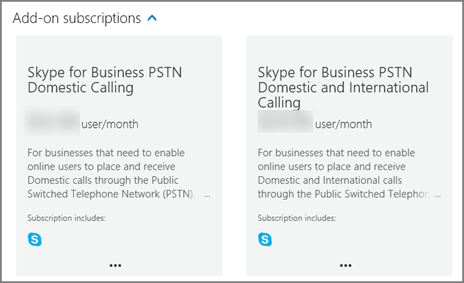

# Calling Plans for Office 365

Calls to other Skype for Business and Microsoft Teams users are free, but if you want your users to be able to call regular phones, and you don't already have a service provider to make voice calls, you need to buy a Calling Plan. [What are Calling Plans in Office 365?](../what-are-calling-plans-in-office-365/what-are-calling-plans-in-office-365.md)
  
Here are the Calling Plans option:
  
- **Domestic Calling Plan**: Licensed users can call out to numbers located in the country/region where they are assigned in Office 365.
    
- **Domestic and International Calling Plan**: Licensed users can call out to numbers located in the country/region where their Office 365 license is assigned to the user based on the user's location, and to international numbers in [196 countries/regions](../countries-and-region-availability-for-audio-conferencing-and-calling-plans/users-can-make-outbound-calls-to-these-countries-and-regions.md).
    
Monthly minutes available for each organization and each country/region are located [here](../countries-and-region-availability-for-audio-conferencing-and-calling-plans/countries-and-region-availability-for-audio-conferencing-and-calling-plans.md).
  
> [!IMPORTANT]
> The country/region is based on the location of the user's license in the **Office 365 admin center** > **Active users** and **NOT** the billing address listed under the **Organization Profile** in the **Office 365 admin center**.   

  
For detailed information about usage limits and terms of use, see [Audio Conferencing complimentary dial-out period](../accessibility-and-regulatory/audio-conferencing-complimentary-dial-out-period.md).
  
## How to buy a Calling Plan

1. **You must first purchase a **Phone System** add-on license**. To do that, [sign into the Office 365 admin center](https://portal.office.com/adminportal/home?add=sub&amp;adminportal=1#/catalog) and choose **Billing** > **Purchase services** > **Add-on subscriptions** > **Buy now**.
    
    
  
    > [!NOTE]
    > Depending on your plan, you may need to buy more add-ons before you can buy Phone System licenses. To learn more, see [Which add-on licenses do I need to buy to get more features?](skype-for-business-and-microsoft-teams-add-on-licensing.md#bkmk_whichaddons)
  
2. After you buy Phone System licenses, you can buy the Calling Plan by signing in to the **Office 365 admin center**, choose **Billing** > **Purchase services** > **Add-on subscriptions**, and then clicking **Buy now**. You'll see the Calling Plans there.
    
    
  
You can buy and assign different Calling Plans to different users, depending on the needs of your organization. After you select the Calling Plan you need, proceed to checkout. You assign a plan to each user in the Office 365 admin center. To learn how, see [Assign Skype for Business and Microsoft Teams licenses](assign-skype-for-business-and-microsoft-teams-licenses.md).
  
## Do you have a service provider that provides on-premises PSTN connectivity for hybrid users?

If so, you don't need to buy a Calling Plan. Office 365 Enterprise E5 includes the **Phone System** add-on, so you can proceed to checkout.
  
Then, assign the Enterprise E5 or **Phone System** add-on licenses to users in the Office 365 admin center. To learn how, see [Assign Skype for Business and Microsoft Teams licenses](assign-skype-for-business-and-microsoft-teams-licenses.md).
  
## Pricing information

- [Pricing for Calling Plans](https://go.microsoft.com/fwlink/?LinkId=799761)
    
- [Pricing for Phone System](https://go.microsoft.com/fwlink/?linkid=799763)
    
- [Pricing for Audio Conferencing](https://go.microsoft.com/fwlink/?linkid=799762)
    
## For more information

Here are more articles that explain how to set up your Calling Plans:
  
- [Set up Calling Plans](../what-are-calling-plans-in-office-365/set-up-calling-plans.md)
    
- [Skype for Business and Microsoft Teams add-on licensing](skype-for-business-and-microsoft-teams-add-on-licensing.md)
    
- [Plan for Skype for Business Cloud Connector Edition](https://technet.microsoft.com/EN-US/library/Mt605227.aspx): This article explains how to set up Office 365 Phone System with your own PSTN connectivity.
    
- [Plan your Phone System in Office 365 (Cloud PBX) solution](https://go.microsoft.com/fwlink/p/?LinkId=717926)
    
## 

||
|:-----|
| **New to Office 365?**         Discover free video courses for **Office 365 admins and IT pros**, brought to you by LinkedIn Learning. |
   
## Related Topics

[Set up Skype for Business Online](../set-up-skype-for-business-online/set-up-skype-for-business-online.md)
  

