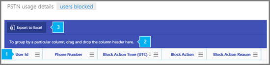

# Skype for Business blocked users report

The new Office 365 **Reports** dashboard shows you the activity overview across the Office 365 products in your organization. It enables you to drill in to individual product level reports to give you more granular insight about the activities within each product. For example, you can use the **Skype for Business Blocked users** report to see the users in your organization that have been blocked from making PSTN calls. This report along with the other Skype for Business reports give you details on activity including PSTN usage across your organization.
  
    
    

 Check out [Activity Reports in the Office 365 admin center](http://technet.microsoft.com/library/0d6dfb17-8582-4172-a9a9-aed798150263%28Office.14%29.aspx) for more reports that are available.
> [!NOTE]
> You can see all of the Skype for Business reports when you log on as an administrator to the Office 365 admin center. 
  
    
    

## How to get to the Skype for Business Users blocked report

1. Go to the Office 365 admin center > **Reports**
    
  
2. Select **Reports** from the left menu then click **Usage**.
    
  
3. From the drop down under **Select a report**, click **Skype for Business Users blocked**.
    
     
  

    
    > [!IMPORTANT]
      > Depending on the Office 365 subscription you have, you might not see all the products and reports that are shown here. 

## Interpret the Skype for Business Blocked users report

You can get a view into your user's **Skype for Business Blocked user** by looking at each of the columns that are displayed.
  
    
    
This is what the report looks like.
  
    
    

  
    
    

  
    
    

  
    
    

  
    
    

|||
|:-----|:-----|
|**1**   | The table shows you a breakdown of the all of the users that are blocked from making calls. This shows all users that have Skype for Business Cloud PBX or PSTN Conferencing assigned to them. You can add/remove columns to the table.   **User ID** is the user's sign in.   **Phone number** is the number that is assigned to a user.   **Block action time** is the time (UTC) that the user was blocked from making calls.   **Block action** is the type of action that was taken to block the user.   **Block action reason** is the reason the user has been blocked from making calls.   |
|**2**   |Click to drag a column to **To group by a particular column, drag and drop the column header here** if you want to create a view that groups all of the data in one or more columns.   |
|**3**   |You can also export the report data into an Excel .csv file, by clicking or tapping the **Export to Excel** button.   This exports data of all users and enables you to do simple sorting and filtering for further analysis. If you have less than 2000 users, you can sort and filter within the table in the report itself. If you have more than 2000 users, in order to filter and sort, you will need to export the data.    |
   

## Want to see other Skype for Business reports?

-  [Skype for Business activity report](skype-for-business-activity-report.md) You can see how much your users are using peer-to-peer, organized, and participated in conferencing sessions.
    
  
-  [Skype for Business clients used report](skype-for-business-clients-used-report.md) You can to see the devices including Windows-based operating systems and mobile devices that have the Skype for Business app installed and are using it for IM and meetings.
    
  
-  [Skype for Business conference organizer activity report](skype-for-business-conference-organizer-activity-report.md) You can see how much your users are organizing conferences that use IM, audio/video, application sharing, Web, dial-in/out - 3rd party, and dial-in/out - Microsoft.
    
  
-  [Skype for Business conference participant activity report](skype-for-business-conference-participant-activity-report.md) You can see how many IM, audio/video, application sharing, Web and and dial-in/out conferencing conferences are being participated in.
    
  
-  [Skype for Business peer-to-peer activity report](skype-for-business-peer-to-peer-activity-report.md) You can see how much your users are using IM, audio/video, application sharing and transferring files.
    
  
-  [Skype for Business blocked users report](skype-for-business-blocked-users-report.md) You can see the users in your organization that have been blocked from making PSTN calls.
    
  
-  [Skype for Business PSTN usage report](skype-for-business-pstn-usage-report.md) You can see the number of minutes spent in inbound/outbound calls and cost for these calls.
    
  
-  [Skype for Business blocked users report](skype-for-business-blocked-users-report.md) You can see details about the type of media being used, duration of the session, the client used and the conferencing URL.
    
  

## See also

#### Other Resources

  
    
    
 [Activity Reports in the Office 365 admin center](http://technet.microsoft.com/library/0d6dfb17-8582-4172-a9a9-aed798150263%28Office.14%29.aspx)
