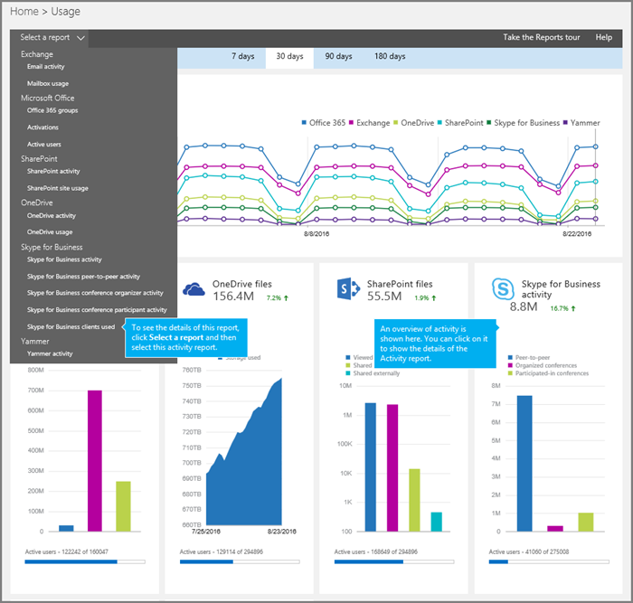
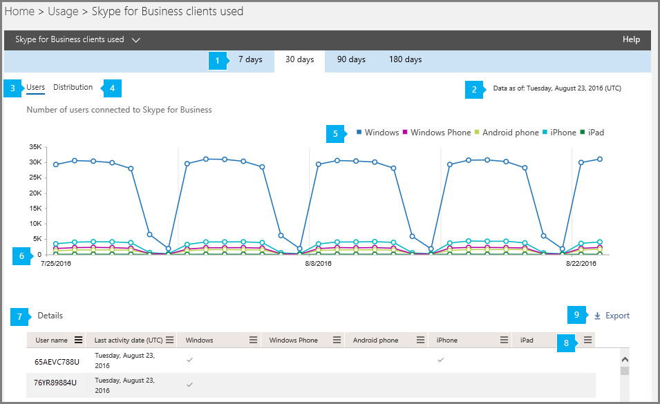

# Skype for Business clients used report

The new Office 365 **Reports** dashboard shows you the activity overview across the Office 365 products in your organization. It enables you to drill in to individual product level reports to give you more granular insight about the activities within each product. For example, you can use the **Skype for Business Conference clients used** report to see the devices including Windows-based operating systems and mobile devices that have the Skype for Business app installed and are using it for IM and meetings. Check out [Activity Reports in the Office 365 admin center](http://technet.microsoft.com/library/0d6dfb17-8582-4172-a9a9-aed798150263%28Office.14%29.aspx) to learn more.
  
    
    

This report along with the other Skype for Business reports give you details on the types of clients/devices that are used across your organization. These details are very helpful when you are investigating, planning, and making other business decisions for your organization.
> [!NOTE]
> You can see all of the Skype for Business reports when you log on as an administrator to the Office 365 admin center. 
  
    
    

## How to get to the Skype for Business clients used report

1. Go to the Office 365 admin center > **Reports**
    
  
2. Select **Reports** from the left menu or click on the **Reports** widget.
    
  
3. Click the **Skype for Business activity** widget on the dashboard then select **Skype for Business clients used** or select it from the **Select a report** list on the reports **Usage** page.
    
     
  

    
    > [!IMPORTANT]
      > Depending on the Office 365 subscription you have, you might not see all the products and activity reports shown here. 

## Interpret the Skype for Business clients used report

You can get a view into the clients that are using the Skype for Business app by looking at the **User** and **Distribution** charts.
  
    
    

  
    
    

  
    
    

  
    
    

  
    
    

|||
|:-----|:-----|
|**1**   |The **Skype for Business clients used** report can be viewed for trends over the last 7 days, 30 days, 90 days, or 180 days.   |
|**2**   |Each report has a date for when this report was generated. The reports usually reflect a 24 to 48 hour latency from time of activity.    |
|**3**   |Use the interactive chart data on the **Users** chart to understand usage trends and to see the number of users that are connected using the Skype for Business app that are used in your organization. It will show you the total number of users and types of **Windows**, **Windows Phone**, **Android phone**, **iPhone** and **iPad** devices that have the Skype for Business client app installed and are being used across your organization.   |
|**4**   | Use the interactive chart data on the **Distribution** bar chart to understand usage to see the number of users using unique devices in your organization. It will show you the total number of **Windows**, **Windows Phone**, **Android phone**, **iPhone** and **iPad** users with a device being used.   |
|**5**   |You can filter the series you see on the chart by clicking on an item in the legend. For example, on the **Users** chart, click or tap , **Windows**, **Windows Phone**, **Android phone**, **iPhone** or **iPad** to see only the info related to each one. Changing this selection doesn't change the info in the grid table.   |
|**6**   | Each chart has an 'X' (horizontal) and 'Y' (vertical) axis.    On the **Users** chart, the Y axis is the total number of users connected with a device that has the Skype for Business app installed.    On the **Distribution** activity chart, the Y axis is the number of users that are connected with a certain type of device with the Skype for Business app installed.    The X axis on both charts is the selected date range for this specific report.   |
|**7**   | The table shows you a breakdown of the all conferencing activities per user. This shows all users that have Skype for Business assigned to them and their conferencing activities. You can add additional columns to the table.   **User name** is the name of the user.   **Last activity date (UTC)** is the latest time the user engaged in a peer to peer session, or organized a conference or participated in a conference.   **Windows** is selected if the user is has the Skype for Business client app installed on a Windows-based operating system and is using it.   **Windows Phone** is selected if the user is has the Skype for Business client app installed on a Windows Phone device and is using it.   **Android phone** is selected if the user is has the Skype for Business client app installed on a Android phone and is using it.   **iPhone** is selected if the user is has the Skype for Business client app installed on an iPhone and is using it.   **iPad** is selected if the user is has the Skype for Business client app installed on an iPad and is using it.    If your organization's policies prevents you from viewing reports where user information is identifiable, you can change the privacy setting for all these reports. Check out the **How do I hide user level details?** section in the [Activity Reports in the Office 365 admin center](http://technet.microsoft.com/library/0d6dfb17-8582-4172-a9a9-aed798150263%28Office.14%29.aspx).    |
|**8**   |Click or tap **Columns** to add or remove columns from the report.             |
|**9**   |You can also export the report data into an Excel .csv file, by clicking or tapping **Export**.             This exports data of all users and enables you to do simple sorting and filtering for further analysis. If you have less than 2000 users, you can sort and filter within the table in the report itself. If you have more than 2000 users, in order to filter and sort, you will need to export the data.    |
   

  
    
    

## Want to see other Skype for Business reports?

-  [Skype for Business activity report](skype-for-business-activity-report.md) You can see how much your users are using peer-to-peer, organized, and participated in conferencing sessions.
    
  
-  [Skype for Business conference organizer activity report](skype-for-business-conference-organizer-activity-report.md) You can see how much your users are organizing conferences that use IM, audio/video, application sharing, Web, dial-in/out - 3rd party, and dial-in/out - Microsoft.
    
  
-  [Skype for Business conference participant activity report](skype-for-business-conference-participant-activity-report.md) You can see how many IM, audio/video, application sharing, Web and and dial-in/out conferencing conferences are being participated in.
    
  
-  [Skype for Business peer-to-peer activity report](skype-for-business-peer-to-peer-activity-report.md) You can see how much your users are using IM, audio/video, application sharing and transferring files.
    
  
-  [Skype for Business blocked users report](skype-for-business-blocked-users-report.md) You can see the users in your organization that have been blocked from making PSTN calls.
    
  
-  [Skype for Business PSTN usage report](skype-for-business-pstn-usage-report.md) You can see the number of minutes spent in inbound/outbound calls and cost for these calls.
    
  
-  [Skype for Business blocked users report](skype-for-business-blocked-users-report.md) You can see details about the type of media being used, duration of the session, the client used and the conferencing URL.
    
  

## See also

#### Other Resources

  
    
    
 [Activity Reports in the Office 365 admin center](http://technet.microsoft.com/library/0d6dfb17-8582-4172-a9a9-aed798150263%28Office.14%29.aspx)
