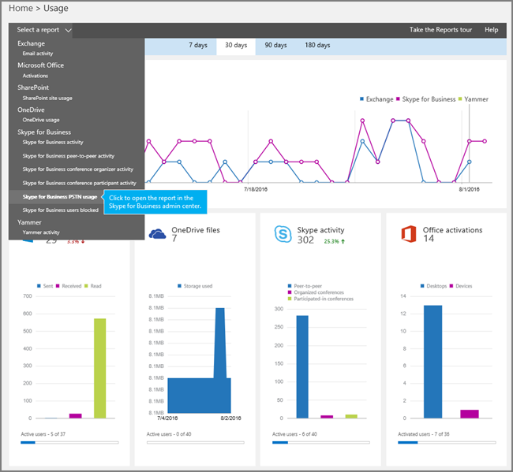
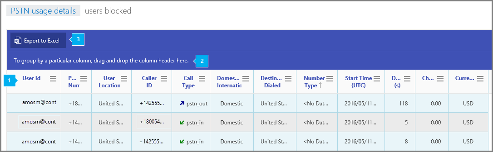

# Skype for Business PSTN usage report

The new Office 365 **Reports** dashboard shows you the activity overview across the Office 365 products in your organization. It enables you to drill in to individual product level reports to give you more granular insight about the activities within each product. For example, you can use the **Skype for Business PSTN usage details** report to see the number of minutes spent in inbound/outbound calls and cost for these calls. You can view dial-in conferencing PSTN usage details including the cost of the call so that you can understand your usage and call billing details to determine usage within your organization.
  
    
    

Check out  [Activity Reports in the Office 365 admin center](http://technet.microsoft.com/library/0d6dfb17-8582-4172-a9a9-aed798150263%28Office.14%29.aspx) for more reports that are available.
This report along with the other Skype for Business reports give you details on activity including PSTN usage across your organization. These details are very helpful when you investigating, planning, and making other business decisions for your organization and for setting up  [What is PSTN Consumption billing?](what-is-pstn-consumption-billing.md).
  
    
    

> [!NOTE]
> You can see all of the Skype for Business reports when you log on as an administrator to the Office 365 admin center. 
  
    
    

## How to get to the Skype for Business PSTN usage details report

1. Go to the Office 365 admin center > **Reports**
    
  
2. Select **Reports** from the left menu then click **Usage**.
    
  
3. From the drop down under **Select a report**, click **Skype for Business PSTN usage**.
    
     
  

    
    > [!IMPORTANT]
      > Depending on the Office 365 subscription you have, you might not see all the products and reports that are shown here. 

## Interpret the Skype for Business PSTN usage report

You can get a view into your user's Skype for Business PSTN usage by looking at each of the columns that are displayed.
  
    
    
This is what the report looks like.
  
    
    

  
    
    

  
    
    

  
    
    

  
    
    

## 

  
    
    

|||
|:-----|:-----|
|**1**   | The table shows you a breakdown of the all PSTN usage per user. This shows all users that have Skype for Business assigned to them and their PSTN usage. You can add/remove columns to the table.   **Call ID** is the call ID for a call. It is a unique identifier for the call that is used when calling Microsoft service support.   **User ID** is the user's sign in name.   **Phone number** is the Skype for Business phone number that received the call for inbound calls or the number dialed for outbound calls.   **User location** is country/region where the user is located.   **Caller ID** is caller's telephone number (Caller ID) for inbound calls, the number from which the call originated or the Skype for Business number from which the call originated for outbound calls.   **Call type** is whether the call was a PSTN outgoing or incoming call and the type of call such as a call placed by a user or a dial-in conference. The call types you may see are:    PSTN Calling   **user_in** (the user received an inbound PSTN call)   **user_out** (the user placed an outbound PSTN call)   **user_out_conf** (the user added 2 or more PSTN participants to the call such as a 3-way conference call)   **user_out_transfer** (the user transferred the call to a PSTN number)   **user_out_forwarding** (the user forwarded the call to a PSTN number)    PSTN Conferencing   **conf_in** (an inbound call to the PSTN conferencing bridge)   **conf_out** (an outbound call from the PSTN conferencing bridge usually to add a PSTN number to the conference)    Unified Communication Applications (UCAP)   **ucap_in** (an inbound call to the UC application such as auto-attendant or call queue)   **ucap_out** (an outbound call from the UC application such as auto-attendant or call queue)   **Domestic/International** tells you whether the call that was placed was considered domestic (within a country/region) or international (outside of a country/region) based on the user's location.   **Destination dialed** is the name of the country/region destination dialed such as France, Germany, or the United States (U.S.).   **Number type** is the type of phone number that is from a user's phone number, a service or toll free number.   **Start Time (UTC)** is the time that the call was started or placed.   **Duration** is how long the call was connected.    ConfID is the conference ID of the PSTN conference.   **Charge** is the amount of money or cost of the call that is being charged to your account.   **Currency** is the type of currency that is used to calculate the cost of the call.    Capability is the license used for the call. The license types you may see are:     **MCOPSTNPP** - Skype for Business PSTN Consumption     **MCOPSTN1** - Skype for Business PSTN Domestic Calling     **MCOPSTN2** - Skype for Business PSTN Domestic &amp; International Calling     **MCOPSTN5** - Skype for Business PSTN Domestic Calling   **MCOMEETADD** - Skype for Business PSTN Conferencing   |
|**2**   |Click to drag a column to **To group by a particular column, drag and drop the column header here** if you want to create a view that groups all of the data in one or more columns.   |
|**3**   |You can also export the report data into an Excel .csv file, by clicking or tapping the **Export to Excel** button.   This exports data of all users and enables you to do simple sorting and filtering for further analysis. If you have less than 2000 users, you can sort and filter within the table in the report itself. If you have more than 2000 users, in order to filter and sort, you will need to export the data.    |
   

## Want to see other Skype for Business reports?

-  [Skype for Business activity report](skype-for-business-activity-report.md) You can see how much your users are using peer-to-peer, organized, and participated in conferencing sessions.
    
  
-  [Skype for Business clients used report](skype-for-business-clients-used-report.md) You can to see the devices including Windows-based operating systems and mobile devices that have the Skype for Business app installed and are using it for IM and meetings.
    
  
-  [Skype for Business conference organizer activity report](skype-for-business-conference-organizer-activity-report.md) You can see how much your users are organizing conferences that use IM, audio/video, application sharing, Web, dial-in/out - 3rd party, and dial-in/out - Microsoft.
    
  
-  [Skype for Business conference participant activity report](skype-for-business-conference-participant-activity-report.md) You can see how many IM, audio/video, application sharing, Web and and dial-in/out conferencing conferences are being participated in.
    
  
-  [Skype for Business peer-to-peer activity report](skype-for-business-peer-to-peer-activity-report.md) You can see how much your users are using IM, audio/video, application sharing and transferring files.
    
  
-  [Skype for Business blocked users report](skype-for-business-blocked-users-report.md) You can see the users in your organization that have been blocked from making PSTN calls.
    
  
-  [Skype for Business blocked users report](skype-for-business-blocked-users-report.md) You can see details about the type of media being used, duration of the session, the client used and the conferencing URL.
    
  

## See also

#### Other Resources

  
    
    
 [Activity Reports in the Office 365 admin center](http://technet.microsoft.com/library/0d6dfb17-8582-4172-a9a9-aed798150263%28Office.14%29.aspx)
