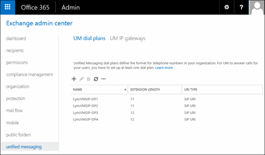
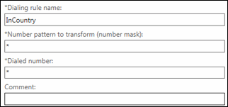
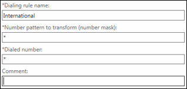
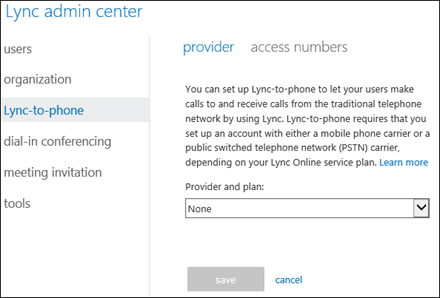

# Skype-to-phone voice messaging set up

Skype-to-phone for Office UNRESOLVED_TOKEN_VAL(365) is a cloud-based voice solution that's fully integrated with Skype for Business Online and Exchange Online. As an Office UNRESOLVED_TOKEN_VAL(365) admin, the network connectivity and routing has been deployed, and the Skype-to-phone syndicated partner delivers full datacenter resiliency and phone connectivity.
  
    
    

## Set up tasks using the Office 365 Exchange admin center

You use the Exchange admin centerto perform the tasks to set up Exchange voice mail.
  
    
    

||||
|:-----|:-----|:-----|
|**Checklist**   |**Task**   |**Details**   |
||Open the Exchange admin center.    |Go to the **Office 365 admin center** > **Admin** > **Exchange** to open the **Exchange admin center**.                 |
||Create a SIP URI dial plan.    | Unified Messaging (UM) dial plans are the main component of Unified Messaging and are required to successfully deploy Unified Messaging voice mail on your network. UM dial plans are used in Unified Messaging to make sure that user telephone extensions are unique.    In the left navigation, **Unified Messaging** > **UM Dial Plans** > **New**.     In the **Name** box, type a unique name. For example, Skype-to-phoneDialPlan.    Under **Extension length (digits)**, enter the number of digits for the full phone number, including the country code. For example, for country code 353, area code 56, and phone number 555-1234, the extension length will be 12 digits. In the US, it's 11 digits.     Under **Audio language**, use the drop-down list to select the language that you want to use. This language will be used when users call into an Outlook Voice Access number.     In **Country/Region code**, enter the country or region code, and click **Save**. For example, if your dial plan is in the United States, the code is 1. This code must be between one and four digits.     For details, see [Create a UM dial plan](https://go.microsoft.com/fwlink/?LinkId=519273).    |
||Set the Outlook Voice Access number for the SIP dial plan.    | An Outlook Voice Access user (also called a subscriber), is a user in an organization who's enabled for Unified Messaging. Subscribers use Outlook Voice Access to access their mailboxes by telephone to retrieve email, voice mail messages, personal contacts, and calendar information.    In the left navigation, **Admin** > **Exchange** > **Unified Messaging** > **UM Dial Plans**, then select the UM dial plan, and click **Edit**.     On the **UM dial plan** page, click **Configure**.     On the ** UM dial plan** page, > **Outlook Voice Access**, and under **E.164 routing number for your SIP server**, enter the E.164 number. These phone numbers are used for call routing between Exchange and Skype for Business and must be in the E.164 format. For example, +14255551234.     For details, see [Manage a UM dial plan](https://go.microsoft.com/fwlink/?LinkId=519276) and [Setting up Outlook Voice Access](https://go.microsoft.com/fwlink/?LinkId=519275).    |
||Create two default dialing rules.    | Dialing rules are used to modify a phone number before sending it to Skype for Business for outgoing calls. You need to create two sets of dialing rules. One for in-country/region calls and another for international calls. For details, see [Allow users to make calls](https://go.microsoft.com/fwlink/?LinkId=519277). Create the default in-country/region dial rule like the one below.     In the left navigation, click **Admin** > **Exchange** > **Unified Messaging** > **UM Dial Plans**, then click **Edit**.    In the **UM Dial Plan** window, go to **Configure** > **Dialing rules** > ** In-country/region dialing rules** > **Add**.    **Enter a name for this rule,** and asterisks (*) in the next two fields, and then click **OK**.     Create the international dial rule like the one below.    In the UM dial plan window, click ** International dialing rules** > **Add**.    **Enter a name for this rule,** and asterisks (*) in the next two fields, and then click **OK**.     For details, see [Create dialing rules for users](https://go.microsoft.com/fwlink/?LinkId=519278).    |
||Use the default UM mailbox policy or create a new UM mailbox policy.    | Unified Messaging (UM) mailbox policies are required when you enable users for Unified Messaging. You create UM mailbox policies to apply a common set of policies or security settings to a collection of voice mail users' mailboxes. UM mailbox policies are used to specify UM settings, like PIN policies and other UM mailbox settings.   > [!NOTE]>  You can use the default UM mailbox policy that was created when the dial plan was created, or you can create another one.           In the left navigation, click **Admin** > **Exchange**, and navigate to **Unified Messaging** > **UM dial plans**. In the list view, select the UM dial plan you want to modify, and then click **Edit**.    On the UM Dial Plan page, under **UM Mailbox Policies**, click **New**.    On the **New UM mailbox policy** page, in the **Name** box, enter the name of the new UM mailbox policy. Use this box to specify a unique name for the UM mailbox policy. It cannot include any of the following characters: " / \\ [ ] : ; | = , + * ? < >.    Click **Save** to save the new UM mailbox policy. When you save the UM mailbox policy, all of the default settings, including PIN policies, voice mail features, and Protected Voice Mail settings are enabled.    For details, see [Manage a UM mailbox policy](http://go.microsoft.com/fwlink/?LinkID=519279&amp;clcid=0x409).    |
||Enable users for voice mail.    | A user must have a mailbox before they can be enabled for Unified Messaging. But, by default, a user who has a mailbox isn't enabled for Unified Messaging. After the user is UM-enabled, you can manage, modify, and configure the UM properties and voice mail features for them. You can enable a user for Unified Messaging using EAC or the Shell.    Go to the **Exchange Admin Center** > **Exchange** > **Recipients**.    Select the user name, and then click **Edit**.    Under **Phone and Voice Features: Unified Messaging**, click **Enable**.    Click **Browse** to add the SIP URI dial plan you want.    Click **Next**, enter the complete phone number for the user's extension number, including the entire number of digits set on the SIP URL dial plan, and then click **Finish** > **Save**.   > [!NOTE]>  You can use the **Enable-UMMailbox** cmdlet to enable multiple users for Unified Messaging. However, make sure to use the full phone number in E.164 number including country code and area code for the -Extension parameter.           For details, see [Voice mail-enabled user procedures](https://go.microsoft.com/fwlink/?LinkId=519281).    |
||Create the required number of UM auto attendants.    | By using Unified Messaging, you can create one or more UM auto attendants depending on the needs of your organization. You can use UM auto attendants to create a voice menu system for an organization that lets external and internal callers move through the UM auto attendant menu system to locate and place or transfer calls to company users or departments in an organization.    To be able to have external users call into the organization, you need to create and set up UM auto attendants.    In the left navigation, click **Admin** > **Exchange** > **Unified Messaging** > **UM Dial Plans**, and then click **Edit**.     In the **UM Dial Plan** window, under **UM Auto Attendants**, click **New**.     Under **Name**, enter a unique name—for example,  _CallMenus1_.     Under **Access numbers**, enter the number you want to use, click **Add**, and then click **Save**. If you add the phone number here, you won't need to add it again in the next step. Make sure you enter the full E.164 phone number.     For details, see [Set up a UM auto attendant](https://go.microsoft.com/fwlink/?LinkId=519283).    |
|| Configure the UM auto attendants with the correct external phone number(s).   | For external callers to be able to call into your organization, you need to configure your auto attendants with the correct access numbers. These numbers will also be used when you configure the Skype-to-phone access number using the **Skype for Business admin center**.     In the left navigation, click **Admin** > **Exchange** > **Unified Messaging** > **UM dial plans**. In the list view, select the UM dial plan you want to edit, and click **Edit**.     Under **Access numbers**, enter the number you want to use, click **Add**, and then click **Save**. If you add the phone number here, you won't need to add it again in the next step. Make sure you enter the full E.164 phone number.     See [Add an auto attendant extension number](https://go.microsoft.com/fwlink/?LinkId=519285) if you want to add other extension numbers for an auto attendant.    To manage other settings on UM auto attendants, see [Manage a UM auto attendant](https://go.microsoft.com/fwlink/?LinkId=519284).    |
||Set up auto attendant menus.    | You can define the action that will be performed when a key on the telephone keypad is pressed, for example, transferring the call to an extension number or another auto attendant.    In the left navigation, **Admin** > **Exchange** > **Unified Messaging** > **UM dial plans**. In the list view, select the UM dial plan you want to edit, and click **Edit**.     On the **UM Dial Plan** page, double-click the Auto Attendant to edit it, and then click **Menu navigation**.     Select **Enable business hours menu navigation**, and then click **Add**.     Click **Save** > **Save** > **Close**.    > [!NOTE]>  Skype-to-phone auto attendants can only transfer calls to other Skype-to-phone numbers.           For details, see [Create menu navigation](https://go.microsoft.com/fwlink/?LinkId=519286).    |
||Authorize dialing rules for the dial plan.    | By default, users aren't able to place outgoing calls. To specify the kinds of calls users can make, first create dialing rules, then authorize groups of these dialing rules on the SIP URI dial plans that are used.    In the left navigation, click **Admin** > **Exchange** > **Unified Messaging** > **UM Dial Plans**, and then click **Configure**.     In the **UM Dial Plan** window, **Dialing authorization**.     Verify that **Calls in the same UM dial plan** and **Allow calls to any extension** are both selected.    Under **Authorized in-country/region dialing rule groups**, click **Add**.     Select the in-country dialing rule you created earlier, click **Add**, and then click **OK**.     Under **Authorized international dialing rule groups**, click **Add**.     Select the international dialing rule you created earlier, click **Add**, and then click **OK**.     Click **Save** to return to the **UM Dial Plan Details** page.    For details, see [Authorize calls for users in a dial plan](https://go.microsoft.com/fwlink/?LinkId=519287).    |
||Authorize dialing rules for the UM mailbox policy.    | By default, users aren't able to place outgoing calls. To specify the kinds of calls users can make, first create dialing rules, then authorize groups of these dialing rules on UM mailbox policies.    In the left navigation, click **Admin** > **Exchange** > **Unified Messaging** > **UM Dial Plans**, and then click **Configure**.     In the **UM Dial Plan** window, select the UM mailbox policy, click **Edit** > **Dialing authorization**.     Verify that **Calls in the same UM dial plan** and **Allow calls to any extension** are both selected.    Under **Authorized in-country/region dialing rule groups**, click **Add**.     Select the in-country dialing rule you created earlier, click **Add**, and then click **OK**.     Under **Authorized international dialing rule groups**, click **Add**.     Select the international dialing rule you created earlier, click **Add**, and then click **OK**.     Click **Save** to return to the **UM Dial Plan Details** page.    For details, see [Allow calls for a group of users]( https://go.microsoft.com/fwlink/?LinkId=519288).    |
||Authorize dialing rules for the UM auto attendant.    | By default, users aren't able to place outgoing calls. To specify the kinds of calls users can make, first create dialing rules, then authorize groups of these dialing rules on UM auto attendants.    In the left navigation, click **Admin** > **Exchange** > **Unified Messaging** > **UM Dial Plans**, and then click **Configure**.     In the **UM Dial Plan** window, select the Auto Attendant, click **Edit** > **Dialing authorization**.     Verify that **Calls in the same UM dial plan** and **Allow calls to any extension** are both selected.    Under **Authorized in-country/region dialing rule groups**, click **Add**.     Select the in-country dialing rule you created earlier, click **Add**, and then click **OK**.     Under **Authorized international dialing rule groups**, click **Add**.     Select the international dialing rule you created earlier, click **Add**, and then click **OK**.     Click **Save** to return to the **UM Dial Plan Details** page.    For details see, [Authorize calls for auto attendant callers](https://go.microsoft.com/fwlink/?LinkId=519289).    |
   

## Set up tasks using the Skype for Business Online admin center

You use the **Skype for Business admin center**to finish performing the tasks to set up Exchange voice mail.
  
    
    

||||
|:-----|:-----|:-----|
|**Checklist**   |**Task**   |**Details**   |
||Open the **Skype for Business admin center**admin center.    |Go to **Admin** > **Skype for Business** to open the **Skype for Business Online admin center**.    |
||Add an Outlook Voice Access number for Skype for Business that is used to allow users phone access to their Office 365 mailbox.    | When you configure an Outlook Voice Access or subscriber access number on a dial plan, UM-enabled users can call in to the number, sign in to their mailbox, and access their email, voice mail, calendar, and personal contact information.    Before you complete this task, you need the Outlook Voice Access phone number or numbers that you set on the UM dial plan.    In the left navigation, click **Skype-to-phone** > **Access numbers** > **Add**.     In the **Number** box, enter the number you want to use. Enter the entire phone number in E.164 format, and include the country code. For example, for country code 1, area code 425, and phone number 555-1234, the extension length is 12 digits. Enter all of the digits of the phone number for Outlook Voice Access.    Under **Address**, enter a descriptive name.     Under **Country or region**, select the county or region from the drop-down list.     Under **Type**, select **Outlook Voice Access (external phone access to voice mail and Outlook**, and then click **Save**.    > [!NOTE]>  You must do this for each Outlook Voice Access number that you configured on the SIP URI dial plan.           See [Configure an Outlook Voice Access number](https://go.microsoft.com/fwlink/?LinkId=519290) if you want to configure other Outlook Voice Access phone numbers.   |
||Add an auto attendant number to Skype for Business Online to greet external callers.    | For external callers to be able to call into your organization, you need to configure your auto attendants with the correct access numbers. These numbers are the ones that were used when you configured extension number on your UM auto attendants.    In the left navigation, click **Skype-to-phone** > **Access numbers** > **Add**.     In the **Number** box, enter the number you want to use. Enter the entire phone number in E.164 format, and include the country code. For example, for country code 1, area code 425, and phone number 555-1234, the extension length is 12 digits. Enter all of the digits of the phone number for Outlook Voice Access.    Under **Address**, enter a descriptive name.     Under **Country or region**, select the county or region from the drop-down list.     Under **Type**, select **Auto attendant (call routing for outside callers)**, and then click **Save**.    > [!NOTE]>  You must do this for each auto attendant number that you configured on the SIP URI dial plan.           See [Add an auto attendant extension number](https://go.microsoft.com/fwlink/?LinkId=519285) if you want to add other extension numbers for an auto attendant.   |
   
