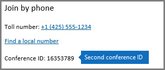

# Using dial-in conferencing dynamic IDs in your organization

The PSTN Conferencing service is being updated to provide each Skype for Business meeting a different conference ID. Dynamic conference IDs are a significant improvement over static conference IDs as they provide:
  
    
    

- **Enhanced security** The conference IDs are unique for each Skype for Business meeting and generated when the meeting is being scheduled.
    
  
- **A better experience for back-to-back and side-to-side meetings** Meetings for a single organizer are given specific dial-in information that prevents phone participants of one meeting from being mixed with participants of another one when they're scheduled next to each other.
    
  
- **A seamless transition** When your organization is enabled for dynamic conference IDs, all the meetings that have been already scheduled in your organization with static conference IDs will continue to work.
    
  

> [!TIP]
> Dynamic IDs are only available to users that are enabled for PSTN Conferencing and have Microsoft set as their dial-in conferencing provider. You can  [Assign Microsoft as the dial-in conferencing provider](assign-microsoft-as-the-dial-in-conferencing-provider.md) for your users.
  
    
    

## What changes will the users on my organization see?

After dynamic conference IDs have been enabled for your organization, any new meeting that is scheduled by users in your organization that are enabled for PSTN Conferencing, will have conference IDs that will be different from the static conference ID they had before. For organizers that had static conference IDs before, they need to remind the users joining their meetings that they now need to use a new conference ID in the meeting's invite before they can join it.
  
    
    

> [!NOTE]
> Meetings that have been scheduled by a user with static conference IDs, before your organization was enabled for dynamic conference IDs, will continue to have the static conference IDs so they'll continue to schedule meetings without any impact. 
  
    
    

These examples show you the new experience for two Skype for Business meetings that have been organized by the same user but both will now have two different conference IDs: 
  
    
    
 **Meeting #1** has been scheduled from 9:00 AM to 10:00 AM and it has 93907123 as its conference ID:
  
    
    

  
    
    

  
    
    

  
    
    
 **Meeting #2** has been scheduled by the same user from 10:00 AM to 11:00 AM and it has 16353789 as its conference ID:
  
    
    

  
    
    

  
    
    

  
    
    

  
    
    

## Leave us a comment

Was this information helpful? If so, please let us know at the bottom of this topic. If it wasn't, and you're having trouble finding the information you need, please tell us what you're looking for. We'll use your feedback to update this article.
  
    
    

## Related topics

-  [Set up Skype for Business Online](set-up-skype-for-business-online.md)
    
  
-  [Set up dial-in or PSTN conferencing for Skype for Business](set-up-dial-in-or-pstn-conferencing-for-skype-for-business.md)
    
  
-  [Skype for Business add-on licensing](skype-for-business-add-on-licensing.md)
    
  

