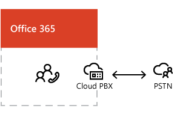

# What is PSTN calling?

PSTN calling is an add-on telephone service that, when combined with Skype for Business Cloud PBX, can become your phone system. PSTN calling provides the people in your business with a primary phone number, and lets them make and receive phone calls outside of your organization.  [PSTN Calling plans for Skype for Business](pstn-calling-plans-for-skype-for-business.md)
  
    
    

Users who are assigned phone numbers can make voice calls from all Skype for Business devices, including  [Getting phones for Skype for Business Online](getting-phones-for-skype-for-business-online.md), PCs, and mobile devices. They can control their calls through desktop phones, for example, mute/unmute, hold/resume, transfer calls, and use call forwarding features.
  
    
    

  
    
    

  
    
    

  
    
    

## Supported countries/regions

PSTN Calling is available in these  [Countries and regions that are supported for Skype for Business Online PSTN Services](countries-and-regions-that-are-supported-for-skype-for-business-online-pstn-serv.md).
  
    
    

## Setting it up

Setting up PSTN calling is easy. You can search for, acquire, and assign new phone numbers to users. You can transfer your existing numbers to Skype for Business.
  
    
    
 **For step-by-step setup instructions, see  [Set up PSTN Calling for Skype for Business](set-up-pstn-calling-for-skype-for-business.md).**
  
    
    
To learn more about Cloud PBX, PSTN calling, and dial-in conferencing, see this YouTube video:  [Cloud PBX and PSTN meetings in Skype for Business ](https://www.youtube.com/watch?v=5Cxawu9mIag&amp;list=PLXtHYVsvn_b8dbRbnL19GUPcBH1UQ7c4x&amp;index=28).
  
    
    

## See also

#### Other Resources

  
    
    
 [Emergency calling terms and conditions](emergency-calling-terms-and-conditions.md)
  
    
    
 [Skype for Business Online: Emergency Calling disclaimer label](https://go.microsoft.com/fwlink/?LinkID=692099)
  
    
    
 [What are emergency locations, addresses and call routing?](what-are-emergency-locations-addresses-and-call-routing.md)
  
    
    
 [Skype for Business Online PSTN services use terms](skype-for-business-online-pstn-services-use-terms.md)
  
    
    
 [Skype for Business add-on licensing](skype-for-business-add-on-licensing.md)
