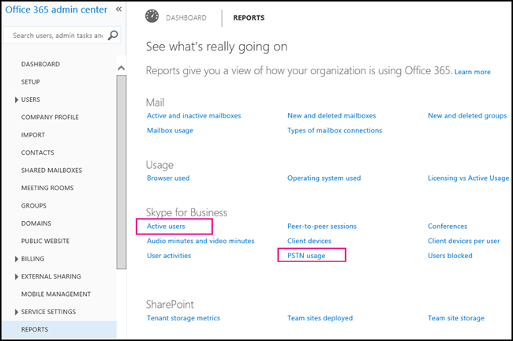

# What is PSTN Consumption billing?

Skype for Business PSTN Consumption is a convenient way to pay for Skype for Business PSTN services. It helps ensure you and your users are never caught without being able to:
  
    
    

- Add toll free numbers to use with PSTN conferencing meetings, auto attendants or call queues.
    
  
- Dialing out from a PSTN conferencing meeting to add someone else from anywhere in the world.
    
  
- Dialing out from a PSTN conference to your mobile phone with the Skype for Business app installed to destinations that aren't already included in your subscription.
    
  
- Dial any international phone number when you have PSTN domestic calling subscriptions.
    
  
- Dial international phone numbers beyond what is included in PSTN international voice calling subscription.
    
  

> [!NOTE]
> Outbound calls to some destinations may be included in your PSTN Conferencing subscription. Please check your subscription information for details. 
  
    
    

## What are the PSTN Consumption Rates?

If you're wondering how what the cost of the calls are, see  [PSTN Consumption Rate Table](https://go.microsoft.com/fwlink/p/?LinkId=799523 ).
  
    
    

## What is it?

To use toll free numbers in Skype for Business, PSTN Consumption is required as these calls are billed per minute. Also, we recommend that you set up PSTN Consumption billing for your PSTN Calling and Conferencing users that need the ability to dial out to **any PSTN destination**. Many countries/regions are included but some PSTN destinations may not be included in your PSTN Calling or PSTN Conferencing subscriptions. If you don't set up PSTN Consumption billing or assign a license to your users and you run out minutes for your organization (depending on your PSTN Calling or Conferencing plan or your country/region), those users won't be able to make calls or dial-out from Online PSTN Conferencing meetings.
  
    
    

> [!NOTE]
> **You must set up PSTN Consumption Billing and then assign a PSTN Consumption Billing license each user** in the **Office 365 admin center** > **Active Users**. 
  
    
    

It's recommended that you carefully evaluate your organization's PSTN Service usage in order to understand the best set up for consumption billing. You can see more about PSTN Services by seeing  [What is PSTN calling?](what-is-pstn-calling.md) and [Dial-in conferencing in Office 365](http://technet.microsoft.com/library/90d51188-0ba9-4dc4-bd6c-ae11dd1f8551%28Office.14%29.aspx).
  
    
    
You can set up consumption billing using either a **one-time funding** of the pre-paid balance **OR** setting up an **auto recharge** ( **recommended** ) amount with a minimum balance that will trigger a purchase for that recharge amount. Initially, it's suggested that you set up auto recharge amounts that allow you to monitor actual usage and find the right auto recharge thresholds that meet your needs and usage patterns. PSTN consumption should be monitored over time and then adjust the minimum balance and recharge amounts as needed to be tailored for each organization's needs.
  
    
    

> [!NOTE]
> You can see the plans and pricing by  [signing into the Office 365 admin center](https://portal.office.com/adminportal/home?add=sub&amp;adminportal=1#/catalog) and going to **Billing** > **Subscriptions** > **Add subscriptions**. 
  
    
    

In the **Office 365 admin center** > **Billing** > **Subscriptions**, you will be able to add credit manually at any time. You can also enable the **Auto-recharge** option, which will allow automatic account refills when the balance falls below the threshold that you set. If you choose to fund your PSTN Consumption balance with a one-time amount and then balance falls to zero, the additional calling scenarios above are no longer work including toll free phone numbers. As such, it's recommended that you use the ' **Auto-recharge** ' setting to avoid any disruption of service should your PSTN consumption balance reaches 0 (zero). You will be sent an email when recharge transactions succeed, recharge transactions fail (such as an expired credit card) and when your PSTN consumption balance reaches 0 (zero).
  
    
    
Each organization will have a different usage of PSTN Calling volume and rates to consider. You will need to get this type of usage data from your current service provider. For those organizations using Skype for Business Online already as their service provider, you can get usage data by reviewing it in the **Office 365 admin center** > **Reporting** or **Skype for Business admin center** > **Reports** > **PSTN usage details** report.
  
    
    
When you are setting up PSTN Consumption billing, you will need to investigate call usage for your organization to determine the amounts that you will need to put in. You can get call usage information by reviewing the **PSTN usage details** report. This report lets you export the call data records to Excel if you want to export the data for storage or to create custom reports.
  
    
    

  
    
    

  
    
    

  
    
    

## Recommended funding amounts

To give you an idea on recommended amounts that you would use, which are based on the number of users in your organization, here is a table that will be helpful.
  
    
    

|**Number of licensed users**|**One-time funding (initial amount)**|**Trigger (lowest amount)**|
|:-----|:-----|:-----|
|< 250    |$1,000 (for invoice billed customers).    |$200    |
|250-500    |$1,000    |$400    |
|500-1000    |$2,000    |$500    |
|1,000-5,000    |$3,000    |$1,000    |
|5,000-10,000    |$5,000    |$1,000    |
|10,000-50,000    |$10,000    |$1,000    |
|50,000-100,000    |$15,000    |$2,500    |
|100,000-200,000    |$20,000    |$2,500    |
   

> [!NOTE]
> All of the amounts listed above are in US dollars. 
  
    
    

## Want to know about plans and pricing?

You can see the plans and pricing by seeing one of the following links:
  
    
    

-  [Skype for Business PSTN Calling Plans](https://go.microsoft.com/fwlink/?LinkId=799761 )
    
  
-  [Skype for Business PSTN Conferencing Plans](https://go.microsoft.com/fwlink/?LinkId=799762 )
    
  
-  [Skype for Business Cloud PBX Plans](https://go.microsoft.com/fwlink/?LinkId=799763)
    
  
You can also see information by  [signing into the Office 365 admin center](https://portal.office.com/adminportal/home?add=sub&amp;adminportal=1#/catalog) and going to **Billing** > **Subscriptions** > **Add subscriptions**.
  
    
    
To see a table with the license or licenses you will need for each feature, see  [Skype for Business add-on licensing](skype-for-business-add-on-licensing.md).
  
    
    

## Related Topics

 [Skype for Business Online PSTN services use terms](skype-for-business-online-pstn-services-use-terms.md)
  
    
    

