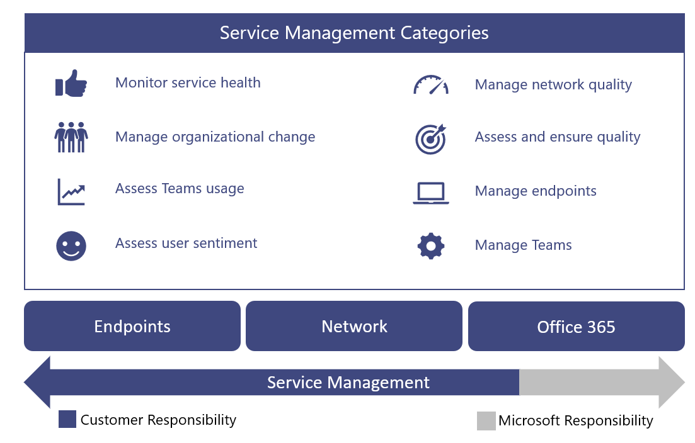
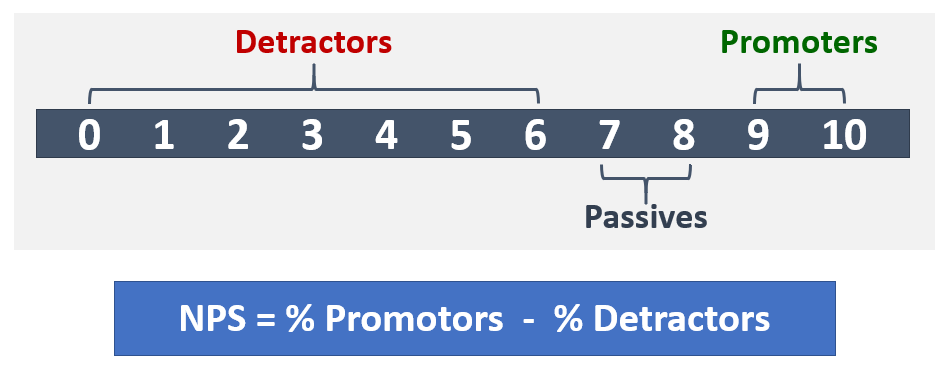
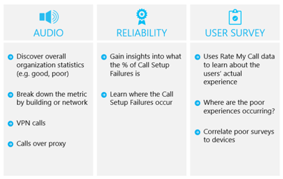

# Operate my service

This article gives an overview of the requirements for successfully operating cloud voice services for your organization. By properly operating your cloud voice services, you can be sure you’re providing a high-quality, reliable experience for your organization.

## Introduction to the Operations Guide

The Operations Guide gives you an overview of all the tasks and activities
required as part of the service management function for Microsoft Teams.

Service management is a broad topic that covers day-to-day operations of the
Microsoft Teams service after it has been deployed and enabled for users. The
Teams service encompasses Microsoft Office 365 and the infrastructure components
that are deployed on-premises (for example, networking).

The notion of service management is most likely not a new concept for most
organizations. You might have already implemented processes and tasks that are
associated with existing services. That said, you can probably augment your
current processes when you plan for service management today to support Teams in
the future.

Service management encompasses all the activities and processes involved in
managing Teams end to end. As noted earlier, some components of service
management—the infrastructure that the Office 365 service itself comprises—are
Microsoft’s responsibility, whereas you, the customer, are accountable to your
users to manage the various aspects of Teams, the network, and endpoints you
provide.

The tasks and activities in this guide are grouped into eight categories as
depicted in the following diagram. Each of these categories will be expanded
upon in the following sections.

<table>
<tr><td>  Decision points</td><td><ul><li>Decide how operations will be implemented for Teams.</li></ul></td></tr>
<tr><td> Next steps</td><td><ul><li>Review the Operations Guide in full.</li><li>Implement an operations strategy that aligns with your organization’s goals to deliver the quality and reliability of cloud voice workloads.</li><li>Review the Quality of Experience Review Guide.</li><li> Implement an operations strategy to regularly perform Quality of Experience Reviews to make sure your cloud voice deployment is operating at its peak capabilities.</li></ul></td></tr>
</table>

### Operational role mapping

The planning you undertook for operations during the Envision phase is critical,
because operations activities begin when the first pilot users are enabled. This
guide lists the activities and tasks that must be performed on a daily, weekly,
monthly, or as-needed basis to maintain a high-quality Teams deployment. This
guide provides knowledge and guidance for how to perform these critical
activities and tasks.

One crucial component of a successful deployment is to ensure that the planning
you do early in the Envision phase includes determining who will be responsible
for performing specific activities. After you’ve figured out which tasks and
activities apply to your deployment, they need to be understood and followed by
the groups or individuals that you assign to them.

Each team you identify must review and agree on the tasks and responsibilities
identified and start preparation. This might include training and readiness,
providing updates to the staffing plan, or ensuring that external providers are ready to
deliver.

The activities and roles defined in this guide should be valid in most
scenarios, but every Teams deployment is unique; therefore, you can use this
guide as a starting point to customize the activities and default roles to meet
your needs.

Ensure that each accountable team has a good understanding of the activities
that are required to run the service. It’s critical that each team accepts and
signs off on their accountability in your organization before the first pilot
begins.

After an agreement is in place, the corresponding teams should start to
operationalize their roles.

<table>
<tr><td> Next steps</td>
<td><ul><li>Use this document to facilitate the operational role mapping exercise.</li><li>Meet with the respective support teams to assign names to each item in the list of required activities.</li><li>Gain acceptance or sign-off on the assigned roles.</li><li>Ensure that the corresponding teams have the appropriate training, readiness, and resources to complete the activities required of them.</li></ul></td></table>

### Teams service dependencies

Microsoft Teams brings together technologies across Office 365 to provide a hub
for teamwork. Examples include:

-   Azure Active Directory (Azure AD) provides authentication and authorization services
    for Teams.

-   Exchange Online provides advanced features like legal hold and e-discovery.

-   SharePoint Online provides the ability to share files in channels, and
    OneDrive for Business provides a mechanism for sharing files within a
    private chat.

Organizations can also leverage existing investments in on-premises
infrastructure. For example, existing on-premises Active Directory accounts can
be used for authentication by leveraging Azure AD Connect. Certain versions of
Exchange Server can be used in place of Exchange Online.

These technologies come together to provide a rich, collaborative, and
intelligent communications suite for users. This tight integration is a key
benefit of Teams, but it also drives a requirement for service management across
these technologies.

This guide covers the key areas of focus to manage the Teams service. Most
likely, you have service management plans in place for the supporting
technologies that Teams depends on. If not, you’ll need to establish proper
service management plans for those technology components (both on-premises and
online) as well. This will help ensure your users enjoy a high-quality, reliable
experience with Teams.

#### References 

[Overview of Microsoft Teams](teams-overview.md)

[How Exchange and Microsoft Teams interact](exchange-teams-interact.md)

[How SharePoint Online and OneDrive for Business interact with Microsoft Teams](sharepoint-onedrive-interact.md)

[Microsoft Teams and Skype for Business coexistence and interoperability](teams-and-skypeforbusiness-coexistence-and-interoperability.md)

<!--ENDOFSECTION-->

## Operations Guide activities

The following sections give an overview of the activities that are required to
successfully operate the Microsoft Teams service. They include reference to
tools, contextual information, and additional content to help you understand the
activity and to assist in readiness initiatives.

<!--ENDOFSECTION-->

## Monitor service health

It’s important that you understand the overall health of the Microsoft Teams
service so that you can proactively alert others in your organization of any
event that affects the service. As described earlier, Teams is dependent on
other Office 365 services such as Azure Active Directory, Exchange Online,
SharePoint Online, and OneDrive for Business. Because of this, it’s equally
important that you monitor the health of the dependent services.

Incorporate this activity into your incident management process to proactively
inform users, the helpdesk, and your operations teams to prepare to handle user
escalations.

The following sections describe the tools that you can leverage to monitor for
[service incidents](https://technet.microsoft.com/library/office-365-service-health.aspx#Anchor_1) that affect the Teams service. A summary of the benefits of each
tool, and when you should use each one is included in the following table.

| Monitoring Tool                       | Benefits                                            | When to use                                                                                  |
|---------------------------------------|-----------------------------------------------------|----------------------------------------------------------------------------------------------|
| Office 365 portal                     | Available from any device with a supported browser. | Use when you don’t need real-time notifications.                                          |
| Office 365 Admin app                  | Provides push notifications to your mobile device.  | Use when you need to be notified of service incidents while you’re on the go.                  |
| Microsoft System Center               | Integration with Microsoft System Center.           | Use when you need advanced monitoring capabilities and notification support.                       |
| Office 365 Service Communications API | Programmatic access to Office 365 service health.   | Use when you need integration with a third-party monitoring tool or want to build your own solution. |

> [!NOTE]
> Only individuals who are assigned the **global admin** or **service
administrator** role can view service health.

### Monitoring with the Office 365 portal

The [Office 365 portal](https://portal.office.com/) provides a [Service Health
dashboard](https://portal.office.com/adminportal/home#/servicehealth) where you
can view the current health of the Teams service in addition to dependent
services.

### Monitoring with the mobile app

The Office 365 Admin app is available on Apple iOS, Android, and Windows (PC and
mobile). The app provides service administrators information about service
health and upcoming changes. The app supports push notifications that can alert
you almost immediately after an advisory has been posted. This helps you stay
current on the status, health, and any upcoming changes to the service. The
notification support makes it the recommended monitoring tool for
administrators. For more information, see:

[Office 365 Admin Mobile
App](https://support.office.com/article/Office-365-Admin-Mobile-App-e16f6421-2a1a-4142-bf9d-9846600a060a)

[Download the Office 365 Admin Mobile
App](https://products.office.com/business/manage-office-365-admin-app)

### Monitoring with Microsoft System Center

Microsoft System Center is an integrated management platform that helps you
manage datacenter, client devices, and hybrid cloud IT environments. Office 365
administrators who use System Center now have the option to import the Office
365 Management Pack, which enables them to view all service communications
within Operations Manager in System Center. Using this tool gives you access to
the status of your subscribed services, active and resolved service incidents,
and your Message Center communications (upcoming changes). For more information,
refer to the following [blog
post](https://blogs.office.com/2014/07/29/new-office-365-admin-tools/?eu=true).

If you leverage System Center to monitor Teams service health (and dependent
services), you can further customize the management pack to alert or notify
specific groups or individuals who have been identified to react to incidents.
These groups can include service owners, helpdesks, second-level and third-level
support groups, and incident managers in your organization.

### Monitoring for advanced scenarios

You can monitor service health and upcoming changes by leveraging the Office 365
Service Communications API to access Office 365 service health and changes
programmatically. Use this API to create your own monitoring tool, or connect
your existing monitoring tools to Office 365 service communications, potentially
simplifying how you monitor your environment. For more information, see [Office
365 for Enterprise
developers](https://developer.microsoft.com/office).

### Daily/weekly/monthly/as-needed tasks

| Activity               | Description                                                                                                                                                                                                               | Cadence   | Team assigned |
|------------------------|---------------------------------------------------------------------------------------------------------------------------------------------------------------------------------------------------------------------------|-----------|---------------|
| Monitor service health | Proactively monitor Microsoft Teams service health, (and dependent services) by using the tools available. Dependent services include: Exchange Online, SharePoint Online, OneDrive for Business, Azure Active Directory. | Real-time |               |
| Incident notification  | Notify internal stakeholders of events that affect the Teams service. Internal stakeholders can include users, helpdesks, and incident managers.                                                                          | As needed |               |

### References 

[How to check Office 365 service health](https://support.office.com/article/How-to-check-Office-365-service-health-932AD3AD-533C-418A-B938-6E44E8BC33B0)

[Verify service health for Microsoft Teams](service-health.md)

[Service Health and Continuity](https://technet.microsoft.com/library/office-365-service-health.aspx)

<!--ENDOFSECTION-->

## Manage organizational change

Microsoft Teams is a cloud-based service. With that comes the ability to provide
new features and functionality at a rapid pace. Delivering ongoing innovation
provides an obvious benefit to organizations, but these changes need to be
managed appropriately within your organization to avoid user resistance or
escalations to your helpdesk.

Updates to Teams are rolled out automatically to your users. Your users will
always have the latest client and features available in the Teams service. It’s
not possible to manage the rollout of Teams updates to your users, therefore
it’s critically important to manage change through effective communication,
training, and adoption programs. If your users are aware of the change, educated
about the benefits, and empowered to leverage the new capabilities&mdash;they’ll be
able to adapt more quickly and welcome the change.

### Monitoring for change

The first step in change management is monitoring the changes that are planned
for Teams. The best source for monitoring these changes is the [Office 365
Roadmap](https://products.office.com/business/office-365-roadmap), which
lists features that are currently in development, being rolled out to customers,
or have fully launched. You can search for Teams-specific features by using the
filter provided, or you can download the roadmap to an Excel file for further
analysis. For each feature, the roadmap gives a short description, along with
the anticipated release date.

In the [Microsoft Teams
blog](https://techcommunity.microsoft.com/t5/Microsoft-Teams-Blog/bg-p/MicrosoftTeamsBlog),
you can learn about best practices, trends, and news about Teams product
updates. Expect to find major feature updates to Teams to be announced here. You
can also subscribe to the blog through an RSS feed. You can then add [the RSS
feed](https://techcommunity.microsoft.com/gxcuf89792/rss/board?board.id=MicrosoftTeamsBlog)
directly into a Teams channel, so all the important news is delivered directly
inside of Teams.

All features that are released are documented in the [Release Notes for
Microsoft
Teams](https://support.office.com/article/Release-notes-for-Microsoft-Teams-d7092a6d-c896-424c-b362-a472d5f105de).
Here you’ll find a list of features that were released for desktop, web, and
mobile devices. The same set of release notes are also available on the **What's new** tab in [Help](get-help-in-microsoft-teams.md).

Become familiar with the resources available and ensure that you assign applicable
owners to monitor for change.

### Planning for change

Now that you’re aware of upcoming changes to the Teams service, the next step is
to prepare and plan accordingly. Assess each change to determine which changes
require communication to users, awareness campaigns, training for support teams
or users, or feature evaluation and adoption campaigns. This is the primary role
of a change management team in your organization. Below is a collection of sample tables that
can help you plan for change.

#### Feature: Cloud Recording (Release date: January 2018)

**General track**

| Change readiness | Status   | Notes/next steps | Owner |
|----|----|----|-----|
| Legal review   | Completed     | This feature is a prerequisite to onboarding the training team. | Project team  |

**Technical change management**

|       Change readiness       | Status |                      Notes/next steps                      |    Owner     |
|------------------------------|--------|------------------------------------------------------------|--------------|
|     IT changes required      |  Yes   | Admin needs to enable recording for identified users only. | Support team |
| Technical readiness complete |  Yes   |                                                            | Support team |
|                              |        |                                                            |              |

**User change management** 

| Change readiness | Status   | Notes/next steps | Owner |
|----|----|----|-----|
| User impact                  | Low                  |                                                                 |                        |
| User readiness required      | Yes                  |                                                                 |                        |
| Communications ready         | No                   | Communication email has been drafted—pending review.            | Communications Team    |
| Training ready               | Yes                  | Training will leverage existing Microsoft video.                | Training Team          |

**Status track**

| Change readiness | Status   | Notes/next steps | Owner |
|----|----|----|-----|
| Release status               | in progress          | Pending review by executive sponsor.               | Change Management Team |
| Release sign-off             |                      |                                                                 |                        |
| Release date                 |                      |                                                                 |                        |

For more information about planning for change management with Teams, see
[Create a change management strategy for Microsoft Teams](change-management-strategy.md).

### Daily/weekly/monthly/as-needed tasks

| Activity               | Description                                                                                                                                                                                                                | Cadence   | Team assigned |
|------------------------|----------------------------------------------------------------------------------------------------------------------------------------------------------------------------------------------------------------------------|-----------|---------------|
| Monitor for change     | Monitor for upcoming changes to Microsoft Teams service.                                                                                                                                                                   | Daily     |               |
| Planning for change    | Evaluate and plan for new features and capabilities, including communication plans, awareness campaigns, and training.                                                                                                     | As needed |               |
| User readiness             | Perform targeted communication, awareness, or training campaigns to ensure users are ready for the upcoming change.                                                                                                        | As needed |               |
| Support team readiness | Perform targeted communication, awareness, or training campaigns to ensure the support team is ready. Support teams can include the “white glove” team, helpdesks, Tier 2 or Tier 3 support, external partners, and so on. | As needed |               |

<!--ENDOFSECTION-->

## Assess Teams usage

After the initial pilot begins, it’s critical to establish a regular cadence for
measuring actual Teams usage. This enables your organization to gain insights
into how actual usage aligns with the usage you predicted during the Envision
phase. Although this section focuses on Teams usage, this should be part of a
broader effort to measure and assess Office 365 usage overall.

Reviewing usage frequently early in the deployment gives you the opportunity to:

-   Validate whether users are using Teams.

-   Identify potential adoption challenges before they create critical issues
    across the organization.

-   Understand whether there are discrepancies between the Envision phase
    requirements and actual usage.

If usage isn’t what you expect, this could be due to a deployment issue, or the
adoption plan isn’t being executed properly, or some other problem. Depending on
the actual reason behind the low usage, the service administrator must
collaborate with the related teams to help remove usage barriers.

### Measuring usage with the Office 365 admin center

Usage data from Teams is available in the Reporting dashboard. Teams usage data
can be found in three different reports. The first report provides a
cross-product view of how users communicate and collaborate by using the various
services in Office 365. This report can be found here: [Office 365 active users
report](https://support.office.com/article/Office-365-Reports-in-the-Admin-Center-Active-Users-FC1CF1D0-CD84-43FD-ADB7-A4C4DFA8112D)

The other two reports are Teams-specific, and they provide further detail about
Teams usage from a user and device perspective. Both reports can be found here:

[Microsoft Teams device usage
report](https://support.office.com/article/Office-365-Reports-in-the-Admin-Center-Microsoft-Teams-device-usage-917b3e1d-203e-4439-8539-634e80196687)

[Microsoft Teams user activity
report](https://support.office.com/article/Office-365-Reports-in-the-Admin-Center-Microsoft-Teams-user-activity-07f67fc4-c0a4-4d3f-ad20-f40c7f6db524)

#### Required permissions

The usage reports in the admin center can be accessed by people who have been
assigned a **Global administrator** role, or a product-specific admin role
(**Exchange administrator**, **Skype for Business administrator**, **SharePoint
administrator**).

In addition, the **Reports reader** role is available for users who require
access to the reports, but don’t perform any tasks that require
administrator-level permissions. You assign this role to provide usage reports
to anyone who is a stakeholder, to monitor and drive adoption. For more
information about the different roles available, see [About Office 365 admin
roles](https://support.office.com/article/About-Office-365-admin-roles-da585eea-f576-4f55-a1e0-87090b6aaa9d).

### Assessing usage

After you’ve used the Reporting dashboard to measure usage, it’s important to
compare the measured usage against any key success indicators (KSIs) that you
defined during the project’s Envision phase. You can define a KSI that might be
defined as active usage, or one that’s indirectly linked to active usage.

It’s important to identify any variances between actual and planned usage
before resuming the rollout to additional sites or users. You’ll likely identify
organizational learnings as part of this activity that you can leverage to
ensure that the next batch of sites or users don’t encounter the same issues.

First, pinpoint whether this is an adoption or technical problem. Begin by
investigating the items below, in order, to determine where the problem is.

1.  Validate quality by performing a [Quality of Experience Review](#quality-of-experience-review-guide).

2.  Work with the helpdesk team to check that there are no trending technical
    issues preventing users from accessing or using the service. If issue trends
    do exist, use the [endpoint troubleshooting](#endpoint-troubleshooting)
    section later in this article to try to solve the problem before engaging support.

3.  Work with the training and adoption team to gather direct feedback from
    users (see [Assess user sentiment](#assess-user-sentiment) later in this article), and to check the effectiveness of
    awareness and adoption activities.

### Daily/weekly/monthly/as-needed tasks

| Activity                         | Description                                                                                                                      | Cadence   | Team assigned |
|----------------------------------|----------------------------------------------------------------------------------------------------------------------------------|-----------|---------------|
| Measure usage (enablement phase) | Measure and assess Teams usage as sites continue to be onboarded during the enablement phase. Address usage issues as required. | Weekly    |               |
| Measure usage                    | Measure and assess Teams usage in the Drive Value phase (after deployment has been completed). Address usage issues as required. | Biweekly  |               |
| (drive value phase)              |                                                                                                                                  |           |               |
| Update adoption plan             | Update your adoption plan based on how measured usage compares to your planning targets.                                         | As needed |               |

### References 

[About the Office 365 admin
center](https://support.office.com/article/About-the-Office-365-admin-center-758befc4-0888-4009-9f14-0d147402fd23)

[Activity Reports in the Office 365 admin
center](https://support.office.com/article/Activity-Reports-in-the-Office-365-admin-center-0d6dfb17-8582-4172-a9a9-aed798150263)

<!--ENDOFSECTION-->

## Assess user sentiment

Understanding user sentiment can act as a key indicator for gauging the success
of your Teams deployment. User feedback can drive changes in your organization;
this might include changes to your communication plans, training programs, or
the way that you offer support to your users.

It’s important to get feedback early and continue with assessing user sentiment
throughout the lifecycle of the project and beyond. Use the following guidance
to determine the interval in which your organization will seek out feedback:

-   **Beginning of the project**: By assessing user sentiment at the beginning
    of the project, you can get an early view into how your users feel about
    their Teams experience.

-   **After major milestones**: By collecting feedback throughout the project
    lifecycle, you can gauge user sentiment on a continuous basis and make
    changes as needed. This is especially useful after major milestones.

-   **Project conclusion**: Assessing user sentiment at the end of a project
    will tell you how well you’ve done and where work still needs to be done,
    and allow you to compare results against the previous survey.

-   **Ongoing**: Continue to measure user sentiment indefinitely. Changes in
    user sentiment might be due to changes in your organization’s environment
    or changes in the Teams service. By gauging user sentiment at regular
    intervals, you can understand how well your service management teams are
    performing and how your organization is responding to changes in the Teams
    service.

User sentiment can be assessed through many different methods. These can include
email surveys, in-person or telephone-style interviews, or simply creating a
feedback channel in Teams or Yammer. For more information, see [Best practices
for user feedback methods in Microsoft
Teams](best-practices-feedback.md).

You can also use an industrywide approach to assess user sentiment called net
promotor score (NPS), which is described in the following section.

### NPS 

Net promoter score (NPS) is an industrywide customer loyalty metric and a good
approach to use to assess user sentiment. NPS can be calculated by asking two questions: “How likely are you to recommend
Teams to a colleague?”, followed by the freeform question, “Why?”

NPS is an index, ranging from –100 to 100, that measures a customer’s
willingness to recommend a company’s product or service. NPS is based on an
anonymous survey that’s delivered to users through email or other electronic
means. NPS measures the loyalty between a provider and a consumer. It consists
of only one question, which asks users to rate their experience from 1 through
10, with the option of providing additional comments. Users are then classified
based on the following ratings:

-   9 or 10 are Promoters: Loyal enthusiasts who will promote your service and
    fuel others.

-   7 or 8 are Passive: Satisfied but unenthusiastic, vulnerable to another
    service or offering.

-   From 1 through 6 are Detractors: Unhappy customers who can damage your
    service and impede growth.

Although the base NPS number is useful, you’ll get the most value from analyzing
user comments. They’ll help you understand why the user would (or wouldn’t)
recommend Teams to others. These comments can provide valuable feedback to help
the project or service management teams understand the adjustments necessary to
provide a quality service.

To provide NPS surveys to your organization, you can leverage your favorite
online survey tool.

### Daily/weekly/monthly/as needed tasks

| Activity              | Description                                                                                                                                                                         | Cadence   | Team assigned |
|-----------------------|-------------------------------------------------------------------------------------------------------------------------------------------------------------------------------------|-----------|---------------|
| Assess user sentiment | Capture and assess user sentiment by using surveys or interviews, or through a feedback channel in Teams or Yammer.                                                                 | As needed |               |
| Update adoption plans | Drive change in your organization based on user feedback; this can include changes to your communication plans, training programs, or the way that you offer support to your users. | As needed |               |

### References 

[Net Promoter Score](https://en.wikipedia.org/wiki/Net_Promoter)

[Using Yammer to collect feedback](https://techcommunity.microsoft.com/t5/Yammer-Blog/The-Microsoft-Teams-team-uses-Yammer/ba-p/55210)

[Best practices for user feedback](best-practices-feedback.md)

<!--ENDOFSECTION-->

## Manage network quality

Many core planning elements go into optimizing, right-sizing, and remediating
your network infrastructure to ensure a high-quality, efficient path to the
Microsoft Teams service. The planning tasks and requirements are covered in our
[network readiness](3-envision-evaluate-my-environment.md#network-readiness) guidance. Networks often evolve over
time due to upgrades, expansion, or other business requirements. It’s important
that you account for your requirements for Teams in your network planning
activities.

Although network planning is a critical aspect of a Teams deployment, it’s
equally important to ensure the network remains healthy and stays current, based
on changing business or technical requirements.

To ensure the health of your network, a number of operations activities need to
be performed at regular intervals.

### Daily/weekly/monthly/as-needed tasks

| Activity                                                       | Description                                                                                                                                                                                                                                                                                                                                                                 | Cadence                | Team assigned |
|----------------------------------------------------------------|-----------------------------------------------------------------------------------------------------------------------------------------------------------------------------------------------------------------------------------------------------------------------------------------------------------------------------------------------------------------------------|------------------------|---------------|
| Monitor Office 365 IPs and URLs                                | Monitor any changes to the [Office 365 URLs and IP address ranges](https://aka.ms/o365ips) by using the provided [RSS feed](https://go.microsoft.com/fwlink/p/?linkid=236301) and initiate a change request to applicable networking groups.                                                                                                                                | Daily                  |               |
| Update the network based on changes to Office 365 IPs and URLs | Make updates to the applicable network components (firewalls, proxy servers, VPNs, client-side firewalls, and so on) to reflect changes to the [Office 365 URLs and IP address ranges](https://aka.ms/o365ips).                                                                                                                                                              | As needed              |               |
| Provide building data                                          | Provide updated subnet information to the quality champion (or relevant stakeholders) to ensure that the [building definitions in CQD](https://docs.microsoft.com/SkypeForBusiness/using-call-quality-in-your-organization/turning-on-and-using-call-quality-dashboard#upload-building-information) are kept up to date. | As needed              |               |
| Implement change                                               | Implement changes on the network to support changing Teams business and technical requirements. Network elements can include:<ul><li>Firewalls</li><li>VPNs</li><li>Wired and Wi-Fi networks</li><li>Internet connectivity and ExpressRoute</li><li>DNS</li></ul>     | As needed              |               |
| Network monitoring and reporting                               | Monitor the network end to end for availability, utilization, and capacity trends by using your existing third-party network management tools and reporting capabilities available from your network providers. Use trending data for network capacity planning.                                                                                                            | Daily, weekly, monthly |               |
| Capacity planning                                              | Collaborate with the Teams service owners to understand changing business and technical requirements that might drive additional capacity changes. Leverage the results from the [Network Planner](https://myadvisor.fasttrack.microsoft.com/CloudVoice/NetworkPlanner) to ensure that sufficient bandwidth is available for Microsoft Teams.                               | As needed              |               |
| Network troubleshooting and remediation                        | Assist the Teams helpdesks, service owners, and key stakeholders to troubleshoot and remediate issues to related to Teams connectivity, reliability, or quality. Network elements can include:<ul><li>Firewalls</li><li>VPNs</li><li>Wired and Wi-Fi networks</li><li>Internet connectivity and ExpressRoute</li><li>DNS</li></ul>    | As needed              |               |
| Disaster recovery and high availability testing                | Perform regular high availability and disaster recovery testing on the network infrastructure to ensure that it meets the stated service level objectives (SLOs) or service level agreements (SLAs) for the Teams service.                                                                                                                                                  | Monthly                |               |

### References 

[Network Planner](https://myadvisor.fasttrack.microsoft.com/CloudVoice/NetworkPlanner)

[Office 365 URLs and IP address ranges](https://aka.ms/o365ips)

[Building data schema](https://docs.microsoft.com/SkypeForBusiness/using-call-quality-in-your-organization/turning-on-and-using-call-quality-dashboard#tenant-data-file-format-and-building-data-file-structure)

<!--ENDOFSECTION-->

## Assess and ensure quality 

All organizations need a group or individual to be accountable for quality. This
is the most important role in service management. The Quality Champion role is
assigned to a person or group who is passionate about their users’ experience.
This role requires the skills to identify trends in the environment and the
sponsorship to work with other teams to drive remediation. The best candidate
for the quality champion is typically the customer service owner. Depending on
the organization’s size and complexity, this could be any person or group with a
passion for ensuring a high-quality user experience.

The quality champion leverages existing tools and documented processes, such as
Call Quality Dashboard (CQD) and the Quality of Experience Review Guide, to monitor
user experience, identify quality trends, and drive remediation where needed.
The quality champion should work with the respective teams to drive remediation
actions, and report to a steering committee about progress and any open issues.

The [Quality of Experience Review Guide](https://aka.ms/qerguide) includes activities
that assess and provide remediation guidance in key areas that have the greatest
impact on improving user experience. The guidance provided in the Quality
Experience Review Guide focuses on using CQD Online as the primary tool to
report and investigate each area, with a focus on audio to maximize adoption and
impact. Any optimizations made to the network to improve the audio experience
will also directly translate to improvements in video and desktop sharing.

We strongly recommend that you nominate the quality champion early on. After
being nominated, they should start to familiarize themselves with the content in
the Quality of Experience Review Guide and associated training materials.

### Daily/weekly/monthly/as-needed tasks

| Activity                               | Description                                                                                                                                                                                                                                                                                                 | Cadence                             | Team Assigned |
|----------------------------------------|-------------------------------------------------------------------------------------------------------------------------------------------------------------------------------------------------------------------------------------------------------------------------------------------------------------|-------------------------------------|---------------|
| Nominate and train quality champion(s) | Nominate and train a quality champion.                                                                                                                                                                                                                                                                   | As needed                           |               |
| Perform Quality of Experience Reviews (QERs)     | Perform a QER to identify trends in quality and reliability, review against defined targets, and report out to key stakeholders in the organization.                                                                                                                            | Monthly (weekly during deployments) |               |
| Drive remediation                      | Coordinate remediation efforts across the organization based on the QER assessments and findings.                                                                                                                                                                                                           | As needed                           |               |
| Update building data in CQD            | Update or add new building definitions in CQD when changes are made to the network (see [Upload Building information](https://docs.microsoft.com/SkypeForBusiness/using-call-quality-in-your-organization/turning-on-and-using-call-quality-dashboard#upload-building-information)). | As needed                           |               |
| Fill the Quality Champion role      | End-to-end responsibility for quality in the organization. This includes:<ul><li>Ensure that the QER is being conducted regularly.</li><li>Report out to key stakeholders on quality status.</li><li>Ensure the building data definitions are up to date.</li><li>Coordinate remediation efforts across the organization to ensure that users have a high-quality experience with Teams.</li></ul>          | Daily                               |               |

### References 

[Learn CQD](https://myadvisor.fasttrack.microsoft.com/CloudVoice/Academy?SOFTrainings=Leverage%20the%20Investigate%20Media%20Quality%20using%20CQD%20Videos)

[Upload Building information](turning-on-and-using-call-quality-dashboard.md#upload-building-information)

[Quality of Experience Review Guide](https://aka.ms/qerguide)

<!--ENDOFSECTION-->

## Manage endpoints

Microsoft Teams endpoints can be defined as any PC, Mac, tablet, or mobile (or
any other) device running the Teams client. The term *endpoint* not only
encompasses the device itself, but how a user connects to the device—for
example, by using the device’s built-in mic or speaker, earbuds, or an optimized
headset. After they’re deployed, endpoints must not be forgotten. The Teams
endpoints require ongoing care and maintenance. The following sections describe
specific areas to focus on.

### Endpoint requirements

One of the key benefits of Teams is that the client is kept up to date
automatically. The clients on the PC and Mac are updated by using a background
process that checks for new builds and downloads the new client when the app is
idle. The Teams mobile apps are kept current through their respective app
stores.

The Teams client has minimum requirements in terms of the underlying software
platform. These requirements might change over time, and therefore it’s
important that you monitor them for changes. For example, the Teams client has a
minimum iOS version. If the client uses an internet browser, the browser needs
to be kept current as well. A list of supported platforms can be found in [Get clients for Microsoft Teams](get-clients.md).

### Endpoint firewalls

Client-side firewalls can have a significant impact on the user experience.
Client-side firewalls can affect call quality and even prevent a call from being
established. After the appropriate exclusions on the client firewall have been
configured, they need to be kept up to date based on the information in [Office
365 URLs and IP address ranges](https://aka.ms/o365ips). Your third-party vendor
will have specific guidance for how to update the exclusions.

### Wi-Fi drivers

Wi-Fi drivers might be problematic. As an example, a driver might have very
aggressive roaming behaviors between access points that can induce unnecessary
access-point switching, leading to poor call quality. A poorly performing Wi-Fi
driver might be discovered through a Quality of Experience Review (see [Quality of Experience Review Guide](https://aka.ms/qerguide) for more detail). It’s essential to
implement a quality-driven process that monitors new Wi-Fi drivers and ensures
that they’re tested before being deployed to the general user population.

### Endpoint management

A catalog of supported endpoints and interface devices (such as headsets) should
be available and maintained. This catalog will include a list of approved
devices that were selected and validated as part of the Envision and
Onboard phases. Typically, specific devices are selected for each persona
type in your organization to meet the needs of that persona’s attributes. All
endpoints have a lifecycle, and you need to manage the vendor contracts,
warranty, replacement, distribution, and repair policies associated with these
devices.

### Endpoint troubleshooting

Even if you’ve followed the previous guidance, users in your organization still
might run into issues with Teams. Although the problem might not be with the
endpoint itself, the symptoms of the issue are typically surfaced through the
client to the user. The following guidance is intended to provide general steps
you can take to resolve the issue; it’s not meant to be a comprehensive
troubleshooting guide. The steps are provided in a specific order, but they
don’t have to be followed explicitly and might not be applicable, depending on
the nature of the issue.

1.  **Validate service health:** The issue a user might be experiencing can be
    related to an event that negatively affects the Teams service or its
    dependent services. As a first step, we recommend that you confirm there are
    no active service issues. Consult [How to check Office 365 service
    health](https://support.office.com/article/How-to-check-Office-365-service-health-932AD3AD-533C-418A-B938-6E44E8BC33B0).
    Remember to check for the status of dependent services (for example, Exchange,
    SharePoint, OneDrive for Business). Monitoring for service health is
    discussed in more detail in the previous section, [Monitor service health](#monitor-service-health).

2.  **Validate client connectivity:** Connectivity issues cause functionality or
    sign-in issues in Teams. We recommend (especially for new sites or
    locations) that you validate connectivity to the service. Ensure the
    following [Office 365 URLs and IP address ranges](https://aka.ms/o365ips)
    guidance is followed for each site. You can leverage the [Microsoft Network
    Assessment Tool](https://www.microsoft.com/download/details.aspx?id=53885) to
    perform a connectivity test to validate that the media ports have been
    opened correctly for cloud voice capabilities. Detailed steps on how to run
    the connectivity tests are provided in the [network readiness](3-envision-evaluate-my-environment.md#network-readiness)
    guidance.

3.  **Check the known issues list:** Consult the [list of known issues for
    Teams](known-issues.md) to
    determine whether the user has been negatively affected by one of these
    issues. Follow the workaround provided (if there is one) to resolve the
    issue.

4.  **Visit the Microsoft Teams community:** The [Microsoft Teams community](https://techcommunity.microsoft.com/t5/Microsoft-Teams/ct-p/MicrosoftTeams)
    offers dedicated spaces for Teams. The Teams community provides a discussion
    list, blog posts, and announcements centered around Teams. You can post a
    question or search previous discussions for solutions to your issue.

5.  **Contact Microsoft Support:** You can contact Microsoft Support for issues
    with Teams online or by phone. For information, see [Contact support for
    business products](https://docs.microsoft.com/office365/admin/contact-support-for-business-products?toc=/microsoftteams/toc.json&bc=/microsoftteams/breadcrumb/toc.json).
    For Premier customers, support requests can be initiated by following the
    guidance at [Contact support for Microsoft Teams (Premier
    customers)](https://support.microsoft.com/premier/contacts).

### Daily/weekly/monthly/as-needed tasks

| Activity                 | Description                                                                                                                                                                                                                                                                                                                                                                     | Cadence   | Team assigned |
|--------------------------|---------------------------------------------------------------------------------------------------------------------------------------------------------------------------------------------------------------------------------------------------------------------------------------------------------------------------------------------------------------------------------|-----------|---------------|
| Endpoint requirements    | Ensure that the Teams endpoint continues to meet all the software requirements for Teams listed in [Get clients for Microsoft Teams](get-clients.md).                                                                                                                                                                                       | Monthly   |               |
| Endpoint firewalls       | Maintain the appropriate exclusions on the endpoint firewall based on the information in [Office 365 URLs and IP address ranges](https://aka.ms/o365ips). Your third-party vendor will have specific guidance for how to maintain the exclusions. Subscribe to the [RSS feed](https://support.office.com/o365ip/rss) to be notified automatically of changes. | As needed |               |
| Wi-Fi drivers            | Test and update Wi-Fi drivers on the PC. Validate the results by using CQD ([Quality of Experience Review Guide](https://aka.ms/qerguide)).                                                                                                                                                                                                                                                                   | As needed |               |
| Endpoint management      | Maintain the catalog of supported endpoints and interface devices (such as headsets). Manage vendor contracts, warranty, distribution, replacement, and repair policies.                                                                                                                                                                                                        | Monthly   |               |
| Endpoint troubleshooting | Troubleshooting tasks can include verifying connectivity, consulting the known issues list, log gathering, analysis, and escalation to Microsoft Support or third-party vendors.                                                                                                                                                                                               | As needed |               |

### References 

[Office 365 URLs and IP address ranges](https://aka.ms/o365ips)

[Get clients for Microsoft Teams](get-clients.md)

[Microsoft Teams community](https://techcommunity.microsoft.com/t5/Microsoft-Teams/ct-p/MicrosoftTeams)

[Known issues for Microsoft Teams](known-issues.md)

[Verify service health for Microsoft Teams](service-health.md)

[Contact support for business products - Admin Help](https://docs.microsoft.com/office365/admin/contact-support-for-business-products?toc=/microsoftteams/toc.json&bc=/microsoftteams/breadcrumb/toc.json)

[Contact Premier support](https://support.microsoft.com/premier/contacts)

[Troubleshooting Teams video](https://www.youtube.com/watch?v=4O4d_7uZTQY)

<!--ENDOFSECTION-->

## Manage Teams

After the Microsoft Teams service has been deployed, you’ll need to perform
several activities relating to its administration. The activities range from
administering the service and individual users to capacity planning and
provisioning licensing and telephone numbers. The following sections cover some
of these common administration tasks.

### Service administration

The Teams service has multiple settings that can be configured tenant-wide.
Changes made to the tenant settings affect all users who have been enabled for
Teams. For a detailed list of these settings, see [Manage Microsoft Teams settings for your organization](enable-features-office-365.md).

### User administration

To support users, an organization might require any number of related tasks—the
specific tasks vary from one organization to the next. Ultimately, these tasks
need to be managed by a support team that has been assigned these operational
duties. The following tasks are commonly required to support users in Teams.

#### General tasks

[Manage user access to Microsoft Teams](user-access.md)

#### Common tasks for Phone System

[Assign, change, or remove a phone number for a
user](https://docs.microsoft.com/skypeforbusiness/what-are-calling-plans-in-office-365/assign-change-or-remove-a-phone-number-for-a-user)

[Assign or change an emergency address for a
user](https://docs.microsoft.com/skypeforbusiness/what-are-calling-plans-in-office-365/assign-or-change-an-emergency-address-for-a-user)

[Add, change, or remove an emergency location for your
organization](https://docs.microsoft.com/skypeforbusiness/what-are-calling-plans-in-office-365/add-change-or-remove-an-emergency-location-for-your-organization)

[Create and manage dial
plans](create-and-manage-dial-plans.md)

#### Common tasks for Audio Conferencing

[Change the settings for an Audio Conferencing
bridge](change-the-settings-for-an-audio-conferencing-bridge.md)

[Change the phone numbers on your Audio Conferencing
bridge](change-the-phone-numbers-on-your-audio-conferencing-bridge.md)

[Manage the Audio Conferencing settings for a
user](manage-the-audio-conferencing-settings-for-a-user-in-teams.md)

[Reset the Audio Conferencing PIN](reset-the-audio-conferencing-pin-in-teams.md)

### License management

As your organization grows or contracts, it’s important that you plan licensing
for current and future needs. There is a base Teams license, in addition to
licensing for cloud voice capabilities ([Phone
System](here-s-what-you-get-with-phone-system.md)
and [Audio
Conferencing](https://products.office.com/skype-for-business/audio-conferencing)).

For Teams, Phone System licenses require associated [Calling
Plans](calling-plan-landing-page.md)
licenses. Calling Plan licensing enables you to make and receive domestic and/or
international phone calls. These plans are usage-based and have minute pools
associated with them. Provisioning [Communications
Credits](what-are-communications-credits.md)
will ensure you never run out of service.

Audio Conferencing allows for tolled dial-in conferencing and domestic dial-out
conferencing services. Toll-free dial-in conferencing or non-domestic dial-out
scenarios might cause you to incur additional charges for which [Communications
Credits](what-are-communications-credits.md)
are required.

Communications Credits can supplement both Calling Plan and Audio Conferencing
licenses. Both Calling Plan licenses and Communication Credits are usage-based,
and therefore need to be monitored and provisioned for accordingly.

You can leverage the [PSTN usage report](https://docs.microsoft.com/skypeforbusiness/skype-for-business-online-reporting/pstn-usage-report)
to help you monitor your usage of Calling Plan minutes and Communications
Credits. Based on the results of this activity, you can adjust your licensing
accordingly. Coming soon, we will offer a [PSTN minute pools](https://docs.microsoft.com/skypeforbusiness/skype-for-business-online-reporting/pstn-minute-pools-report)
report to more effectively assist with this task.

### Telephone number management

There are two methods to acquire numbers in Teams: You can port telephone
numbers from another provider or you can provision the numbers directly from
Microsoft’s number inventory. Both methods are described in [Getting phone numbers for your users](https://docs.microsoft.com/skypeforbusiness/what-are-calling-plans-in-office-365/getting-phone-numbers-for-your-users).

There is a limit to the number of telephone numbers you can provision from
Microsoft’s number inventory. The limits are determined by a number of factors
detailed in [How many phone numbers can you get?](how-many-phone-numbers-can-you-get.md).
The limits depend on the type of numbers—toll-free service numbers, toll service
numbers, and subscriber (user) numbers. Each has its own limits and must be
managed independently. If you’re nearing the limit (or you’ve reached the
limit), you can apply for an increment to the limit. This process is described
in the article in the previous paragraph.

There might be times when a number isn’t available to be provisioned in a region
where service is available. For information about the process for requesting
numbers, see [Manage phone numbers for your
organization](https://docs.microsoft.com/skypeforbusiness/what-are-calling-plans-in-office-365/manage-phone-numbers-for-your-organization/manage-phone-numbers-for-your-organization).

### Team creation (optional)

By default, all users with a mailbox in Exchange Online have permissions to
create Office 365 groups and, therefore, a team in Microsoft Teams. If you want
to have tighter control and [restrict the creation of new teams](assign-roles-permissions.md#permissions-to-create-teams)
(and thus the creation of new Office 365 groups), you can delegate group
creation and management rights to a set of administrators. If your organization
wants to pursue this option, see the process described in this article to allow
users to submit requests that are processed by an assigned team.

### Daily/weekly/monthly/as-needed tasks

| Activity                    | Description                                                                                                                                                                                                                                                                                                                                                                                                             | Cadence   | Team assigned |
|-----------------------------|-------------------------------------------------------------------------------------------------------------------------------------------------------------------------------------------------------------------------------------------------------------------------------------------------------------------------------------------------------------------------------------------------------------------------|-----------|---------------|
| Service administration      | Administration of tenant-wide Teams settings.                                                                                                                                                                                                                                                                                                                                                                           | As needed |               |
| User administration         | Administration of user-based settings and licensing in Teams.                                                                                                                                                                                                                                                                                                                                                           | As needed |               |
| License management          | Plan for current and future needs for both user and consumption-based licensing (Calling Plans and Communication Credits) by leveraging the [PSTN usage report](https://docs.microsoft.com/skypeforbusiness/skype-for-business-online-reporting/pstn-usage-report) and [PSTN minute pools](https://docs.microsoft.com/skypeforbusiness/skype-for-business-online-reporting/pstn-minute-pools-report) report. | Weekly    |               |
| Telephone number management | Manage the telephone numbers available for future growth, and adjust inventory levels to meet your organizational needs.                                                                                                                                                                                                                                                                                                | Weekly    |               |
| Team creation (optional)    | Review and process requests for team creation.                                                                                                                                                                                                                                                                                                                                                                          | As needed |               |

<!--ENDOFSECTION-->

## Quality of Experience Review Guide

The [Quality of Experience Review Guide](https://aka.ms/qerguide) includes a set of activities that assess and provide remediation guidance in key areas that have the greatest impact on
improving the user experience, as illustrated below.

By continually assessing and remediating the areas described in the guide,
you can reduce their potential to negatively affect user experience. Most
user-experience problems encountered in a deployment can be grouped into the
following categories:

-   Incomplete firewall or proxy configuration

-   Poor Wi-Fi coverage

-   Insufficient bandwidth

-   VPN

-   Use of unoptimized or built-in audio devices

-   Problematic subnets or network devices

The guidance provided in the Quality of Experience Review Guide focuses on using
Call Quality Dashboard (CQD) Online as the primary tool to report and
investigate each area described, with a focus on audio to maximize adoption and
impact. Any optimizations made to the network to improve the audio experience
will also directly translate to improvements in video and desktop sharing.

We highly recommend that you nominate the quality champion early on. After being
nominated, they should start to familiarize themselves with the content in the
[Quality of Experience Review Guide](https://aka.ms/qerguide).

<!--ENDOFSECTION-->