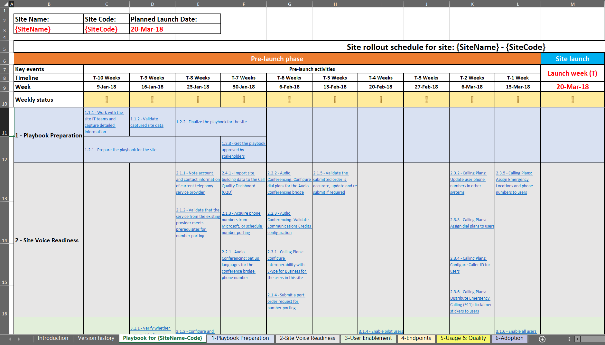
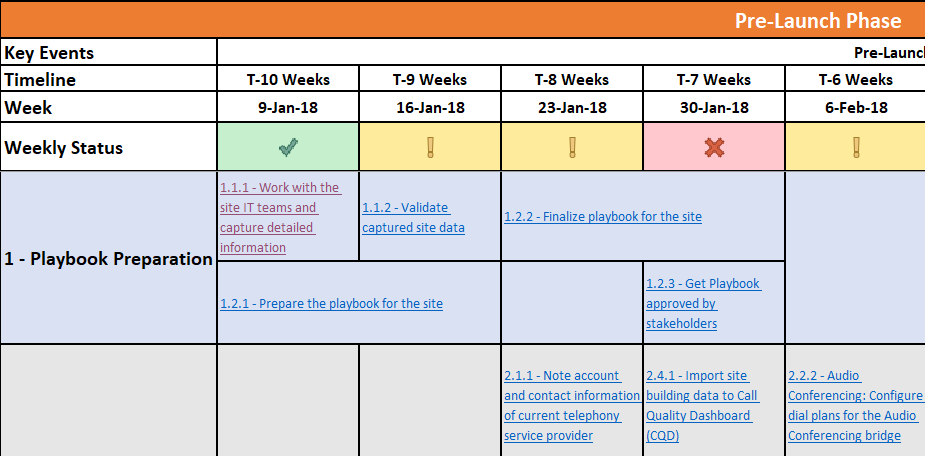

# Deploy my service

This article gives an overview of the requirements for properly deploying cloud voice services. By following prescriptive guidance for deploying cloud voice services, you can make sure you successfully account for all requirements and deliver repeatable results.

## Site enablement playbook for Microsoft Teams voice workloads

Use this playbook to help your organization successfully plan and execute the
rollout of Microsoft Teams voice features on a site-by-site basis.

Including all required activities, recommended timelines, and links to
corresponding guidance for each activity, this playbook covers end-to-end
guidance to help ensure a successful Teams voice deployment for a given site,
focusing on factors that are important to the user.

By completing the activities in this playbook, your organization can:

-   Effectively plan and schedule your Teams rollout.

-   Accelerate and optimize user adoption.

-   Reduce support needs and increase user satisfaction.

> [!NOTE]
> This article and the associated playbook aren’t intended to describe
every technical configuration step required for service enablement or providing
dial tone to a specific site. Instead, they focus on activities and tasks
recommended to onboard users easily and have them start consuming Teams voice
workloads through a fast and smooth transition with a high adoption rate, while
minimizing support requirements. For technical guidance on how to best configure
your environment for Teams voice, see the onboarding checklists for [configuring Teams voice workloads](onboarding-checklist-configure-cloud-voice-workloads-in-Microsoft-Teams.md), [configuring Direct Routing in Teams](onboarding-checklist-configure-direct-routing-in-Microsoft-Teams.md), [Teams core capabilities](onboarding-checklist-configure-microsoft-teams-core-capabilities.md), [networking for Teams](onboarding-checklist-configure-networking.md), and [enabling Office 365](onboarding-checklist-enable-office-365.md).

<!--ENDOFSECTION-->

## Playbook focus areas

The focus of the playbook is to address the factors that influence the user’s
perception of a Teams voice deployment. Activities and tasks are grouped into
the following focus areas:

-   Validation of service readiness
    - Audio Conferencing
    - Calling Plans
    - Direct Routing

-   User enablement

-   Endpoints

-   Usage and quality

-   Adoption

The [Site Enablement Playbook for Voice (Playbook)](https://github.com/MicrosoftDocs/OfficeDocs-SkypeForBusiness/blob/live/Teams/downloads/site-enablement-playbook-for-voice-(playbook).xlsx?raw=true) is a Microsoft Excel workbook. Each of these five
focus areas is a separate sheet in the workbook, and each deployment task and
activity is grouped onto one of these sheets.

> [!NOTE]
> You’ll create a separate instance of the playbook for each site in scope for
your Teams rollout.

<!--ENDOFSECTION-->

## How to use the playbook

Regardless of the size and complexity of the location, enabling each site
requires that you plan your tasks and activities early enough—and execute them
in optimal order—before, during, and after the actual service rollout. We
recommend that you follow these steps as you plan and execute your own journey
to Microsoft Teams voice.

1. Download the [Site Enablement Playbook for Voice (Playbook)](https://github.com/MicrosoftDocs/OfficeDocs-SkypeForBusiness/blob/live/Teams/downloads/site-enablement-playbook-for-voice-(playbook).xlsx?raw=true) for Microsoft Teams
   Voice.

2. Create a separate copy of the playbook for each site.

3. On the tab for the sheet named **Playbook for {SiteName-Code}**, replace
   **{SiteName-Code}** with the relevant site name and/or site code.

4. Enter the **Site name, Site code**, and **Planned launch date**, as
   illustrated below. This is a critical step, because it adjusts the
   recommended deadlines for every activity in the playbook.

   

5. Review each activity, take necessary actions, and update the status as you
   walk through the timeline. Status is represented graphically, as described
   below:
   <ul>
   <li> <strong>Yes, or not applicable (green):</strong> The activity has been completed, or it’s not applicable for this site, and no further action is needed.</li>
   <li> <strong>The activity isn’t completed yet (yellow):</strong> The activity hasn’t been completed yet, and must be updated to Yes or No on its schedule.</li>
   <li> <strong>No (red):</strong> The activity can’t be completed because of an issue and must be carried to the project status meeting.</li></ul>

6. The status is rolled up within each section, and the section heading is
   formatted with one of these status indicators. **Weekly status** is also
   updated automatically.

> [!TIP]
> Repeat the steps above for all the locations you have.

> [!IMPORTANT]
> Some steps might not be applicable to all locations and sites. If a
specific activity isn’t relevant to a site, you must select **Not applicable**
for this activity. **DO NOT DELETE** any rows in the playbook; if you do, the
status roll-up formulas won’t work.  
> Pay attention to activities that might take more time than you
planned for, such as number porting and procurement activities. These activities
can negatively affect the site deployment timeline. Be sure to review and update
the activity list and the associated timeline weekly, and present them at
[steering committee meetings](https://docs.microsoft.com/MicrosoftTeams/envision-steering-committee-complete-guide) to ensure that stakeholders are aware
of the status of each site and any possible deviations from the deployment
schedule.

<table>
<tr><td>  Decision points</td><td><ul><li>Decide if the Site Enablement Playbook is required for your deployment.</li><li>Decide who will be responsible for customizing the Site Enablement Playbook for Microsoft Teams for every site you’ll deploy.</li></ul></td></tr>
<tr><td> Next steps</td><td><ul><li><a href="https://github.com/MicrosoftDocs/OfficeDocs-SkypeForBusiness/blob/live/Teams/downloads/site-enablement-playbook-for-voice-(playbook).xlsx?raw=true" data-raw-source="[Download the Site Enablement Playbook](https://github.com/MicrosoftDocs/OfficeDocs-SkypeForBusiness/blob/live/Teams/downloads/site-enablement-playbook-for-voice-(playbook).xlsx?raw=true)">Download the Site Enablement Playbook</a>.</li><li>Customize the Site Enablement Playbook for your first site.</li><li>Repeat as needed for additional sites.</li></ul></td></tr>
</table>

<!--ENDOFSECTION-->