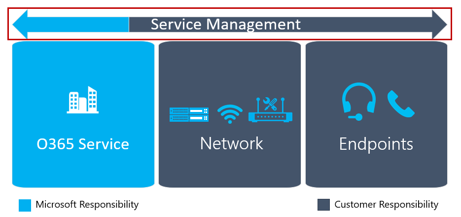

# Plan my service management

This article gives an overview of the requirements that are necessary to deliver
and maintain a high-quality Microsoft Teams deployment. You can help ensure a
successful deployment by planning for service management and quality during the
Envision phase, before your first pilot or production deployment.

## Service management for Teams

Service management is a broad topic that covers day-to-day operations of the
Microsoft Teams service after it has been deployed and enabled for users. The
Teams service encompasses Microsoft Office 365 and the infrastructure components
that are deployed on-premises (for example, networking).

The notion of service management is most likely not a new concept for most
organizations. You probably have already implemented processes and tasks that
are associated with existing services. That said, you can probably augment what
you have in place when you plan for service management today to support
Microsoft Teams in the future.

Service management encompasses all the activities and processes involved in
managing Microsoft Teams end to end. Some components of service management—the
infrastructure components that the Office 365 service itself comprises—are
Microsoft’s responsibility, whereas the customer is accountable to its users to
manage the various aspects of Teams, the network, and endpoints they provide.
For a complete discussion of the customer responsibility for Teams service
management and how it relates to the key components that underpin the quality of
the user experience, see [Plan for service management and quality](https://docs.microsoft.com/MicrosoftTeams/envision-planning-for-service-management-and-quality-complete-guide).

<!--ENDOFSECTION-->

## Introduction to the Operations Guide 

**What**, **Who**, and **How** are three important questions that need to be
answered when it comes to service management.

You can use the [Operations Guide](https://docs.microsoft.com/MicrosoftTeams/1-drive-value-operate-my-service) to help you address
all three of these questions. The guide provides a list of activities to be
performed on a daily, weekly, monthly, and as-needed basis. These activities and
tasks are critical for maintaining a high-quality Teams deployment. Determining
who will be responsible for performing specific activities in service management
is a critical aspect of your planning that you need to do early in the Envision
phase to ensure a successful deployment. After you’ve figured out the tasks and
activities, they need to be understood and followed by the groups or individuals
that you assign to them. The Operations Guide provides knowledge and guidance
for how to perform each of the tasks, and/or references to outside content.

## Plan for operational role mapping

Planning for service management early is a critical milestone, because the
operations phase begins when the first pilot users are enabled. The project team
must review and agree on the tasks and activities required, identify the team
that’s responsible for each operational task, and then get a commitment and
sign-off from each respective team.

After sign-off is complete, the responsible team must then start
operationalizing these roles and responsibilities. This might include training
and readiness, updating the staffing model, or ensuring that external partners
are ready to deliver.

Mapping operational roles early in the Envision phase enables all teams to start
their operational tasks during the pilot and ramp up operations and make sure
that everything is ready after the deployment starts.

The Operations Guide provides a list of common tasks mapped to typical roles
that should be valid in most scenarios. You need to customize these
responsibilities to work for your organization.

>[!TIP]
>The following is an example of a template to document the result of
operational roles mapping exercise that you performed to support this project.

|Operational Role |Description |Team |Contact Details |
|---------|---------|---------|---------|
|Service Owner|Service owner, interface to business divisions, strategy|TBA|TBA|
|Audio Conferencing Operations|Daily operations, user and device account move/add/change, monitoring|TBA| TBA| 
|Tenant Admin|Change tenant-wide settings, enable new features|TBA|TBA|
|Help Desk|Interface for users to get support|TBA|TBA|
|Network Operations|Run LAN, WAN, Wi-Fi, and internet access|TBA|TBA|
|Client & Endpoints Team|Manage desktop deployments|TBA|TBA|
|Identity Operations|Manage identity infrastructure (Active Directory, Active Directory Federation Services, Azure AD)|TBA|TBA|
|Adoption/Change Management|Manage awareness, training, and adoption for the solution|TBA|TBA|
|Exchange Operations|Manage the Exchange environment|TBA|TBA|
|Telephony Operations|Manage the SBC's and the phone numbers|TBA|TBA|

To facilitate a more detailed operational roles mapping, including the tasks
associated with each operational role, you can use the [Operational Role Mapping
Workbook](https://myadvisor.fasttrack.microsoft.com/CloudVoice/Downloads?SelectedIDs=4_4_0_16)
to capture the details that will provide the clarity around roles and
responsibilities to support cloud voice workloads.

<!--ENDOFSECTION-->

## The Quality Champion role

A group or individual needs to be accountable for quality in all organizations.
This is the most important role in service management. The quality champion is a
customer role that's assigned to a person or group who is passionate about their
users' experience. This role requires the skills to identify trends in the
environment and the sponsorship to work with other teams to drive remediation.
The best candidate for the quality champion is typically the customer service
owner, who—depending on the organization’s size and complexity—could be any
person or group who is passionate about user experience.

The quality champion leverages existing tools and documented processes, such as
the Call Quality Dashboard (CQD) and the Quality Experience Review Guide, to
monitor user experience, identify quality trends, and drive remediation where
needed. The quality champion works with the respective teams to drive
remediation actions, reporting to a steering committee on their progress and
open issues.

The tasks and activities associated with the role are documented in the
Operations Guide. This role should be assigned early in the Envision phase. A
key step in operationalizing the role of Quality Champion is gaining the
knowledge required for the role and ensuring the prerequisites are in place to
deliver on the tasks. A key task for this role is running a regular Quality
Experience Review.

<!--ENDOFSECTION-->

## Introduction to the Quality Experience Review Guide

The Quality Experience Review Guide has a set of activities that assess and
provide remediation guidance in key areas that have the greatest impact for
improving user experience, as shown in the figure below.

By continually assessing and remediating the areas described in this document,
you can reduce their potential to negatively affect user experience. Most
user-experience problems encountered in a deployment can be grouped into the
following categories:

-   Incomplete firewall or proxy configuration

-   Poor Wi-Fi coverage

-   Insufficient bandwidth

-   VPN

-   Use of unoptimized or built-in audio devices

-   Problematic subnets or network devices

The guidance provided in the Quality Experience Review Guide focuses on using
Call Quality Dashboard (CQD) Online as the primary tool to report and
investigate each area described, with a focus on audio to maximize adoption and
impact. Any optimizations made to the network to improve the audio experience
will also directly translate to improvements in video and desktop sharing.

We highly recommend that you nominate the quality champion early on. After being
nominated, they should start to familiarize themselves with the content in the
[Quality Experience Review Guide](https://aka.ms/qerguide).

<table>
<tr><td>  Decision points</td><td><ul><li>Decide who is accountable for cloud voice operations in your organization.</li></ol></td></tr>
<tr><td> Next steps</td><td><ul><li>Download the Planning for Service Management full guide.</li><li>Download the Quality Experience Review guide.</li><li>Review the Operations Guide in full.</li><li>Provide all guides to every operations team members to review and be familiar with operations requirements.</li></ol></td></tr>
</table>

<!--ENDOFSECTION-->