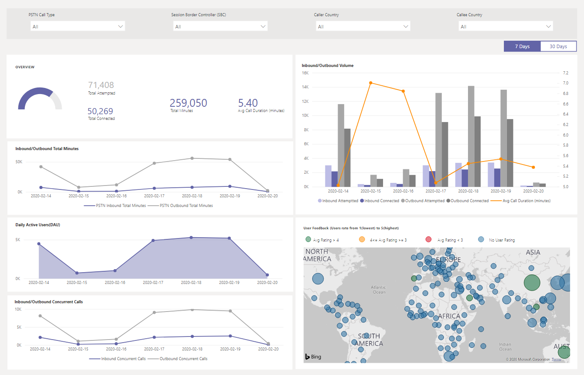
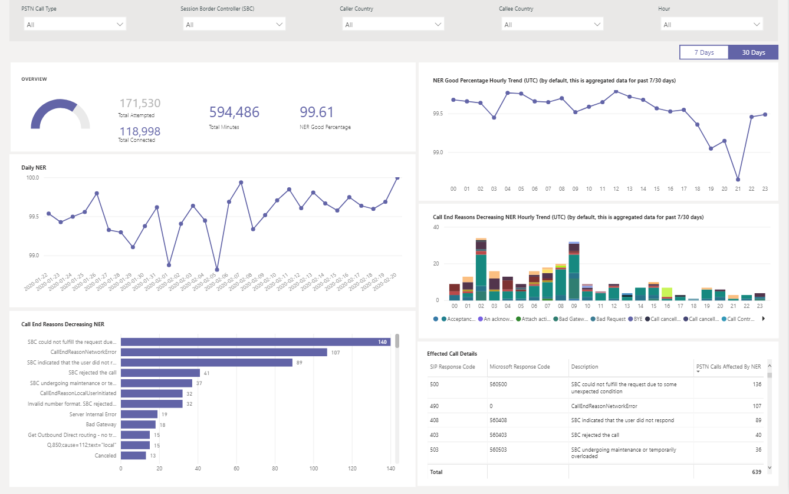
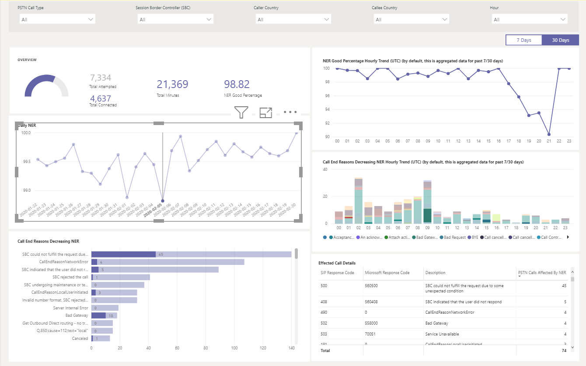
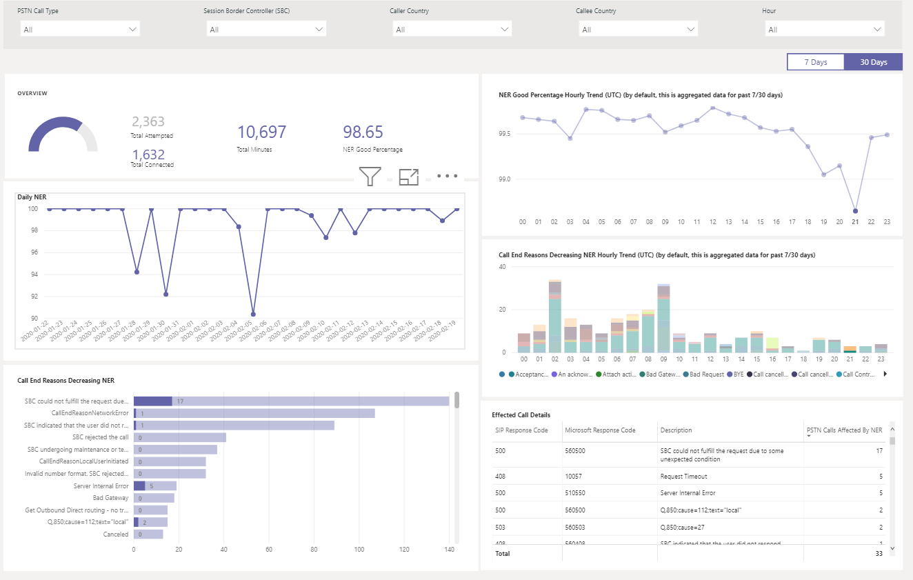
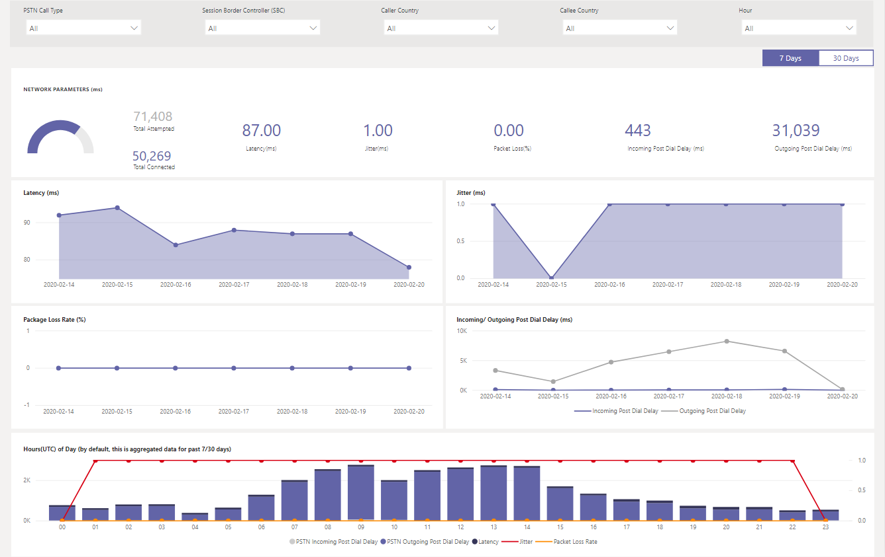

# Using the CQD PSTN Direct Routing report

New in March 2020, we've added a Microsoft Teams Call Quality Dashboard (CQD) PSTN Direct Routing report to our downloadable [Power BI query templates for CQD](https://github.com/MicrosoftDocs/OfficeDocs-SkypeForBusiness/blob/live/Teams/downloads/CQD-Power-BI-query-templates.zip?raw=true). 

The CQD PSTN Direct Routing report (CQD PSTN Direct Routing Report.pbit) helps you understand the usage patterns and quality of your PSTN services. Use this report to monitor service usage, information about your Session Border Controller (SBC), the telephony service, network parameters, and Network Effectiveness Ratio details. This information can help you identify issues, including the reason for dropped calls. For example, you'll be able to see when volume drops, or how many calls get affected and for what reason.

The CQD PSTN Direct Routing Report has four sections:

  - [PSTN Overview](#pstn-overview)

  - [Service Details](#service-details)

  - [Network Effectiveness Ratio](#network-effectiveness-ratio)

  - [Network Parameters](#network-parameters)

## Highlights

1. Analyze by call type, SBC, caller and callee country

   The CQD PSTN Direct Routing report aggregates reliability and usage metrics for all SBCs on your tenant for the last 7, 30, or 180 days (6 months). You can analyze data by call type, SBC, caller and callee country. If you're interested in a particular SBC or country, you'll be able to identify changes in trends over the selected time range.
   :::image type="content" source="media/CQD-PSTN-report8.png" alt-text="Screenshot of filters available in the CQD PSTN Direct Routing report.":::
   
2. Track trends

    Trends analysis is essential when trying to understand service usage and reliability. Hourly trends provide a close look at daily performance, which helps identify real-time incidents. Daily trends let you see your service health from a long-term perspective. It's important to be able to shift between those two modes with appropriate data granularity. The CQD PSTN Direct Routing report provides 6-month trends overview, 7- and 30-day daily trends, and hourly trends so you can analyze performance at each level.
    :::image type="content" source="media/CQD-PSTN-report9.png" alt-text="Screenshot of trends graphs in CQD PSTN Direct Routing report.":::

3. Drill through to SBC or user level

   We've been building in drill-through capability on many data categories in CQD, which lets you quickly understand usage or reliability distribution at the SBC or user level. By using drill through, you can quickly poinpoint issues and understand real user impact. The CQD PSTN Direct Routing report features drill through on the Service Detail and Network Effectiveness Ratio metrics. Click the data point you're interested in to drill through to SBC- or user-level details.
   :::image type="content" source="media/CQD-PSTN-report10.png" alt-text="Screenshot showing drill-through capability on a data point.":::

## PSTN Overview

The CQD PSTN Direct Routing Report provides the following information related to overall health of the service for the past 180 days.

For example, if you are interested in the overall usage and health about all inbound calls going through SBC abc.bca.adatum.biz with US as the internal country:

| **Call Out** | **Description**                                                                                                                                                 |
| ------------ | --------------------------------------------------------------------------------------------------------------------------------------------------------------- |
| 1            | You can use the filters at the top to drill down and select ByotIn as call type, abc.bca.contoso.com as Session Boarder Controller, and US as internal country. |
| 2            | Usage trend for the past 180 days. You can find usage detail report on Service Detail page.                                                                     |
| 3            | Post Dial Delay, Latency, Jitter, and Packet Loss trend for the past 180 days. You can find detail report on Network Parameters page.                           |
| 4            | Concurrent Call and Daily Active User trend for the past 180 days. This chart can help you understand the max volume of the service.                            |
| 5            | Top Call End Reason affected service quality for the past 180 days. You can find service health detail on Network Effective Ratio(NER) page.                    |

## Service Details

This page provides service usage trends per day and user feedback breakdown by geographic.

  - **Total Attempt Calls –** Total attempt calls in that time range, including both success and failed calls

  - **Total Connected Calls -** Total connected calls in that time range

  - **Total Minutes –** Total minute usage in that time range

  - **Daily Active Users(DAU) –** Count of daily active user who made at least one connected call in that day

  - **Concurrent Calls –** Max of simultaneous active calls in a minute

  - **User Feedback –** "Rate My Call" score comes from the user. 3-5 is considered as a good call. 1-2 is considered as a bad call.

For example:

1.  If you see average call duration drops to 0 at 02/14/2020, you can first check if the call volume looks normal and see if there is a big discrepancy between total connect calls and total attempt calls. Then go to Network Effectiveness Ratio page to invest on call failure reasons.

2.  If you see increasing red spots on the user feedback map, you could go to Network Effectiveness Ratio page and Network Parameter to see if there are any anomalies and you could raise a ticket using MS Service Desk.

## Network Effectiveness Ratio

This is the same metric that appears on the Overall Health dashboard. You can check hourly NER number with affected calls detail for both call directions (inbound/outbound) on the Hourly network effectiveness ratio and call ending reason chart below.

  - **NER** - The ability (%) of a network to deliver calls by measuring the number of calls sent versus the number of calls delivered to a recipient.

  - **SIP response code**- A three-digit integer response code shows the call status.

  - **Microsoft response code**-A response code sent out from Microsoft component.

  - **Description** – The reason phase that corresponding to the SIP response code and Microsoft response code.

  - **Number of calls affected** – The total number of calls got affected during the selected time range.

> 
> 
For example:

If Daily NER has a dip on 02/05/2020, you can click on the date and other charts will zoom to that specific date.

From the NER Good Percentage Hourly Trend, you can find the dip happens around 21:00. Then click again to zoom to hour 21 and check Effected Call Details to see how many calls failed in that hour and what are the call end reasons. You can start with self-trouble shooting on any SBC problems or report to Service Desk if the problem is not related to SBC.

## Network Parameters

All network parameters are measured from the Direct Routing interface to the Session Border Controller. For information about the recommended values, see [Prepare your organization's network for Microsoft Teams](prepare-network.md), and look at the Customer Edge to Microsoft Edge recommended values.

  - **Jitter** – Is the millisecond measure of variation in network propagation delay time computed between two endpoints using RTCP (The RTP Control Protocol).

  - **Packet Loss** – Is a measure of packet that failed to arrive; it is computed between two endpoints.

  - **Latency** - (Also known as round trip time) is the length of time it takes for a signal to be sent plus the length of time it takes for the acknowledgment of that signal to be received. This time delay consists of the propagation times between the two points of a signal.

> 

For example:

If you see a spike on any of the four charts (Latency, Jitter, Package Loss Rate, Post Dial Delay) for a specific date, for example, Latency on 02/14/2020, click on the date point. And the hourly trend chart at the bottom will refresh to show the hourly number. You can check the SBCs or raise a ticket with MS Service Desk.

## Related topics

[Use Power BI to analyze CQD data for Microsoft Teams](CQD-PSTN-report.md)

[Teams Troubleshooting](/MicrosoftTeams/troubleshoot/teams)