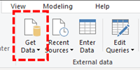
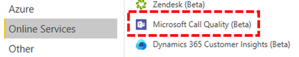
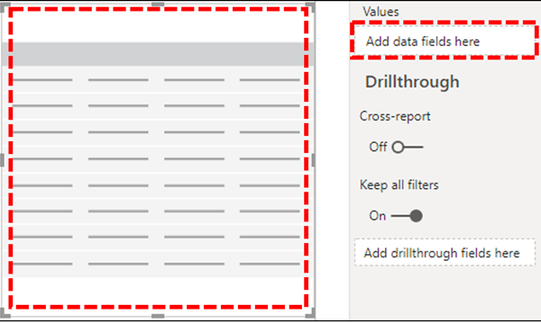
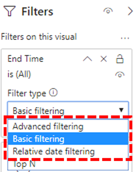
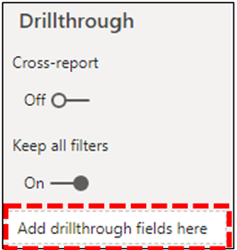

# Install Microsoft Call Quality connector for Power BI to use Call Quality Dashboard query templates

Before you can use the Power BI query templates (PBIX files) for Microsoft Teams Call Quality Dashboard (CQD), you'll need to install the Microsoft Call Quality connector for Power BI, using the *MicrosoftCallQuality.pqx* file included in the [download](https://github.com/MicrosoftDocs/OfficeDocs-SkypeForBusiness/blob/live/Teams/downloads/CQD-Power-BI-query-templates.zip?raw=true).

Read [Use Power BI to analyze CQD data for Teams](CQD-Power-BI-query-templates.md) to learn about these templates.

Make sure you have the right [CQD access role](./turning-on-and-using-call-quality-dashboard.md#assign-admin-roles-for-access-to-cqd) to access the Power BI reports.

> [!NOTE]
> The Microsoft Call Quality connector only supports DirectQuery in Power BI; Import mode is not supported. 

## Installation

The process for installing a custom connector and adjusting security to enable use of the connector is described in detail in the [Power BI documentation](/power-bi/desktop-connector-extensibility). For the sake of simplicity, here's a quick explanation:

1. Check to see if your computer already has a *\[Documents\]\\Power BI Desktop\\Custom Connectors* folder. If not, create this folder.1

2. Download the connector file (either a *\*.mez* or *\*.pqx* file) and place it in the *Custom Connectors* directory.

3. **If the connector file is a *\*.mez* file,** you will also need to adjust your security settings as described in the [custom connector setup documentation](/power-bi/desktop-connector-extensibility#data-extension-security).

If a new version of the Microsoft Call Quality connector is released, replace the old connector file in the *Custom Connectors* directory with the new file.

## Setup

In order to build a report and run queries, you will first need to connect to the CQD data source. Follow the steps below in order to connect:

1. In the Home tab of Power BI Desktop, click on *Get Data*.

    

2. The *Get Data* window should appear at this point. Navigate to *Online Services*, then select *Microsoft Call Quality (Beta)* and hit *Connect*.

    

3. You will be prompted to sign in next. Use the same credentials that you use for Call Quality Dashboard.2

4. The next prompt will give you the option between two *Data Connectivity modes*. Select *DirectQuery* and hit *OK*.

5. Finally, you will be given a final prompt showing you the entire data model for Call Quality Dashboard. No data will be visible at this point, only the data model for CQD. Select *Load* to complete the setup process.

6. At this point, Power BI will load the data model onto the right side of the window. The page will remain otherwise blank, and no queries will be loaded by default. Proceed to **Building Queries** below in order to build a query and return data.

If any of the steps during this setup process weren't clear, a more detailed explanation of the process can be found in [Quickstart: Connect to data in Power BI Desktop](/power-bi/desktop-quickstart-connect-to-data).

## Building Queries

Once setup is complete, you should see the names of several hundred dimensions and measures load in the *Fields* pane. Constructing actual queries from here is simple, just select the dimensions and measures you want for your query, then drag and drop them onto the page. Here's a more detailed explanation, with a simple example:

1. Select the visualization you want to use from the *Visualizations* pane. A blank version of that visualization should appear on the page. For the purposes of this example, we will be using the *Table* visualization.

    

2. Determine which dimensions and measures (denoted by an aggregation symbol by their name) you wish to use for your query, then manually select them and drag them onto the black visualization. Alternately, drag them onto the *Values* field beneath the visualization options.

    

    > [!IMPORTANT]
    > Call Quality Dashboard requires a measure for any query to run. Failure to add a measure to a query will cause that query to fail.

3. Next, select any dimensions you want to filter on and drag them to the *Filters on this visual* field in the *Filters* pane. The Microsoft Call Quality connector currently supports *Basic filtering* (select values from a list of possible dimension values), *Advanced filtering* (manually specify values and operands to filter on, similar to Call Quality Dashboard), and *Relative date filtering* (only available for the *End Time* and *Start Time* dimensions). Filtering according to *Top N* is not supported by Call Quality Dashboard.

    

    > [!IMPORTANT]
    > Filters are only supported when applied to Dimensions. Filtering on the values of Measurements is not supported in Call Quality Dashboard.

4. Finally, select the *Format* tab within the *Visualizations* pane to style and format your query.

    > [!NOTE]
    > Call Quality Dashboard queries require at least one measure in order to run. If your query does not load, double check that you have included a measure in the query.

## Creating a Drillthrough Report

[Drillthrough in Power BI](/power-bi/desktop-drillthrough) allows you to create focused reports that you can quickly filter using the values of other reports as context. Once you know how to create your first query with the Microsoft Call Quality connector, creating a drillthrough is even simpler.

1. Create another page for the focused report, and then add your queries to that page.

2. Select the dimension you want to use as a drillthrough filter and drag them onto the *Drillthrough* field under on the *Visualizations* pane.

    

3. **That's it\!** Any other query on another page that uses that dimension can now drill through to that page, automatically applying the drillthrough dimension's value as a filter.

    

Unlike Call Quality Dashboard, Power BI supports non-sequential drillthrough. If a query includes the necessary dimension, it can drill through to any other page.

### Best practice

Microsoft Call Quality connector queries should be designed with drillthrough functionality in mind. Instead of trying to load all the data at once, and then slicing down with filters, start with broader, low-cardinality queries and drill down to high-cardinality queries. For instance, when attempting to diagnose which subnets contribute most to quality issues, it's helpful to first identify those regions and countries that contribute to the problem, then drill down to the subnets in that region or country. The Call Quality connector templates have been designed in this manner in order to act as an example.

## Limitations

Despite making use of Power BI, not all Power BI functionality is support by the Microsoft Call Quality connector, either as a result of limitations on Call Quality Dashboard's data model or on DirectQuery connectors in general. The list below notes some of the Connector's more noteworthy limitations, but this list should not be considered exhaustive:

1. **Calculated Columns –** DirectQuery connectors in general have limited support for calculated columns in Power BI. Some calculated columns might work with the Connector, that those columns are exceptions. As a general rule, calculated columns don't function.

2. **Aggregations –** The Call Quality Dashboard data model is built on a cube model, meaning that aggregations are already supported in the form of measures. Attempting to manually add aggregations to different dimensions or changing the aggregation type of a measure will not work with the Connector, and it will generally result in an error.

3. **Custom Visuals –** While the Microsoft Call Quality connector does work with a range of custom visuals, we are unable to guarantee compatibility with all custom visuals. Many custom visuals rely on the use of calculated columns or imported data, neither of which is supported by DirectQuery connectors.

4. **Referencing Cached Data –** Power BI currently does not support referencing cached data from a DirectQuery connector in any way. Any attempt to reference the results of a query will result in a new query.

5. **Relative Data Filtering –** Is supported in the Microsoft Call Quality connector, but only with the *Start Time* and *End Time* dimensions. Although the *Date* dimension may be the obvious choice for relative date filtering, *Date* is not stored as a date time object and thus does not support relative date filtering in Power BI.

6. **Measurement Only Queries -** Are not supported at this time in the Microsoft Call Quality connector. When creating a visualization with three or more measurements and no dimensions, the column data will be transposed. To avoid this, always include at least one dimension (eg: Month Year) in your visualizations. This is slated to be resolved in an upcoming release of the Microsoft Call Quality connector for Power BI.

7. **Government Community Cloud (GCC) Support –** For customers in the GCC environment, the Microsoft Call Quality connector will work when using Power BI Desktop only. The Microsoft Call Quality connector is not presently compatible with the Power BI service for GCC customers.

Most of these issues are either restrictions to DirectQuery connector design in Power BI or fundamental to the design of the CQD data model.

## Troubleshooting

### I'm trying to use the Date column as a Date slicer. As soon as I convert the data type of this column to Date, I get this error

> **Couldn't load the data for this visual**: OLE DB or ODBC error: [Expression.Error] We couldn't fold the expression to the data source. Please try a simpler expression.

Date slicers aren't supported with the Microsoft Call Quality connector. To specify a date range, apply two filters to the report, specifying a less than and greater than date.

Alternatively, if the dates you want to view are recent, apply a relative date filter to show only data for the last N days/weeks/months.

### When I add certain dimensions to my reports, the visual immediately returns **"Couldn't load the data for this visual"**. Removing the dimension fixes the visual -- what is happening?

This is a known issue in the Microsoft Call Quality connector; any dimension that is exposed as a whole number will appear in Power BI as an 'aggregate' column, where Power BI will attempt a default summarize action (typically 'Sum'). In some cases, this behavior will succeed at summing up the values even though the result is not useful, since the 'sum' of a dimension like Second WiFi Channel is meaningless. In other cases, this summarize action will fail and cause errors in the visual.

To work around this issue, start by removing the dimension from the visual. Select the dimension from the 'Fields' list, browse to the 'Column tools' tab in the ribbon, click the 'Summarization' drop-down menu and select **Don't summarize**. The dimension can now be added to the visual again.

## Error Codes

Because the Microsoft Call Quality connector for Power BI is less restricted than the browser app in terms of kinds of queries you can construct, you may occasionally encounter a number of errors while building your queries. In the event that you receive an error message of the type "CQDError. RunQuery – Query Execution Error", reference the list below with the ErrorType number provided in order to troubleshoot the possible issue with the query. The following are the most common Error Type codes you may encounter with the CQD Power BI Connector:

- **ErrorType 1 - Query Structure Error:** A query structure error is typically caused by the Connector failing to build a properly formatted query. This happens most often when using unsupported functionality, as specified in the Limitations above. Double check that you are not using any calculated columns or custom visuals for that query.

  - **ErrorType 2 - Query Building Error:** A query building error is caused by the Microsoft Call Quality connector being unable to properly parse the query you are attempting to build. This happens most often when using unsupported functionality, as specified in the Limitations above. Double check that you are not using any calculated columns or custom visuals for that query.

  - **ErrorType 5 - Execution Timeout:** The query has reached the maximum possible runtime before timing out. Try adding more filters to the query in order to limit its scope. Narrowing the data range is often the most effective way to achieve this.

  - **ErrorType 7 - No Measurements Error:** Call Quality Dashboard queries require a measure in order to function. Double check that your query includes measure. Measures in the Microsoft Call Quality connector are denoted by the aggregation (sum) symbol before their name.

If you encounter any additional errors outside of this scope, please notify the Call Quality Dashboard team so that we can help troubleshoot the issue and update the documentation as appropriate.

## Footnotes

**1** Certain processes and apps (e.g., OneDrive) may cause your Documents root folder to change; make sure that the *Power BI Desktop\\Custom Connectors* directory is placed inside of the current root folder Documents folder.

**2** The login credentials you use for Call Quality Dashboard *do not* need to be the same credentials you use for logging into the Power BI Desktop app itself.

## Frequently asked questions

### When will the Power BI Connector be updated from "Beta" status?

Despite the Beta tag, the Microsoft Call Quality (Beta) connector for Power BI is the first 'release' version of the connector and has been officially security signed by the Power BI team to reflect this. At the time of the connector's initial release, the Power BI team was unable to provide support and broader certification, but was still prepared to attest to the security, authenticity, and general functionality of the Microsoft Call Quality connector. Looking ahead, we are planning to invest in the Microsoft Call Quality connector for Power BI in the near future.

### Why does the connector seem slower compared to Call Quality Dashboard in the browser? What can I do to improve performance?

Query performance for the various templates is actually the same in both the browser and in the connector.  Just like any other standalone app, Power BI adds its authentication and rendering time to our performance. In addition, the difference comes in the number of concurrent queries being run. Because the in-browser version of Call Quality Dashboard had less well-developed and information-dense visualization options, most of our reports were limited to loading 2-3 queries at a time. On the other hand, the connector templates often display 20+ concurrent queries. If you wish to build reports that are just as responsive as the older ones you were used to, try creating reports with no more than 2-3 queries per tab.

For more information, see the following articles:

- [Optimization guide for Power BI](/power-bi/guidance/power-bi-optimization)
- [DirectQuery model guidance](/power-bi/guidance/directquery-model-guidance)

### I find that I routinely run into the 10,000-row limit when running queries. How can I get the connector to return more than 10,000 rows?

The 10,000-row limit is actually specified on the API end, and it is designed to help significantly improve performance and reduce the risk of query execution errors resulting from low memory conditions.

Instead of attempting to increase the result row count, it is best to restructure your reports according to connector best practices. The templates we have included are designed to demonstrate these best practices. Where possible, start by looking at your KPIs using broader, lower-cardinality dimensions, such as Month, Year, Date, Region, Country, etc. From there, you can drill down into increasingly higher-cardinality dimensions. The Helpdesk and Location-Enhanced Reports both provide good examples of this drill down workflow.

## Related topics

[Use Power BI to analyze CQD data for Teams](CQD-Power-BI-query-templates.md)
