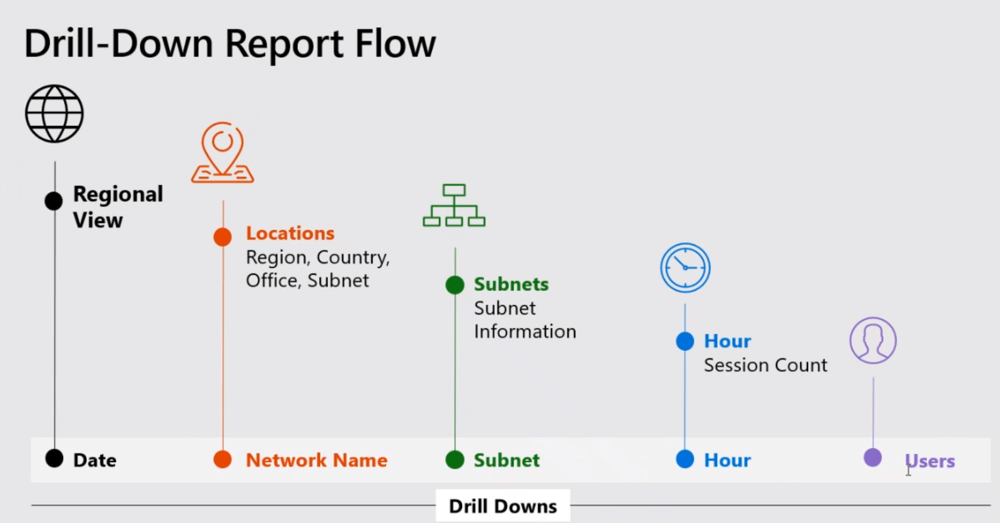
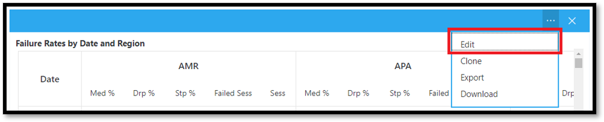
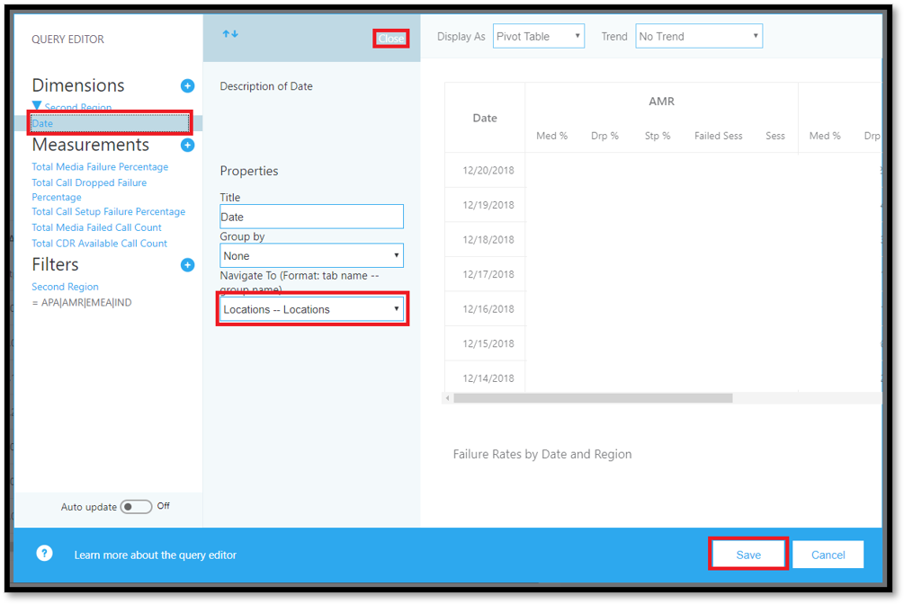
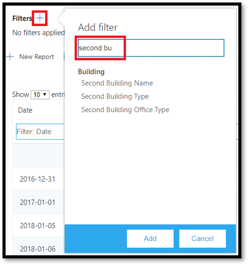
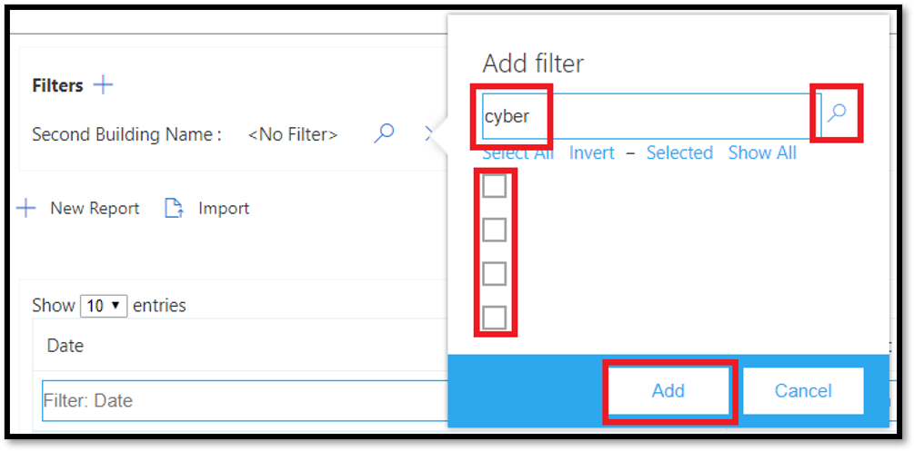
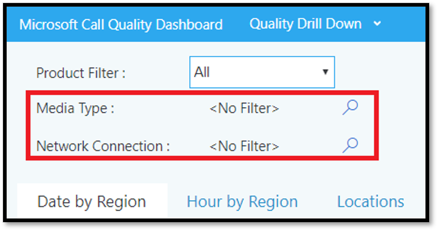

# Data and reports in Call Quality Dashboard (CQD)

Microsoft Call Quality Dashboard (CQD) uses a near-real-time (NRT) data feed. Call records are available in CQD within 30 minutes of the end of a call. Call records from the NRT pipeline are only available for a few months before they are removed from the data set.

## Many ways to access CQD data

You can access CQD data by several different avenues. Pick the one that best meets your needs:

|&nbsp;|&nbsp;|
|---|---|
|Teams admin center [(https://admin.teams.microsoft.com)](https://admin.teams.microsoft.com)|CQD data is included on the **Users** page in the Teams admin center, showing the most common data you need in an easy-to-read format. You can't customize CQD data that you find under **Users**.|
|CQD portal [(https://cqd.teams.microsoft.com)](https://cqd.teams.microsoft.com)|Robust summary and detailed reports that meet most needs, with drill-through filtering. You can also customize reports in the CQD portal. <br><br>Get two [CQD report templates](#import-the-cqd-report-templates) to help you analyze data in the CQD portal.|
|Power BI|Use direct queries to view your CQD data in Power BI using [customizable Power BI templates](CQD-Power-BI-query-templates.md). [Download Power BI query templates for CQD](https://github.com/MicrosoftDocs/OfficeDocs-SkypeForBusiness/blob/live/Teams/downloads/CQD-Power-BI-query-templates.zip?raw=true).<br><br>You can also [use the REST API to access CQD data](/skypeforbusiness/management-tools/call-quality-dashboard/data-api) through Power BI. Use this method if you want to download your CQD data so you can work on it offline. The benefit of using this method is better performance, especially useful for large data sets that bog down in Power BI when you're online.|
|Graph API|Access call quality data yourself using the [Graph API](/graph/api/resources/callrecords-api-overview). This is the most complex method, but it gives you the most control and flexibility in analyzing your call quality data. For example, if you need to join it with other data for your organization, you can use the Graph API to create a data model and incorporate call quality data.|

## Import the CQD report templates

Download [two curated CQD report templates](https://aka.ms/qertemplates) (All Networks and Managed Networks) to help you get up to speed quickly with CQD. The All Networks template, though optimized to work with a building data file, can be used while you work toward collecting and uploading building information into CQD, as described in the next section.

**To import the templates (.CQDX) into CQD**:

1. In CQD, select **Detailed Reports** from the menu at the top of the page.

2. In the left panel, select **Import**. Browse to the first CQDX template and select **Open**.

3. After the template is uploaded, a pop-up window will display the message "Report import was successful."

4. Repeat steps 2 and 3 for the second CQD template.

   > [!NOTE]
   > Each user must import the CQD templates into their CQD instance.

## EUII data

For compliance reasons, end-user identifiable information (EUII) data (also known as personally-identifiable information or PII) is only kept for 28 days. As NRT data crosses the 28-day mark, fields that contain EUII are cleared, resulting in EUII-free NRT data. Fields that contain EUII data are:

- Full IP address
- Media Access Control (MAC) Address
- Basic Service Set identifier (BSSID)
- Session Initiation Protocol (SIP) URI (Skype for Business only)
- User Principal Name (UPN)
- Machine Endpoint Name
- User Verbatim Feedback
- Object ID (the Active Directory object ID of the endpoint's user)
- Phone Number

### Admin roles with and without EUII access

These [RBAC](/azure/role-based-access-control/overview) roles **DO** have EUII access:

- Global Admin
- Teams Service Admin
- Teams Communications Admin
- Teams Communications Support Engineer
- Global Reader
- Skype for Business Admin

These RBAC roles **DON'T** have EUII access:

- Reports Reader
- Teams Communications Support Specialist

## Date controls

CQD supports the following Rolling Trend types:

- 5-day
- 7-day
- 30-day
- 60-day
- 90-day

The URL Date parameter accepts a Day field. Rolling-day reports use dates specified in the YYYY-MM-DD format as the last day of the trend. The URL Date parameter "00"  indicates "today".

|URL|End date of Rolling Day Trend|
|:---|:---|
|<span>https://\<cqdv3>/spd/#/Dashboard/\<reportid>/2019-02/</span>|Current Day of Feb 2019|
|<span>https://\<cqdv3>/spd/#/Dashboard/\<reportid>/2019-02-15/</span>|Feb 15, 2019|
|<span>https://\<cqdv3>/spd/#/Dashboard/\<reportid>/00/</span>|Current Day|

By default, the current day of the month is used as the last day of the Rolling Day Trend.

## Data available in CQD reports

The default summary and detailed CQD reports may be all you need to manage call quality for your org. If you need to, you can [create custom reports](#create-custom-detailed-reports).

If you want to use Power BI to analyze your CQD data, read [Use Power BI to analyze CQD data for Teams](CQD-Power-BI-query-templates.md).

|Feature|Summary Reports|Detailed Reports|
|:---|:---|:---|
|Application sharing metric|No|Yes|
|Customer building information support|Yes|Yes|
|Customer endpoint information support|Only in <span>cqd.teams.microsoft.com<span/>|Only in <span>cqd.teams.microsoft.com<span/>|
|Drill down analysis support|No|Yes|
|Media reliability metrics|No|Yes|
|Out-of-the-box reports|Yes|Yes|
|Overview reports|Yes|Yes|
|Per-user report set|No|Yes|
|Report set customization (add, delete, modify reports)|No|Yes|
|Video-based screen sharing metrics|No|Yes|
|Video metrics|No|Yes|
|Amount of data available|Last 12 months|Last 12 months|
|Microsoft Teams data|Yes|Yes|

### Select product data to see in reports

In the Summary and Location-Enhanced Reports, you can use the **Product Filter** drop-down to show all product data, only Microsoft Teams data, or only Skype for Business Online data.

> [!div class="mx-imgBorder"]
> 

In Detailed reports, you can use the **Is Teams** dimension to filter the data to Microsoft Teams or Skype for Business Online data.

## Summary Reports

These are the reports that you'll see on the CQD Dashboard when you first sign in to CQD. They give you an at-a-glance look at quality trends with daily, monthly, and table reports to assist with identifying subnets that have poor quality.

|Tab|Description|
|---|---|
|Overall Call Quality|Aggregate of the other 3 tabs.|
|Server—Client|Details of the streams between server and client endpoints.|
|Client—Client|Details of the streams between two client endpoints.|
|Voice Quality SLA|Info about calls included in the Skype for Business voice quality [SLA](https://go.microsoft.com/fwlink/p/?linkid=846252).|

### Overall Call Quality tab

Use the data on this tab to evaluate call quality status and trends based on stream counts and poor percentages. The legend in the upper-right corner shows which color and visual elements represent these metrics.

> [!div class="mx-imgBorder"]
> 

Streams are classified in three groups: Good, Poor, and Unclassified. There are also calculated  *Poor %*  values that give you the ratio of streams classified as *Poor*  to the total classified stream count. Since *Poor % = Poor streams/(Poor streams+ Good streams) \* 100*, the *Poor %* is unaffected by the presence of multiple *Unclassified*  streams. To see what classifies a stream as poor or good, refer to [Stream Classification in Call Quality Dashboard](stream-classification-in-call-quality-dashboard.md).

Use the scale on the left to measure the stream count values.

> [!div class="mx-imgBorder"]
> 

Use the scale on the right to measure the Poor % values.

> [!div class="mx-imgBorder"]
> 

You can also obtain the actual numerical values by hovering the mouse over a bar.

> [!NOTE]
> The following example is from a very small sample data set, and the values aren't realistic for an actual deployment.

> [!div class="mx-imgBorder"]
> 

The overall stream volume helps determine how relevant the calculated Poor percentages are. The smaller the volume of overall streams, the less reliable the reported Poor percentage values are.

### Server-Client tab and Client-Client tabs

These two tabs provide details for the streams that took place in their endpoint-to-endpoint scenarios. The Server-Client tab has four collapsible sections that represent four scenarios under which media streams would flow.

- Wired Inside
- Wired Outside
- WiFi Inside
- WiFi Outside

Similarly, the Client-Client tab has five collapsible sections:

- Wired Inside — Wired Inside
- Wired Inside — Wired Outside
- Wired Outside — Wired Outside
- Wired Inside — WiFi Inside
- Wired Inside — WiFi Outside

#### Inside versus Outside

CQD classifies a stream as  *Inside*  or *Outside*  using Building information, if it exists. Endpoints of each stream are associated with a subnet address. If the subnet is in the list of the subnets marked InsideCorp in the uploaded Building information, then it is considered *Inside*. If Building information has not yet been uploaded, then Inside Test always classifies the streams as *Outside*.

The Inside Test for a Server-Client scenario only considers the client endpoint. Because servers are always outside from a user's perspective, this isn't accounted for in the test.

#### Wired versus WiFi

As the names indicate, the classification criteria is based on the type of client connections. Server is always wired and it isn't included in the calculation. In a given stream, if one of the two endpoints is connected to a WiFi network, then CQD classifies it as WiFi.

> [!NOTE]
> Given a stream, if one of the two endpoints is connected to a WiFi network, then it is classified as WiFi in CQD.

## Tenant Data information

The CQD Summary Reports dashboard includes a **Tenant Data Upload** page, accessed by selecting **Tenant Data Upload** from the settings menu in the top-right corner. This page is used for admins to upload their own information, such as:

- A map of IP address and geographical information.
- A map of each wireless AP and its MAC address.
- A map of Endpoint to Endpoint Make/Model/Type, etc.

We recommend that you upload your tenant, building, and location data so CQD can include this information in your reports. If you haven't already uploaded this data, read [Upload tenant and building data](CQD-upload-tenant-building-data.md).

## Detailed reports

|Name|Description|
|---|---|
|Location-Enhanced Reports|Shows quality trends based on location information. This report appears only if you've [uploaded your tenant data](CQD-upload-tenant-building-data.md).|
|Reliability Reports|Includes audio, video, video-based screen sharing (VBSS), and app sharing reports.|
|Quality of Experience Reports|Audio quality and reliability for all clients and devices, including meeting rooms. These reports are a "slimmed-down" version of the downloadable [CQD templates](https://aka.ms/QERtemplates), focusing on key areas for analyzing audio quality and reliability.|
|Quality Drill Down Reports|Drill downs: Date by region, locations, subnets, hour, and users.|
|Failure Drill Down Reports|Drill downs: Date by region, locations, subnets, hour, and users.|
|Rate My Call Reports|Analyze user call ratings by region, location, or by user. Includes verbatim feedback.|
|Help Desk Reports|Help Desk Reports look at call and meeting data for individual users, groups of users, or everyone. Incorporating building and EUII data, these reports help identify possible system issues based on network location, conference details, devices, or firmware.|
|Client Version Reports|Client Version Summary: View the Sessions and Users counts for each client app version<br><br>Client Version by User: View user names for each client app version <br><br>Pre-built filters for Product and Client Type help focus the versions to specific clients.|
|Endpoint Reports|Shows call quality by machine endpoints (computer make and model). These reports include building data, if you've uploaded it.|

## Create custom detailed reports

If the default CQD reports don't meet your needs, use these instructions to create a custom report. Or (as of January 2020) [Use Power BI for CQD reports ](cqd-power-bi-query-templates.md)instead.

From the pull-down list of reports at the top of the screen displayed at login \(the **Summary Reports** screen\) Select **Detailed Reports**  and then **New**. Click **Edit** in a report to see the Query Editor. Each report is backed by a query into the cube. A report is a visualization of the data returned by its query. The Query Editor helps you edit these queries and the display options of the report.

> [!IMPORTANT]
> The network range can be used to represent a supernet (combination of several subnets with a single routing prefix). All new building uploads will be checked for any overlapping ranges. If you have previously uploaded a building file, you should download the current file and re-upload it to identify any overlaps and fix the issue before uploading again. Any overlap in previously uploaded files may result in the wrong mappings of subnets to buildings in the reports. Certain VPN implementations do not accurately report the subnet information. It is recommended that when adding a VPN subnet to the building file, instead of one entry for the subnet, separate entries are added for each address in the VPN subnet as a separate 32-bit network. Each row can have the same building metadata. For example, instead of one row for 172.16.18.0/24, you should have 256 rows, with one row for each address between 172.16.18.0/32 and 172.16.18.255/32, inclusive.
>
> The VPN column is optional and will default to 0.  If the VPN column's value is set to 1, the subnet represented by that row will be fully expanded to match all IP addresses within the subnet.  Please use this sparingly and only for VPN subnets since fully expanding these subnets will have a negative impact on query times for queries involving building data.

Point to bar charts and trend lines in the report to display detailed values. The report that has focus will show the action menu: **Edit**, **Clone**, **Delete**, **Download**, and **Export Report Tree**.

## Query filters

Query filters are implemented by using the Query Editor in CQD. These filters are used to reduce the number of records returned by CQD, thus minimizing the report's overall size and query times. This is especially useful for filtering out unmanaged networks. The filters listed in the following table use regular expressions (RegEx).

|Filter|Description|CQD query filter example|
|---|---|---|
|No blank values|Some filters don't have the option to filter for blank values. To filter blank values manually, use the blank expression and set the filter to Equals or Not Equals, depending on your needs.|Second Building Name \<\> \^\\s\*\$|
|Exclude common subnets|Without a valid building file to separate managed from unmanaged networks, home networks will be included in the reports. These home subnets are outside the scope of IT's control and can be quickly excluded from a report. Common subnets, as defined in this guide, are 10.0.0.0, 192.168.1.0 and 192.168.0.0.|Second Subnet \<\> 10.0.0.0 \|192.168.0.0 \|192.168.1.0|
|View inside only|Used to filter a report for managed (inside) or unmanaged (outside). The managed CQD template is already preconfigured with these filters.|Second Inside Corp = Inside|

## Report filters

Use CQD report filters to narrow the focus of your investigations. Use report filters by adding a filter to the rendered report either in the Query Editor or directly in the report. The following report filters are used throughout the [CQD templates](https://aka.ms/QERtemplates).

|Filter|Description|CQD report filter example|
|---|---|---|
|Month|Start with the year first, then month.|2017-10|
|Alphabetic|Filters for any alphabetic characters.|[a-z]|
|Numeric|Filters for any numeric characters.|[0-9]|
|Percentage|Filters for a percentage.|([3-9]\\.)\|([3-9])\|([1-9][0-9])|

### Drill-down filters

CQD reports feature several drill-down filters, which are powerful tools for narrowing the focus of your call-quality investigations. If you select a drill-down field, the report automatically opens the appropriate tab and filters on the selected value. If that tab has its own drill-down fields and one is selected, both sets of filters are applied, progressively narrowing the resulting data set.



#### Adding and editing drill-down fields

When editing a report, you have the option to specify drill-down fields of your own using the Query Editor.

Start by clicking **...** for the report you want to edit, then select **Edit**.



Select a Dimension from the list on the left side of the Query Editor. Then click on the dropdown below the **Navigate To** label and select the tab and expander group that you want that Dimension to drill through to. Note: Presently, drill-down functionality only works by navigating to different tabs. Support for drilling through to a specific expander will be added later. Finally, click **Close** to save your changes to the Dimension, then click **Save** to save and close the Query Editor.



### Multi-select filters

In addition to drill-down functionality, CQD also supports specifying Filters with multiple values (OR filters).

In order to select multiple filter values, begin by adding a new filter to the report. Click **+** beside the **Filters** label, enter the name of the Dimension you want to use, and click **Add**.



Then, click **Search** (a magnifying glass icon next to the new filter). You'll see a text field, and a number of options, including **Select All** and **Invert**. Enter a value,  and click **Search** next to that field to search. Alternatively, leave the text field empty and click **Search** to view up to the first 100 options.

```powershell
/filter/[AllStreams].[Second Tenant Id]\|[YOUR TENANT ID HERE]
```

Example:



### Dashboard level filters

Certain CQD reports have dashboard-level filters added to them, making it easy to filter by common parameters. These filters appear outside the regular report tabs and directly beneath the Product filter, and they apply to all filters in the Dashboard.



```powershell
/filter/[AllStreams].[Is Teams]|[TRUE | FALSE]
```

### URL filters

CQD supports adding filters to the URL. This makes it easy to share or bookmark a CQD query. You can define parameters in the URL, such as Trending Month, tenant ID, or language. You can also add Product or Dashboard level filters to the URL.
Excluding federated data from CQD reports is useful when you're remediating managed buildings or networks where federated endpoints might influence your reports.

To add a filter, append the following to the end of the URL:

```console
/filter/[AllStreams].[Second Tenant Id]\|[YOUR TENANT ID HERE]
```

Example:

`https://cqd.teams.microsoft.com/cqd/#/1234567/2018-08/filter/[AllStreams].[Second Tenant Id]|[TENANTID]`

To add a Dashboard-level filter to a URL, that filter must exist in CQD as either a Product or Dashboard level filter. Add these filters to the URL after the Trending Month and before the URL parameters:

`filter/DATA_MODEL_NAME|VALUE`

For example, to apply a Product filter value of Microsoft Teams, you'd add the following:

`filter/[AllStreams].[Is%20Teams]|[True]`

Your entire URL would look something like this:

`https://cqd.teams.microsoft.com/spd/#/Dashboard/2624085/2018-9/filter/[AllStreams].[Is%20Teams]|[True]`

To apply URL filters with multi-select values, separate each value with a pipe ( | ) character. For example:

`filter/[AllStreams].[Media%20Type]|[Video]|[Audio]|[VBSS]`

If you specify an invalid name or value, the URL filter won't be applied.

You can use a URL filter to filter every report for a specific dimension. The most common URL filters are used to filter reports to exclude federated participant telemetry, or focus on only Teams or Skype for Business Online. Excluding federated data from CQD reports is useful when you're remediating managed buildings or networks where federated endpoints might influence your reports.

|Filter|Description|CQD query filter example|
|---|---|---|
|No blank values|Some filters don't have the option to filter for blank values. To filter blank values manually, use the blank expression and set the filter to Equals or Not Equals, depending on your needs.|Second Building Name \<\> \^\\s\*\$|
|Exclude common subnets|Without a valid building file to separate managed from unmanaged networks, home networks will be included in the reports. These home subnets are outside the scope of IT's control and can be quickly excluded from a report. Common subnets, as defined in this article, are 10.0.0.0, 192.168.1.0 and 192.168.0.0.|Second Subnet \<\> 10.0.0.0 \|192.168.0.0 \|192.168.1.0|
|View inside only|Used to filter a report for managed (inside) or unmanaged (outside). The managed CQD template is already preconfigured with these filters.|Second Inside Corp = Inside|

#### How to find your tenant ID

The tenant ID in CQD corresponds to the Directory ID in Azure. If you don't know your Directory ID, you can find it in the Azure portal:

1. Sign in to the Microsoft Azure portal: <https://portal.azure.com>

2. Select **Azure Active Directory**.

3. Under **Manage**, select **Properties**. Your tenant ID is in the **Directory ID** box.

You can also find your tenant ID by using PowerShell:

```powershell
Login-AzureRmAccount
```

## Comparing Teams and Skype for Business CQD data

When reviewing your data, you may see differences in data between Teams and Skype for Business. Some reasons:

- Differences in the mechanisms for ensuring performance and reliability:
  - Teams has auto-reconnect and fast roaming. Skype for Business doesn't.
  - Teams has dynamic bandwidth management. Skype for Business doesn't.
- Differences in [IP address ranges](Office-365-URLs-IP-address-ranges.md) between Teams and Skype for Business. The Teams IP ranges are newer, which could cause connectivity problems at the firewall.

## Related topics

[Improve and monitor call quality for Teams](monitor-call-quality-qos.md)

[What is CQD?](CQD-what-is-call-quality-dashboard.md)

[Set up Call Quality Dashboard (CQD)](turning-on-and-using-call-quality-dashboard.md)

[Upload tenant and building data](CQD-upload-tenant-building-data.md)

[Use CQD to manage call and meeting quality](quality-of-experience-review-guide.md)

[Dimensions and measures available in CQD](dimensions-and-measures-available-in-call-quality-dashboard.md)

[Stream Classification in CQD](stream-classification-in-call-quality-dashboard.md)

[Use Power BI to analyze CQD data](CQD-Power-BI-query-templates.md)
