# Use CQD Power BI reports to view Microsoft Teams utilization

New in March 2020, we've added a Teams Utilization report to our downloadable [Power BI query templates for CQD](https://github.com/MicrosoftDocs/OfficeDocs-SkypeForBusiness/blob/live/Teams/downloads/CQD-Power-BI-query-templates.zip?raw=true). 

This new Teams Utilization reports lets you see how (and how much) your users are using Microsoft Teams. These reports are intended to be a centralized location that both administrators and business leaders can quickly go to for this data.

The Teams Utilization Power BI report consists of two primary reports: **[Call Count Summary](#call-count-summary-report)** and **[Audio Minutes Summary](#audio-minutes-summary-report)**. The [Daily Usage](#daily-usage) and [Regional Audio Details](#regional-audio-details) reports come into play when a user takes advantage of the drill-down reports, noted in the descriptions below.

> [!NOTE]
> Building and subnet data must be populated to provide regional and network filtering capabilities.

## Call Count Summary Report

The main page (Call Count Summary) immediately provides the number of audio, video and screen sharing sessions over the last 30 and 90 days as noted in the section title. The data initially displayed is for the organization as a whole and can be filtered using the slicer dropdown options on the left side of the page.

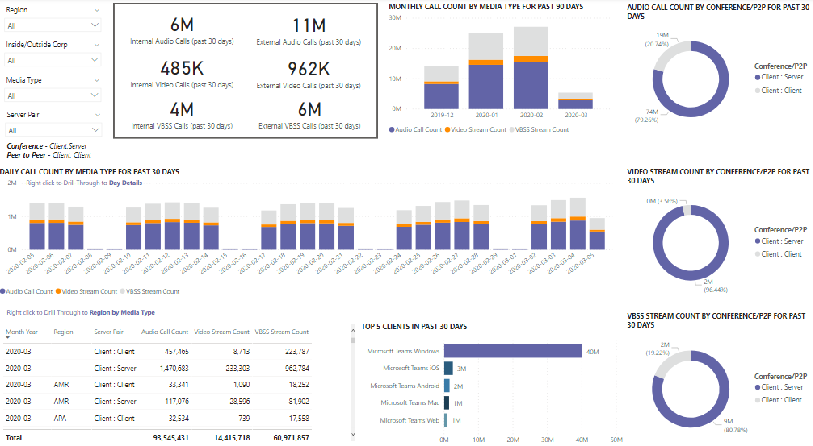

1. To the right of the slicer dropdowns, the number of calls by media type is broken down to an internal/external view over the past thirty days. We can see through the above screenshot that there are more calls happening from outside organizational locations, which makes sense considering the current global environment.
  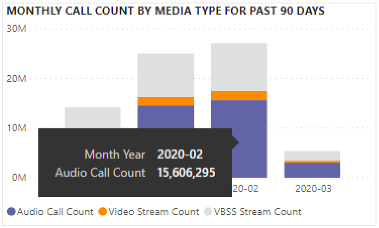

1. To the right of the media type count box, we have the Monthly Call Count by Media Type for the last 90 days. Each column and media type can be hovered over to display the count for a previous month or the current month to date, providing usage trend information.
  

1. The middle graph functions as the 90-day graph does, however it provides a daily usage view for the past 30 days and allows a user to right click and drill down into details for a specific day.
  

On the bottom left section of the page, you'll find a table providing total values for each media type over the past year. 
    
  
The table also has an available drill down where you can see a regional data breakdown.
    

To the right of the table, a bar chart shows clients with the most use (calls/streams) for the past 30 days.
   

The last set of charts for this page show each media type individually, with a breakdown showing conference and P2P usage. The charts below show that there is a significantly higher number of conference usage as compared to P2P.
  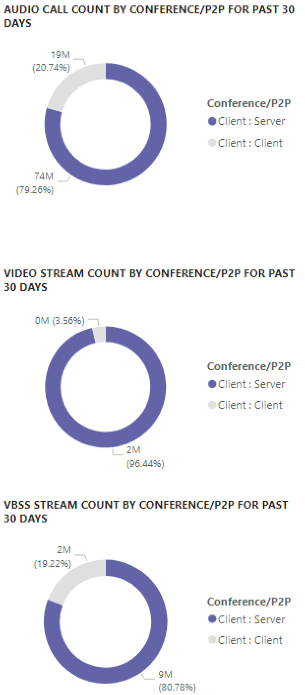

## Audio Minutes Summary Report

On the Audio Minutes usage report, the total minute usage is provided through a few different views. 

We have the thirty-day usage summary shown next to the slicers as easy to consume text boxes. The top number shows the thirty-day total, with internal and external breakdowns below that.

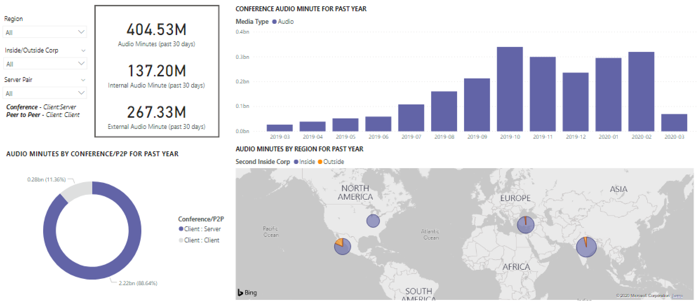

The top right bar graph provides a yearlong view of conference audio usage. Hover over the month to show the conference audio minutes.

To show the difference in P2P and conference audio, the bottom left chart takes all audio for the past year and breaks it up between the two types.

The last chart for the Audio minutes page shows audio minute usage on a global map overlay. This chart will only work if building and subnet data is uploaded to the tenant. The pie chart overlay on the map can be drilled into, subsequently providing regional audio usage.

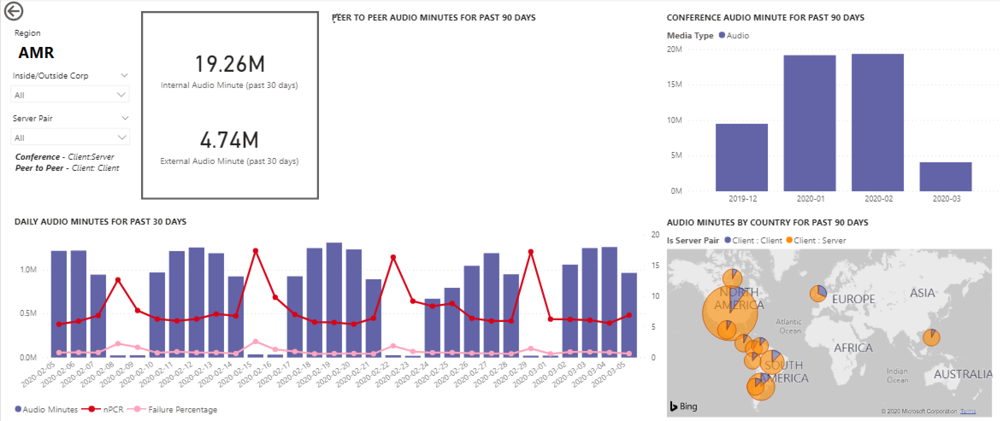

## Drill-through capabilities

As previously noted, users can drill into the daily and regional usage reports.

### Daily Usage

The Daily Usage report allows an administrator to identify peak consumption periods through the course of a day. In addition to usage, we are also able to capture overall user sentiment and feedback for that day.

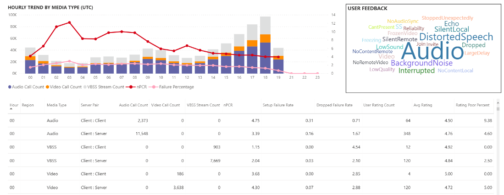

This data can be used to identify regions having problems during peak consumption times.

1.  On the Call Count Summary page, drill-through on a specific date. Look at the hourly trend that day to find the peak utilization.
  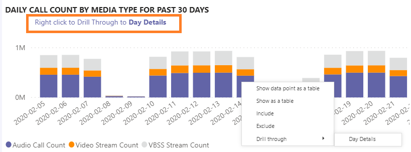

2.  Click on the column for that day to display metrics for that hour.
  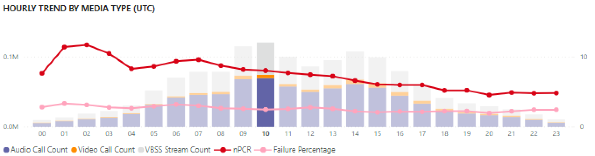
    
    1.  The table below the chart will display the metrics for that hour. This can be sorted by any column header; however, we would be interested in finding problematic areas.  
        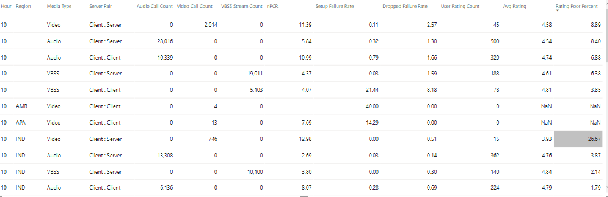
    
    2.  We see that the IND region is experiencing poor video performance in conferences during this time frame. Subsequently, the CQD QER Microsoft reports can be used to narrow down the problematic location as the region and time frame has been identified.

### Regional Audio Details

The Regional Audio Details drill down specifically shows the audio minute usage for the selected region. Users with access to CQD can see usage trends for both P2P and conference audio within the selected region.

1.  On the Call Count Summary page, drill-through to as specific region through the table.
  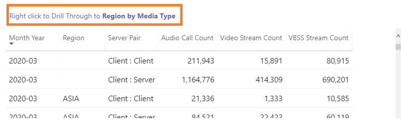

2.  Select the row with the region additional information is needed for.
  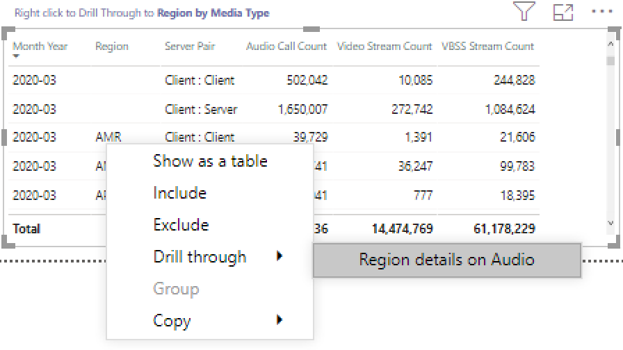

3.  The data trends show a significant number of minutes being used on the internal network, with conferencing far surpassing P2P use.
  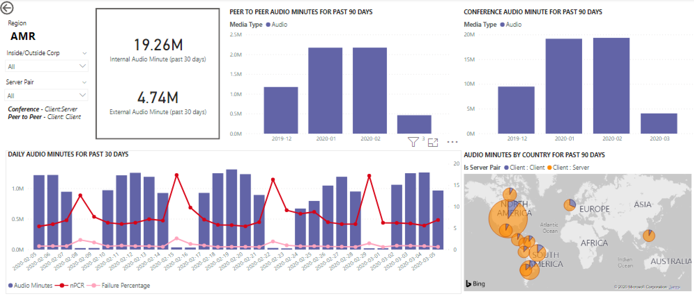

The regional audio trend can be used to show how users are impacted by external influences in the world. Specifically, right now, we would expect to see the external usage for the EMEA and APAC regions to increase with people being asked to work remotely.

## Related topics

[Dimensions and measures available in Call Quality Dashboard](dimensions-and-measures-available-in-call-quality-dashboard.md)

[Stream Classification in Call Quality Dashboard](stream-classification-in-call-quality-dashboard.md)

[Set up Skype for Business Call Analytics](set-up-call-analytics.md)

[Use Call Analytics to troubleshoot poor call quality](use-call-analytics-to-troubleshoot-poor-call-quality.md)

[Call Analytics and Call Quality Dashboard](difference-between-call-analytics-and-call-quality-dashboard.md)
 