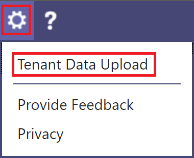
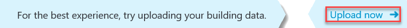
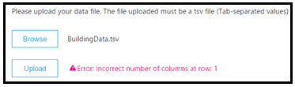
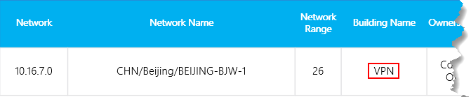

# Upload tenant and building data in Call Quality Dashboard (CQD)

To get the most out of Call Quality Dashboard (CQD), we recommend that you upload your tenant and building data. There are 2 types of tenant data files, [Building](#upload-building-data-file) and [Endpoint](#endpoint-data-file).

You can download a sample tenant data template [here](https://github.com/MicrosoftDocs/OfficeDocs-SkypeForBusiness/blob/live/Teams/downloads/locations-template.zip?raw=true). For help with building mapping, read [Create a building map for CQD](CQD-building-mapping.md).

From the CQD Summary Reports dashboard, select **Tenant Data Upload** from the CQD **Settings** menu (a gear icon at the top of CQD). From here, admins can upload their organization's building and endpoint information, such as mapping of IP addresses and geographical information, mapping each wireless access point and its MAC address, etc.

1. Open CQD (from the Teams admin center, or at [https://cqd.teams.microsoft.com](https://cqd.teams.microsoft.com)), then select the gear icon in the upper-right corner and choose **Tenant Data Upload** from the **Summary Reports** page.

   
    
2. Alternatively, if this is your first time visiting CQD, you'll be asked to upload building data. You can select **Upload Now** to quickly navigate to the **Tenant Data Upload** page.

   

3. On the **Tenant Data Upload** page, select **Browse** to choose a data file.

4. After selecting a data file, specify **Start date** and, optionally, specify an end date.

5. After selecting **Start date**, select **Upload** to upload the file to CQD.   Before the file is uploaded, it's validated. If validation fails, an error message is displayed requesting that you correct the file. The following figure shows an error occurring when the number of columns in the data file is incorrect.

   
 
6. If no errors occur during validation, the file upload will succeed. You can then see the uploaded data file in the **My uploads** table, which shows the full list of all uploaded files for the current tenant at the bottom of that page.

> [!NOTE]
> It can take up to four hours to finish processing the building file.    If you've already uploaded a building file and need to add subnets that might have been missed or excluded, modify the original file by adding the new subnets, remove the current file, and re-upload the newly edited file. There can be only one active building data file in CQD. 

## Upload building data file

The first type of tenant data file in CQD is the **Building** data file. The Subnet column is derived by expanding the Network+NetworkRange column, then joining the Subnet column to the call record’s First Subnet or Second Subnet column to show Building, City, Country, or Region information. The format of the data file you upload must meet the following criteria to pass the validation check before upload:
  
- The file must be either a .tsv file (columns are separated by a TAB) or a .csv file (columns are separated by a comma).

- The data file doesn't include a table header row. The first line of the data file is expected to be real data, not header labels like "Network".

- Data types in the file can only be String, Integer, or Boolean. For the  Integer data type, the value must be a numeric value. Boolean values must be either 0 or 1.

- If a column uses the String data type, a data field can be empty but must still be separated by a tab or comma. An empty data field just assigns an empty String value.

- There is a 1,000,000 expanded row limit per tenant data file.

- There must be 15 columns for each row, each column must have the appropriate data type, and the columns must be in the order listed in the following table (comma or tab delimited):

  **Building data file format**
  
  | Column name        | Data type | Example                   | Guidance              |
  |--------------------|-----------|---------------------------|-----------------------|
  | NetworkIP          | String    | 192.168.1.0               | Required              |
  | NetworkName        | String    | USA/Seattle/SEATTLE-SEA-1 | Required1  |
  | NetworkRange       | Number    | 26                        | Required              |
  | BuildingName       | String    | SEATTLE-SEA-1             | Required1  |
  | OwnershipType      | String    | Contoso                   | Optional              |
  | BuildingType       | String    | IT Termination            | Optional              |
  | BuildingOfficeType | String    | Engineering               | Optional              |
  | City               | String    | Seattle                   | Recommended           |
  | ZipCode            | String    | 98001                     | Recommended           |
  | Country            | String    | US                        | Recommended           |
  | State              | String    | WA                        | Recommended           |
  | Region             | String    | MSUS                      | Recommended           |
  | InsideCorp2         | Bool      | 1             | Required              |
  | ExpressRoute3       | Bool      | 0             | Required              |
  | VPN                | Bool      | 0                         | Optional              |

  1 While not required by CQD, the templates are configured to display Building and Network name.

  2 This setting can be used to reflect whether or not the subnet is inside the corporate network. You can customize usage for other purposes.

  3 This setting can be used to reflect whether or not the network uses Azure ExpressRoute. You can customize usage for other purposes.  

  **Sample row:**

  `192.168.1.0,USA/Seattle/SEATTLE-SEA-1,26,SEATTLE-SEA-1,Contoso,IT Termination,Engineering,Seattle,98001,US,WA,MSUS,1,0,0`

> [!IMPORTANT]
> The network range can be used to represent a supernet (combination of several subnets with a single routing prefix). All new building uploads will be checked for any overlapping ranges. If you have previously uploaded a building file, you should download the current file and re-upload it to identify any overlaps and fix the issue before uploading again. Any overlap in previously uploaded files may result in the wrong mappings of subnets to buildings in the reports. Certain VPN implementations do not accurately report the subnet information. 
>
> The VPN column is optional and will default to 0. If the VPN column’s value is set to 1, the subnet represented by that row will be fully expanded to match all IP addresses within the subnet. Please use this sparingly and only for VPN subnets since fully expanding these subnets will have a negative impact on query times for queries involving building data. If the expansion of the subnet results in the expansion row limit of 1,000,000 being exceeded, the building file will not be accepted.

### Supernetting

You can use supernetting, commonly called Classless Inter-Domain Routing (CIDR,) in place of defining each subnet. A *supernet* is a combination of several subnets that share a single routing prefix. Instead of adding an entry for each subnet, you can use the supernetted address. Supernetting is supported, but we don't recommend using it.

For example, Contoso's marketing building is made up of the subnets below:

-   10.1.0.0/24—first floor
-   10.1.1.0/24—second floor
-   10.1.2.0/24—third floor
-   10.1.3.0/24—fourth floor

Instead of adding an entry for each subnet, you can use the supernetted address—in this example, 10.1.0.0/22.

-   Network = 10.1.0.0
-   Network Range = 22

Here are a few things to consider before you implement supernetting:

-   Supernetting can only be used in a subnet mapping with 8-bit to 28-bit mask.

-   Supernetting takes less time up front, but it comes at the cost of reducing the richness of your data. Let's say there's a quality problem involving subnet 10.1.2.0. If you implemented supernetting, you won't know where in the building the subnet is located or what type of network it is (for example, a lab). If you'd defined all the subnets for a building and uploaded floor location information, you'd be able to see that distinction.

-   It's important to ensure that the supernetted address is correct and isn't catching unwanted subnets.

-   It's quite common to find 192.168.0.0 in data. For many organizations, this indicates that the user is at home. For others, this is the IP address scheme for a satellite office. If your organization does have offices that use this configuration, don't include it in your building file because it's difficult to distinguish between home and internal networks by using [common subnets](quality-of-experience-review-guide.md#common-subnets). 

> [!IMPORTANT]
> The network range can be used to represent a supernet. All new building data file uploads will be checked for any overlapping ranges. If you've previously uploaded a building file, you should download the current file and upload it again to identify any overlaps and fix the issue. Any overlap in previously uploaded files might result in the wrong mappings of subnets to buildings in the reports.

### VPN

The quality of experience (QoE) data that clients send to Microsoft 365 or Office 365—which is where CQD data is sourced from—includes a VPN flag. CQD will see this as the First VPN and Second VPN dimensions. However, this flag relies on VPN vendors' reporting to Windows that the VPN network adapter registered is a Remote Access adapter. Not all VPN vendors properly register Remote Access adapters. Because of this, you might not be able to use the built-in VPN query filters. Use the VPN column discussed above to accurately mark and identify VPN subnets. It is also good practice to label your VPN networks for easy identification in your reports. Below are two examples of how to label your VPN subnets:

- Define a **Network Name** by entering "VPN" in this field for VPN subnets.

  

- Define a **Building Name** by entering "VPN" in this field for VPN subnets.

  

> [!NOTE]
> VPN connections have been known to misidentify the network connection type as wired when the underlying connection is wireless. When looking at quality over VPN connections, you can't assume that the connection type has been accurately identified.

## Endpoint data file

The other type of CQD tenant data file is the **Endpoint** data file. The column values are used in the call record’s First Client Endpoint Name or Second Client Endpoint Name column to show Endpoint Make, Model, or Type information. The format of the data file you upload must meet the following criteria to pass the validation check before upload:

- The file must be either a .tsv file (columns are separated by a TAB) or a .csv file (columns are separated by a comma).

- The content of the data file doesn't include table headers. The first line of the data file is expected to be real data, not a header label like "EndpointName".

- All seven columns use the String data type only. The maximum allowed length is 64 characters.

- Entries are case-sensitive; EndpointName **ABC123** will be treated as unique from EndpointName **abc123**.

- A data field can be empty but must still be separated by a tab or comma. An empty data field just assigns an empty String value.

- EndpointName must be unique, otherwise the upload fails. If there is a duplicate row or two rows that use the same EndpointName the conflict will  cause incorrect joining.

- EndpointLabel1, EndpointLabel2, and EndpointLabel3 are customizable labels. They can be empty Strings or values such as “IT Department designated 2018 Laptop” or “Asset Tag 5678”.

- There must be seven columns for each row and the columns must be in the following order:

  **Field order:**

  EndpointName, EndpointMake, EndpointModel, EndpointType, EndpointLabel1, EndpointLabel2,  EndpointLabel3

  **Sample row:**

  `1409W3534, Fabrikam, Model 123, Laptop, IT designated 2018 Laptop, Asset Tag 5678, Purchase 2018`

## Update a building file

While gathering building and subnet information, administrators will often upload the building file in multiple iterations over time, adding new subnets and their building information as it becomes available. When this occurs, you'll need to re-upload your building file. This process is like the initial upload as described in the previous section, with a few exceptions as noted in the following section.

> [!Important]
> Only one building file can be active at a time. Multiple building files aren't cumulative.

## Add net new subnets

There are times when you'll need to add net new subnets to CQD that weren't originally part of your network topology. To add net new subnets, do the following from the **Tenant Data Upload** page in CQD:

1.  Download the original file, if you don't already have an up-to-date copy.

1.  Remove the current file in CQD.

1.  Edit the original building file and provide an end date that occurs at least one day before the net new subnets were acquired.

1.  Append the net new subnets to the original building file.

1.  Upload the newly modified building file, and set the start date for one day after the previous building file ends.

## Add missing subnets

After you upload building information for managed networks, every managed network should have a building association. However, this won't always be the case; typically, a few subnets are missed. To find these missing networks, review the **Missing Subnet Report** on the **Quality of Experience Reports** page in CQD. This presents all the subnets with 10 or more audio streams that aren't defined in the building data file and are being marked as outside. Ensure that there are no managed networks in this list. If subnets are missing, use the following procedure to update the original building data file and re-upload it to CQD.

1. Go to the **Tenant Data Upload** page in CQD.

1. Download the original file, if you don't already have an up-to-date copy.

1. Remove the current file in CQD.

1. Append the new subnets to the original file.

1. Upload the building file. Be sure to set the start date to at least eight months prior so that CQD will process historical data.

> [!IMPORTANT]
> You'll need to add your tenant ID as a query filter for **Second Tenant ID** to this report to filter the report to view only your organization's tenant data. Otherwise, the report will show federated subnets.

> [!NOTE] 
> Be sure to adjust the Month Year report filter to the current month. Select **Edit**, and adjust the **Month Year** report filter to save the new default month.

## Related topics

[Create a building map for CQD](CQD-building-mapping.md)

[Improve and monitor call quality for Teams](monitor-call-quality-qos.md)

[What is CQD?](CQD-what-is-call-quality-dashboard.md)

[Set up Call Quality Dashboard (CQD)](turning-on-and-using-call-quality-dashboard.md)

[CQD data and reports](CQD-data-and-reports.md)

[Use CQD to manage call and meeting quality](quality-of-experience-review-guide.md)

[Dimensions and measures available in CQD](dimensions-and-measures-available-in-call-quality-dashboard.md)

[Stream Classification in CQD](stream-classification-in-call-quality-dashboard.md)

[Use Power BI to analyze CQD data](CQD-Power-BI-query-templates.md)
