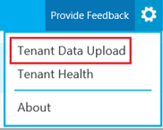

# Upload tenant and building data in Call Quality Dashboard (CQD)

The CQD Summary Reports dashboard includes a **Tenant Data Upload** page, accessed by selecting **Tenant Data Upload** from the settings menu in the top-right corner. This page is used for admins to upload tenant, building, and location information, including:

- A map of IP address and geographical information
- A map of each wireless AP and its MAC address
- A map of Endpoint to Endpoint Make/Model/Type, etc.

Don't miss the [sample locations template](https://github.com/MicrosoftDocs/OfficeDocs-SkypeForBusiness/blob/live/Teams/downloads/locations-template.zip?raw=true).

## Reporting labels

Reporting Labels that you upload to CQD will be handled as *Support Data* under your agreement for Office 365, including any information that would otherwise be considered *Customer Data* or *Personal Data*. Please do not include data you do not wish to provide to Microsoft as *Support Data*, as this information will be visible to Microsoft Engineers for support purposes.

1. On the **Tenant Data Upload** page, use the drop-down menu to choose a data file type to upload. The file data type denotes the content of the file (for example, "Building" refers to mapping of IP address and building and other geographical information, “Endpoint” refers to mapping of Endpoint Name to Endpoint Make/Model/Type information). CQD supports “Building” and “Endpoint” data types.
2. After you select the file data type, click **Browse** to choose a data file.

   - A data file must be a .tsv (tab-separated values) file or a .csv (comma-separated value) file. With a .csv file, any field that contains a comma must be surrounded by quotes or have the comma removed. For example, if your building name is NY,NY,  enter  "NY,NY" in the .csv file.
   - The data file must be no larger than 50 MB.
   - Data files have an expanded row limit of 1,000,000 to keep query performance fast. 
   - For each data file, each column in the file must match a predefined data type, discussed later in this topic.
3. Next, specify a **Start date** and, optionally, **Specify an end date**.
4. Finally, select **Upload** to upload the file to the CQD server.
    Before the file is uploaded, it is first validated. Once validated, it is stored in an Azure blob. If validation fails or the file fails to be stored in an Azure blob, an error message requests a correction to the file. The following image shows a sample error with an incorrect number of columns in the data file.

     
  
5. If no errors occur during validation, the file upload succeeds. You can then see the uploaded data file in the **My uploads** table. The bottom of that page also shows a full list of all files uploaded for the current tenant.
    Each record shows one uploaded tenant data file, with file type, last update time, time period, description, a remove icon, and a download icon. To remove a file, select the trash bin icon in the table. To download a file, select the download icon in the **Download** column of the table. 

     

6. If you choose to use multiple building data files or multiple endpoint data files, some reports generate more slowly.

## Tenant data file format and structure
Before you can start using CQD, activate it for your Microsoft 365 or Office 365 as follows:

### Building data file

CQD uses a Building data file, which helps provide useful call details. The Subnet column is derived by expanding the Network+NetworkRange column, then joining the Subnet column to the call record’s First Subnet or Second Subnet column to show Building, City, Country, or Region information. The format of the data file you upload must meet the following criteria to pass the validation check before upload:
1. Sign in to your Microsoft 365 or Office 365 using Microsoft Teams service admin account, and then select the **Admin** tile to open the Admin center.
2. In the left pane, under **Admin centers**, select **Microsoft Teams** to open the Microsoft Teams admin center.
3. In the Microsoft Teams admin center, select **Call quality dashboard** in the left pane.
4. On the page that opens \(https://cqd.teams.microsoft.com\), click **Sign in** and enter your Global Administrator account or Microsoft Teams Service Admin account information.

You can download a sample template [here](https://github.com/MicrosoftDocs/OfficeDocs-SkypeForBusiness/blob/live/Teams/downloads/locations-template.zip?raw=true)
  
- The file must be either a .tsv file (columns are separated by a TAB) or a .csv file (columns are separated by a comma).
- The data file doesn't include a table header row. The first line of the data file is expected to be real data, not header labels like "Network".
- Data types in the file can only be String, Integer, or Boolean. For the  Integer data type, the value must be a numeric value. Boolean values must be either 0 or 1.
- If a column uses the String data type, a data field can be empty but must still be separated by a tab or comma. An empty data field just assigns an empty String value.
- There must be 14 columns for each row, each column must have the appropriate data type, and the columns must be in the order listed in the following table (comma delimited):

|Column field name|Data type|Example value|
|:--- |:--- |:--- |
|NetworkIP | String | 192.168.1.0 |
|NetworkName    | String|USA/Seattle/SEATTLE-SEA-1|
|NetworkRange|Number|26|
|BuildingName|String|SEATTLE-SEA-1|
|OwnershipType|String|Contoso|
|BuildingType|String|IT Termination|
|BuildingOfficeType|String|Engineering|
|City   |String| Seattle|
|ZipCode|String|98001|
|Country|String|US|
|State |String|WA|
|Region|String|MSUS|
|InsideCorp&dagger;|Boolean|0|
|ExpressRoute&Dagger;|Boolean|0|
|VPN (optional)|Boolean|0|
||||

&dagger; This setting can be used to reflect whether or not the subnet is inside the corporate network. You can customize usage for other purposes if you decide to.

&Dagger; This setting can be used to reflect whether or not the network uses Azure ExpressRoute. You can customize usage for other purposes if you decide to.  

**Sample row:**

`192.168.1.0,USA/Seattle/SEATTLE-SEA-1,26,SEATTLE-SEA-1,Contoso,IT Termination,Engineering,Seattle,98001,US,WA,MSUS,1,0,0`

> [!IMPORTANT]
> The network range can be used to represent a supernet (combination of several subnets with a single routing prefix). All new building uploads will be checked for any overlapping ranges. If you have previously uploaded a building file, you should download the current file and re-upload it to identify any overlaps and fix the issue before uploading again. Any overlap in previously uploaded files may result in the wrong mappings of subnets to buildings in the reports. Certain VPN implementations do not accurately report the subnet information. It is recommended that when adding a VPN subnet to the building file, instead of one entry for the subnet, separate entries are added for each address in the VPN subnet as a separate 32-bit network. Each row can have the same building metadata. For example, instead of one row for 172.16.18.0/24, you should have 256 rows, with one row for each address between 172.16.18.0/32 and 172.16.18.255/32, inclusive.
>
> The VPN column is optional and will default to 0.  If the VPN column’s value is set to 1, the subnet represented by that row will be fully expanded to match all IP addresses within the subnet.  Please use this sparingly and only for VPN subnets since fully expanding these subnets will have a negative impact on query times for queries involving building data.

### Endpoint data file

CQD uses an Endpoint data file. The column values are used in the call record’s First Client Endpoint Name or Second Client Endpoint Name column to show Endpoint Make, Model, or Type information. The format of the data file you upload must meet the following criteria to pass the validation check before upload:

- The file must be either a .tsv file (columns are separated by a TAB) or a .csv file (columns are separated by a comma).
- The content of the data file doesn't include table headers. The first line of the data file is expected to be real data, not a header label like "EndpointName".
- All six columns use the String data type only. The maximum allowed length is 64 characters.
- A data field can be empty but must still be separated by a tab or comma. An empty data field just assigns an empty String value.
- EndpointName must be unique, otherwise the upload fails. If there is a duplicate row or two rows that use the same EndpointName the conflict will  cause incorrect joining.
- EndpointLabel1, EndpointLabel2, and EndpointLabel3 are customizable labels. They can be empty Strings or values such as “IT Department designated 2018 Laptop” or “Asset Tag 5678”.
- There must be six columns for each row and the columns must be in the following order:

  **Field order:**

EndpointName, EndpointModel, EndpointType, EndpointLabel1, EndpointLabel2,  EndpointLabel3

  **Sample row:**

`1409W3534, Fabrikam Model 123, Laptop, IT designated 2018 Laptop, Asset Tag 5678, Purchase 2018,`  

===============
FROM QERGUIDE:
## Building mapping

In a Teams or Skype for Business Online deployment, all clients are external. That has the implication that by default, all clients are reported as outside in CQD, regardless of whether the client was connected on an internal corporate network.

When you work with CQD, you need to know the location of an endpoint and whether it was connected to a network you can manage or a network you can't manage—the assumption being that you can only improve networks you can manage. By uploading subnet and building information to CQD, you enable CQD to determine whether the endpoint was connected to an internal corporate/managed network or to an external/unmanaged network.

### Building data file structure

The format of the data file you upload must meet the following requirements to pass the validation check before uploading.

-   The file must be either a TSV file—which means that for each row, each column is separated by a Tab character—or a CSV file in which each column is separated by a comma.

-   The file can't be larger than 50 MB.

-   The content of the data file *must not include table headers*. In other words, the first line of the data file must be real data, not column headings such as "Network."

-   For each column, the data type can only be String, Number, or Bool. If the data type is Number, the value must be a numeric value; if it's Bool, the value must be either 0 or 1.

-   For each column, if the data type is String, the data can be empty (but still must be separated by an appropriate delimiter—that is, a Tab character or comma). This just assigns that field an empty string value.

-   There must be 14 columns for each row (or 15 if you want to add the optional VPN column). Each column must have the data type described in the following table, and the columns must be in the order listed in the table.

| Column name        | Data type | Example                   | Guidance    |
|--------------------|-----------|---------------------------|-------------|
| Network            | String    | 192.168.1.0               | Required    |
| NetworkName        | String    | USA/Seattle/SEATTLE-SEA-1 | Required\*  |
| NetworkRange       | Number    | 26                        | Required    |
| BuildingName       | String    | SEATTLE-SEA-1             | Required\*  |
| OwnershipType      | String    | Contoso                   | Optional    |
| BuildingType       | String    | IT Termination            | Optional    |
| BuildingOfficeType | String    | Engineering               | Optional    |
| City               | String    | Seattle                   | Recommended |
| ZipCode            | String    | 98001                     | Recommended |
| Country            | String    | US                        | Recommended |
| State              | String    | WA                        | Recommended |
| Region             | String    | MSUS                      | Recommended |
| InsideCorp         | Bool      | 1                         | Required    |
| ExpressRoute       | Bool      | 0                         | Required    |
| VPN                | Bool      | 0                         | Optional    |

\*While not required by CQD, the templates are configured to display Building and Network name.

#### Supernetting

You can use supernetting, commonly called Classless Inter-Domain Routing (CIDR,) in place of defining each subnet. A *supernet* is a combination of several subnets that share a single routing prefix. Instead of adding an entry for each subnet, you can use the supernetted address. Supernetting is supported, but we don't recommend using it.

For example, Contoso's marketing building is made up of the subnets below:

-   10.1.0.0/24—first floor
-   10.1.1.0/24—second floor
-   10.1.2.0/24—third floor
-   10.1.3.0/24—fourth floor

Instead of adding an entry for each subnet, you can use the supernetted address—in this example, 10.1.0.0/22.

-   Network = 10.1.0.0
-   Network Range = 22

Here are a few things to consider before you implement supernetting:

-   Supernetting can only be used in a subnet mapping with 8-bit to 28-bit mask.

-   Supernetting takes less time up front, but it comes at the cost of reducing the richness of your data. Let's say there's a quality problem involving subnet 200.1.2.0. If you implemented supernetting, you won't know where in the building the subnet is located or what type of network it is (for example, a lab). If you'd defined all the subnets for a building and uploaded floor location information, you'd be able to see that distinction.

-   It's important to ensure that the supernetted address is correct and isn't catching unwanted subnets.

-   It's quite common to find 192.168.0.0 in data. For many organizations, this indicates that the user is at home. For others, this is the IP address scheme for a satellite office. If your organization does have offices that use this configuration, don't include it in your building file because it's difficult to distinguish between home and internal networks by using common subnets. See the section about [common subnets](#common-subnets), earlier in this article.

> [!IMPORTANT]
> The network range can be used to represent a supernet. All new building data file uploads will be checked for any overlapping ranges. If you've previously uploaded a building file, you should download the current file and upload it again to identify any overlaps and fix the issue. Any overlap in previously uploaded files might result in the wrong mappings of subnets to buildings in the reports.

#### VPN

The quality of experience (QoE) data that clients send to Microsoft 365 or Office 365—which is where CQD data is sourced from—includes a VPN flag. CQD will see this as the First VPN and Second VPN dimensions. However, this flag relies on VPN vendors' reporting to Windows that the VPN network adapter registered is a Remote Access adapter. Not all VPN vendors properly register Remote Access adapters. Because of this, you might not be able to use the built-in VPN query filters. There are two approaches to accommodating VPN subnets in the building information file:

- Define a **Network Name** by using the text "VPN" in this field for VPN subnets.

  

- Define a **Building Name** by using the text "VPN" in this field for VPN subnets.

  

> [!IMPORTANT]
> Certain VPN implementations don't accurately report subnet information. If this occurs in your reporting, we recommend that when you add a VPN subnet to the building file, instead of one entry for the subnet, add separate entries for each address in the VPN subnet as a separate 32-bit network. Each row can have the same building metadata. For example, instead of one row for 172.16.18.0/24, you have 253 rows, with one row for each address from 172.16.18.1/32 through 172.16.18.254/32, inclusive.

> [!NOTE]
> VPN connections have been known to misidentify the network connection as wired when the underlying internet connection is wireless. When looking at quality over VPN connections, you can't assume that the connection type has been accurately identified.

### Uploading building information

The CQD Summary Reports dashboard includes a **Tenant Data Upload** page, accessed by selecting the **Tenant Data Upload** link tag in the upper-right corner (look for the gear icon). This page is used for admins to upload their own information, such as mapping of IP address and geographical information, mapping each wireless access point and its MAC address, and so on.

1. In CQD, select the gear icon in the upper-right corner, and choose **Tenant Data Upload** from the **Summary Reports** page.

   

2. Alternatively, if this is your first time visiting CQD, you'll be asked to upload building data. You can select **Upload Now** to quickly navigate to the **Tenant Data Upload** page.

   

3. On the **Tenant Data Upload** page, select **Browse** to choose a data file.

4. After selecting a data file, specify **Start date** and, optionally, specify an end date.

5. After selecting **Start date**, select **Upload** to upload the file to CQD.   Before the file is uploaded, it's validated. If validation fails, an error message is displayed requesting that you correct the file. The following figure shows an error occurring when the number of columns in the data file is incorrect.

   
 
6. If no errors occur during validation, the file upload will succeed. You can then see the uploaded data file in the **My uploads** table, which shows the full list of all uploaded files for the current tenant at the bottom of that page.

> [!NOTE]
> It can take up to four hours to finish processing the building file.    If you've already uploaded a building file and need to add subnets that might have been missed or excluded, modify the original file by adding the new subnets, remove the current file, and re-upload the newly edited file. There can be only one active building data file in CQD. 

### Updating a building file

While gathering building and subnet information, administrators will often upload the building file in multiple iterations over time, adding new subnets and their building information as it becomes available. When this occurs, you'll need to re-upload your building file. This process is like the initial upload as described in the previous section, with a few exceptions as noted in the following section.

> [!Important]
> Only one building file can be active at a time. Multiple building files aren't cumulative.

#### Adding net new subnets

There are times when you'll need to add net new subnets to CQD that weren't originally part of your network topology. To add net new subnets, do the following in the CQD Tenant Data Upload portal:

1.  Edit the original building file and provide an end date that occurs at least one day before the net new subnets were acquired.
2.  Download the original file, if you don't already have an up-to-date copy.
3.  Append the net new subnets to the original building file.
4.  Upload the newly modified building file following the same process as above, and set the start date for one day after the previous building file ends.

#### Updating the current building file

If a building file is already uploaded but you need to add missing subnets, do the following in the CQD Tenant Data Upload portal:

1.  Download the original file, if you don't already have an up-to-date copy.
2.  Remove the current file in CQD.
3.  Append the new subnets to the original file.
4.  Upload the building file. Be sure to set the start date to at least eight months prior so that CQD will process historical data.

### Missing subnets

After you upload building information for managed networks, every managed network should have a building association. However, this won't always be the case; typically, a few subnets are missed. This section covers how to validate those missing networks.

Browse to the **Detailed Reports** page in CQD and navigate to the **Missing Subnet Report** included in the CQD templates. This presents all the subnets with 10 or more audio streams that aren't defined in the building data file and are being marked as outside. Ensure that there are no managed networks in this list. If subnets are missing, update the original building data file and re-upload it to CQD.

> [!IMPORTANT]
> You'll need to add your tenant ID as a query filter for **Second Tenant ID** to this report to filter the report to view only your organization's tenant data. Otherwise, the report will show federated subnets.

> [!NOTE] 
> Be sure to adjust the Month Year report filter to the current month. Select **Edit**, and adjust the **Month Year** report filter to save the new default month.

### Building mapping tools

Let's face it, mapping out subnets in your organization can be difficult. Large global networks are very complex, with different teams managing their respective regions, and there might be no single source of truth for the network topology. There are two tools available to assist with starting the building mapping exercise, described in the following sections.

============END FROM QERGUIDE==============

## Related topics
[Improve and monitor call quality for Teams](monitor-call-quality-qos.md)

[What is CQD?](CQD-what-is-call-quality-dashboard.md)

[Set up Call Quality Dashboard (CQD)](turning-on-and-using-call-quality-dashboard.md)

[CQD data and reports](CQD-data-and-reports.md)

[Use CQD to manage call and meeting quality](quality-of-experience-review-guide.md)

[Dimensions and measures available in CQD](dimensions-and-measures-available-in-call-quality-dashboard.md)

[Stream Classification in CQD](stream-classification-in-call-quality-dashboard.md)

[Use Power BI to analyze CQD data](CQD-Power-BI-query-templates.md)
