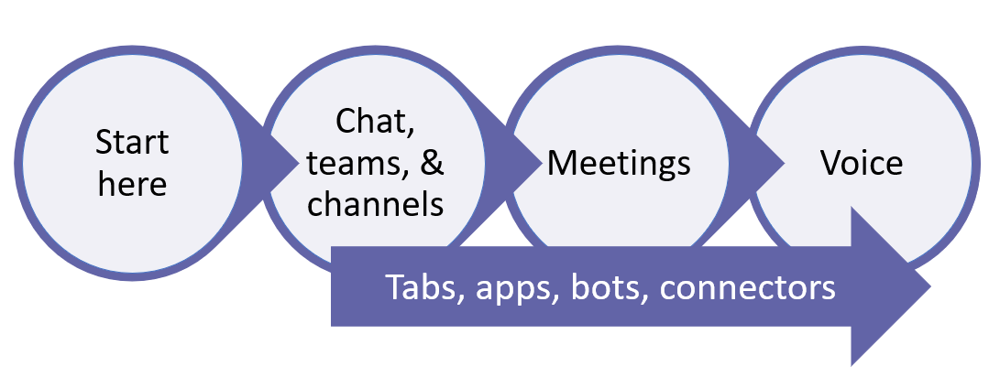

# How to roll out Microsoft Teams

## Start here
Whether you're a small business or a multi-national enterprise, the place to start for rolling out Teams is [Get started](get-started-with-teams-quick-start.md). It walks you through a small-scale Teams rollout, which may be all you need if you're a small business. If you're a larger organization, use [Get started](get-started-with-teams-quick-start.md) to pilot Teams with a small group of early adopters so you can learn about Teams and start planning your org-wide deployment. 

## Recommended path to Teams

We recommend rolling out Teams in stages, workload by workload, as your organization is ready. **You don’t have to wait until you've completed one step before you move to the next.** Some orgs may want to roll out all Teams features at once, while others may prefer a phased approach. Here are the Teams workloads, in the order we recommend rolling them out:

- [Get started](get-started-with-teams-quick-start.md)
- [Chat, teams, channels, & apps](deploy-chat-teams-channels-microsoft-teams-landing-page.md)
- [Meetings & conferencing](deploy-meetings-microsoft-teams-landing-page.md)
- [Cloud voice](cloud-voice-landing-page.md)

[Adoption hub](adopt-microsoft-teams-landing-page.md): Throughout your Teams rollout, be sure to take advantage of these resources to help drive Teams adoption.

## If you're starting from Skype for Business, on-premises, or hybrid deployments

If you're coming to Teams from Skype for Business (online or on premises), or if you need a hybrid configuration, you still want to follow the [recommended path](#recommended-path-to-teams) above for rolling out Teams, but first you need to do some extra planning. Start by reviewing the guidance in the table below that applies to your organization's profile.

|  |Your organization's profile|Guidance  |
|---------|---------|---------|
||I'm currently using Skype for Business Online, and I'm ready to move to Teams. |Go to [Upgrade to Teams](upgrade-start-here.md).        |
||My organization is running Skype for Business Server, and I want to roll out Teams. |For a full-scale Teams rollout, first you need to configure hybrid connectivity between your on-premises environment and Microsoft 365. Start by reading [Plan hybrid connectivity between Skype for Business Server and Office 365](https://docs.microsoft.com/skypeforbusiness/hybrid/plan-hybrid-connectivity).   You should also review [Upgrade to Teams](upgrade-start-here.md).    |
||I don't have Skype for Business Server, but I do have an on-premises PSTN solution. I want to roll out Teams, but I want to keep my on-premises PSTN solution. |Roll out Teams following  the [recommended path](#recommended-path-to-teams) above.  Then read [Plan Direct Routing](direct-routing-plan.md) to learn about using Phone System Direct Routing to hook up your on-premises PSTN solution with Teams.|
|

