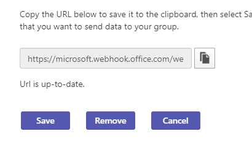

# Manage Microsoft 365 and custom connectors

To keep your team updated, the connectors deliver frequently used content and service updates directly into a Teams channel. With connectors, your Teams users can receive updates from popular services such as Trello, Wunderlist, GitHub, and Azure DevOps Services. The updates are posted directly into the chat stream in their team.

Microsoft 365 connectors are used with both Microsoft Teams and Microsoft 365 groups, making it easier for all members to stay in sync and receive relevant information quickly. Both Microsoft Teams and Exchange use the same connector model, which allows you to use the same connectors within both platforms. However, if you disable any connectors configured for a Microsoft 365 group, it also disables the ability for the Microsoft 365 group to create connectors.

Any member of a team can connect their team to popular cloud services with the connectors if the team permissions allow, and all team members are notified of activities from that service. Connectors continue to function after the member who has initially setup the connector has left. Any team member with the permissions to add or remove can modify connectors setup by other members.

## Enable or disable connectors in Teams

The Exchange Online PowerShell V2 module uses modern authentication and works with multi-factor authentication, called MFA for connecting to all Exchange related PowerShell environments in Microsoft 365. Admins can use Exchange Online PowerShell to disable connectors for an entire tenant or a specific group mailbox, affecting all users in that tenant or mailbox. It isn't possible to disable for few specific users. Also, connectors are disabled by default for Government Community Cloud, called GCC tenants.

The tenant setting overrides the group setting. For example, if an admin enables connectors for the group and disables them on the tenant, connectors for the group is disabled. To enable a connector in Teams, [connect to Exchange Online PowerShell](/powershell/exchange/connect-to-exchange-online-powershell?view=exchange-ps#connect-to-exchange-online-powershell-using-modern-authentication-with-or-without-mfa&preserve-view=true) using modern authentication with or without MFA.

### Commands to enable or disable connectors

Execute the following commands in Exchange Online PowerShell:

* To disable connectors for the tenant: `Set-OrganizationConfig -ConnectorsEnabled:$false`.
* To disable actionable messages for the tenant: `Set-OrganizationConfig -ConnectorsActionableMessagesEnabled:$false`.
* To enable connectors for Teams, execute the following commands:
  * `Set-OrganizationConfig -ConnectorsEnabled:$true`
  * `Set-OrganizationConfig -ConnectorsEnabledForTeams:$true`
  * `Set-OrganizationConfig -ConnectorsActionableMessagesEnabled:$true`

For more information on PowerShell module exchange, see [Set-OrganizationConfig](/powershell/module/exchange/Set-OrganizationConfig?view=exchange-ps&preserve-view=true). To enable or disable Outlook connectors, [connect apps to your groups in Outlook](https://support.microsoft.com/topic/connect-apps-to-your-groups-in-outlook-ed0ce547-038f-4902-b9b3-9e518ae6fbab).

<!---TBD: Delete this section after customer migration to new Webhook URL is complete --->

#### Connector URL update notification

The Teams connectors are transitioning to a new URL to enhance security. During transition, you'll receive a notification to update the configured connector. Update your connector at the earliest to prevent any disruption to connector services. To update your connector:

1. In the connectors configuration page, check for **Attention Required** message next to the configured connector.

   

1. To recreate the connection for incoming webhook connectors, select **Update URL** and use the generated webhook URL.

   

1. For other connector types, remove the connector and recreate the connector configuration. A **URL is up-to-date** message appears.

   

## See also

* [custom connectors and webhooks Overview](/microsoftteams/platform/webhooks-and-connectors/what-are-webhooks-and-connectors)
* [Create Office 365 connectors](/microsoftteams/platform/webhooks-and-connectors/how-to/connectors-creating)