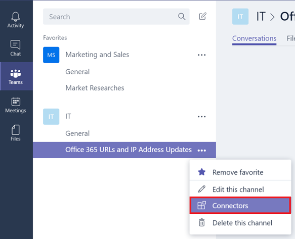
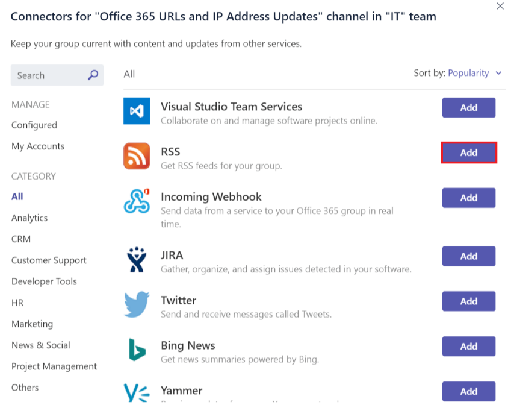
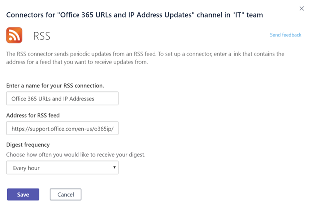
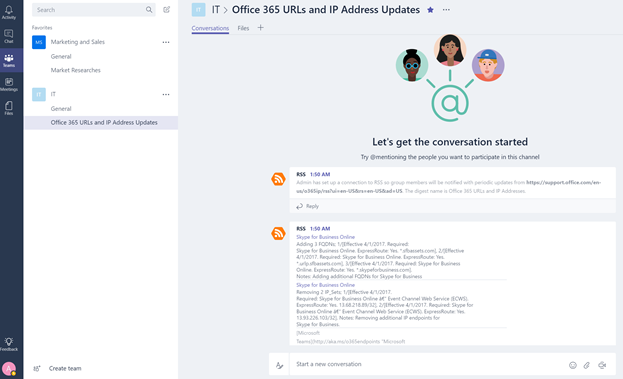
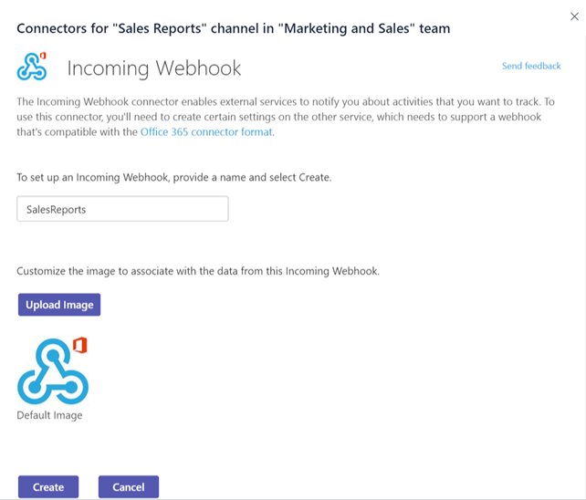
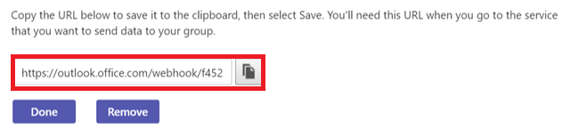
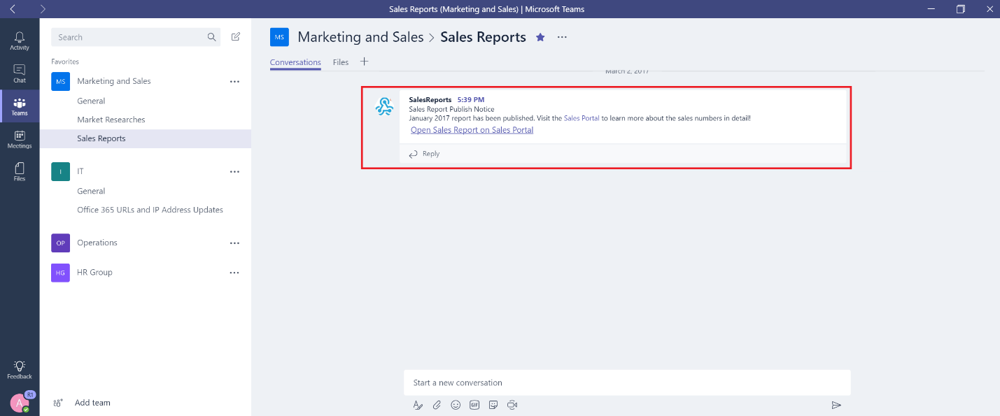

Use Office 365 and custom connectors in Microsoft Teams
=======================================================

Connectors keep your team current by delivering frequently used content and service updates directly into a channel. With connectors, your Microsoft Teams users can receive updates from popular services such as Twitter, Trello, Wunderlist, GitHub, and Azure DevOps Services within the chat stream in their team.

Any member of a team can connect their team to popular cloud services with the connectors if the team permissions allow, and all team members are notified of activities from that service. Connectors will continue to function even after the member who has initially setup the connector has left. Any team member with the permissions to add\remove can modify connectors setup by other members.

Office 365 connectors can be used with both Microsoft Teams and Office 365 groups, making it easier for all members stay in sync and receive relevant information quickly. Both Microsoft Teams and Exchange use the same connector model, which allows you to use the same connectors within both platforms. It is worth noting, however, that disabling connectors for the Office 365 Group that a team is dependent upon will disable the ability to create connectors for that team as well.

Add a connector to a channel
----------------------------

Currently, you can add connectors by using Microsoft Teams desktop and web clients. However, information posted by these connectors can be viewed in **all clients** including mobile.

1. To add a connector to a channel, click the **ellipses (…),** on the right of a channel name, then click **Connectors**.

    

2. Users can select from a variety of available connectors, then click **Add**.

    

3. Fill in the required information of the selected connector and click **Save**. Each connector requires a diverse set of information to function properly, and some may require you to sign in to the service using the links provided on the connector configuration page.

    

4. Data provided by the connector is automatically posted to the channel.

    

Develop custom connectors
-----------------------------

It is very easy to develop custom connectors that can integrate with your line-of-business (LOB) applications. You can use the built-in **Incoming Webhook** connector to create an endpoint for a channel that pulls data from any application using HTTP post methods.

1. Add the **Incoming Webhook** like any other connector.

    

2. To create a Webhook, specify a **name**, update the Webhook image, if necessary, and click **Create**.

    

3. Applications that push data to this channel require the Webhook connector URL. A unique URL is created when you create the Webhook. Share this URL with your developers so that they can configure their applications to push data, as needed.

    

4. When an external application pushes data to a connector, the message is shown in the channel conversation list as a special message called a **Connector Card** message.

    

     Developers can configure their applications to create these cards by sending an HTTP request with a simple JSON payload to a team’s Webhook address, which is a unique URL of that endpoint provided by the wizard. Have your developers refer to [Getting started with Office 365 Connectors for Microsoft Teams](https://docs.microsoft.com/en-us/microsoftteams/platform/concepts/connectors/connectors), on the Microsoft Developer Network, which has detailed instructions and connector samples. Other resources include [Connect apps to your groups in Outlook](https://support.office.com/article/Connect-apps-to-your-groups-in-Outlook-ed0ce547-038f-4902-b9b3-9e518ae6fbab) and the [Office Dev Center – Microsoft Teams](https://go.microsoft.com/fwlink/?linkid=855784).
