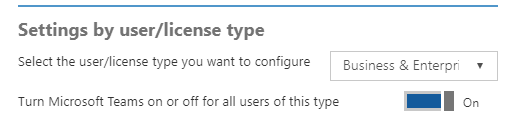

Office 365 licensing for Microsoft Teams
========================================

The following Office 365 subscriptions enable users for Teams:

|Small Business Plans  |Enterprise Plans  |Education Plans  |
|---------|---------|---------|
|Office 365 Business Essentials     |Office 365 Enterprise E1         |Office 365 Education         |
|Office 365 Business Premium     |Office 365 Enterprise E3         |Office 365 Education Plus         |
|     |Office 365 Enterprise E4 (retired)         |Office 365 Education E3 (retired)         |
|     |Office 365 Enterprise E5         |Office 365 Education E5   
      |Office 365 Enterprise F1 |  |

> [!NOTE]
> Teams is also available for non-profit organizations. Government licensing is not currently supported but is being investigated for future support.
        

In terms of Teams **core** functionalities, there are no differences between the different Office 365 subscriptions, the availability of the compliance capabilities does rely on the correct subscription level. (See [Information Protection Licensing](https://support.office.com/en-us/article/Plan-for-Office-365-security-and-information-protection-capabilities-3d4ac4a1-3920-4ff9-918f-011f3ce60408) for more information.)

All supported subscription plans are eligible for access to the Teams web client, desktop clients, and mobile apps.

Teams is not available as a standalone service.

Teams license
-------------

By default, the Teams license is enabled for all users with eligible Office 365 subscriptions.

Teams can be turned on or off for an entire license type within an organization and is turned on by default for all licenses types except guest users. **You can't turn on Teams for only part of a license type by using the Teams switch in the Office 365 Admin center.** If you want to turn on Teams for some of your organization and turn it off for others (for example, if you're planning a Teams pilot with a select set of users), turn on the Teams license switch for everyone, then turn it off for individual users.

**Tip:**   Enabling and disabling Teams as a workload license through PowerShell is done just as any other workload. The service plan name is TEAMS1 for Microsoft Teams. (See [Disable access to services with Office 365 PowerShell](https://technet.microsoft.com/en-us/library/dn771769.aspx) for more information.)

**Sample:** Below is just a quick sample on how you would disable Microsoft Teams for everyone in a particular license type. You'll need to do this first, then individually enable it for the users who should have access for piloting purposes.

*To display the subscription types you have within your organization, use the following command:*

      Get-MsolAccountSku

*Fill in the name of your plan that includes your organization name and the plan for your school (such as ContosoSchool:ENTERPRISEPACK_STUDENT), and then run the following commands:*

      $acctSKU="<plan name>
      $x = New-MsolLicenseOptions -AccountSkuId $acctSKU -DisabledPlans "TEAMS1"
*To disable Microsoft Teams for all users with an active license for your named plan, run the following command:*

      Get-MsolUser | Where-Object {$_.licenses[0].AccountSku.SkuPartNumber -eq  ($acctSKU).Substring($acctSKU.IndexOf(":")+1,  $acctSKU.Length-$acctSKU.IndexOf(":")-1) -and $_.IsLicensed -eq $True} |  Set-MsolUserLicense -LicenseOptions $x