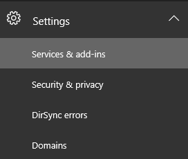
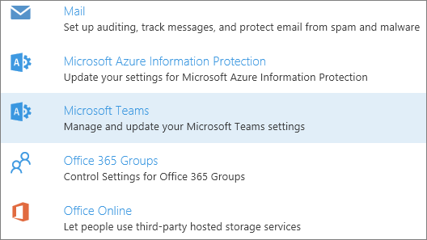
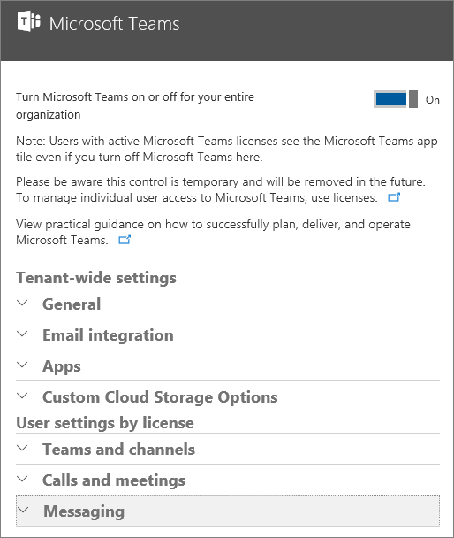

Set up Microsoft Teams in your Office 365 organization
======================================================

By default, Teams is turned on for all organizations. If you used Teams during the preview period, the setting stays the same as what you set during your Teams preview.

As an administrator for your organization, you can assign user licenses to control individual access to Teams, and you can allow or block what content sources can be used in Teams. See [Administrator settings for Microsoft Teams](https://support.office.com/article/3966a3f5-7e0f-4ea9-a402-41888f455ba2) for more information.

To learn more about managing individual licenses, read [Office 365 licensing for Microsoft Teams](Office-365-licensing.md).

## Turn Teams on or off for your entire organization

1.  Sign in to the [Office 365 Admin center](https://go.microsoft.com/fwlink/?linkid=854614) with an account that has Global Administrator privileges.

2.  Go to **Settings** > **Services & add-ins**.

    

3.  On the Services & add-ins page, click **Microsoft Teams**.

    

4.  To turn on Teams for the organization, set the toggle to **On** and then click **Save**.

    

> [!NOTE]
> Tenant-level control of the on/off status for Teams is temporary and will be removed at some point in the future. At that time, access to Teams will be controlled via user-level licensing only. 