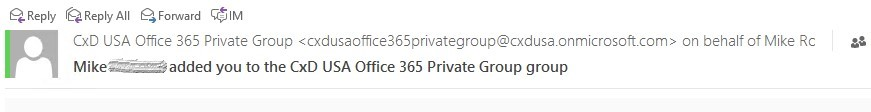
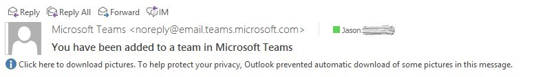
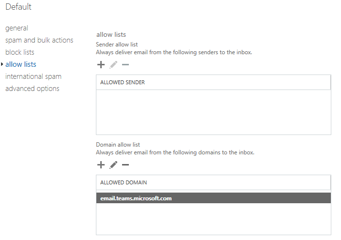

Add the Microsoft Teams SMTP domain as an allowed sender domain in Exchange Online 
=============================================================================

Whether you create an Office 365 Group in the admin console or by using Outlook, Exchange Online is used to send notifications of a team member being added to a Group. These messages are generated from your tenant as they represent your default domain SMTP FQDN.

Teams uses Microsoft Exchange Online as well to send notifications to team members when they’ve been added. The difference being the domain FQDN of the SMTP message is “@email.teams.microsoft.com” for Commercial/Business tenants and "@GCC-email.teams.com" for Government tenants and could be caught by spam filtering.

For best result and seamless operation, consider adding the Microsoft Teams SMTP domain to your “allowed sender domains” list in your Exchange Online spam configuration:

