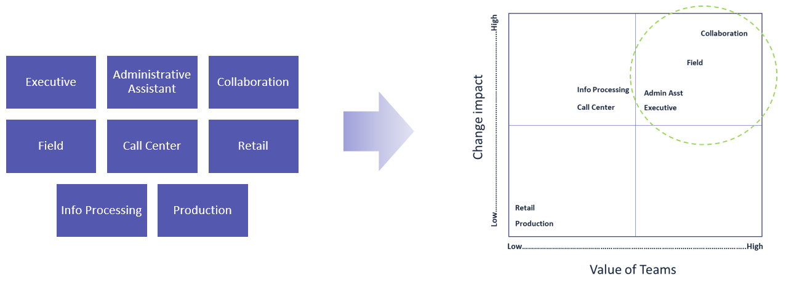
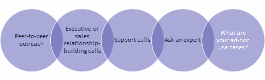

Select users for your Teams pilot 
==================================

A successful pilot validates how Microsoft Teams will be used on a daily basis
by your users. This helps you understand who your users are, how they
communicate and collaborate, and which features will help optimize their
productivity.

The pilot should include key people in various departments who represent a
variety of roles. At the same time, it should include a reasonable number of
users so that project management resources can handle the amount of feedback the
pilot will generate.

There are three core attributes of optimal pilot user selection:

-   **Personas (the “who”):** The categorization of users who benefit from the
    collaboration scenarios that Teams supports. By using a persona assessment,
    you can enlist a good cross-section of the different roles in your
    organization to represent users in your pilot deployment.

-   **Use cases and scenarios (the “how”):** Using features during day-to-day
    activities. You can use relevant scenarios to build your pilot test plans.

-   **Functionality (the “what”):** Individual features in Teams. You can assess
    the Teams roadmap to define your pilot phases based on the availability of
    features that are already included in Teams or will be introduced later.

Perform user persona assessment
-------------------------------

The user persona assessment, built on eight core personas commonly found in
organizations, helps you categorize your users based on their communication and
collaboration requirements. This helps you narrow down the list of users you’ll
select for the pilot as you plan for your broad rollout of Teams over time.

| **Persona**             | **Profile**                                                 | **Communication functionality requirements**          | **Devices**         |
|---|---|---|---|
| **Collaboration**   | <ul><li>Might work with both internal and external customers <li>Might work remotely or onsite<li>Balances time between meetings and productive work<li>Uses Office (PowerPoint, Word, and so on) and third-party apps</ul>                         | <ul><li>Contact management (internal and external)<li>From IM to phone call to screen sharing to conference call<li>Scheduled meetings with app share, OneNote<li>Audio calling and conferencing</ul>        | <ul><li>Headset, “puck” speakerphone for home office workers, desktop client, mobile client</ul> |
| **Field**           | <ul><li>Travels frequently—heavy reliance on email and phone<li>Requires reliable technology across devices<li>Will find a technology that works for them<li>Needs easy access to sales and marketing materials</ul>                         | <ul><li>Contact management (internal and external)<li>From IM to phone call to screen sharing to conference call<li>Scheduled meetings with app share, OneNote<li>Audio calling and conferencing</ul>        | <ul><li>Headset, desktop client, mobile client</ul>                                              |
| **Executive**       | <ul><li>Serves as the voice and brand of the organization, internally and externally<li>Focuses on relationships<li>Has fast-paced, dynamic schedules<li>Uses mobile devices to stay connected<li>Relies on delegates as their “eyes and ears”<li>Spends the majority of their days in meetings or on phone calls</ul> | <ul><li>Delegate synchronization<li>Contact management (internal and external)<li>Audio calling (PC and PSTN)<li>Video calling<li>Multiple device support<li>Application sharing<li>Broad-scale communication tool</ul>                          | <ul><li>Desk phone, “puck” speakerphone, webcam, desktop client, mobile client</ul>              |
| **Admin Assistant** | <ul><li>Manages the executive’s schedule (and life)<li>Fills a dynamic, multi-faceted role (gatekeeper to the rest of the organization, office management, meeting coordination, and so on)<li>Requires back-up while away<li>Shares information across the executive support team</ul>                                  | <ul><li>Delegate scheduling, calendar and call management<li>Contact management (internal and external)<li>Call functions: team call group, simultaneous ring<li>Meeting scheduling (from one-on-one to all-hands)<li>Core meeting functions (upload, app share, OneNote, recording, attendance reporting)<li>Streamlined access to data and documents</ul> | <ul><li>Desk phone, wireless headset, desktop client</ul>                                      |
| **Call Center**     | <ul><li>Fills a customer-facing role (internal and external)<li>Might be contract workers with high turnover<li>Process and transactional based<li>Uses third-party tools for completing orders, time tracking</ul>                         | <ul><li>Meeting attendee<li>IM with escalate to call and share<li>Audio calling<li>Auto attendant<li>Streamlined access to data and documents<li>Third-party app integration</ul>                                  | <ul><li>Headset, desktop client</ul>                                                             |
| **Info Processing** | <ul><li>Completes tasks and processes orders<li>Needs consistency and flow for this high-turnover job<li>Task or transaction based (for example order processing, purchasing)<li>Uses third-party tools for completing orders, time tracking</ul>                                         | <ul><li>Meeting attendee<li>IM that can be escalated to phone call and screen sharing<li>Audio calling<li>Auto attendant<li>Streamlined access to data and documents<li>Third-party app integration</ul>                                  | <ul><li>Headset, desktop client</ul>                                                             |
| **Retail**          | <ul><li>Fills an in-person, on-premises, customer-facing role<li>Might work as a contract or part-time employee<li>Uses third-party tools for time tracking<li>Has little or no access to a PC</ul>                        | <ul><li>Meeting attendee<li>Streamlined access to data and documents<li>Third-party app integration</ul>                                  | <ul><li>Shared PC/desktop client</ul>                                                            |
| **Production**      | <ul><li>Produces and packages company products for distribution<li>Shares workspaces and computers<li>Communicates on the factory floor, in person<li>Uses third-party tools for time tracking</ul>                      | <ul><li>Meeting attendee<li>Mobile device support<li>Streamlined access to data and documents<li>Third-party app integration</ul>                                  | <ul><li>Shared PC or desktop client</ul>                                                         |

Map use cases to your personas
------------------------------

When it comes to communication and collaboration, there are four common types of
interactions: conversations, meetings, team and project collaboration, and
at-scale communications. During this assessment, you need to define how your
organization maps to each one, as it relates to your journey from Skype for
Business to Teams.

Sample scenarios for each interaction type are provided below. Use these samples
as a starting point, and map your organization’s use cases to these scenarios
for your journey to Teams.

### Scenario 01 – Conversations (ad hoc)
**Scenario theme:** Accelerate communications to maintain project momentum and
build rapport.

**Sample use cases:**

**Common characteristics:**
-   One on one, or few participants
-   Ad-hoc, as needed
-   Brief and interactive
-   Chat-driven or phone call–driven

### Scenario 02—Meetings
**Scenario theme:** Facilitate discussions and dissemination of information
through interactive conversation and brainstorming.

**Sample use cases:**

**Common characteristics:**
-   Point-in-time meetings with defined agendas
-   Synchronous communication
-   Defined audience, can be internal and external
-   Scheduled in advance
-   Real-time content sharing
-   Multiple presenters or contributors

### Scenario 03 – Collaboration
**Scenario theme:** Expedite information-sharing and simplify information
accessibility to drive team activity and productivity.

**Sample use cases:**

**Common characteristics:**
-   Project-related or team-related efforts
-   Defined audiences, local and remote (worldwide) vTeams
-   Add new team members over time, need to quickly onboard
-   Persistent access to files, conversation, and apps
-   Synchronous or asynchronous communication (chats, meetings)

### Scenario 04 – At-scale communications
**Scenario theme:** Broadcast a message in a structured and professional manner
to a large group of participants.

**Sample use cases:**

**Common characteristics:**
-   Defined or open audience
-   Structured format
-   Scheduled in advance
-   One-way dissemination of information
-   Managed participants (Q&A, audio)

>[!Note]
>You can find more than two-hundred use cases and scenarios, with detailed explanations and videos to help you identify how Office 365 solutions can help you achieve  your business goals, in the [Office 365 Productivity Library](http://aka.ms/productivitylibrary).

|         |         |         |
|---------|---------|---------|
| | Decision Points|<ul><li>Define 5–10 use cases to serve as a guideline for your pilot users.</li></ul>|
| | Next Steps|<ul><li>Map use cases to your personas.<li>Identify and note your pilot users.</ul>|

> [!Important]
> Review the [Teams roadmap](https://aka.ms/skype2teamsroadmap) when you define your pilot phases and users. Ensure that your users don’t depend on any feature that hasn’t been released yet.

Create a test plan
------------------

After you’ve defined and documented your personas and use cases, the next step is validating that your organization’s expectations and requirements are met through feature, functionality, and usability. You should perform this validation step before you complete the final deployment in your production environment.

A sample test plan for the pilot rollout is provided below. Use the scenarios and personas described earlier in this article to customize this plan and make it relevant for your pilot users. We recommend that you include the scenario in your email communication so that the pilot tester can apply a real-world use case to their testing, versus just running through a series of features.

| **Conversations**                   | **Meetings**                   |
|-------------------------------------|--------------------------------|
| <ul><li>Find a contact:<ul><li>Internal.<li>External - federated.</ul><li>Start a chat:<ul><li>With a Teams user.<li>With a Skype for Business user.</ul><li>Add a participant to an IM.<li>Add audio.<li>Add sharing.<li>Share a file.<li>Review a chat (history).<li>Resume a prior chat.<li>Respond to an incoming IM.<li>Send an IM on a mobile device.<li>Respond to an IM on a mobile device. | <ul><li>Schedule a meeting in Outlook.<li>Schedule a meeting in Teams: <ul><li>Invite internal users.<li>Invite external users.<li>Add audio conferencing.</ul><li>Join from a PC or mobile device.<li>Share your desktop.<li>Share an application.<li>Give control during a shared session.<li>Take control back during a shared session.<li>Mute a participant.<li>Turn on webcam video.<li>Switch devices.<li>Enable a meeting lobby.|
| **Calling**                         | **Collaboration**              |
| <ul><li>Make, receive, and transfer a call:<ul><li>To another Teams user<li>To a Skype for Business user</ul><li>Check voicemail.<li>Forward your phone to another number.<li>Enable simultaneous ring.<li>Transfer a call to another user.<li>Put a call on hold.<li>Speed-dial a contact. | <ul><li>Create a team.<li>Add a channel.<li>Add members.<li>Start a conversation.<li>Add files.<li>Add tabs.                 |

|         |         |         |
|---------|---------|---------|
| | Decision Points|<ul><li>Personalize the test plan to meet the requirements of your use cases.</li></ul>|
| | Next Steps|<ul><li>Execute your test plan with your pilot users and capture feedback.<ul><li>[Test plan for Audio Conferencing in Teams](https://docs.microsoft.com/MicrosoftTeams/onboarding-test-plan-for-enterprises-audio-conferencing)<li>[Test plan for Phone System with Calling Plans in Teams](https://docs.microsoft.com/MicrosoftTeams/onboarding-test-plan-for-enterprises-phone-system)</ul></ul>|
