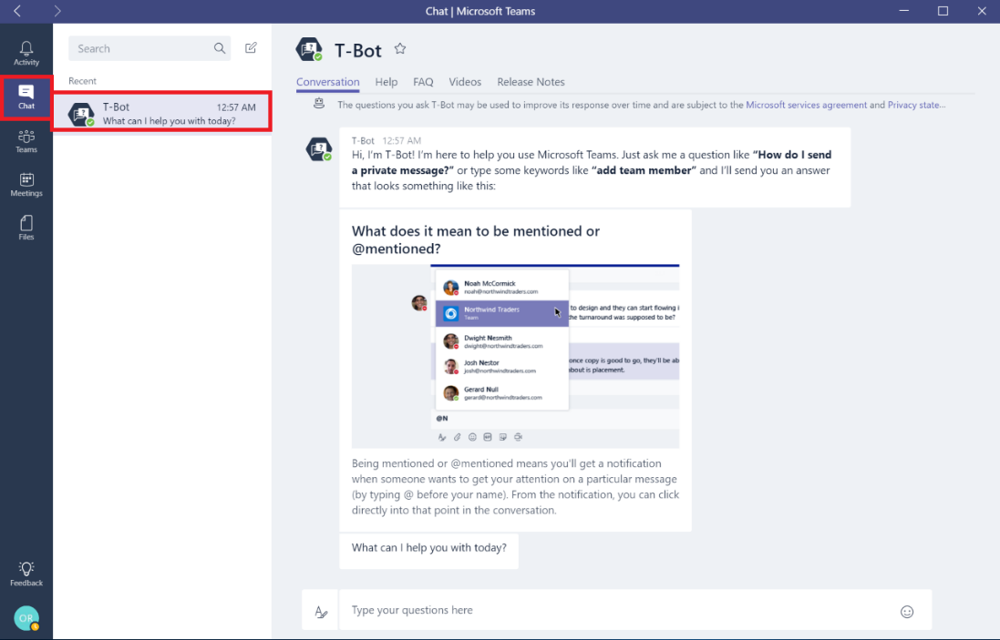
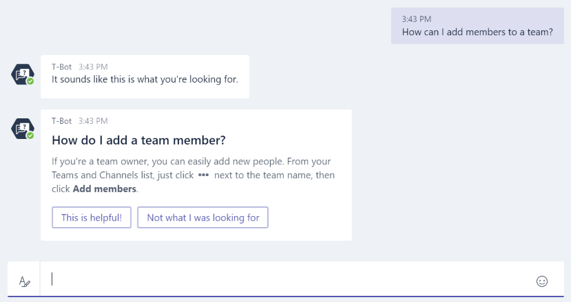
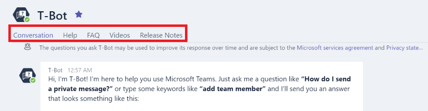
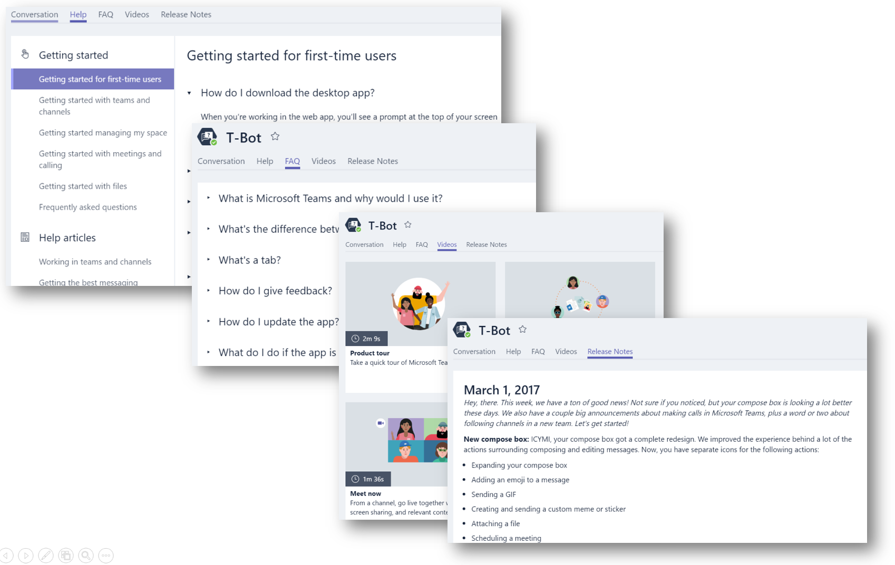

Use T-Bot to help users with Microsoft Teams
============================================

For help while using Microsoft Teams, ensure your users and champions get familiar with [T-Bot](https://support.office.com/en-us/article/Apps-and-services-cc1fba57-9900-4634-8306-2360a40c665b?ui=en-US&rs=en-US&ad=US#bkmk_bots). T-Bot is a bot which users can interact with to ask it questions about how to use Microsoft Teams and get answers to a wide range of questions.

Microsoft Teams provides localized language support for T-Bot and help content. New languages are being added all the time. For the most current list of supported languages, see [Microsoft Teams supported languages for help content](https://support.office.com/en-us/article/Microsoft-Teams-supported-languages-for-help-content-9c71d10a-0c5c-49d4-b6d7-0c58cdfdf4cf).

T-Bot also provides alternative assistance methods for the users who will prefer browsing the content instead of asking questions to a bot.

Providing a full slate of Help, FAQ, Videos and Release Notes sections via the tabs within the bot.

