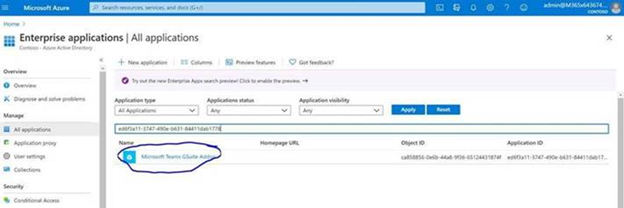
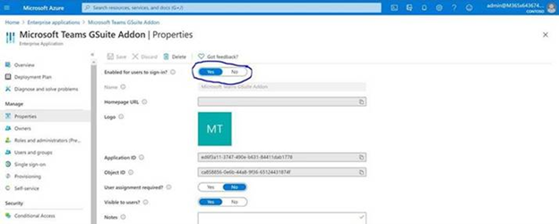

# Set up Google Workspace Marketplace Teams app

Using the Google Workspace Marketplace Teams app lets Google calendar users schedule and join a Microsoft Teams meeting directly from Google Workspace. Users will get access to Teams meetings features including video and audio conferencing, screen sharing, meeting chat, digital whiteboards, and more. Stay connected and organized to get more done together across work, school, and life.

The Google Workspace Marketplace Teams app must be enabled by a Teams admin before tenant users can access the app.

## Enable Google Workspace in the Azure Active Directory

As a tenant administrator, you can enable or disable a Google Workspace Marketplace Teams app from your organization's admin account using the Azure Active Directory (AAD) portal.

1. Sign in to the AAD portal.

2. Select **Manage** > **All applications**.

3. Search for **Microsoft Teams Gsuite Add-on** or **Microsoft Teams Google Workspace Add-on**.

4. Select **Enable**.
5. (Optional) To disable the addon, select **Disable** instead of **Enable** in Step 4.

 

 

## Disable Google Workspace Marketplace Teams app using PowerShell

The basic PowerShell command is`Remove-AzAdServicePrincipal -DisplayName ServicePrincipalName`.

For more information, see [Create an Azure service principal with Azure PowerShell](https://docs.microsoft.com/powershell/azure/create-azure-service-principal-azureps?view=azps-5.0.0).

## Delete a Google Workspace Marketplace app

See the [Google documentation Delete a Google Workspace Marketplace app](https://support.google.com/a/answer/6216211?hl=en) for instructions.
