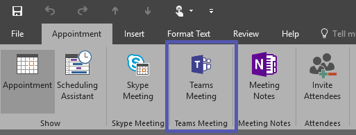

Use the Teams Meeting add-in in Outlook
=======================================
> [!IMPORTANT]
> [!INCLUDE [new-teams-sfb-admin-center-notice](includes/new-teams-sfb-admin-center-notice.md)]

The Teams Meeting add-in is automatically installed for users who have Microsoft Teams and either Office 2013 or Office 2016 installed on their Windows PC. Users will see the Teams Meeting add-in on the Outlook Calendar ribbon. 

> [!NOTE]
> Windows 7 users must install the [Update for Universal C Runtime in Windows](https://support.microsoft.com/help/2999226/update-for-universal-c-runtime-in-windows) for the Teams Meeting add-in to work.​

If users do not see the Teams Meeting add-in, instruct them to close Outlook and Teams, then restart the Teams client first, then sign in to Teams, and then restart the Outlook client, in that specific order.

> [!NOTE]
> The Teams Meeting button in Outlook for Mac will appear in the Outlook for Mac ribbon if Outlook is running Production Build 16.20 and later.​

## Authentication requirements

The Teams Meeting add-in requires users to sign in to Teams using Modern Authentication. If users do not use this method to sign in, they’ll still be able to use the Teams client, but will be unable to schedule Teams online meetings using the Outlook add-in. You can fix this by doing one of the following:

- If Modern Authentication is not configured for your organization, you should configure Modern Authentication.
- If Modern Authentication is configured, but they cancelled out on the dialog box, you should instruct users to sign in again using multi-factor authentication.

To learn more about how to configure authentication, see [Identity models and authentication in Microsoft Teams](identify-models-authentication.md).

## Enable private meetings

Allow scheduling for private meetings must be enabled in the Microsoft Teams admin center for the plug-in to get deployed. In the admin center, go to **Meetings** > **Meeting Policies**, and in the **General** section, toggle **Allow scheduling private meetings** to On.)

The Teams client installs the correct add-in by determining if users need the 32-bit or 64-bit version.

> [!NOTE]
> Users might need to restart Outlook after an installation or upgrade of Teams to get the latest add-in.​

## Other considerations

The Teams Meeting add-in is still building functionality, so be aware of the following:
- Some online meeting features, such as recording, polling, and whiteboarding are not yet available.
- Meeting options are currently not available.
- Currently, you can only invite people from within your company, as it is not yet possible for external users to join meetings.
- The add-in is for scheduled meetings with specific participants, not for meetings in a channel. Channel meetings must be scheduled from within Teams. Currently, the Teams Meeting add-in in Outlook is only available for Windows users, but support for Mac is coming.
- The add-in will not work if an Authentication Proxy is in the network path of user's PC and Teams Services.
- The add-in is being rolled out incrementally and might not be available for your organization yet.

## Troubleshooting

If you cannot get the Teams Meeting add-in for Outlook to install, try these troubleshooting steps.

- Ensure all available updates for Outlook desktop client have been applied 
- Restart the Teams desktop client.
- Sign out and then sign back in to the Teams desktop client.
- Restart the Outlook desktop client. (Make sure Outlook isn’t running in admin mode.)
- Make sure the logged-in user account name does not contain spaces. (This is a known issue, and will be fixed in a future update.)
- Make sure single sign-on (SSO) is enabled.

For general guidance about how to disable add-ins, see [View, manage, and install add-ins in Office programs](https://support.office.com/article/View-manage-and-install-add-ins-in-Office-programs-16278816-1948-4028-91E5-76DCA5380F8D).

Learn more about [meetings and calling in Microsoft Teams](https://support.office.com/article/Meetings-and-calls-d92432d5-dd0f-4d17-8f69-06096b6b48a8).

[!INCLUDE [new-feature-availability](includes/new-feature-availability.md)]

