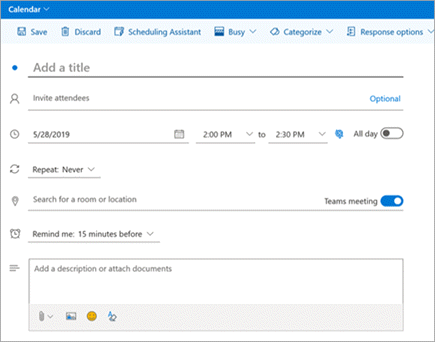
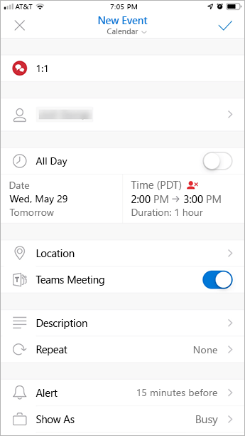

Use the Teams Meeting add-in in Outlook
=======================================

The Teams Meeting add-in lets users schedule a Teams meeting from Outlook. The add-in is available for Outlook on Windows, Mac, web, and mobile.

## Teams Meeting add-in in Outlook for Windows

The Teams Meeting add-in is automatically installed for users who have Microsoft Teams and either Office 2013 or Office 2016 installed on their Windows PC. Users will see the Teams Meeting add-in on the Outlook Calendar ribbon.

> [!NOTE]
> - If users do not see the Teams Meeting add-in, instruct them to close Outlook and Teams, then restart the Teams client first, then sign in to Teams, and then restart the Outlook client, in that specific order.
> - Windows 7 users must install the [Update for Universal C Runtime in Windows](https://support.microsoft.com/help/2999226/update-for-universal-c-runtime-in-windows) in Windows for the Teams Meeting add-in to work.

## Teams Meeting add-in in Outlook for Mac

The Teams Meeting button in Outlook for Mac will appear in the Outlook for Mac ribbon if Outlook is running Production Build 16.23.326.1 and later.​

## Teams Meeting add-in in Outlook Web App

The Teams Meetings button in Outlook Web App will appear as part of new event creation if the user is on an early version of the new Outlook on the web. See the [Outlook Blog](https://techcommunity.microsoft.com/t5/Outlook-Blog/Designed-to-be-fast-The-Outlook-on-the-web-user-experience-gets/ba-p/234909?utm_source=t.co&utm_medium=referral) to learn about how users can try the early version of the new Outlook on the web.

## Teams Meeting add-in in Outlook mobile (iOS and Android)

The Teams Meeting button shows up in latest builds of the Outlook iOS and Android app.

## Authentication requirements

The Teams Meeting add-in requires users to sign in to Teams using Modern Authentication. If users do not use this method to sign in, they’ll still be able to use the Teams client, but will be unable to schedule Teams online meetings using the Outlook add-in. You can fix this by doing one of the following:

- If Modern Authentication is not configured for your organization, you should configure Modern Authentication.
- If Modern Authentication is configured, but they canceled out on the dialog box, you should instruct users to sign in again using multi-factor authentication.

To learn more about how to configure authentication, see [Identity models and authentication in Microsoft Teams](identify-models-authentication.md).

## Enable private meetings

**Allow scheduling for private meetings** must be enabled in the Microsoft Teams admin center for the add-in to get deployed. In the admin center, go to **Meetings** > **Meeting Policies**, and in the **General** section, toggle **Allow scheduling private meetings** to On.)

The Teams client installs the correct add-in by determining if users need the 32-bit or 64-bit version.

> [!NOTE]
> Users might need to restart Outlook after an installation or upgrade of Teams to get the latest add-in.​

## Teams upgrade policy and the Teams Meeting add-in for Outlook

Customers can [choose their upgrade journey from Skype for Business to Teams](upgrade-and-coexistence-of-skypeforbusiness-and-teams.md). Tenant admins can use the Teams co-existence mode to define this journey for their users. Tenant admins have the option to enable users to use Teams alongside Skype for Business (Islands mode). 

When users who are in Island mode schedule a meeting in Outlook, they typically expect to be able to choose whether to schedule a Skype for Business or a Teams meeting. In Outlook on the web, Outlook Windows, and Outlook Mac, users see both Skype for Business and Teams add-ins when in Islands mode. Due to certain limitations in the initial release, Outlook mobile can only support creating Skype for Business **or** Teams meetings. See the following table for details.

| Coexistence mode in the Teams admin center | Default meetings provider in Outlook mobile |
| --------------------------------------|---------------------------------------------|
| Islands | Skype for Business |
| Skype for Business only | Skype for Business |
| Skype for Business with Teams collaboration | Skype for Business |
| Skype for Business with Teams collaboration and meetings | Teams |
| Teams only | Teams |

## Other considerations

The Teams Meeting add-in is still building functionality, so be aware of the following:

- The add-in is for scheduled meetings with specific participants, not for meetings in a channel. Channel meetings must be scheduled from within Teams. Currently, the Teams Meeting add-in in Outlook is only available for Windows users, but support for Mac is coming.
- The add-in will not work if an Authentication Proxy is in the network path of user's PC and Teams Services.
- Users can't schedule live events from within Outlook. Go to Teams to schedule live events. For more information, see [What are Microsoft Teams live events?](teams-live-events/what-are-teams-live-events.md).

## Troubleshooting

If you cannot get the Teams Meeting add-in for Outlook to install, try these troubleshooting steps.

- Ensure all available updates for Outlook desktop client have been applied.
- Restart the Teams desktop client.
- Sign out and then sign back in to the Teams desktop client.
- Restart the Outlook desktop client. (Make sure Outlook isn’t running in admin mode.)
- Make sure the logged-in user account name does not contain spaces. (This is a known issue, and will be fixed in a future update.)
- Make sure single sign-on (SSO) is enabled.

For general guidance about how to disable add-ins, see [View, manage, and install add-ins in Office programs](https://support.office.com/article/View-manage-and-install-add-ins-in-Office-programs-16278816-1948-4028-91E5-76DCA5380F8D).

Learn more about [meetings and calling in Microsoft Teams](https://support.office.com/article/Meetings-and-calls-d92432d5-dd0f-4d17-8f69-06096b6b48a8).

[!INCLUDE [new-feature-availability](includes/new-feature-availability.md)]

