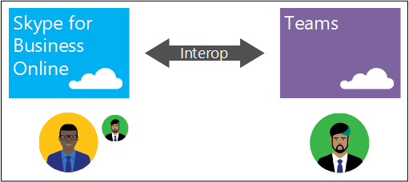
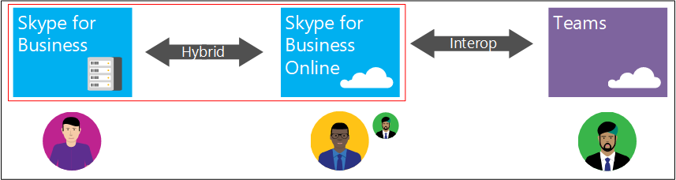

Microsoft Teams and Skype for Business interoperability
=======================================================

If your organization uses Skype for Business today and you intend to start using Teams, it's important to understand how to configure the two applications to interoperate.

> [!IMPORTANT]
> This document is provided for early evaluation of Calling Plans support for Teams. Teams interop policy details are expected to change in the future.

Interoperability (interop for short) enables Skype for Business and Teams users to chat and call with one another, ensuring that communications remain fluid across your organization. To help IT pros manage the adoption of Teams, we've added a new Teams interop policy, managed through a Skype for Business remote Windows PowerShell session using [`*-CsTeamsInteropPolicy`](https://docs.microsoft.com/powershell/module/skype) cmdlets. Use this policy to configure Teams the way you need it to work in your organization.

> [!TIP]
> To find the PowerShell cmdlets you need for interop, type "CsTeamsInteropPolicy" in the **Filter** box in the [Skype for Business PowerShell cmdlet documentation](https://docs.microsoft.com/powershell/module/skype).

Teams interop policy enables an IT pro to designate a user’s preferred application for receiving chats and calls. It can be configured to keep communications in Teams and Skype for Business siloed, or it can be configured to enable users to communicate across application boundaries.

Teams interop policy can be defined at the tenant or per-user level, and can even be configured to enable users to choose what application they would like to use to receive their chats and calls.

This built-in flexibility is intended to help your organization trial, evaluate, and migrate to Teams at the pace and in the manner that is best suited to your organization.

> [!NOTE]
> Interoperability between Teams and Skype for Business is supported between users who are purely online (Skype for Business Online and Teams), and users homed in a Skype for Business on-premises deployment in a mixed (Hybrid) deployment topology.

## What interoperability means
Interop is the ability for Teams and Skype for Business users to chat (IM) and call each other across Teams and Skype for Business.

As organizations begin the journey from Skype for Business to Teams, the expectation is that there will be a mix of users using different clients in the organization.

To ensure continued productivity, Teams provides the ability for users to communicate with one another regardless of the application they use (Teams or Skype for Business).

Supported interop experiences include the following:
- Skype for Business users that do not use Teams can chat with Teams users, vice versa

 
- Skype for Business users can call Teams users over voice and video, vice versa. Advanced calling options, such as call transfer and call forwarding will continue to work, even for interop calls.

 

> [!NOTE]
> From a Skype for Business user point of view, chats and calls from/to Teams will appear as basic Skype for Business chats and calls. Please review the [Interop experiences limitations](#interop-experiences-limitations) section for details.

> [!IMPORTANT]
> Unified presence between Teams and Skype for Business is currently not supported, which means Teams and Skype for Business will show their own independent presence states. To find out when support for unified presence is going to be available, review [Skype for Business to Microsoft Teams Capabilities Roadmap](https://aka.ms/skype2teamsroadmap).

## Interop requirements
For interop capabilities to be enabled, users must meet the following criteria:
- Users must be enabled (and/or licensed) for Teams
- Users must be enabled (and/or licensed) for Skype for Business Online
    - This is applicable to users that are planning to use Teams only or Teams as their primary chat and calling application
- In a hybrid Skype for Business deployment,
    - Users homed at on-premises Skype for Business (or any Lync Server version currently supported for Skype for Business Hybrid deployment), can interop with cloud users using Teams
    - Cloud users that are planning to use Teams as their primary chat and calling application must be enabled (and/or licensed) for Skype for Business Online

## Supported topologies for interop
Interop between Teams and Skype for Business is primarily supported for the following Skype for Business deployment topologies:
- Skype for Business Online only
- Skype for Business Hybrid (mixed deployment of Skype for Business Online and Skype for Business on-premises)

### Skype for Business Online only topology
Organizations with Skype for Business Online deployment only can benefit from interop chat and calling support between Skype for Business Online users and Teams users.

In this topology, users configured with Teams as the primary chat and calling application must also be enabled for Skype for Business Online for interop to function.

### Skype for Business Hybrid deployment topology
Organizations with a deployment that consists of mixed deployment of Skype for Business Online and Skype for Business server (on-premises) in a Hybrid deployment topology, can benefit from interop chat and calling support between Skype for Business users (homed at either online and on-premises) and Teams users.

Like Skype for Business Online only deployment topology, users configured with Teams as the primary chat and calling application must also be enabled for and homed at Skype for Business Online for interop to function.

> [!IMPORTANT]
> Interop support for Skype for Business Hybrid does not include Hybrid Voice capabilities delivered through CCE (Cloud Connector Edition) or on-premises PSTN connectivity using existing deployment--or commonly called as OPCH (On Prem Config Hybrid). Teams users cannot be enabled for PSTN calling capabilities using CCE or OPCH.

### Interop experiences limitations
Currently, in addition to the absence of unified presence between Teams and Skype for Business, which leads to Teams and Skype for Business having their own independent presence states, there are features that are not available for interop chat and interop calling experiences between Teams and Skype for Business.

For chat interop, the following are the current list of limitations:
- Multi-party (group) conversation (chat) in Teams can only include participants using Teams
- Multi-party IM conversation (chat) in Skype for Business can only include participants using Skype for Business
- File transfer for two-party chat conversation or file attachment in multi-party conversation across Teams and Skype for Business, vice versa, are not supported
- Interop chat is not persisted in Teams
- Markdown, rich text, full emoticon set, etc. in Teams are not supported for interop chat

For calling interop, the following are the current list of limitations:
- Screen sharing (desktop or app sharing) between Teams and Skype for Business is not supported
- Escalation of ongoing peer to peer (P2P) voice and video call to multi-party call involving Teams and Skype for Business users is not supported

## Managing interoperability
To manage the interoperability between Teams and Skype for Business, a new policy called Teams interop policy can be utilized to control where to send chats and route calls, Teams or Skype for Business, and this policy can be configured for all users in the organization (global policy) or applied at the per user basis, manageable through Skype for Business remote Windows PowerShell session using [`*-CsTeamsInteropPolicy`](https://docs.microsoft.com/powershell/module/skype/?view=skype-ps) cmdlets.

By default, this policy is configured to ensure that Teams and Skype for Business can be used side-by-side with minimal interop between them. This approach is intended to ensure that current business processes and communications within your organizations are not disrupted as a result of Teams adoption.

### Interop policy overview
Teams interop policy consists of the following parameters:

|Parameter                    |Possible values      |Description  |
|-----------------------------|---------------------|---------|
|`ChatDefaultClient`          | Default, SfB, Teams | This parameter specifies the default Chat app        |
|`CallingDefaultClient`       | Default, SfB, Teams | This parameter specifies the default Calling app        |
|`AllowEndUserClientOverride` | True, False         | This parameter specifies whether users can override the default Chat and Calling app         |

> [!WARNING]
> While it is currently possible to create Teams interop policy with independent values for `ChatDefaultClient` and `CallingDefaultClient` parameters, we expect this to change in the future. At this time, please ensure that you are using the same value for both parameters.

#### Chat default client
The `ChatDefaultClient` parameter defines how chats are routed between Teams and Skype for Business, and the default global value of this parameter is set to **Default**.

> [!IMPORTANT]
> At the present time, the `ChatDefaultClient` parameter is not respected by Teams. We will update this documentation to describe the expected behavior once the parameter is respected by Teams. Existing chat interop capabilities between Teams and Skype for Business controlled at the tenant level will continue to work as is.

#### Calling default client
The `CallingDefaultClient` parameter defines how calls are routed between Teams and Skype for Business, and the default global value of this parameter is set to **Default**.

Below is the detailed explanation of how each setting of this parameter influences Teams and Skype for Business client behavior.

|Caller calling from  |Setting: Default; call received on  |Setting: Teams; call received on  |Setting: SfB; call received on  |
|---------|---------|---------|---------|
|**Skype for Business**     |Skype for Business         |Teams        |Skype for Business         |
|**Teams**     |Teams         |Teams         |Skype for Business         |
|**PSTN**   |Skype for Business        |Teams        |Skype for Business         |
|**Federated Skype for Business**     |Skype for Business         |Skype for Business         |Skype for Business         |

> [!IMPORTANT]
> Currently, changing `CallingDefaultClient` to Teams will also affect calls to Skype for Business IP phones. Incoming calls will not be received on the phones and will only ring Teams clients. Please consult the [Skype for Business to Microsoft Teams Capabilities Roadmap](https://aka.ms/skype2teamsroadmap) for information about support for existing certified SIP phones.

#### Allowing user choice
The `AllowEndUserClientOverride` parameter accepts Boolean value (**TRUE** or **FALSE**), and when it is set to **TRUE**, Teams will allow users to select where they want to receive their calls--Teams or Skype for Business, and users will be able to change their primary application at any time.

The global default value for this parameter is **FALSE**, thereby users will not be allowed to choose their primary application without intervention from administrator.

## Teams interop policy special cases
When assigning Teams interop policy, users that remain homed at Skype for Business on-premises--in a mixed (Hybrid) deployment topology, users with Hybrid Voice (both through CCE or OPCH), and users with specialized Skype for Business workflows are considered special cases, and they require special attention on the policy assigned to them.

### Policy for Skype for Business on-premises users
In a mixed (Hybrid) deployment topology, users homed at Skype for Business on-premises should never have their policy set to Teams for either `ChatDefaultClient` and `CallingDefaultClient` parameters. If they do, they will be unable to receive chats and calls. Use the following policy definition for on-prem users:

|Parameter  |Value  |
|---------|---------|
|`ChatDefaultClient`    |Default or SfB         |
|`CallingDefaultClient`     |Default or SfB         |
|`AllowEndUserClientOverride`     |False         |

> [!IMPORTANT]
> When moving users from Skype for Business Online to Skype for Business on-premises, or vice versa, you need to make sure the Teams interop policy assigned to the user is aligned with the behavior that needs to be enforced. Remember that on-premises users cannot be configured to use Teams as primary chat and calling application.

### Policy for Hybrid Voice users (CCE or OPCH)
Skype for Business Online users enabled for Phone System with Hybrid Voice (through CCE or OPCH) cannot receive PSTN calls in Teams. When assigning Teams interop policy for Hybrid Voice users, use the following policy definition

|Parameter  |Value  |
|---------|---------|
|`ChatDefaultClient`    |Default or SfB or Teams         |
|`CallingDefaultClient`     |Default or SfB         |
|`AllowEndUserClientOverride`     |False         |

### Policy for users with specialized Skype for Business workflows
In some cases, a group of users may be using third party applications that rely on Skype for Business (e.g.: call centers, front desk attendants, etc.). In these cases, you will want to ensure that they remain on Skype for Business until they have equivalent capabilities in Teams. For these users, use the following policy definition:

|Parameter  |Value  |
|---------|---------|
|`ChatDefaultClient`    |Default or SfB         |
|`CallingDefaultClient`     |Default or SfB         |
|`AllowEndUserClientOverride`     |False         |