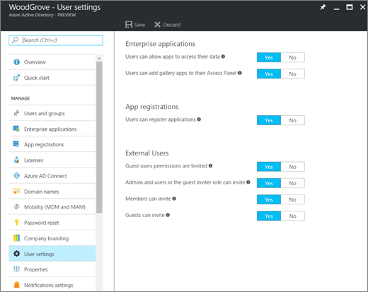
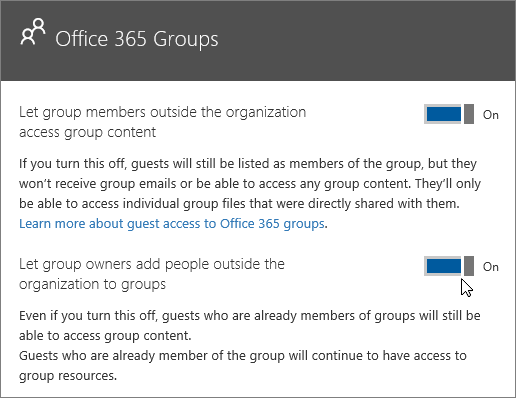

Authorize guest access in Microsoft Teams
===========================================

To satisfy your organization’s requirements, you can manage Microsoft Teams guest access features and capabilities through four different levels of authorization. All the authorization levels apply to your Office 365 tenant. Each authorization level controls the guest experience as shown below:
- **Azure Active Directory**: Guest access in Microsoft Teams relies on the Azure AD business-to-business (B2B) platform. Controls the guest experience at the directory, tenant, and application level. 
- **Microsoft Teams**: Controls Microsoft Teams only. 
- **Office 365 Groups**: Controls the guest experience in Office 365 Groups and Microsoft Teams.
- **SharePoint Online and OneDrive for Business**: Controls the guest experience in SharePoint Online, OneDrive for Business, Office 365 Groups, and Microsoft Teams.

These different authorization levels provide you with flexibility in how you set up guest access for your organization. For example, if you don’t want to allow guest users in your Microsoft Teams organization, just turn off guest access in Microsoft Teams. Another example: You could enable guest access at the AAD, Teams, and Groups levels, but then disable guest users' addition on selected teams that match one or more criteria such as data classification equals confidential. And, perhaps you don’t use Office 365 Groups. SharePoint Online and OneDrive for Business have their own guest access settings that don't rely on Office 365 Groups. 

> [!NOTE]
> Guests are subject to  [Office 365](https://go.microsoft.com/fwlink/p/?linkid=282347) and [Azure Active Directory](https://go.microsoft.com/fwlink/p/?linkid=853019) service limits. 

  The following diagram shows how guest access authorization dependency is granted and integrated between Azure Active Directory, Microsoft Teams, and Office 365.

## Azure Active Directory

With Azure AD business-to-business (B2B) collaboration, sending invitations to potential guest users isn’t restricted to tenant admins. Instead, you can use policies to delegate sending invitations to users whose roles allow them to send invitations.

The settings for invitations apply at the tenant level and control the guest experience at the directory, tenant, and application level. At a minimum to support guests, **Members can invite** must be set to **Yes**.

Azure AD includes the following settings to configure external users:
- **Guest user permissions are limited**: **Yes** means that guests don't have permission for certain directory tasks, such as enumerate users, groups, or other directory resources. In addition, guests can't be assigned to administrative roles in your directory. **No** means that guests have the same access to directory data that regular users have in your directory.
- **Admins and users in the guest inviter role can invite**: **Yes** means that admins and users in the "Guest Inviter" role will be able to invite guests to the tenant. **No** means admins and users can't invite guests to the tenant.
- **Members can invite**: **Yes** means that non-admin members of your directory can invite guests to collaborate on resources secured by your Azure AD, such as SharePoint sites or Azure resources. **No** means that only admins can invite guests to your directory.
- **Guests can invite**: **Yes** means that guests in your directory can themselves invite other guest to collaborate on resources secured by your Azure AD, such as SharePoint sites or Azure resources. **No** means that guests can't invite other guests to collaborate with your organization.
 

> [!NOTE]
> You can also manage which domains can be invited into your tenant as guests. See [Allow/Block guest access to Office 365 groups](https://docs.microsoft.com/exchange/recipients-in-exchange-online/manage-group-access-to-office-365-groups). 

## Microsoft Teams
In Microsoft Teams, you can control whether the guest experience is enabled or disabled for your organization. The setting is disabled by default and applies at the tenant level for Microsoft Teams only.

You can manage Microsoft Teams guest access settings from the Office 365 admin center. For more information, see [Turn on or off guest access to Microsoft Teams](set-up-guests.md). 

## Office 365 Groups

From Office 365 Groups, you can control adding guest users and guest access to all Office 365 groups and Microsoft Teams in your organization.

1. Sign in with your Office 365 global admin account at [https://portal.office.com/adminportal/home](https://portal.office.com/adminportal/home).
    
  
2. In the navigation menu, choose **Settings** and then select **Services &amp; add-ins**.
    
  
3. Select **Office 365 Groups**.
    
     
  

  

  
4. On the Office 365 Groups page, set the toggle to **On** or **Off**, depending if you want to let team and group owners outside your organization access Office 365 groups. Click or tap the toggle to **On** next to **Let group owners add people outside the organization to groups**. If you turn this toggle to On, you'll see another option to control whether you want to let group and team owners add people outside your organization to Office 365 groups and Microsoft teams. Set this toggle to On if you want to let group and team owners add guest users. 

The above settings apply at the tenant level and control the guest experience in Office 365 Groups and Microsoft Teams.

## SharePoint Online and OneDrive for Business

Teams relies on SharePoint Online and OneDrive for Business to store files and documents for channels and chat conversations.  
  
    
    
To enable the full Teams guest access experience, Office 365 admins need to select **On** for the following settings:
  
    
    

- In SharePoint Online: **Only allow sharing with external users already in the directory**
    
    For more information, see [Manage external sharing for your SharePoint Online environment](https://docs.microsoft.com/sharepoint/external-sharing-overview).
    
  
- In Office 365 groups: **Let group owners add people outside the organization to groups**
    
    For more information, see [Control guest access to Microsoft Teams](#controlguest).
  

The above settings apply at the tenant level and control the guest experience at SharePoint Online, OneDrive for Business, Office 365 Groups and Microsoft Teams.

You can manage SharePoint Online external user settings for the Teams connected team site. For more details, see  [Manage your SharePoint team site settings](https://support.office.com/article/Manage-your-SharePoint-team-site-settings-8376034d-d0c7-446e-9178-6ab51c58df42).
