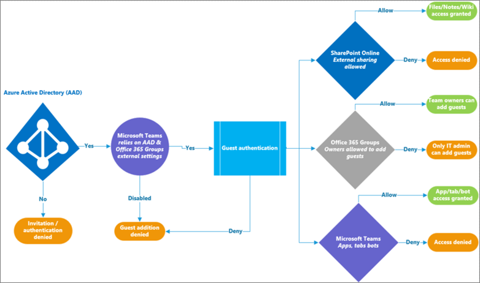
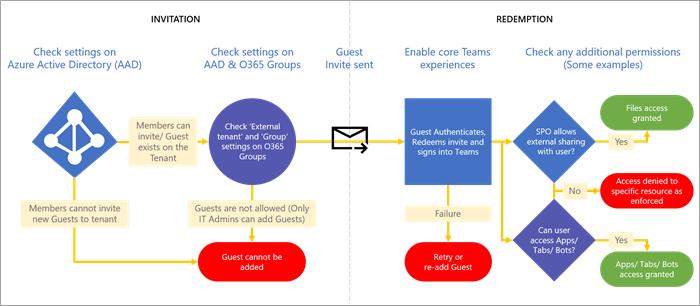
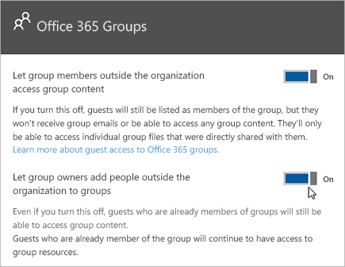

Authorize guest access in Microsoft Teams
===========================================

To satisfy your organization’s requirements, you can manage Microsoft Teams guest access features and capabilities through four different levels of authorization. All the authorization levels apply to your Office 365 tenant. Each authorization level controls the guest experience as shown below:

- **Azure Active Directory**: Guest access in Microsoft Teams relies on the Azure AD business-to-business (B2B) platform. Controls the guest experience at the directory, tenant, and application level. 
- **Microsoft Teams**: Controls Microsoft Teams only. 
- **Office 365 Groups**: Controls the guest experience in Office 365 Groups and Microsoft Teams.
- **SharePoint Online and OneDrive for Business**: Controls the guest experience in SharePoint Online, OneDrive for Business, Office 365 Groups, and Microsoft Teams.

These different authorization levels provide you with flexibility in how you set up guest access for your organization. For example, if you don’t want to allow guest users in your Microsoft Teams but want to allow it overall in your organization, just turn off guest access in Microsoft Teams. Another example: You could enable guest access at the AAD, Teams, and Groups levels, but then disable guest users' addition on selected teams that match one or more criteria such as data classification equals confidential. SharePoint Online and OneDrive for Business have their own guest access settings that don't rely on Office 365 Groups. 

> [!NOTE]
> Guests are subject to  [Office 365](https://go.microsoft.com/fwlink/p/?linkid=282347) and [Azure Active Directory](https://go.microsoft.com/fwlink/p/?linkid=853019) service limits. 

The following diagram shows how guest access authorization dependency is granted and integrated between Azure Active Directory, Microsoft Teams, and Office 365.

The next diagram shows, at a high level, how the user experience works with the permission model through a typical guest access invitation and redemption flow.

It’s important to note here that apps, bots, and connectors might require their own set of permissions and/or consent specific to the user account. These might need to be granted separately. Similarly, SharePoint might impose extra external sharing boundaries for a specific user, groups of users, or even at the site level.

The previous two diagrams are also available in [Visio](https://github.com/MicrosoftDocs/OfficeDocs-SkypeForBusiness/blob/live/Teams/media/teams_dependencies.vsdx?raw=true).

## Control guest access in Azure Active Directory

Use Azure AD to determine whether external collaborators can be invited into your tenant as guests, and in what ways. For more information about Azure B2B guest access, see [What is guest user access in Azure Active Directory B2B](https://docs.microsoft.com/en-us/azure/active-directory/b2b/what-is-b2b). For information about Azure AD roles, see [Grant permissions to users from partner organizations in your Azure Active Directory tenant](https://docs.microsoft.com/en-us/azure/active-directory/b2b/add-guest-to-role).

The settings for invitations apply at the tenant level and control the guest experience at the directory, tenant, and application level. To configure these settings in the Azure portal, go to **Azure Active Directory** > **Users** > **User settings**, and under **External users**, select **Manage external collaboration settings**.

Azure AD includes the following settings to configure external users:

- **Guest user permissions are limited**: **Yes** means that guests don't have permission for certain directory tasks, such as enumerate users, groups, or other directory resources. In addition, guests can't be assigned to administrative roles in your directory. **No** means that guests have the same access to directory data that regular users have in your directory.
- **Admins and users in the guest inviter role can invite**: **Yes** means that admins and users in the "Guest Inviter" role will be able to invite guests to the tenant. **No** means admins and users can't invite guests to the tenant.
- **Members can invite**: **Yes** means that non-admin members of your directory can invite guests to collaborate on resources secured by your Azure AD, such as SharePoint sites or Azure resources. **No** means that only admins can invite guests to your directory. 
      
    > [!NOTE]
    > Currently, Teams doesn't support the guest inviter role. at a minimum the **Members can invite** toggle must be set to **Yes** for guest access to work in Teams.
- **Guests can invite**: **Yes** means that guests in your directory can themselves invite other guests to collaborate on resources secured by your Azure AD, such as SharePoint sites or Azure resources. **No** means that guests can't invite other guests to collaborate with your organization.
 
For more information about controlling who can invite guests, see [Delegate invitations for Azure Active Directory B2B collaboration](https://docs.microsoft.com/en-us/azure/active-directory/b2b/delegate-invitations).

> [!NOTE]
> You can also manage which domains can be invited into your tenant as guests. See [Allow/Block guest access to Office 365 groups](https://docs.microsoft.com/exchange/recipients-in-exchange-online/manage-group-access-to-office-365-groups). 

Adding the user guest account manually to Azure AD B2B is not required, as the account will be added to the directory automatically when you add the guest to Teams. 

Azure AD licensing allows you to add up to 5 guests per license. For more information about Azure AD licensing, see [Azure Active Directory B2B collaboration licensing guidance](https://docs.microsoft.com/en-us/azure/active-directory/b2b/licensing-guidance).

## Control guest access in Teams

In Teams, you can control whether the guest experience is enabled or disabled for your organization. The setting is disabled by default and applies at the tenant level for Teams only.

You can manage Teams guest access settings from the Microsoft Teams admin center. For more information, see [Turn on or off guest access to Microsoft Teams](set-up-guests.md). 

## Control guest access in Office 365 Groups

From Office 365 Groups, you can control adding guest users and guest access to all Office 365 groups and Microsoft Teams in your organization.

1. Sign in with your Office 365 global admin account at [https://portal.office.com/adminportal/home](https://portal.office.com/adminportal/home).
    
2. In the navigation menu, choose **Settings** and then select **Services &amp; add-ins**.
    
3. Select **Office 365 Groups**.
    
     
  
4. On the Office 365 Groups page, set the toggle to **On** or **Off**, depending on whether you want to let team and group owners outside your organization access Office 365 groups. Click or tap the toggle to **On** next to **Let group owners add people outside the organization to groups**. If you turn this toggle to **On**, you'll see another option to control whether you want to let group and team owners add people outside your organization to Office 365 groups and Microsoft teams. Set this toggle to **On** if you want to let group and team owners add guest users. 
 
   

These settings apply at the tenant level and control the guest experience in Office 365 Groups and Microsoft Teams.

See [Guest access in Office 365 Groups](https://support.office.com/en-us/article/Guest-access-in-Office-365-Groups-bfc7a840-868f-4fd6-a390-f347bf51aff6) for more information about guest access in Groups, including how guest access works, how to manage guest access, and answers to frequently asked questions.

## Control guest access to SharePoint Online and OneDrive for Business

Teams relies on SharePoint Online and OneDrive for Business to store files and documents for channels and chat conversations.  
   
To enable the full Teams guest access experience, Office 365 admins need to select **On** for the following settings:

- In SharePoint Online: **Existing guests**, **New and existing guests**, or **Anyone**
    
    For more information, see [Turn external sharing on or off](https://docs.microsoft.com/sharepoint/turn-external-sharing-on-or-off).
    
- In Office 365 groups: **Let group owners add people outside the organization to groups**
    
    For more information, see [Control guest access in Office 365 Groups](#control-guest-access-in-office-365-groups), above.
  
These settings apply at the tenant level and control the guest experience at SharePoint Online, OneDrive for Business, Office 365 Groups, and Teams.

You can manage SharePoint Online external user settings for the Teams connected team site. For more details, see  [Manage your SharePoint team site settings](https://support.office.com/article/Manage-your-SharePoint-team-site-settings-8376034d-d0c7-446e-9178-6ab51c58df42).

## Guest access vs. external access (federation)

[!INCLUDE [guest-vs-external-access](includes/guest-vs-external-access.md)]
