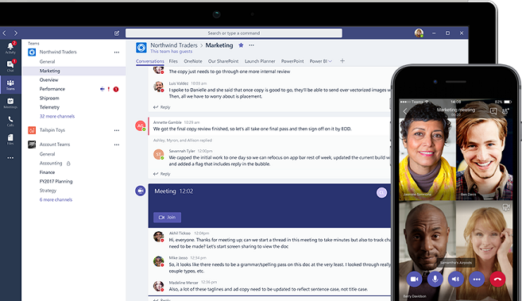

# Welcome to Microsoft Teams

## Get started
If you're the admin for Microsoft Teams in your organization, you're in the right place. Here you’ll find all the information you need to plan, deploy, and run Teams. To get started with Teams, start with our [Quick start guide](get-started-with-teams-quick-start.md), which walks you through a small-scale Teams rollout so you can learn about Teams and start to plan your org-wide deployment. 

Teams consists of 4 workloads, which you can roll out as your organization is ready. 
- [Chat, teams, & channels](teams-channels-overview.md)
- [Meetings and conferencing](deploy-meetings-microsoft-teams-landing-page.md)
- [Cloud voice](cloud-voice-landing-page.md)
- [Apps](app-permissions.md)

## Overview of Teams

If you're new to Teams, check out this short video, [Welcome to Teams](https://support.office.com/article/video-welcome-to-microsoft-teams-b98d533f-118e-4bae-bf44-3df2470c2b12?wt.mc_id=otc_microsoft_teams). Teams is built on Office 365 groups, Office Graph, and the same enterprise-level security, compliance, and manageability as the rest of Office 365. Teams leverages identities stored in Azure Active Directory (Azure AD). When you create a team, here's what gets created:
- A new [Office 365 group](office-365-groups.md)
- A [SharePoint Online](sharepoint-onedrive-interact.md) site and document library to store team files
- An [Exchange Online](exchange-teams-interact.md) shared mailbox and calendar
- A OneNote notebook
- Ties into other Office 365 apps such as Planner and Power BI

When you create a team from an existing group, that group's membership, site, mailbox, and notebook are ported to Teams. Don't miss the new [org-wide team](create-an-org-wide-team.md), a special type of team that pulls in every user in your organization and keeps membership up to date with Active Directory as users join and leave the organization. 

To customize and extend Teams, add third-party apps through [tabs](built-in-custom-tabs.md), [connectors](office-365-custom-connectors.md), and [bots](add-bots.md). With Teams, you can include people from outside your organization by [adding them as a guest](guest-access.md) to a team or channel. As part of Office 365, Teams offers a robust [extensibility story](https://docs.microsoft.com/en-us/microsoftteams/platform) so you can build the teamwork hub you need for your organization. 

Teams is the primary client for intelligent communications in Office 365, replacing Skype for Business Online over time. To learn more about Skype for Business features and functionality that we've built into Teams, see the [Skype for Business to Microsoft Teams capabilities roadmap](http://aka.ms/skype2teamsroadmap). To complement persistent chat and messaging capabilities, Teams offers a comprehensive meeting and calling experience, with built-in, fully integrated voice and video. Check out [Teams is now a complete meeting and calling solution](https://techcommunity.microsoft.com/t5/Microsoft-Teams-Blog/Microsoft-Teams-is-now-a-complete-meeting-and-calling-solution/ba-p/236042) in the Microsoft Teams Blog.

## Teams admin experience

We’re rolling out the new Microsoft Teams & Skype for Business admin center. If you don’t see it yet, it’s on its way, giving you a unified experience for managing Teams and Skype for Business. Since March 2018, we’ve been gradually migrating settings to it from the Skype for Business admin center and the Teams experience in the Office 365 admin center. 

During the migration, you’ll be split between two different admin experiences. Don’t worry – we’ll make sure you don’t get lost! After a setting is migrated, you’ll get a notification and will be directed to the new location of the setting in the Microsoft Teams & Skype for Business admin center. To learn more, see [Manage Teams during the transition to the new Microsoft Teams & Skype for Business Admin Center](manage-teams-skypeforbusiness-admin-center.md). 

To stay on top of what’s coming for Teams and all other Office 365 products and services in your organization, be sure to check [Message center](https://admin.microsoft.com/AdminPortal/Home#/MessageCenter) and the [Teams roadmap](https://www.microsoft.com/microsoft-365/roadmap?rtc=1%26filters=Microsoft%20Teams%26searchterms=microsoft%2Cteams). You’ll get announcements about new and updated features, planned changes, and issues to help keep you informed and prepared. 

## Upgrade from Skype for Business to Teams
If you’re already on Teams, great! Use the resources here to get the most out of Teams as the central hub for teamwork in your organization. 

If you’re running Skype for Business and are ready to upgrade to Teams, or if you’re running Skype for Business and Teams side-by-side and are ready to fully move to Teams, we have the tools, tips, and guidance to help make your transition successful. To learn more, see [Skype for Business to Microsoft Teams upgrade](journey-skypeforbusiness-teams.md).

## Teamwork and Office 365
Every team is different; there’s no one-size-fits-all approach to collaboration. Office 365 is designed to meet the unique needs of every team, empowering people to communicate, collaborate, and achieve more with purpose-built, integrated applications. 

When deciding which Office 365 apps and services to use, think about the work your organization does and the types of conversations your teams need to have. 

- **Teams**, a digital hub where people who work closely together on core projects, including people outside your organization, can actively connect and collaborate in real time to get things done. Have a conversation right where the work is happening, whether coauthoring a document, having a meeting, or working together in other apps and services. Teams is the place to have informal chats, iterate quickly on a project, work with team files, and collaborate on shared deliverables. 

- **Outlook** for collaborating in the familiar environment of email and in a more formal, structured manner or when targeted and direct communication is required. 

- **SharePoint** for sites, portals, intelligent content services, business process automation, and enterprise search. SharePoint keeps content at the center of teamwork, making all types of content easily shareable and accessible across teams. Tight integration with Outlook, Yammer, and Teams enables seamless content collaboration across conversation experiences.   

- **OneDrive for Business** for storing files and sharing them with people that a user invites. Content that a user saves to OneDrive for Business is private until the user shares it with others, making it the best option for storing personal and draft documents that are not intended to be shared or not ready to be shared.

- **Yammer** to connect people across the organization. Drive company-wide initiatives, share best practices, and build communities around common topics of interest or areas or practice. Crowdsource ideas to foster open discussions with people across the company.

- **Office apps** are all the familiar tools that people know and use regularly, including Word, Excel, PowerPoint, and OneNote. 

## Teams known issues

See [Known issues for Microsoft Teams](Known-issues.md).

## Teams client release notes

See [What's new in Microsoft Teams](https://support.office.com/article/what-s-new-in-microsoft-teams-d7092a6d-c896-424c-b362-a472d5f105de).

