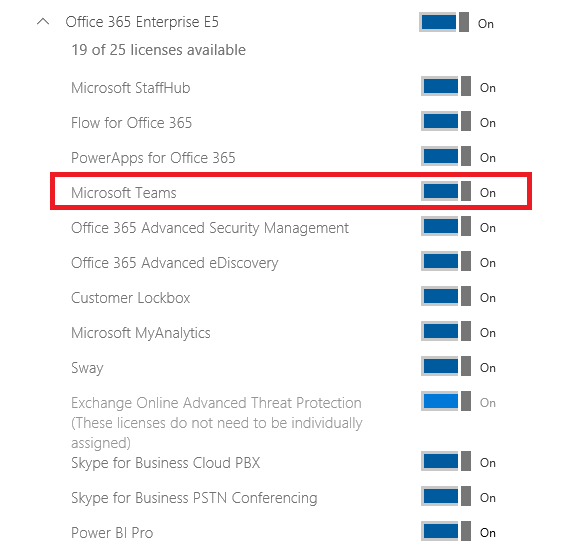

Office 365 licensing for Microsoft Teams
========================================

The following Office 365 subscriptions enable users for Microsoft Teams:

|Small Business Plans  |Enterprise Plans  |Education Plans  |
|---------|---------|---------|
|Office 365 Business Essentials     |Office 365 Enterprise E1         |Office 365 for Education         |
|Office 365 Business Premium     |Office 365 Enterprise E3         |Office 365 for Education Plus         |
|     |Office 365 Enterprise E4 (retired)         |Office 365 for Education E3 (retired)         |
|     |Office 365 Enterprise E5         |Office 365 for Education E5   
      |Office 365 Enterprise K1 |  |

|||
|---------|---------|
|  Note     |Microsoft Teams is also available for non-profit organizations. Government licensing is not currently supported, but are being investigated for future support.         |
        

In terms of Microsoft Teams **core** functionalities, there are no differences between the different Office 365 subscriptions, the availability of the compliance capabilities does rely on the correct subscription level. (See [Information Protection Licensing](https://support.office.com/en-us/article/Plan-for-Office-365-security-and-information-protection-capabilities-3d4ac4a1-3920-4ff9-918f-011f3ce60408) for more information.)

All supported subscription plans are eligible for access to Microsoft Teams’ web client, desktop clients, and mobile apps.

Microsoft Teams is not available as a standalone service.

Microsoft Teams license
---------------------

By default, the Microsoft Teams license is enabled for all users assigned with the eligible Office 365 subscriptions.

Microsoft Teams can be enabled or disabled for the entire organization and is enabled by default. **You can't turn on Microsoft Teams for only part of an organization.** If an organization intends to operate a pilot of Microsoft Teams with a selective set of users, while actively restricting access to Microsoft Teams for other users, then the Microsoft Teams license must be disabled for all users who are not part of the pilot group.
