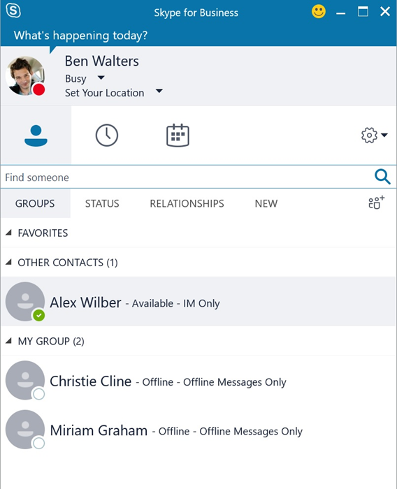
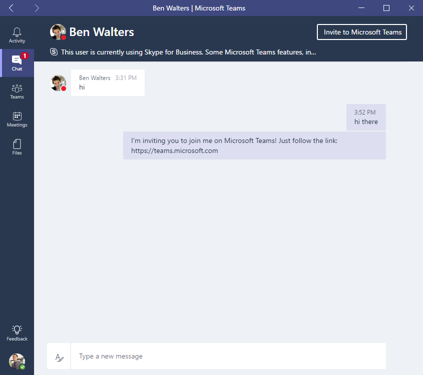

Understand how Skype for Business and Microsoft Teams interact
==============================================================

If your organization uses Skype for Business today, it is important to understand how Skype for Business and Microsoft Teams will interact.

At general availability of Microsoft Teams, basic interoperability between Microsoft Teams and Skype for Business Online or Hybrid is available peer to peer (P2P) instant messaging only.

The default behavior is that the Microsoft Teams client will sign into both the Microsoft Teams backend services and the Skype for Business services (a dual-stack approach). The Microsoft Teams client will only present IM capabilities to Skype for Business, so looking up a Microsoft Teams user from Skype for Business will only indicate the user as IM Only – shown in the example below, Alix Wilber is only signed into the Microsoft Teams client.

From Microsoft Teams, users can search for other users within their organization who are currently only enabled for Skype for Business, and conduct instant messaging chat sessions.

Users on Skype for Business can reply to the instant messages, which will arrive in Microsoft Teams’ chat window.

Users on Microsoft Teams, if enabled for Skype for Business as well, can sign in to Microsoft Teams and Skype for Business using their own respective clients simultaneously.

The last active endpoint will be honored, so if the user is actively using Microsoft Teams, any instant messages sent from a Skype for Business user will arrive in the Microsoft Teams chat window. If the user is currently using Skype for Business to receive/make phone calls or just finished taking a call using Skype for Business, and have not returned to Microsoft Teams client, incoming instant messages sent from a Skype for Business user will arrive in Skype for Business client as this will be the most active endpoint.

As Microsoft Teams only currently supports peer-to-peer (P2P) instant messaging interop between Skype for Business, any audio/video calls or invitation to join a Skype for Business meetings, for any modalities, from other Skype for Business users will arrive on the Skype for Business client only. In the reverse, any audio/video calls or invitation to join group calling, for any modalities from Microsoft Teams client, will only arrive on the Microsoft Teams client.

With the above behavior, end users can comfortably use both Microsoft Teams and Skype for Business at the same time, and handle specific communications needs using the right tool. However, proper end user awareness may be required to understand how interoperability works and how it may impact end user experience.

|  |  |
|---------|---------|
| Note       |With Skype for Business interoperability, instant messages that arrive in Teams will not be recorded in Skype for Business conversation history.         |

Microsoft Teams provides the ability for users to disable Skype for Business interoperability from within the Notification settings. This setting is user controlled, allowing each user to decide on the behavior they prefer.
