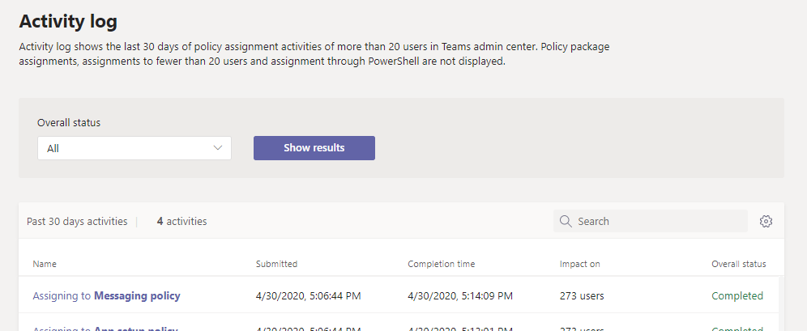
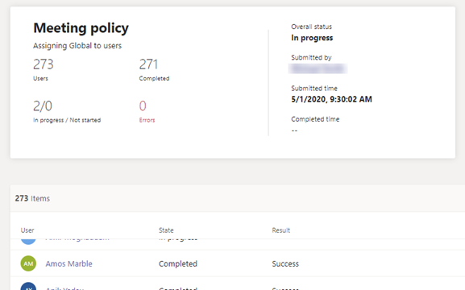

# View your policy assignments in the Activity log

When you assign policies to users in the Microsoft Teams admin center, you can view the status of those policy assignments in the Activity log. The Activity log shows policy assignments to batches of more than 20 users through the Microsoft Teams admin center from the last 30 days. Keep in mind that the Activity log doesn't show policy package assignments, policy assignments to batches of less than 20 users through the Microsoft Teams admin center, or policy assignments through PowerShell.

## View your policy assignment activities in the Activity log

To view your policy assignments in the Activity log:

1. In the left navigation of the Microsoft Teams admin center, go to **Home**, and then under **Activity Log**, select **View details**.
2. You can view all policy assignments or filter the list by status to show only assignments that are **Not started**, **In progress**, or **Completed**. You'll see the following information about each assignment:
    - **Name**: The name of the policy assignment. Click the link to view more details. This includes the number of users the policy was assigned to and the number of assignments completed, in progress, and not started. You'll also see the list of users in the batch, and the status and result for each user. Here's an example:

        

    - **Submitted**: Date and time the policy assignment was submitted.
    - **Completion time**: Date and time the policy assignment was completed.
    - **Impact on**: Number of users in the batch.
    - **Overall status**: Status of the policy assignment.

> [!NOTE]
> You can also get to the Activity log from the **Users** page. After you click **Apply** to submit a bulk policy assignment, you'll see a banner at the top of the page. Click the **Activity log** link in the banner.

## Related topics

- [Assign policies to users](policy-assignment-overview.md)
