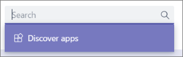
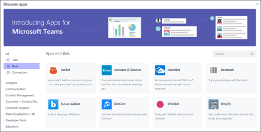
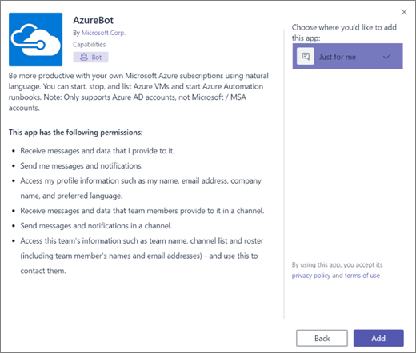
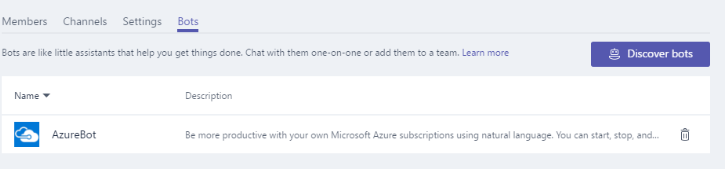

Add bots for private chats and channels in Microsoft Teams
==========================================================

Bots are automated programs that are set up to respond to queries or give updates and notifications about details users find interesting or want to stay informed about. Bots allow users to interact with cloud services like task management, scheduling, and polling, through chat conversations in Microsoft Teams. Bots for Microsoft Teams are built on the [Microsoft Bot Framework](https://go.microsoft.com/fwlink/?linkid=854370) and the bots that are developed using this framework can be enabled easily for Microsoft Teams.

Currently, Microsoft Teams support bots in private chats and channels within a team. Administrators can control whether the use of bots is allowed or prohibited within the Office 365 tenant.

Bots developed by the community and are made available, can be leveraged within Microsoft Teams. The bot’s functionality and bot’s side loading must be enabled on the tenant level for custom bots to be functional. Bots can be used in private chats or in channels. For channels, team owners or members can add bots.

Add bots for Private Chat and channels
--------------------------------------

There are two ways to integrate a bot for private chats and channels:

1.  Install publicly available bots for **private chat** or **channels**. (This is the first option.)

2.  Alternatively, to find bots, navigate to **Chat**, search for a **contact,** and click **Discover apps.**

3.  Select which **Bot** you want to have a conversation with, as shown below.

4.  Once selected, provide the bot **permissions,** and select whether you want to use **bots in a private chat** or select a **Team** to use it in.

5.  Alternatively, to use a bot within a channel of a team, simply click **View Team and Bots**. Here you can Discover additional bots.

6.  At any time, a bot can be removed from the team. Simply click **View Team and Bots,** to see all bots and then **remove** the one you’d like.

Create custom bots for Microsoft Teams
--------------------------------------

You can easily create a bot that integrates in to your LOB applications, using the Microsoft Bot Framework. Please refer to [Creating and Testing a bot for Microsoft Teams](https://go.microsoft.com/fwlink/?linkid=854371) guidance to learn how you can develop and publish your own bots.

When you create a bot and register it with the Bot Framework, you can choose to publish it or not. If you don't publish it, the bot remains private. You can also require your users to log in before using the bot. Requiring login makes sure only employees of your organization can access the bot, even if the bot's application ID becomes known. See [*AuthBot*](https://go.microsoft.com/fwlink/?linkid=854372) on GitHub for a code example of how to authenticate users against your Active Directory using bots.

Bots can be tested using the [Bot Framework Emulator](https://go.microsoft.com/fwlink/?linkid=854373) before they are deployed into your Teams.

Side load your own bot for private chat
---------------------------------------

1.  Once you have created your Bot, navigate to the **Bot Dashboard** [page](https://go.microsoft.com/fwlink/?linkid=854374) for the bot you developed, and under **Details**, copy the **Microsoft App ID**.

2.  From within Microsoft Teams, on the **Chat** pane, select the **Add chat icon**. For **To:,** paste your bot's **Microsoft app ID**.

3.  The app ID will resolve to your **bot name,** and then you can initiate a chat conversation with that bot.
