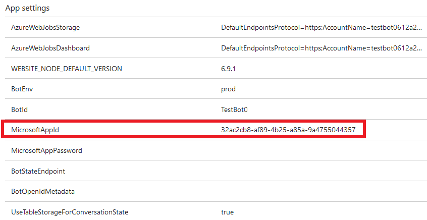
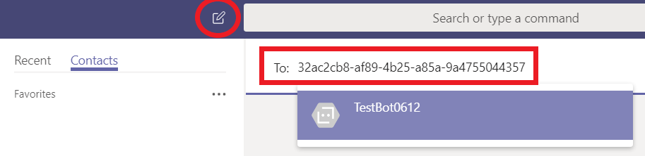
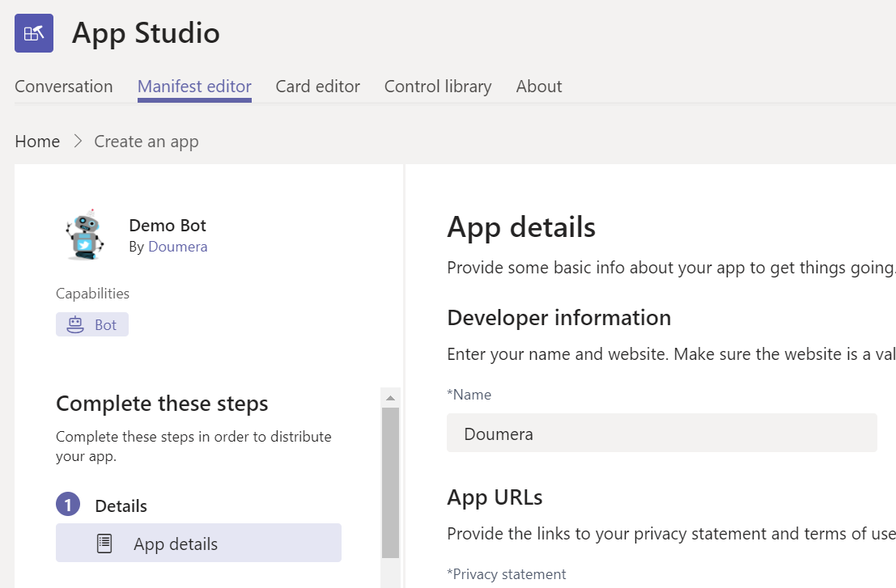
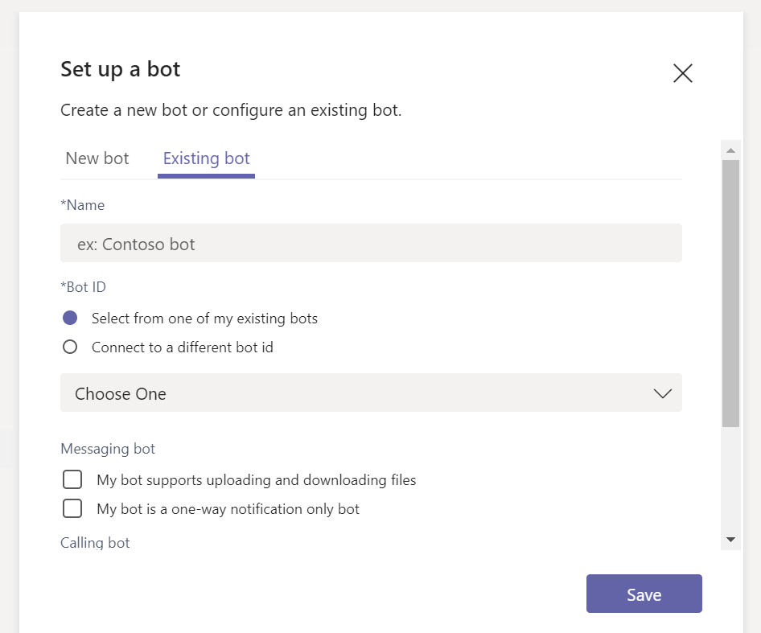

Add bots for personal chats, group chats, and channels in Microsoft Teams
==========================================================
> [!IMPORTANT]
> [!INCLUDE [new-teams-sfb-admin-center-notice](includes/new-teams-sfb-admin-center-notice.md)]

Bots are automated programs that respond to queries or give updates and notifications about details users find interesting or want to stay informed about. Bots allow users to interact with cloud services like task management, scheduling, and polling, through chat conversations in Microsoft Teams. Bots for Teams are built on the [Microsoft Bot Framework](https://go.microsoft.com/fwlink/?linkid=854370). The bots that are developed using this framework can be enabled easily for Teams. For more information, see [Manage Microsoft Teams settings for your organization](enable-features-office-365.md).

Currently, Teams supports bots in personal chats, group chats, and channels within a team. Administrators can control whether the use of bots is allowed or prohibited within the Office 365 tenant.

Bots developed by the community can be leveraged within Teams. The bot's functionality and the ability to upload custom apps (also known as sideloading) must be enabled on the tenant level for custom bots to be functional. Bots can be used in personal chats, group chats, and channels. For channels, team owners or members can add bots.

For more information, see [Apps and services](https://support.office.com/article/Apps-and-services-cc1fba57-9900-4634-8306-2360a40c665b).

> [!IMPORTANT]
> Adding a bot by GUID, for anything other than testing purposes, is not recommended. Doing so severely limits the functionality of a bot. Bots in production use should be added to Teams as part of an app. See [Create a bot](https://docs.microsoft.com/microsoftteams/platform/concepts/bots/bots-create) and [Test and debug your Microsoft Teams bot](https://docs.microsoft.com/microsoftteams/platform/concepts/bots/bots-test)

Create custom bots for Microsoft Teams
--------------------------------------

You can easily create a bot that integrates in to your LOB applications, using the Microsoft Bot Framework. See the [Creating and Testing a bot for Microsoft Teams](https://go.microsoft.com/fwlink/?linkid=854371) guidance to learn how you can develop and publish your own bots.

When you create a bot and register it with the Bot Framework, you can choose to publish it. If you don't publish it, the bot remains private. You can also require your users to log in before using the bot. Requiring login makes sure only employees of your organization can access the bot, even if the bot's application ID becomes known. See [*AuthBot*](https://go.microsoft.com/fwlink/?linkid=854372) on GitHub for a code example of how to authenticate users against your Active Directory using bots.

Bots can be tested using the [Bot Framework Emulator](https://go.microsoft.com/fwlink/?linkid=854373) before they are deployed into your Teams.

Upload your bot for personal chat
---------------------------------------

1. After you create your bot, go to the **Application Settings** for the bot you developed, and then under **App settings**, copy the value of the **MicrosoftAppId** setting.

2.  In Teams, on the **Chat** pane, select the **Add chat icon**. In **To**, paste your bot's **Microsoft app ID**. 

3. The app ID will resolve to your **bot name,** and then you can start a chat conversation with that bot.

Upload your bot for group chats or channels
-----------------------------------

If you want to share your bot with your colleagues, here's how to add it to group chats or channels of different teams:

1. After you [create an app package for your bot](https://docs.microsoft.com/microsoftteams/platform/concepts/apps/apps-upload), open Teams and browse to the team in which you'll be uploading the bot.
2. Add **[App Studio](https://docs.microsoft.com/microsoftteams/platform/get-started/get-started-app-studio)**, app to Teams.
3. In App Studio, select the **Manifest Editor** Tab. 

4. To add your bot, in capabilities, select the bot and choose to add an existing bot. Then, choose an existing bot or enter the Id of an existing bot.

5. Browse to the location of your app package, select it, and then click **Open**.
6. Select your bot's name. (Don't forget to select the **Group chat** or **Team** check box under the scope section).
7. Select **Test and distribute**.
8. Select the group chat or team where you want to connect your bot to.

    Your bot will be available in your group chat or team in Teams.
