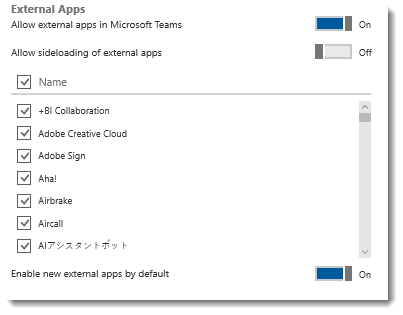

Admin settings for apps in Microsoft Teams
==========================================
> [!IMPORTANT]
> [!INCLUDE [new-teams-sfb-admin-center-notice](includes/new-teams-sfb-admin-center-notice.md)]

Apps are tabs, connectors, bots, or any combination of these three, provided by Teams (first-party apps, and also known as default apps) or by a third-party (also known as external apps). In the Microsoft 365 admin center, you can enable and disable default apps and configure settings to control external apps. These settings let you specify which external apps are allowed and disallowed, new external app behavior, and whether side-loading apps is allowed.

 To manage admin settings for apps in Teams, go to the Microsoft 365 admin center and choose **Settings** > **Services & add-ins** > **Microsoft Teams**. If you're signed in as an Office 365 admin, this link should take you there:

https://portal.office.com/adminportal/home#/Settings/ServicesAndAddIns 

To learn more about admin settings for apps, see the following video: 
 
|  |  |
|---------|---------|
| Managing the App Experience in Microsoft Teams   | <iframe width="350" height="200" src="https://www.youtube.com/embed/CHnpw1O7EgM" frameborder="0" allowfullscreen></iframe>     | 

## Allow external apps in Teams

By default, **Allow external apps in Microsoft Teams** is turned on, with all apps selected.  If you turn off this setting, all external third-party apps are disabled. 

## Enable new external apps by default

#### :trophy: Best practice: Manage external apps individually 
 
To turn on some apps (and turn off others), turn off **Allow sideloading of external apps**. Then turn off any apps you don't want your users to use. Optional: Turn off **Enable new external apps by default** (if you want to control new apps). 

> [!NOTE]
> Default apps, such as those built by Microsoft, are not affected by the **Enable new external apps by default** setting. New apps are enabled by default when released by Microsoft.

When this setting is turned on, users can activate new apps as soon as they're added to the Teams app catalog. To open the Teams app catalog, click **Store** at the bottom of Teams, then click **Apps**. If you want to control which apps are available, turn off this setting. Of course, if you turn it off, you have to remember to review new apps periodically so your organization doesn't miss out on cool new apps. 

Sideloading is how you add an app to Teams by uploading a zip file directly to a team. Sideloading lets you test an app as it's being developed. It also lets you build an app for internal use only and share it with your team without submitting it to the Teams app catalog in the Office Store. 

Only team owners, or members who are granted permissions, can sideload apps into Teams.  

## Creating and uploading app packages 

To learn more about apps, see [Develop apps for Teams](https://docs.microsoft.com/microsoftteams/platform/concepts/apps/apps-overview). 

