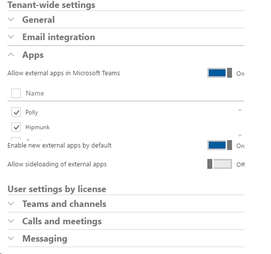

Admin settings for apps in Microsoft Teams
==========================================

In this section, we refer to tabs, connectors, and bots, or any combination of these capabilities, provided by a single third-party service as Apps. There are Admin policies that can be configured in the Office 365 Admin Portal to control which external third-party apps are allowed. These policies let you specify which apps are allowed and disallowed, new external App behavior, as well as whether side-loading apps is allowed.

**Allow external apps in Microsoft Teams**

By default, allow external apps in Microsoft Teams is enabled with all apps selected. When turning this policy to **“Off”**, then all external third-party apps are disabled. You can get more granular and allow external apps to be enabled and uncheck specific apps that you want to disable on an individual basis.

**Enable new external apps by default**

Whenever new apps are submitted to the Teams App Catalog, this switch controls whether they are available for users in this tenant. By default, this policy is set to **“On”** which allows users to have access to apps as soon as they are added to the Team’s app catalog. If you would prefer to validate apps before allowing them to be utilized in Teams, then set this policy to **Off.** Just remember, if you set this to **"Off",** you should evaluate newly added apps on a regular basis to make sure your users benefit from the latest innovations and additions of apps.

**Allow side-loading of external apps**

Only Team owners or members who are granted permissions, can side-load apps into Microsoft Teams. Some benefits of side-loading apps into Microsoft Teams are:

-   Ability to test apps prior to submitting to Microsoft

-   Provide apps directly to users within your organization without having to submit to the Office Store.

To learn more about side loading apps into Microsoft Teams, visit: [Side loading your app in a team](https://go.microsoft.com/fwlink/?linkid=854631).

