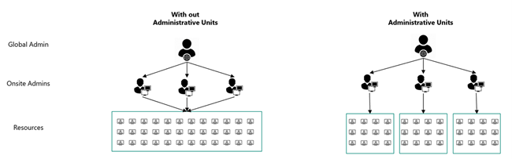
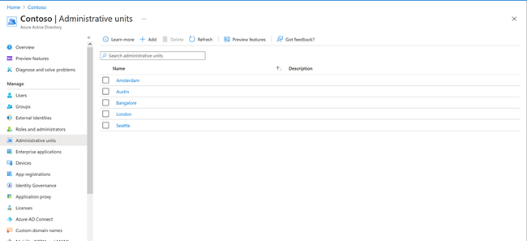
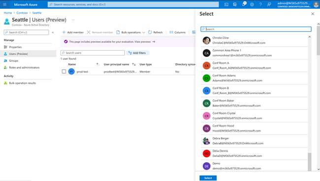

# Administrative unit functionality for device management in Teams

Have more granular role-based access for device management using the Microsoft Teams admin center. We've implemented the Administrative Unit concept for device management through the Teams admin center.

With the administrative unit concept, you’ll ensure access to a specific set of resources to a dedicated administrator. The administrative unit limits access to all the resources. You can extend the same functionality for Teams devices management.

> [!NOTE]
> The administrative unit concept is available only for the Teams Device Administrator role currently.

As an example, Contoso has operations across different geographies. Alice is a Global IT admin in London, while Prashant is an IT admin for India. Today, when Prashant signs into the Teams admin center with the Device Administrator role, they get to see devices across the globe. Alice wants to restrict Prashant’s access only to those devices that are present in India. The administrative units concept helps solve this problem. Learn more [administrative unit concept](/azure/active-directory/roles/administrative-units).

## Creation of Administrative Units

Create administrative units in Azure portal and assign admins for respective administrative units. Learn more about assigning administrative units at [manage admin units](/azure/active-directory/roles/admin-units-manage).

Once created, Global IT admin can then add device users who correspond to that administrative unit.

The assignment of the role can be done through PowerShell using the [Add-AzureADMSScopedRoleMembership](/powershell/module/azuread/add-azureadmsscopedrolemembership?view=azureadps-2.0) cmdlet.

Once you've assigned roles to users for Administrative Units, users need to sign into Teams admin center to start managing scoped devices.

## Experience for Administrative Unit Admin

If the same admins are assigned responsibility of multiple administrative units, they can switch between administrative units without signing out from the portal. In the changed administrative unit view, they'll see only those set of devices that are associated with the new administrative unit.
