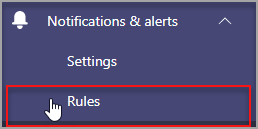
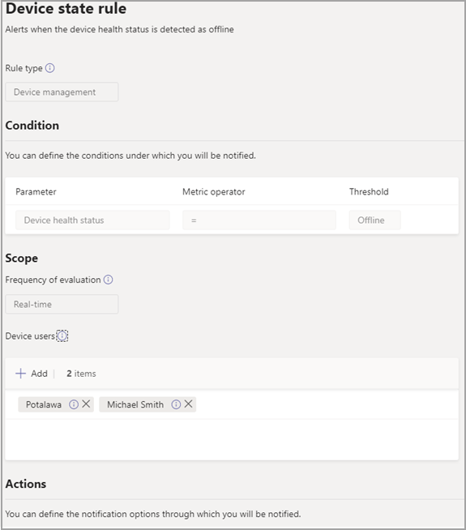
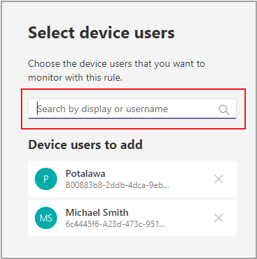

# Microsoft Teams device health monitoring

Device health monitoring in the Microsoft Teams admin center gives you an ability to proactively monitor the health of various Teams devices. Monitor the offline state of a device and receive alerts in real time if the monitored device in your organization goes offline.  

Before you start, you'll need the teams/channel creation permissions in your tenant. [Learn More](/microsoft-365/solutions/manage-creation-of-groups).

## Configure device state rule

1. In the left navigation of the Microsoft Teams admin center, select **Notifications & alerts** > **Rules**.

   

2. In the **Rules** Page, select **Device state rule**.

3. Select the device to configure the state rule for enabling alerts.

    

## Interpret the rule configuration


|Field |Description  |
|--------|-------------|
|**Rule type**   |The device state rule helps you effectively manage. Teams devices and is classified as a device management type. In the future, more rules of device management type will be available to monitor other related capabilities (examples may include: unhealthy device and the sign-in status of device).|
|**Condition**   |You can monitor the health of devices if they go offline. [Learn more](../devices/device-management.md) about device management in Teams admin center and Teams Rooms Pro Management. |
|**Scope**   |You can specify how frequently you want to monitor device health status by mentioning the rule evaluation frequency. By default teams devices will be monitored in near real time if they go offline. |
|**Device users**   |You can specify which devices need proactive offline statue monitoring by selecting them based on signed-in users. Refer to [Select devices for configuration](#select-devices-for-configuration) for more details. |
|**Actions** > **Channel alert**   |In the Actions section, you can specify teams channels you want to get alerts for. Currently, a default team named **Admin Alerts and Notifications** and channel named **MonitoringAlerts** will be created where notifications will be delivered to. <BR/> <BR/> Global administrators and Teams administrators in your tenant will be automatically added to this default team.|
|**Actions** > **Webhook**   |You can also get notifications with an external webhook (optional). Specify an external public webhook URL in the webhook section where a JSON notification payload will be sent. <BR/> <BR/>  The notification payload, via webhooks, can be integrated with other systems in your organization to create custom workflows.<br/><br/> 

**JSON payload schema for webhook:**

```json
{ 
    "type": "object",
    "properties": { 
      "AlertTitle": { "type": "string"} ,
      "DeviceLoggedInUserId": { "type": "string" } ,
      "DeviceId": { "type": "string" } , 
      "MetricValues": {
            "type": "object",
            "properties": {
                 "DeviceHealthStatus": { "type": "string"} 
             }
        } ,
        "RuleName": { "type": "string"} ,
        "RuleDescription": { "type": "string"} ,
        "RuleFrequency": { "type": "string"} ,
        "RuleType": { "type": "string"} ,
        "TenantId": { "type": "string"} , 
        "RuleCondition": { "type": "string"} , 
        "AlertRaisedAt": { "type": "string"} 
     }
} 
``` 

**Sample JSON payload**:

```json
{
    "AlertTitle":"sample_device_name of User_Name has become offline",
    "DeviceLoggedInUserId": User_GUID ,
    "DeviceId": Device_GUID ,  
    "MetricValues": { 
       "DeviceHealthStatus": "offline" 
           },

    "RuleName": "Device state rule" ,
    "RuleDescription": "Alerts when device health status is detected as offline" ,
    "RuleFrequency": "Real-time" ,
    "RuleType": "Device Management" ,
    "TenantId": Tenant_GUID , 
    "RuleCondition": "DeviceHealthStatus = Offline" , 
    "AlertRaisedAt": "2020-02-28T12:49:06Z" 
 }
```

## Select devices for configuration

1. You can select Teams devices you want to monitor by selecting users signed in to those devices. Select **Add** from the **Device users** section.

2. Select one or more users for which you want to monitor device health state

   

   The selected list of users shows in **Device users** section. You can modify this list by adding or removing users.

All the sign-in devices used by the selected list of users will be monitored for the offline health state.

## Notifications in Teams client

The notifications are delivered in the auto-created **MonitoringAlerts** channel of the **Admin Alerts and Notifications** Team. You'll receive an alert within 15 minutes of the device going offline.

> [!NOTE]
> There is a known issue with the notification process. The alert can take approximately 30 minutes to reach you after the device goes offline. The resolution is under progress.

A device offline notification can include the following information:

- The device name that's offline.
- The user of the offline device.
- What time the device went offline. (Currently, the time is presented in UTC.)
- The type of rule that raised the alert.
- Why an alert is raised.
