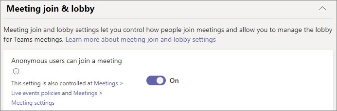

--- 
title: Manage anonymous participant access to Teams meetings, webinars, and town halls (IT admins)
ms.author: jtremper
author: jacktremper
ms.reviewer: 
ms.date: 01/23/2024
manager: pamgreen
ms.topic: article
ms.service: msteams
audience: admin
ms.localizationpriority: medium
search.appverid: MET150
ms.collection: 
  - M365-collaboration
  - Tier1
appliesto: 
  - Microsoft Teams
f1.keywords:
- NOCSH
description: For IT Pros - Learn how anonymous meeting participation works in Microsoft Teams.
---

# Manage anonymous participant access to Teams meetings, webinars, and town halls (IT admins)

**APPLIES TO:** ✔️Meetings ✔️Webinars ✔️Town halls

Anonymous participants in meetings, webinars, and town halls hosted by your organization are those participants who can't be verified. This could include:

- People who aren't logged in to Teams with a work or school account 
- People from non-trusted organizations (as configured in [external access](trusted-organizations-external-meetings-chat.md)) and from organizations that you trust but which don't trust your organization.

Anonymous meeting join is controlled by an organization level setting and user level policies. These also affect webinars and town halls. For anonymous meeting join to work:
- The **Anonymous users can join a meeting** Teams meeting setting (organization level) must be turned on.
- The meeting organizer must be assigned a Teams meeting policy where the **Anonymous users can join a meeting** control is turned on.

> [!NOTE]
> These settings also affects webinars and town halls.

Anonymous meeting join is turned on by default for the organization and in the *Global (Org-wide default)* meeting policy. We recommend keeping the organization level setting on and using meeting policies to turn anonymous meeting join on or off for different users (meeting organizers).

Note that if anonymous meeting join is enabled, lobby policies affect how anonymous participants join meetings. For details, see [Control who can bypass the meeting lobby in Microsoft Teams](who-can-bypass-meeting-lobby.md).

For more details about hosting meetings with external participants, see [Plan for meetings with external participants in Microsoft Teams](plan-meetings-external-participants.md).

#### Meetings with trusted organizations

When you set up trusted organizations for external meetings and chat, meeting attendees from those organizations may be considered anonymous if external access settings aren't configured correctly for both organizations. Both organizations must allow each other's domain and the meeting organizer in your organization and participants from other organizations must be assigned a user policy that allows external access. For details, see [trusted organizations for external meetings and chat](trusted-organizations-external-meetings-chat.md).

## Manage anonymous meeting join for the organization

The organization level anonymous meeting join setting must be turned on for anyone in the organization to create meetings that allow anonymous participants.

> [!Important]
> The **Anonymous users can join a meeting** organization-wide setting will be removed in the future. We recommend leaving this setting **On** and using the the **Anonymous users can join a meeting** user level meeting policy control to allow or prevent anonymous meeting join instead.

To configure anonymous meeting join for the organization
1. Go to the [Teams admin center](https://admin.teams.microsoft.com).

1. In the left navigation, go to **Meetings** > **Meeting settings**.

1. Under **Participants**, set **Anonymous participants can join a meeting** to **On** (recommended) or **Off**.

    :::image type="content" alt-text="Screenshot of participants settings for meetings in the Teams admin center." source="media/meeting-settings-participants.png":::

1. Select **Save**.

## Manage which meeting organizers can allow anonymous meeting join

You can control which users or groups can host meetings that include anonymous participants. To do this, assign a meeting policy with anonymous meeting join turned on to each meeting organizer who needs to host meetings with anonymous participants.

To configure anonymous meeting join for specific meeting organizers
1. Go to the [Teams admin center](https://admin.teams.microsoft.com).

1. In the left navigation, go to **Meetings** > **Meeting policies**.

1. Select the policy that you want to modify.

1. Set **Anonymous users can join a meeting** to **On**.

    

1. Select **Save**.

Changes to meeting policies may take up to 24 hours to take effect.

## Configure anonymous meeting join using PowerShell

You can control whether anonymous participants can join meetings by using:

- The `-DisableAnonymousJoin` parameter in [Set-CsTeamsMeetingConfiguration](/powershell/module/teams/set-csteamsmeetingconfiguration) to configure the organization level setting. (We recommend leaving this set to False and using Set-CsTeamsMeetingPolicy -AllowAnonymousUsersToJoinMeeting to control anonymous meeting join at the user or group level.)
- The `-AllowAnonymousUsersToJoinMeeting` parameter in [Set-CsTeamsMeetingPolicy](/powershell/module/teams/set-csteamsmeetingpolicy) to configure a user level meeting policy

In order to allow anonymous participants to join meetings, you must configure both to allow anonymous meeting join by setting the following values:

- `Set-CsTeamsMeetingConfiguration -DisableAnonymousJoin` set to **$false**
- `Set-CsTeamsMeetingPolicy -AllowAnonymousUsersToJoinMeeting` set to **$true** for the relevant meeting organizers

## Block anonymous meeting join for specific client types

When anonymous participants are allowed to join meetings, they can use either the Teams client or a custom client built using [Azure Communication Services](/azure/communication-services/). 

Admins can block either of these client types by using the `-BlockedAnonymousJoinClientTypes` parameter in [Set-CsTeamsMeetingPolicy](/powershell/module/teams/set-csteamsmeetingpolicy#-blockedanonymousjoinclienttypes).

## Anonymous participants’ meeting experience

Anonymous participants don’t have all the same capabilities as other meeting participants. For example, anonymous participants:

- Don't have access to meeting chat before and after the meeting
- Don't have access to [profile cards](https://support.microsoft.com/office/e80f931f-5fc4-4a59-ba6e-c1e35a85b501)
- Don't have access to collaborative meeting notes.

### How anonymous participants interact with apps in meetings

By default, the setting to allow anonymous participants to interact with apps in meetings is enabled.

To configure app access for anonymous meeting participants

1. Go to the [Teams admin center](https://admin.teams.microsoft.com).

1. In the left navigation, go to **Meetings** > **Meeting settings**.

1. Under **Participants**, set  **Anonymous participants can interact with apps in meetings** to **On** or **Off**.

You can also control this with PowerShell by using `Set-CsTeamsMeetingConfiguration -DisableAppInteractionForAnonymousUsers`.

Anonymous participants inherit the *Global (Org-wide default)* Teams apps permission policy. Anonymous participants can interact with apps in Teams meetings as long as the app is enabled in that policy and **Anonymous participants can interact with apps in meetings** is **On**.

Note that anonymous participants can only interact with apps that are already available in a meeting and can't add or manage these apps.

## Related articles

[Join a meeting without a Teams account](https://support.microsoft.com/office/c6efc38f-4e03-4e79-b28f-e65a4c039508)

[Using the Microsoft Teams admin center to configure organization-wide policy](meeting-settings-in-teams.md#allow-anonymous-users-to-join-meetings)

[External participants receive "Sign in to Teams to join, or contact the meeting organizer"](/microsoftteams/troubleshoot/meetings/external-participants-join-meeting-blocked)

[Assign policies in Teams – getting started](policy-assignment-overview.md)
