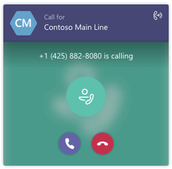

# Answer auto attendant and call queue calls directly from Teams

Teams users can receive and answer calls from Cloud auto attendants and call queues directly from their Teams client.

## What are auto attendants and call queues?

Cloud auto attendants provide a series of voice prompts or an audio file that callers hear instead of a human operator when they call in to an organization. An auto attendant lets callers move through the menu system, place calls, or locate users by using a phone keypad (DTMF) or voice inputs using speech recognition.

Cloud call queues include greetings that are used when someone calls in to a phone number for your organization, the ability to automatically put the calls on hold, and the ability to search for the next available call agent to handle the call while the people who call are listening to music on hold. You can create single or multiple call queues for your organization.

## Handling an auto attendant or call queue call

Users will be able to differentiate incoming calls from an auto attendant or call queue before they answer the call. Along with the name and/or number of the caller, each call will include information about who the caller was trying to reach, giving users a better context for addressing the caller.

The following illustration shows how an incoming call from an auto attendant or call queue will appear to a user.

Once an auto attendant or call queue call is answered, the user can process the call like any other call &#x2014; they can add or conference in another user or transfer the call to another party. Also, auto attendant calls will be forwarded based on the user's configuration.

> [!NOTE] 
> Call queue calls are not forwarded based on the user's call answering rules configuration. This is to ensure callers remain in the queue until an agent can answer the call and the caller isn't forwarded unexpectedly.
>
> Users receiving calls from call queues will only be presented with the name of the caller if it's provided from the PSTN or if the caller's number matches the target user's local Team's client contacts.
>
> Agents are not notified of any missed calls or voicemails for call queue calls.

## Supported clients

Support for auto attendant and call queue calls is available in the following clients:

-    Microsoft Teams Windows client (32 and 64-bit versions)
-    Microsoft Teams Mac client
-    Microsoft Teams iPhone app
-    Microsoft Teams Android app

The Teams client is only supported with a [co-existence mode of Teams Only](/microsoftteams/setting-your-coexistence-and-upgrade-settings).

## Configure auto attendant and call queue support for Microsoft Teams

To receive auto attendant and call queue calls on Microsoft Teams, you need to configure your interoperability policy and upgrade policy. Please review [Migration and interoperability for organizations using Teams together with Skype for Business](migration-interop-guidance-for-teams-with-skype.md). If you do not have auto attendant and/or call queue configured and would like to do so, see [Set up a Cloud auto attendant](create-a-phone-system-auto-attendant.md) and [Create a Cloud call queue](create-a-phone-system-call-queue.md).

## Known Issues

When a call queue agent receives a call on their mobile device, the call may go on hold if the device is locked. Users must unlock the device first and then answer the call.

## Related topics

[Create a Cloud call queue](create-a-phone-system-call-queue.md)

[What are Cloud auto attendants?](what-are-phone-system-auto-attendants.md)

[Set up a Cloud auto attendant](create-a-phone-system-auto-attendant.md)

