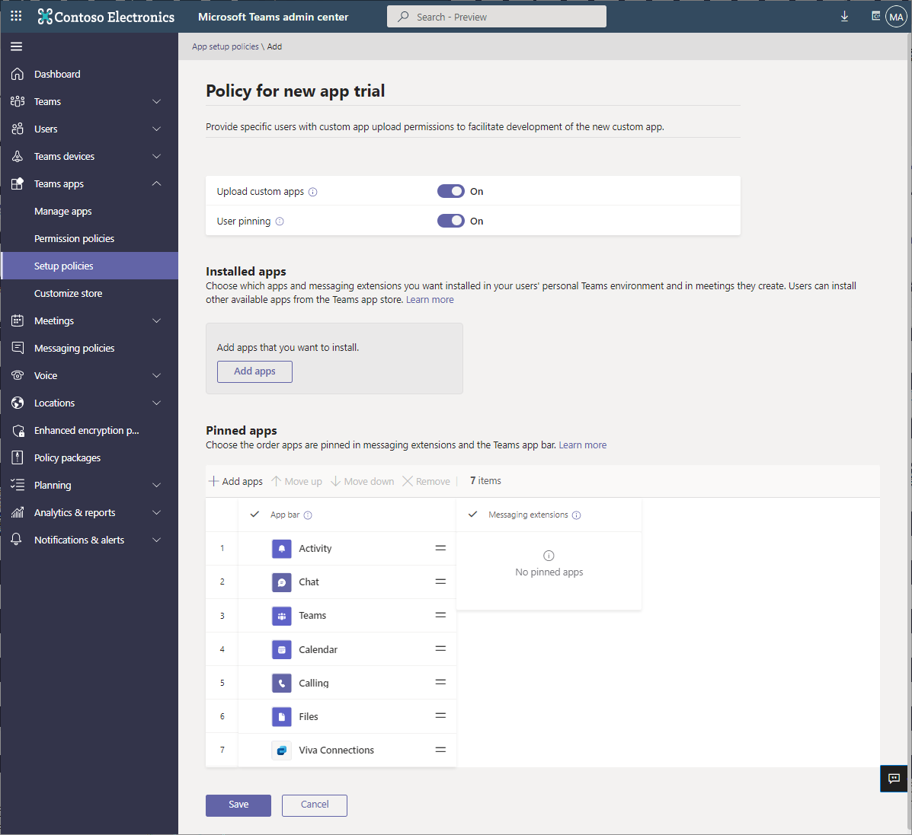

# Overview of app policies used to manage apps in Microsoft Teams

App policies are used to control applications in Microsoft Teams.

## App permission policies

**App permission policies** are used to control what apps are available to your users. As an admin, you can allow or block specific apps that your users install from the Teams app store. [App permission policies](teams-app-permission-policies.md) are managed through the Microsoft Teams admin center.

## App setup policies

**App setup policies** enable you to pin and install applications on behalf of your users and control these settings for your organization. [App setup policies](teams-app-setup-policies.md) are managed in the Teams admin center.

## Custom app policies

You can control who can upload custom apps to Teams with **custom app policies**. [Custom app settings and policies](teams-custom-app-policies-and-settings.md) are managed through the Microsoft Teams admin center.

## Related topics

* [Manage custom app policies and settings in Teams](teams-custom-app-policies-and-settings.md)
* [Manage app setup policies in Teams](teams-app-setup-policies.md)
* [Manage app permission policies in Teams](teams-app-permission-policies.md)
* [Manage Teams with policies](manage-teams-with-policies.md)
