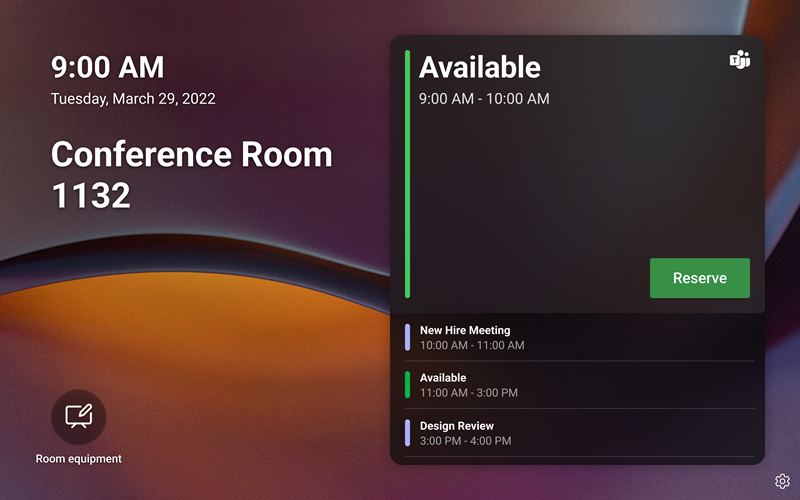

# Microsoft Teams apps/Line of Business (LOB) app support on Teams panels

Teams panels is adding support for [Teams apps/Line of Business (LOB) apps](/microsoftteams/platform/overview). This will enable enterprises to add additional experiences on the panels to meet your organization’s needs. This release supports static web content.

> [!IMPORTANT]
> This feature is only available after updating your Teams panels device(s). You need to have the Teams app version 1449/1.0.97.2021070601 or newer to have app support within Teams panels.

## Teams app experience on Teams panels

 

*The Teams panels home screen includes app navigation options, outlined in the screenshot in red. Note that these are example icons and may not be available for use.*

*When an end-user taps on one of the app icons, they will see the Teams app screen displayed in the previous screenshot. The gray rectangle in the screenshot is where apps are displayed on the Teams panel. The app bar is fixed and part of the Teams panels app.*

## Set up and manage Teams panels apps in Teams admin center 

Microsoft Teams apps bring key information, common tools, and trusted processes to where people gather, learn, and work. Teams apps work [through integrated capabilities](/microsoftteams/platform/concepts/capabilities-overview). Now, as an IT administrator, you have the choice of which apps to include in your organization’s Teams panels device and customize permissions via the [Teams admin center](https://admin.teams.microsoft.com/).

You can now use the Teams apps on Teams panels and customize the user experience based on your organization’s needs. You can decide which web app your users can access and use and prioritize the app views. Some options, like the bot and messaging capabilities, are not supported at this time. Learn more about [the Teams apps](/microsoftteams/platform/overview) and [how to manage your devices in Microsoft Teams](/microsoftteams/devices/device-management).

## Manage apps on Teams panels in Teams admin center

**Note**: You must be a global admin or a Teams service admin to access the [Teams admin center](https://admin.teams.microsoft.com/).

End users can view but not install apps on Teams panels. As an admin, you can view and manage all Teams apps for your organization via the Teams admin center. Learn more about how you can [manage your apps in the Microsoft Teams admin center](/microsoftteams/manage-apps) via the **Manage apps** page. The **Manage apps** page within the Teams admin center is also where you can upload [custom apps](/microsoftteams/manage-apps#publish-a-custom-app-to-your-organizations-app-store).

After setting up apps, you can use [app permission policies](/microsoftteams/teams-app-permission-policies) and [app setup policies](/microsoftteams/teams-app-setup-policies) to configure the app experience for specific room accounts in your organization.

## Pin apps on Teams panels with app setup policies

Since Teams offers the capability to display a wide range of apps, admins can decide on which apps are most essential for the organization and pin only these for the Teams panels **Home** screen for quick access. If there are more than five pinned apps or any unpinned apps, they will appear under the **More** screen. Microsoft recommends creating a custom app setup policy specifically for Teams panels.

 

To manage pinned apps displayed on the Teams panels, sign in to the Teams admin center for your organization and navigate to **Teams apps** \> **Setup policies** \> **Select or Create a new policy** \> **Pinned apps**.

 

*Apps included in this image are only examples and may not be available for use.*

Microsoft recommends you turn off **Upload custom apps** and **User pinning** for the best Teams app experience on Teams panels.

For more about pinning apps, see [Manage app setup policies](/microsoftteams/teams-app-setup-policies).

## Manage apps display order in Teams panels 

*Apps included in this image are only examples and may not be available for use.*

To manage the order in which apps are displayed on the Teams panels, sign in to the Teams admin center for your organization and navigate to **Teams apps** \> **Setup policies** \> **Select the Policy** \> **Pinned apps:** **Move-up/down**.

## Assigning setup policies to a room resource account

After creating the setup policy, the admin will need to assign this policy to the room resource account that will be signed into the Teams panels. For more information, refer to [Assign policies to users and groups](/microsoftteams/assign-policies-users-and-groups).

## FAQ

### How long does it take for Teams panels to get the new or updated app setup policies?

After editing or assigning new policies in the Teams admin center, it can take up to 24 hours for changes to take effect. Admins can try to sign-out/sign-in from the panel, tap the **Settings** icon, and go back to the **Home** screen to try to refresh the policies.

### What is the ordering of the apps on the “More” screen?

On the **More** apps page, the pinned apps will appear first. Then, any other installed apps will appear in alphabetical order.

### Why are bot apps not showing up on Teams panels?

Only static tabs web content is supported at this time.

### Why are native Teams apps, such as Calendar and Tasks, not appearing on Teams panels?

Native Teams apps, such as Calendar and Tasks, are not shown on Teams panels.

### In the Teams admin center, under the setup policies section, what is the difference between installed apps and pinned apps?

For Teams panels, Microsoft recommends using pinned apps, so the admin is able to select the desired app and rearrange its ordering.

**Note:** Some apps do not support app pinning. Please contact the app developer to enable app pinning functionality.

### Why are other apps appearing in the “More” screen even though they are not part of the installed or pinned apps in the Teams app setup policy section?

If apps were previously installed via other app policies or manually in the Teams desktop/web clients for the room resource account used on Teams panels, the admin may need to sign in to the room resource account in Teams and manually uninstall the apps by right-clicking the app, then selecting **Uninstall**.

### Why can't I find an app in the “Add pinned apps” pane?

Not all apps can be pinned to Teams through an app setup policy. Some apps may not support this functionality. To find apps that can be pinned, search for the app in the **Add pinned apps** pane. For more information, please refer to [the FAQ in Working with app setup policies](/microsoftteams/teams-app-setup-policies#why-cant-i-find-an-app-in-the-add-pinned-apps-pane).

### Why am I seeing an “User pinning” pop-up in the setup policies panel after I turn off “User pinning?”

*Apps included in this image are only examples and may not be available for use.* 

This behavior is expected for a device in a shared space and helps prevent unintentional app pinning.
